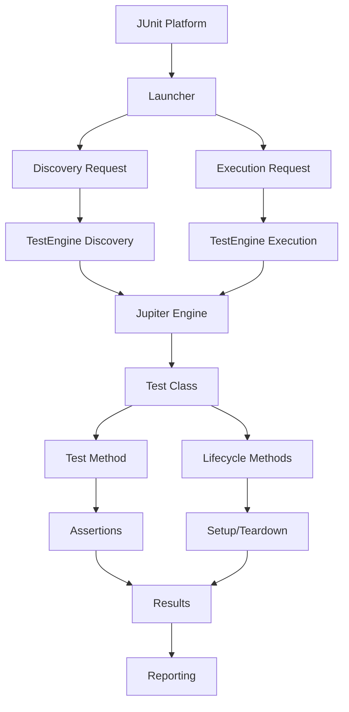

# 11.2 JUnit 5 Basics

## 1. Introduction

JUnit 5 is the latest major version of the most popular Java testing framework. It introduces a modular architecture, powerful new features, and modern Java capabilities. This module covers JUnit 5 annotations, assertions, lifecycle callbacks, and test organization.

## 2. Learning Objectives

- Master JUnit 5 annotations (@Test, @BeforeEach, @AfterEach, @BeforeAll, @AfterAll)
- Use assertions effectively with detailed messages
- Understand test lifecycle and execution order
- Organize tests with @DisplayName and @Nested
- Control test execution with @Disabled and @Enabled conditions

## 3. Prerequisites

- Java 17+ installed
- Basic understanding of testing concepts
- Maven or Gradle build tool
- IDE with JUnit support

## 4. Why This Concept Exists

JUnit 5 addresses limitations of JUnit 4 by providing:
- Modular architecture (JUnit Platform, Jupiter, Vintage)
- Modern Java features support
- Better extension model
- Improved assertions and assumptions
- Parameterized tests and nested test classes

## 5. Problem Statement

How do we write reliable, maintainable tests with proper setup/teardown, meaningful output, and flexible execution control?

## 6. Theory

### JUnit 5 Architecture

```
JUnit 5 = JUnit Platform + JUnit Jupiter + JUnit Vintage

JUnit Platform: Launches testing frameworks on JVM
JUnit Jupiter: New programming and extension model
JUnit Vintage: Backward compatibility with JUnit 3/4
```

### Core Annotations

| Annotation | Description |
|------------|-------------|
| `@Test` | Marks a method as a test |
| `@BeforeEach` | Runs before each test method |
| `@AfterEach` | Runs after each test method |
| `@BeforeAll` | Runs once before all tests in class |
| `@AfterAll` | Runs once after all tests in class |
| `@DisplayName` | Custom name for test display |
| `@Disabled` | Disable a test |
| `@Nested` | Group related tests |
| `@Tag` | Filter test execution |

### Assertion Methods

- `assertEquals(expected, actual)` - Value equality
- `assertNotEquals(expected, actual)` - Value inequality
- `assertTrue(condition)` - Boolean check
- `assertFalse(condition)` - Boolean negation
- `assertNull(object)` - Null check
- `assertNotNull(object)` - Not null check
- `assertThrows(exceptionClass, executable)` - Exception verification
- `assertAll(label, executables)` - Group assertions
- `assertIterableEquals(expected, actual)` - Collection comparison

## 7. Internal Working

1. **Test Discovery**: JUnit scans for `@Test` methods via reflection
2. **Test Execution**: Platform launcher executes tests via TestEngine API
3. **Lifecycle Management**: Framework manages setup/teardown callbacks
4. **Assertion Evaluation**: Assertions throw `AssertionError` on failure
5. **Result Reporting**: Results collected and formatted for output

## 8. JVM Perspective

- Tests run in the same JVM as production code
- No separate process for test execution
- Reflection used for test discovery (minimal overhead)
- Test classes loaded by same classloader
- Memory shared between tests (requires proper cleanup)

## 9. Memory Representation

```
JUnit 5 Execution Model:
┌────────────────────────────────┐
│        JUnit Platform          │
│  ┌──────────────────────────┐ │
│  │    TestEngine API        │ │
│  │  ┌────────────────────┐  │ │
│  │  │   Jupiter Engine   │  │ │
│  │  │  ┌──────────────┐  │  │ │
│  │  │  │ Test Class 1 │  │  │ │
│  │  │  │ Test Class 2 │  │  │ │
│  │  │  │ Test Class N │  │  │ │
│  │  │  └──────────────┘  │  │ │
│  │  └────────────────────┘  │ │
│  └──────────────────────────┘ │
│  ┌──────────────────────────┐ │
│  │   Launcher Discovery     │ │
│  │   Launcher Execution     │ │
│  └──────────────────────────┘ │
└────────────────────────────────┘
```

## 10. Architecture Diagram



## 11. Flow Diagram


## 12. Syntax

```java
import org.junit.jupiter.api.*;
import static org.junit.jupiter.api.Assertions.*;

@DisplayName("Calculator Tests")
class CalculatorTest {
    
    @BeforeAll
    static void beforeAll() {
        System.out.println("Before All Tests");
    }
    
    @AfterAll
    static void afterAll() {
        System.out.println("After All Tests");
    }
    
    @BeforeEach
    void setUp() {
        System.out.println("Before Each Test");
    }
    
    @AfterEach
    void tearDown() {
        System.out.println("After Each Test");
    }
    
    @Test
    @DisplayName("Should add two numbers correctly")
    void shouldAddTwoNumbers() {
        Calculator calc = new Calculator();
        assertEquals(5, calc.add(2, 3));
    }
    
    @Test
    @Disabled("Not yet implemented")
    void notYetImplemented() {
        // TODO: Implement later
    }
    
    @Test
    void shouldVerifyException() {
        assertThrows(ArithmeticException.class, 
            () -> { int result = 1 / 0; });
    }
    
    @Nested
    @DisplayName("When using scientific functions")
    class ScientificTests {
        @Test
        void shouldCalculateSquareRoot() {
            assertEquals(2.0, Math.sqrt(4.0), 0.0001);
        }
    }
}
```

## 13. Easy Example

```java
import org.junit.jupiter.api.Test;
import static org.junit.jupiter.api.Assertions.*;

class StringTest {
    
    @Test
    void shouldConcatenateStrings() {
        // Arrange
        String first = "Hello";
        String second = "World";
        
        // Act
        String result = first + " " + second;
        
        // Assert
        assertEquals("Hello World", result);
    }
    
    @Test
    void shouldCheckStringLength() {
        // Arrange
        String text = "JUnit";
        
        // Act & Assert
        assertEquals(5, text.length());
    }
    
    @Test
    void shouldHandleNullString() {
        // Arrange
        String nullString = null;
        
        // Act & Assert
        assertNull(nullString);
        assertNotNull("Not null");
    }
}
```

## 14. Medium Example

```java
import org.junit.jupiter.api.*;
import java.util.List;
import static org.junit.jupiter.api.Assertions.*;

@DisplayName("Collection Operations Tests")
class CollectionTest {
    
    private List<String> fruits;
    
    @BeforeEach
    void setUp() {
        fruits = List.of("Apple", "Banana", "Cherry", "Date");
    }
    
    @Test
    @DisplayName("Should contain all fruits")
    void shouldContainAllFruits() {
        // Assert multiple conditions
        assertAll("Fruit checks",
            () -> assertEquals(4, fruits.size()),
            () -> assertTrue(fruits.contains("Apple")),
            () -> assertTrue(fruits.contains("Banana")),
            () -> assertTrue(fruits.contains("Cherry")),
            () -> assertTrue(fruits.contains("Date"))
        );
    }
    
    @Test
    @DisplayName("Should find fruit starting with specific letter")
    void shouldFindFruitStartingWith() {
        // Arrange
        String prefix = "B";
        
        // Act
        List<String> result = fruits.stream()
            .filter(f -> f.startsWith(prefix))
            .toList();
        
        // Assert
        assertEquals(1, result.size());
        assertEquals("Banana", result.get(0));
    }
    
    @Test
    @DisplayName("Should throw exception for invalid index")
    void shouldThrowExceptionForInvalidIndex() {
        // Act & Assert
        IndexOutOfBoundsException exception = 
            assertThrows(IndexOutOfBoundsException.class, 
                () -> fruits.get(10));
        
        assertTrue(exception.getMessage().contains("10"));
    }
}
```

## 15. Hard Example

```java
import org.junit.jupiter.api.*;
import java.util.concurrent.*;
import java.util.concurrent.atomic.AtomicInteger;
import static org.junit.jupiter.api.Assertions.*;

@DisplayName("Complex Lifecycle Tests")
class LifecycleTest {
    
    private static final AtomicInteger counter = new AtomicInteger(0);
    private static ExecutorService executor;
    private String testName;
    
    @BeforeAll
    static void initAll() {
        executor = Executors.newFixedThreadPool(3);
        System.out.println("Global setup - initialized shared resources");
    }
    
    @AfterAll
    static void cleanupAll() {
        executor.shutdown();
        System.out.println("Global cleanup - resources released");
    }
    
    @BeforeEach
    void setUp(TestInfo testInfo) {
        testName = testInfo.getDisplayName();
        counter.incrementAndGet();
        System.out.println("Setting up: " + testName);
    }
    
    @AfterEach
    void tearDown(TestInfo testInfo) {
        System.out.println("Tearing down: " + testInfo.getDisplayName());
    }
    
    @Test
    @DisplayName("Should execute concurrently")
    void shouldExecuteConcurrently() throws Exception {
        // Arrange
        int tasks = 10;
        AtomicInteger successCount = new AtomicInteger(0);
        
        // Act
        List<Future<Boolean>> futures = new ArrayList<>();
        for (int i = 0; i < tasks; i++) {
            futures.add(executor.submit(() -> {
                successCount.incrementAndGet();
                return true;
            }));
        }
        
        // Wait for all tasks
        for (Future<Boolean> future : futures) {
            assertTrue(future.get(5, TimeUnit.SECONDS));
        }
        
        // Assert
        assertEquals(tasks, successCount.get());
    }
    
    @Test
    @DisabledIf("isEvenCounter")
    @DisplayName("Should skip when counter is even")
    void shouldSkipWhenEven() {
        // This test runs only when counter is odd
        assertTrue(counter.get() % 2 != 0);
    }
    
    private boolean isEvenCounter() {
        return counter.get() % 2 == 0;
    }
    
    @Nested


---

**Continue to Part 2**: [README-part2.md](README-part2.md)
```

## Interview Questions

[5-10 interview questions with answers]

1. **What is this concept?**
   [Answer]

2. **When would you use it?**
   [Answer]

3. **What are the alternatives?**
   [Answer]

4. **What are common mistakes?**
   [Answer]

5. **How does it perform compared to alternatives?**
   [Answer]

## Pitfalls

[Common mistakes and anti-patterns]

## Performance

[Performance considerations and benchmarks]

## Engineering Decision Framework

### ✅ Use JUnit 5 when:
- Writing unit tests for Java applications
- Integration testing with Spring or other frameworks
- Parameterized or data-driven testing is needed
- Test lifecycle management with @BeforeEach/@AfterEach
- Modern assertions and assumptions API is beneficial

### ❌ Avoid JUnit 5 when:
- Legacy JUnit 3/4 tests already work (use Vintage runner)
- Simple script-based testing suffices
- Testing requires external tools (Postman, curl for APIs)
- Performance benchmarking is the goal (use JMH instead)

### Better Alternatives

| Alternative | When to use |
|-------------|-------------|
| TestNG | Advanced test grouping and parallel execution |
| Spock | BDD-style testing with Groovy |
| JMH | Microbenchmarking and performance measurement |
| Mockito | Mocking framework (used alongside JUnit) |
| AssertJ | Rich fluent assertions (complements JUnit) |

### Production Examples
- Unit testing service layer business logic
- Integration testing REST API endpoints
- Database repository testing with TestContainers
- Contract testing for microservices
- Regression test suites in CI/CD pipelines

### Common Production Mistakes
- Testing implementation details instead of behavior
- Not cleaning up test data (flaky tests)
- Overusing mocks (tests become coupled to implementation)
- Ignoring test execution time in CI pipelines
- Using @Disabled as a permanent fix instead of tracking tech debt

## Overview

[Brief description of the topic]

## Why This Concept Exists

[Problem this concept solves and motivation behind it]

## Internal Working

[How this works under the hood]

## Examples

[Code examples demonstrating the concept]

## References

[Links to official docs, tutorials, and related topics]

- [Official Documentation](#)
- [Related: topic1](#)
- [Related: topic2](#)
