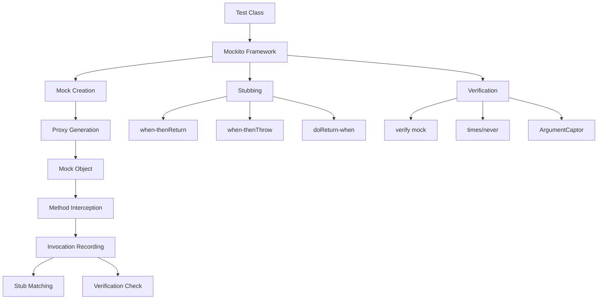
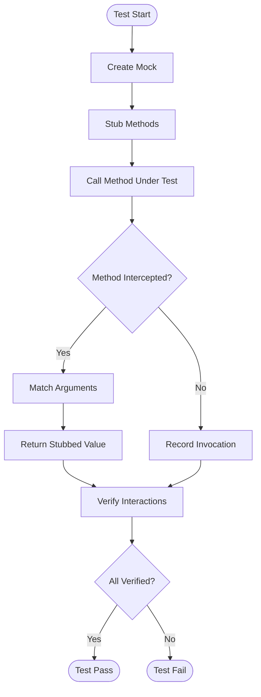

# 11.4 Mockito

## 1. Introduction

Mockito is the most popular mocking framework for Java. It enables isolation testing by replacing real dependencies with controlled mock objects. This module covers mocking, stubbing, verification, and argument captors.

## 2. Learning Objectives

- Create and configure mock objects
- Stub method calls with return values
- Verify method interactions
- Capture and inspect arguments
- Handle void methods and exceptions

## 3. Prerequisites

- JUnit 5 knowledge
- Understanding of interfaces and dependency injection
- Basic understanding of testing principles

## 4. Why This Concept Exists

Real applications have dependencies (databases, APIs, file systems). Testing with real dependencies is:
- Slow (network calls, file I/O)
- Unreliable (external services may fail)
- Complex (requires setup/teardown)
- Non-deterministic (results vary)

Mockito solves this by replacing dependencies with controllable fakes.

## 5. Problem Statement

How do we test a class that depends on external services without actually calling those services?

## 6. Theory

### Core Concepts

- **Mock**: A fake object that simulates real behavior
- **Stub**: Predefined responses for method calls
- **Verification**: Checking that methods were called
- **Argument Captor**: Capturing arguments for inspection
- **Spy**: Partial mock that calls real methods

### Mockito Workflow

```
1. Create mock object
2. Stub method behavior
3. Call method under test
4. Verify interactions
```

### Key Methods

| Method | Description |
|--------|-------------|
| `mock()` | Create a mock object |
| `when().thenReturn()` | Stub return value |
| `when().thenThrow()` | Stub exception |
| `verify()` | Check method was called |
| `times()` | Verify call count |
| `never()` | Verify method not called |
| `any()`, `eq()` | Argument matchers |
| `ArgumentCaptor` | Capture arguments |

## 7. Internal Working

1. **Proxy Creation**: Mockito creates proxy objects using ByteBuddy
2. **Method Interception**: All method calls are intercepted
3. **Stub Matching**: When a stubbed method is called, Mockito matches arguments
4. **Return/Throw**: Returns stubbed value or throws exception
5. **Interaction Recording**: All calls are recorded for verification
6. **Argument Matching**: Uses Hamcrest matchers for flexible matching

## 8. JVM Perspective

- Mocks created using dynamic proxies (java.lang.reflect.Proxy)
- ByteBuddy generates mock classes at runtime
- Mocks have the same classloader as real objects
- Mockito uses thread-local storage for verification
- No bytecode manipulation on production classes

## 9. Memory Representation

```
Mockito Mock Object:
┌─────────────────────────────────┐
│         Mock Object             │
├─────────────────────────────────┤
│  ┌───────────────────────────┐  │
│  │  Method Invocation Record │  │
│  │  - Method name            │  │
│  │  - Arguments              │  │
│  │  - Return value           │  │
│  │  - Timestamp              │  │
│  └───────────────────────────┘  │
├─────────────────────────────────┤
│  ┌───────────────────────────┐  │
│  │  Stub Configuration       │  │
│  │  - Argument matchers      │  │
│  │  - Return values          │  │
│  │  - Exception rules        │  │
│  └───────────────────────────┘  │
├─────────────────────────────────┤
│  ┌───────────────────────────┐  │
│  │  Verification State       │  │
│  │  - Expected invocations   │  │
│  │  - Actual invocations     │  │
│  └───────────────────────────┘  │
└─────────────────────────────────┘
```

## 10. Architecture Diagram



## 11. Flow Diagram



## 12. Syntax

```java
import org.mockito.*;
import static org.mockito.Mockito.*;
import static org.junit.jupiter.api.Assertions.*;

// Create mock
@Mock
UserService userService;

// Inject mocks
@Captor
ArgumentCaptor<User> userCaptor;

@BeforeEach
void setUp() {
    MockitoAnnotations.openMocks(this);
}

@Test
void testMethod() {
    // Stub
    when(userService.findById(1L)).thenReturn(new User("John"));
    
    // Call
    User user = service.getUser(1L);
    
    // Verify
    verify(userService).findById(1L);
    assertEquals("John", user.getName());
    
    // Capture
    verify(userService).save(userCaptor.capture());
    assertEquals("John", userCaptor.getValue().getName());
}
```

## 13. Easy Example

```java
import org.junit.jupiter.api.BeforeEach;
import org.junit.jupiter.api.Test;
import org.mockito.Mock;
import org.mockito.junit.jupiter.MockitoExtension;
import org.junit.jupiter.api.extension.ExtendWith;
import static org.mockito.Mockito.*;
import static org.junit.jupiter.api.Assertions.*;

@ExtendWith(MockitoExtension.class)
class SimpleMockTest {
    
    @Mock
    private EmailService emailService;
    
    private UserService userService;
    
    @BeforeEach
    void setUp() {
        userService = new UserService(emailService);
    }
    
    @Test
    void shouldSendWelcomeEmail() {
        // Arrange
        User user = new User("john@example.com");
        when(emailService.send(anyString(), anyString())).thenReturn(true);
        
        // Act
        boolean result = userService.registerUser(user);
        
        // Assert
        assertTrue(result);
        verify(emailService).send(eq("john@example.com"), contains("Welcome"));
    }
    
    @Test
    void shouldHandleEmailFailure() {
        // Arrange
        User user = new User("john@example.com");
        when(emailService.send(anyString(), anyString())).thenReturn(false);
        
        // Act
        boolean result = userService.registerUser(user);
        
        // Assert
        assertFalse(result);
    }
}
```

## 14. Medium Example

```java
import org.junit.jupiter.api.BeforeEach;
import org.junit.jupiter.api.Test;
import org.mockito.*;
import org.junit.jupiter.api.extension.ExtendWith;
import org.mockito.junit.jupiter.MockitoExtension;
import static org.mockito.Mockito.*;
import static org.junit.jupiter.api.Assertions.*;

@ExtendWith(MockitoExtension.class)
class OrderServiceTest {
    
    @Mock
    private OrderRepository orderRepository;
    
    @Mock
    private PaymentService paymentService;
    
    @Mock
    private InventoryService inventoryService;
    
    @Captor
    private ArgumentCaptor<Order> orderCaptor;
    
    @InjectMocks
    private OrderService orderService;
    
    @BeforeEach
    void setUp() {
        // @InjectMocks automatically injects mocks
    }
    
    @Test
    void shouldCreateOrderSuccessfully() {
        // Arrange
        OrderRequest request = new OrderRequest("PROD-1", 2, 29.99);
        when(inventoryService.checkStock("PROD-1")).thenReturn(10);
        when(paymentService.processPayment(anyDouble())).thenReturn(true);
        when(orderRepository.save(any(Order.class))).thenAnswer(invocation -> {
            Order order = invocation.getArgument(0);
            order.setId("ORD-1");
            return order;
        });
        
        // Act
        OrderResponse response = orderService.createOrder(request);
        
        // Assert
        assertNotNull(response);
        assertEquals("ORD-1", response.getOrderId());
        
        verify(inventoryService).checkStock("PROD-1");
        verify(inventoryService).reserveStock("PROD-1", 2);
        verify(paymentService).processPayment(59.98);
        
        verify(orderCaptor).capture();
        Order savedOrder = orderCaptor.getValue();
        assertEquals(2, savedOrder.getQuantity());
    }
    
    @Test
    void shouldFailWhenOutOfStock() {
        // Arrange
        OrderRequest request = new OrderRequest("PROD-1", 2, 29.99);
        when(inventoryService.checkStock("PROD-1")).thenReturn(0);
        
        // Act & Assert
        assertThrows(OutOfStockException.class,
            () -> orderService.createOrder(request));
        
        verify(paymentService, never()).processPayment(anyDouble());
        verify(orderRepository, never()).save(any(Order.class));
    }
    
    @Test
    void shouldHandlePaymentFailure() {
        // Arrange
        OrderRequest request = new OrderRequest("PROD-1", 2, 29.99);
        when(inventoryService.checkStock("PROD-1")).thenReturn(10);
        when(paymentService.processPayment(anyDouble())).thenReturn(false);
        
        // Act & Assert
        assertThrows(PaymentFailedException.class,
            () -> orderService.createOrder(request));
        
        verify(inventoryService).releaseStock("PROD-1", 2);
    }
}
```

## 15. Hard Example

```java
import org.junit.jupiter.api.BeforeEach;
import org.junit.jupiter.api.Test;
import org.mockito.*;
import org.junit.jupiter.api.extension.ExtendWith;
import org.mockito.junit.jupiter.MockitoExtension;
import java.util.*;
import static org.mockito.Mockito.*;
import static org.junit.jupiter.api.Assertions.*;

@ExtendWith(MockitoExtension.class)
class ComplexMockTest {
    
    @Mock
    private UserDAO userDAO;
    
    @Mock
    private EmailService emailService;
    
    @Mock
    private CacheService cacheService;
    
    @Captor
    private ArgumentCaptor<User> userCaptor;
    
    @Captor
    private ArgumentCaptor<String> stringCaptor;
    
    @Spy
    private PasswordEncoder passwordEncoder;
    
    @InjectMocks
    private UserService userService;
    
    @Test
    void shouldRegisterUserWithCaching() {
        // Arrange
        UserDTO dto = new UserDTO("john", "password123", "john@example.com");
        
        when(userDAO.findByUsername("john")).thenReturn(Optional.empty());
        when(userDAO.save(any(User.class))).thenAnswer(invocation -> {
            User user = invocation.getArgument(0);
            user.setId(1L);
            return user;
        });
        when(cacheService.put(anyString(), any())).thenReturn(true);
        
        // Act
        UserRegistrationResult result = userService.register(dto);
        
        // Assert
        assertTrue(result.isSuccess());
        assertEquals(1L, result.getUserId());
        
        verify(userDAO).findByUsername("john");
        verify(userDAO).save(userCaptor.capture());
        
        User savedUser = userCaptor.getValue();
        assertEquals("john", savedUser.getUsername());
        assertNotEquals("password123", savedUser.getPassword()); // Encrypted
        
        verify(cacheService).put(stringCaptor.capture(), any());
        assertEquals("user:1", stringCaptor.getValue());
        
        verify(emailService).send(eq("john@example.com"), contains("Welcome"));
    }
    
    @Test
    void shouldNotSendEmailOnDuplicateUser() {
        // Arrange
        UserDTO dto = new UserDTO("existing", "pass", "existing@example.com");
        when(userDAO.findByUsername("existing")).thenReturn(Optional.of(new User()));
        
        // Act
        UserRegistrationResult result = userService.register(dto);
        
        // Assert
        assertFalse(result.isSuccess());
        assertEquals("Username already exists", result.getMessage());
        
        verify(userDAO, never()).save(any(User.class));
        verify(emailService, never()).send(anyString(), anyString());
    }
    
    @Test
    void shouldHandleMultipleStubCalls() {
        // Arrange - Sequential stubbing
        when(userDAO.findById(1L))
            .thenReturn(Optional.of(new User("first")))
            .thenReturn(Optional.of(new User("second")))
            .thenReturn(Optional.empty());
        
        // Act & Assert
        assertEquals("first", userService.getUserName(1L));
        assertEquals("second", userService.getUserName(1L));
        assertNull(userService.getUserName(1L));
    }
    
    @Test
    void shouldUseSpyForPartialMocking() {
        // Arrange
        User user = new User("john");
        user.setPassword("encodedPassword");
        
        when(userDAO.findById(1L)).thenReturn(Optional.of(user));
        when(passwordEncoder.matches(anyString(), anyString())).thenReturn(true);
        
        // Act
        boolean valid = userService.validatePassword(1L, "rawPassword");
        
        // Assert
        assertTrue(valid);
        verify(passwordEncoder).matches("rawPassword", "encodedPassword");
    }
}
```

## 16. Enterprise Example

```java
import org.junit.jupiter.api.BeforeEach;
import org.junit.jupiter.api.Test;
import org.junit.jupiter.api.extension.ExtendWith;
import org.mockito.*;
import org.mockito.junit.jupiter.MockitoExtension;
import java.util.concurrent.TimeUnit;
import static org.mockito.Mockito.*;
import static org.junit.jupiter.api.Assertions.*;

@ExtendWith(MockitoExtension.class)
class EnterpriseMockTest {
    
    @Mock
    private UserRepository userRepository;
    
    @Mock
    private AuditService auditService;
    
    @Mock
    private NotificationService notificationService;
    
    @Mock
    private CircuitBreaker circuitBreaker;
    
    @Captor
    private ArgumentCaptor<AuditEvent> auditCaptor;
    
    @InjectMocks
    private UserManagementService service;
    
    @Test
    void shouldAuditAllOperations() {
        // Arrange
        User user = new User("john", "john@example.com");
        when(userRepository.save(any(User.class))).thenReturn(user);
        
        // Act
        service.createUser(user);
        
        // Verify audit
        verify(auditService, times(2)).log(auditCaptor.capture());
        List<AuditEvent> events = auditCaptor.getAllValues();
        assertEquals("USER_CREATED", events.get(0).getType());
        assertEquals("USER_VALIDATED", events.get(1).getType());
    }
    
    @Test
    void shouldHandleCircuitBreakerOpen() {
        // Arrange
        when(circuitBreaker.allowRequest()).thenReturn(false);
        
        // Act & Assert
        assertThrows(ServiceUnavailableException.class,
            () -> service.syncUserData(1L));
        
        verify(userRepository, never()).save(any(User.class));
    }
    
    @Test
    void shouldRetryOnFailure() {
        // Arrange
        when(userRepository.findById(1L))
            .thenThrow(new DatabaseException("Connection failed"))
            .thenReturn(Optional.of(new User("john")));
        
        // Act
        User user = service.getUserWithRetry(1L, 3);
        
        // Assert
        assertNotNull(user);
        verify(userRepository, times(2)).findById(1L);
    }
    
    @Test
    void shouldMockVoidMethod() {
        // Arrange
        doNothing().when(auditService).log(any(AuditEvent.class));
        doThrow(new RuntimeException("DB Error"))
            .when(notificationService).send(anyString());
        
        // Act & Assert
        assertThrows(RuntimeException.class,
            () -> service.processUserAction(new UserAction("LOGIN")));
        
        verify(auditService).log(any(AuditEvent.class));
    }
    
    @Test
    void shouldUseTimeoutVerification() {
        // Arrange
        when(userRepository.save(any(User.class()))).thenAnswer(invocation -> {
            Thread.sleep(100);
            return invocation.getArgument(0);
        });
        
        // Act
        service.createUser(new User("async", "async@example.com"));
        
        // Assert - Verify within timeout
        verify(userRepository, timeout(1000)).save(any(User.class()));
    }
}
```

## 17. Performance

| Operation | Time | Memory |
|-----------|------|--------|
| Mock Creation | ~10ms | ~1KB |
| Stub Setup | ~1ms | Minimal |
| Method Call | ~0.1ms | Minimal |
| Verification | ~1ms | Minimal |
| Argument Capture | ~0.1ms | ~100B |

**Performance Tips:**
- Reuse mocks across tests with @BeforeEach
- Use @InjectMocks for automatic injection
- Avoid over-mocking; mock only what's needed
- Use strict mocks to catch unnecessary stubs

## 18. Time & Space Complexity

| Operation | Time | Space |
|-----------|------|-------|
| Mock Creation | O(1) | O(m) |
| Stubbing | O(1) | O(s) |
| Verification | O(n) | O(1) |
| Argument Capture | O(1) | O(a) |

Where: m = mock methods, s = stubs, n = invocations, a = captured args

## 19. Thread Safety

- Mockito mocks are thread-safe
- Verification is thread-safe via synchronized
- ArgumentCaptors are NOT thread-safe
- Use separate captors for concurrent tests
- Mock injection requires synchronization in parallel tests

## 20. Best Practices

1. **Use @Mock for dependencies** and @InjectMocks for class under test
2. **Stub at the beginning** of test methods
3. **Verify important interactions** explicitly
4. **Use ArgumentCaptor** to inspect passed arguments
5. **Mock interfaces, not implementations** when possible
6. **Use strict stubbing** to catch unnecessary stubs
7. **Prefer doReturn-when** for void methods and spies
8. **Clean up mocks** in @AfterEach if needed
9. **Use any() matchers** for flexibility, eq() for exact values
10. **Document complex stubs** with comments

## 21. Common Mistakes

1. **Over-mocking** - Mocking everything including simple objects
2. **Stubbing after interaction** - Stub should come before call
3. **Verifying too much** - Only verify what's important
4. **Ignoring return values** - Forgetting to stub methods
5. **Wrong argument matchers** - Mixing matchers incorrectly
6. **Mocking concrete classes** - Prefer interfaces
7. **Not using @InjectMocks** - Manual injection is error-prone
8. **Stubbing inside loops** - Creates multiple stubs
9. **Forgetting to verify** - Tests that don't check behavior
10. **Using verifyNoMoreInteractions** excessively - Too strict

## 22. Pitfalls

- **Flaky tests** from over-specific argument matching
- **Brittle tests** that break with implementation changes
- **False positives** from missing verification
- **Memory leaks** from unreset mocks
- **Stubbing conflicts** from multiple when clauses
- **Inconsistent state** between tests

## 23. Debugging Tips

1. **Use lenient()** to debug unnecessary stubs
2. **Print mock invocations** with Mockito.debug()
3. **Check argument matchers** are consistent
4. **Verify mock state** before assertions
5. **Use InOrder** for verification order
6. **Check for unstubbed calls** in logs
7. **Reset mocks** between tests if needed

## 24. Comparison Table

| Feature | Mockito | PowerMock | EasyMock |
|---------|---------|-----------|----------|
| Ease of use | High | Medium | Low |
| Static methods | No | Yes | No |
| Final classes | Yes (mockmaker) | Yes | No |
| Performance | Fast | Slow | Medium |
| Maintenance | Active | Less active | Less active |

## 25. Decision Tree

```
When to use Mockito features?
│
├─ Need to isolate class?
│  └─ Use @Mock for dependencies
│
├─ Need to check method calls?
│  └─ Use verify()
│
├─ Need to inspect arguments?
│  └─ Use ArgumentCaptor
│
├─ Need to stub void method?
│  └─ Use doReturn-when/doNothing
│
├─ Need partial mock?
│  └─ Use @Spy
│
└─ Need to mock static?
   └─ Consider PowerMock or refactor design
```

## 26. Interview Questions

1. **What is the difference between a mock and a stub?**
   - Answer: A stub provides canned answers; a mock verifies interactions.

2. **When should you use @Mock vs @Spy?**
   - Answer: @Mock for complete isolation; @Spy for partial mocking with real behavior.

3. **How do you verify method call order?**
   - Answer: Use InOrder to verify sequences of calls.

4. **What is the purpose of ArgumentCaptor?**
   - Answer: Captures arguments passed to mocks for detailed inspection.

5. **How do you stub a method to throw an exception?**
   - Answer: Use when().thenThrow() or doThrow().when().

6. **What is @InjectMocks and how does it work?**
   - Answer: Automatically injects @Mock dependencies into the class under test.

7. **How do you verify a method was never called?**
   - Answer: Use verify(mock, never()).method().

8. **What are argument matchers and when should you use them?**
   - Answer: Flexible matching for arguments; use when exact values aren't important.

9. **How do you handle void methods in Mockito?**
   - Answer: Use doReturn-when, doNothing, or doThrow patterns.

10. **What is strict stubbing and why is it useful?**
    - Answer: Warns about unnecessary stubs, catching over-stubbing.

11. **How do you mock static methods?**
    - Answer: Mockito doesn't support static; use PowerMock or refactor design.

12. **What is the difference between verify and verifyNoMoreInteractions?**
    - Answer: verify checks specific calls; verifyNoMoreInteractions checks no extra calls.

13. **How do you stub a method with different return values?**
    - Answer: Chain multiple thenReturn() calls for sequential returns.

14. **What are best practices for mock creation?**
    - Answer: Mock at class level, use @InjectMocks, prefer interfaces.

15. **How do you test code that uses the equals() method?**
    - Answer: Use any() matcher or ArgumentCaptor for complex objects.

## 27. Exercises

### Beginner

1. **Basic Mocking**
   - Create a mock EmailService
   - Stub send() to return true
   - Verify send() was called with correct arguments

2. **Simple Stubbing**
   - Mock a UserRepository
   - Stub findById() to return a user
   - Test service uses returned user

### Intermediate

3. **Argument Captor**
   - Capture arguments passed to save() method
   - Verify captured argument has correct values
   - Test multiple calls capture all arguments

4. **Exception Stubbing**
   - Stub repository to throw exception
   - Verify exception handling in service
   - Test retry logic with multiple stubs

### Advanced

5. **Complex Mocking Scenario**
   - Create multiple mock dependencies
   - Use @InjectMocks for automatic injection
   - Verify all interactions in correct order

6. **Spy and Partial Mocking**
   - Create a spy of a real object
   - Stub only specific methods
   - Verify real methods are called

## 28. Summary

Mockito enables isolation testing by replacing dependencies with controllable mocks. Understanding mocking, stubbing, verification, and argument capture is essential for writing effective unit tests that are fast, reliable, and focused.

## 29. References

- Mockito Documentation: https://site.mockito.org/
- Mockito Cookbook: https://www.baeldung.com/mockito
- Mockito Javadoc: https://javadoc.io/doc/org.mockito/mockito-core/latest/index.html
- Mockito Examples: https://github.com/mockito/mockito/wiki
