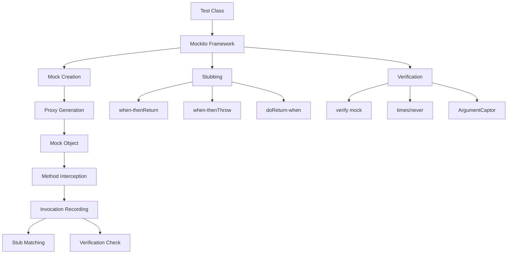

# 11.4 Mockito

## 1. Introduction

Mockito is the most popular mocking framework for Java. It enables isolation testing by replacing real dependencies with controlled mock objects. This module covers mocking, stubbing, verification, and argument captors.

## 2. Learning Objectives

- Create and configure mock objects
- Stub method calls with return values
- Verify method interactions
- Capture and inspect arguments
- Handle void methods and exceptions

## 3. Prerequisites

- JUnit 5 knowledge
- Understanding of interfaces and dependency injection
- Basic understanding of testing principles

## 4. Why This Concept Exists

Real applications have dependencies (databases, APIs, file systems). Testing with real dependencies is:
- Slow (network calls, file I/O)
- Unreliable (external services may fail)
- Complex (requires setup/teardown)
- Non-deterministic (results vary)

Mockito solves this by replacing dependencies with controllable fakes.

## 5. Problem Statement

How do we test a class that depends on external services without actually calling those services?

## 6. Theory

### Core Concepts

- **Mock**: A fake object that simulates real behavior
- **Stub**: Predefined responses for method calls
- **Verification**: Checking that methods were called
- **Argument Captor**: Capturing arguments for inspection
- **Spy**: Partial mock that calls real methods

### Mockito Workflow

```
1. Create mock object
2. Stub method behavior
3. Call method under test
4. Verify interactions
```

### Key Methods

| Method | Description |
|--------|-------------|
| `mock()` | Create a mock object |
| `when().thenReturn()` | Stub return value |
| `when().thenThrow()` | Stub exception |
| `verify()` | Check method was called |
| `times()` | Verify call count |
| `never()` | Verify method not called |
| `any()`, `eq()` | Argument matchers |
| `ArgumentCaptor` | Capture arguments |

## 7. Internal Working

1. **Proxy Creation**: Mockito creates proxy objects using ByteBuddy
2. **Method Interception**: All method calls are intercepted
3. **Stub Matching**: When a stubbed method is called, Mockito matches arguments
4. **Return/Throw**: Returns stubbed value or throws exception
5. **Interaction Recording**: All calls are recorded for verification
6. **Argument Matching**: Uses Hamcrest matchers for flexible matching

## 8. JVM Perspective

- Mocks created using dynamic proxies (java.lang.reflect.Proxy)
- ByteBuddy generates mock classes at runtime
- Mocks have the same classloader as real objects
- Mockito uses thread-local storage for verification
- No bytecode manipulation on production classes

## 9. Memory Representation

```
Mockito Mock Object:
┌─────────────────────────────────┐
│         Mock Object             │
├─────────────────────────────────┤
│  ┌───────────────────────────┐  │
│  │  Method Invocation Record │  │
│  │  - Method name            │  │
│  │  - Arguments              │  │
│  │  - Return value           │  │
│  │  - Timestamp              │  │
│  └───────────────────────────┘  │
├─────────────────────────────────┤
│  ┌───────────────────────────┐  │
│  │  Stub Configuration       │  │
│  │  - Argument matchers      │  │
│  │  - Return values          │  │
│  │  - Exception rules        │  │
│  └───────────────────────────┘  │
├─────────────────────────────────┤
│  ┌───────────────────────────┐  │
│  │  Verification State       │  │
│  │  - Expected invocations   │  │
│  │  - Actual invocations     │  │
│  └───────────────────────────┘  │
└─────────────────────────────────┘
```

## 10. Architecture Diagram



## 11. Flow Diagram


## 12. Syntax

```java
import org.mockito.*;
import static org.mockito.Mockito.*;
import static org.junit.jupiter.api.Assertions.*;

// Create mock
@Mock
UserService userService;

// Inject mocks
@Captor
ArgumentCaptor<User> userCaptor;

@BeforeEach
void setUp() {
    MockitoAnnotations.openMocks(this);
}

@Test
void testMethod() {
    // Stub
    when(userService.findById(1L)).thenReturn(new User("John"));
    
    // Call
    User user = service.getUser(1L);
    
    // Verify
    verify(userService).findById(1L);
    assertEquals("John", user.getName());
    
    // Capture
    verify(userService).save(userCaptor.capture());
    assertEquals("John", userCaptor.getValue().getName());
}
```

## 13. Easy Example

```java
import org.junit.jupiter.api.BeforeEach;
import org.junit.jupiter.api.Test;
import org.mockito.Mock;
import org.mockito.junit.jupiter.MockitoExtension;
import org.junit.jupiter.api.extension.ExtendWith;
import static org.mockito.Mockito.*;
import static org.junit.jupiter.api.Assertions.*;

@ExtendWith(MockitoExtension.class)
class SimpleMockTest {
    
    @Mock
    private EmailService emailService;
    
    private UserService userService;
    
    @BeforeEach
    void setUp() {
        userService = new UserService(emailService);
    }
    
    @Test
    void shouldSendWelcomeEmail() {
        // Arrange
        User user = new User("john@example.com");
        when(emailService.send(anyString(), anyString())).thenReturn(true);
        
        // Act
        boolean result = userService.registerUser(user);
        
        // Assert
        assertTrue(result);
        verify(emailService).send(eq("john@example.com"), contains("Welcome"));
    }
    
    @Test
    void shouldHandleEmailFailure() {
        // Arrange
        User user = new User("john@example.com");
        when(emailService.send(anyString(), anyString())).thenReturn(false);
        
        // Act
        boolean result = userService.registerUser(user);
        
        // Assert
        assertFalse(result);
    }
}
```

## 14. Medium Example

```java
import org.junit.jupiter.api.BeforeEach;
import org.junit.jupiter.api.Test;
import org.mockito.*;
import org.junit.jupiter.api.extension.ExtendWith;
import org.mockito.junit.jupiter.MockitoExtension;
import static org.mockito.Mockito.*;
import static org.junit.jupiter.api.Assertions.*;

@ExtendWith(MockitoExtension.class)
class OrderServiceTest {
    
    @Mock
    private OrderRepository orderRepository;
    
    @Mock
    private PaymentService paymentService;
    
    @Mock
    private InventoryService inventoryService;
    
    @Captor
    private ArgumentCaptor<Order> orderCaptor;
    
    @InjectMocks
    private OrderService orderService;
    
    @BeforeEach
    void setUp() {
        // @InjectMocks automatically injects mocks
    }
    
    @Test
    void shouldCreateOrderSuccessfully() {
        // Arrange
        OrderRequest request = new OrderRequest("PROD-1", 2, 29.99);
        when(inventoryService.checkStock("PROD-1")).thenReturn(10);
        when(paymentService.processPayment(anyDouble())).thenReturn(true);
        when(orderRepository.save(any(Order.class))).thenAnswer(invocation -> {
            Order order = invocation.getArgument(0);
            order.setId("ORD-1");
            return order;
        });
        
        // Act
        OrderResponse response = orderService.createOrder(request);
        
        // Assert
        assertNotNull(response);
        assertEquals("ORD-1", response.getOrderId());
        
        verify(inventoryService).checkStock("PROD-1");
        verify(inventoryService).reserveStock("PROD-1", 2);
        verify(paymentService).processPayment(59.98);
        
        verify(orderCaptor).capture();
        Order savedOrder = orderCaptor.getValue();
        assertEquals(2, savedOrder.getQuantity());
    }
    
    @Test
    void shouldFailWhenOutOfStock() {
        // Arrange
        OrderRequest request = new OrderRequest("PROD-1", 2, 29.99);
        when(inventoryService.checkStock("PROD-1")).thenReturn(0);
        
        // Act & Assert
        assertThrows(OutOfStockException.class,
            () -> orderService.createOrder(request));
        
        verify(paymentService, never()).processPayment(anyDouble());
        verify(orderRepository, never()).save(any(Order.class));
    }
    
    @Test
    void shouldHandlePaymentFailure() {
        // Arrange
        OrderRequest request = new OrderRequest("PROD-1", 2, 29.99);
        when(inventoryService.checkStock("PROD-1")).thenReturn(10);
        when(paymentService.processPayment(anyDouble())).thenReturn(false);
        
        // Act & Assert
        assertThrows(PaymentFailedException.class,
            () -> orderService.createOrder(request));
        
        verify(inventoryService).releaseStock("PROD-1", 2);
    }
}
```

## 15. Hard Example

```java
import org.junit.jupiter.api.BeforeEach;
import org.junit.jupiter.api.Test;
import org.mockito.*;
import org.junit.jupiter.api.extension.ExtendWith;
import org.mockito.junit.jupiter.MockitoExtension;
import java.util.*;
import static org.mockito.Mockito.*;
import static org.junit.jupiter.api.Assertions.*;

@ExtendWith(MockitoExtension.class)
class ComplexMockTest {
    
    @Mock
    private UserDAO userDAO;
    
    @Mock
    private EmailService emailService;
    
    @Mock
    private CacheService cacheService;
    
    @Captor
    private ArgumentCaptor<User> userCaptor;
    
    @Captor
    private ArgumentCaptor<String> stringCaptor;
    
    @Spy
    private PasswordEncoder passwordEncoder;
    
    @InjectMocks
    private UserService userService;
    
    @Test
    void shouldRegisterUserWithCaching() {
        // Arrange
        UserDTO dto = new UserDTO("john", "password123", "john@example.com");
        
        when(userDAO.findByUsername("john")).thenReturn(Optional.empty());
        when(userDAO.save(any(User.class))).thenAnswer(invocation -> {
            User user = invocation.getArgument(0);
            user.setId(1L);
            return user;
        });
        when(cacheService.put(anyString(), any())).thenReturn(true);
        
        // Act
        UserRegistrationResult result = userService.register(dto);
        
        // Assert
        assertTrue(result.isSuccess());
        assertEquals(1L, result.getUserId());


---

**Continue to Part 2**: [README-part2.md](README-part2.md)
```
