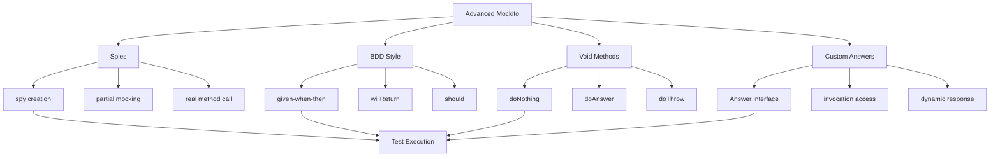

# 11.5 Advanced Mockito

## 1. Introduction

Advanced Mockito covers spies, BDD-style mocking, void method stubbing, custom answer logic, and sophisticated verification patterns. These features enable testing complex scenarios and legacy code.

## 2. Learning Objectives

- Use spies for partial mocking
- Stub void methods effectively
- Apply BDD-style Given-When-Then
- Implement custom answers for dynamic responses
- Master advanced verification techniques

## 3. Prerequisites

- Mockito basics knowledge
- Understanding of proxy patterns
- Familiarity with Hamcrest matchers

## 4. Why This Concept Exists

Advanced Mockito addresses:
- Testing legacy code with concrete classes
- Complex interaction patterns
- Dynamic behavior based on input
- BDD-style test readability
- Fine-grained verification control

## 5. Problem Statement

How do we test code with complex dependencies, void methods, and need for dynamic behavior while maintaining readable tests?

## 6. Theory

### Spies vs Mocks

| Aspect | Mock | Spy |
|--------|------|-----|
| Real behavior | None (returns defaults) | Calls real methods |
| Stubbing | Required | Optional |
| Use case | Isolation testing | Partial mocking |
| Creation | mock() | spy() |

### Void Method Stubbing

```java
// Do nothing
doNothing().when(mock).voidMethod();

// Do answer
doAnswer(invocation -> {
    // Process arguments
    return null;
}).when(mock).voidMethod();

// Throw exception
doThrow(new Exception()).when(mock).voidMethod();
```

### BDD Style

```java
// Given-When-Then with Mockito
given(userRepository.findById(1L)).willReturn(user);
when(service.process(1L)).thenReturn(result);
then(auditService).should().log(any());
```

### Custom Answers

```java
when(mock.method(any())).thenAnswer(invocation -> {
    Object arg = invocation.getArgument(0);
    return computeDynamicResponse(arg);
});
```

## 7. Internal Working

### Spy Implementation

1. Mockito creates a subclass of the real object
2. All methods are intercepted by the proxy
3. Unstubbed methods delegate to real implementation
4. Stubbed methods use mock behavior
5. State is shared between spy and real object

### Custom Answer Execution

1. Answer interface implemented
2. Invoked when stubbed method called
3. Access to invocation metadata (method, args)
4. Can return dynamic values based on input
5. Can perform side effects

## 8. JVM Perspective

- Spies created using subclass generation (ByteBuddy)
- Real object instantiated before spy wrapping
- Method calls intercepted via proxy
- Custom answers execute in test thread
- Memory overhead for spy state

## 9. Memory Representation

```
Spy Object Memory:
┌─────────────────────────────┐
│        Spy Object           │
├─────────────────────────────┤
│  ┌───────────────────────┐  │
│  │   Real Object State   │  │
│  │   - Fields            │  │
│  │   - Behavior          │  │
│  └───────────────────────┘  │
├─────────────────────────────┤
│  ┌───────────────────────┐  │
│  │   Spy Overlay         │  │
│  │   - Stubbed methods   │  │
│  │   - Invocation record │  │
│  └───────────────────────┘  │
├─────────────────────────────┤
│  ┌───────────────────────┐  │
│  │   Method Interceptor  │  │
│  │   - Delegate check    │  │
│  │   - Stub matching     │  │
│  └───────────────────────┘  │
└─────────────────────────────┘
```

## 10. Architecture Diagram



## 11. Flow Diagram

```mermaid
flowchart TD
    Start([Test Start]) --> Create[Create Spy/Mock]
    
    Create --> StubMethod{Stubbed?}
    StubMethod -->|Yes| UseStub[Use Stubbed Behavior]
    StubMethod -->|No| UseReal[Call Real Method]
    
    UseStub --> Verify[Verify Interactions]
    UseReal --> Verify
    
    Verify --> BDD{BDD Style?}
    BDD -->|Yes| Then[then().should()]
    BDD -->|No| VerifyMock[verify mock]
    
    Then --> Result{All Verified?}
    VerifyMock --> Result
    
    Result -->|Yes| Pass([Test Pass])
    Result -->|No| Fail([Test Fail])
```

## 12. Syntax

```java
// Spy usage
@Service
class RealService {
    public String process(String input) {
        return "Processed: " + input;
    }
}

// In test
@Spy
RealService realService = new RealService();

when(realService.process("test")).thenReturn("Mocked");
assertEquals("Mocked", realService.process("test"));
assertEquals("Real call", realService.process("other")); // Calls real

// BDD Style
given(userRepo.findById(1L)).willReturn(user);
when(service.get(1L)).thenReturn(dto);
then(auditService).should().log(any());

// Void methods
doNothing().when(mock).save(any());
doAnswer(invocation -> {
    User user = invocation.getArgument(0);
    user.setId(1L);
    return null;
}).when(mock).save(any(User.class));

// Custom answer
when(mock.calculate(anyInt())).thenAnswer(invocation -> {
    int arg = invocation.getArgument(0);
    return arg * 2;
});
```

## 13. Easy Example

```java
import org.junit.jupiter.api.BeforeEach;
import org.junit.jupiter.api.Test;
import org.mockito.*;
import org.junit.jupiter.api.extension.ExtendWith;
import org.mockito.junit.jupiter.MockitoExtension;
import static org.mockito.BDDMockito.*;
import static org.junit.jupiter.api.Assertions.*;

@ExtendWith(MockitoExtension.class)
class SpyBasicTest {
    
    @Spy
    private StringUtils stringUtils;
    
    @BeforeEach
    void setUp() {
        // Spy calls real methods by default
    }
    
    @Test
    void shouldCallRealMethodByDefault() {
        // Act
        String result = stringUtils.capitalize("hello");
        
        // Assert - Real method was called
        assertEquals("Hello", result);
    }
    
    @Test
    void shouldStubSpecificMethod() {
        // Arrange
        given(stringUtils.capitalize(anyString())).willReturn("MOCKED");
        
        // Act
        String result = stringUtils.capitalize("hello");
        
        // Assert
        assertEquals("MOCKED", result);
    }
    
    @Test
    void shouldUseBDDStyle() {
        // Arrange
        given(stringUtils.length("test")).willReturn(10);
        
        // Act
        int result = stringUtils.length("test");
        
        // Assert
        assertEquals(10, result);
        then(stringUtils).should().length("test");
    }
}
```

## 14. Medium Example

```java
import org.junit.jupiter.api.BeforeEach;
import org.junit.jupiter.api.Test;
import org.mockito.*;
import org.junit.jupiter.api.extension.ExtendWith;
import org.mockito.junit.jupiter.MockitoExtension;
import static org.mockito.BDDMockito.*;
import static org.mockito.Mockito.*;
import static org.junit.jupiter.api.Assertions.*;

@ExtendWith(MockitoExtension.class)
class AdvancedSpyTest {
    
    @Mock
    private EmailService emailService;
    
    @Spy
    private UserMapper userMapper; // Spy on real mapper
    
    @InjectMocks
    private UserService userService;
    
    @Captor
    private ArgumentCaptor<Email> emailCaptor;
    
    @BeforeEach
    void setUp() {
        // Spy can stub specific methods while keeping others real
    }
    
    @Test
    void shouldMapUserAndSendEmail() {
        // Arrange
        UserDTO dto = new UserDTO("john", "john@example.com");
        User user = new User("john", "john@example.com");
        
        given(userMapper.toEntity(dto)).willReturn(user);
        given(emailService.send(any(Email.class))).willReturn(true);
        
        // Act
        User created = userService.createUser(dto);
        
        // Assert
        assertNotNull(created);
        verify(emailService).send(emailCaptor.capture());
        
        Email sentEmail = emailCaptor.getValue();
        assertEquals("john@example.com", sentEmail.getTo());
    }
    
    @Test
    void shouldUsePartialSpy() {
        // Arrange
        PaymentProcessor realProcessor = new PaymentProcessor();
        PaymentProcessor spy = spy(realProcessor);
        
        doReturn(new PaymentResult(true, "TXN-123"))
            .when(spy).processPayment(anyDouble());
        
        // Act
        PaymentResult result = spy.processPayment(100.0);
        
        // Assert
        assertTrue(result.isSuccess());
        verify(spy).processPayment(100.0);
    }
    
    @Test
    void shouldStubVoidMethodWithAnswer() {
        // Arrange
        doAnswer(invocation -> {
            User user = invocation.getArgument(0);
            user.setCreatedAt(LocalDateTime.now());
            return null;
        }).when(userMapper).updateTimestamps(any(User.class));
        
        User user = new User("john", "john@example.com");
        
        // Act
        userService.updateUser(user);
        
        // Assert
        assertNotNull(user.getCreatedAt());
        verify(userMapper).updateTimestamps(user);
    }
}
```

## 15. Hard Example

```java
import org.junit.jupiter.api.BeforeEach;
import org.junit.jupiter.api.Test;
import org.mockito.*;
import org.junit.jupiter.api.extension.ExtendWith;
import org.mockito.junit.jupiter.MockitoExtension;
import java.util.concurrent.atomic.AtomicInteger;
import static org.mockito.BDDMockito.*;
import static org.mockito.Mockito.*;
import static org.junit.jupiter.api.Assertions.*;

@ExtendWith(MockitoExtension.class)
class ComplexAdvancedTest {
    
    @Mock
    private UserRepository userRepository;
    
    @Mock
    private CacheService cacheService;
    
    @Spy
    private AuditLogger auditLogger;
    
    @Captor
    private ArgumentCaptor<AuditEvent> auditCaptor;


---

**Continue to Part 2**: [README-part2.md](README-part2.md) | [Part 3](README-part3.md)