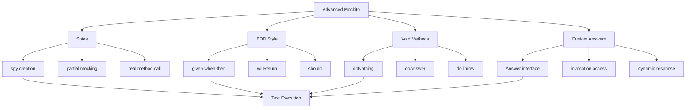

# 11.5 Advanced Mockito

## 1. Introduction

Advanced Mockito covers spies, BDD-style mocking, void method stubbing, custom answer logic, and sophisticated verification patterns. These features enable testing complex scenarios and legacy code.

## 2. Learning Objectives

- Use spies for partial mocking
- Stub void methods effectively
- Apply BDD-style Given-When-Then
- Implement custom answers for dynamic responses
- Master advanced verification techniques

## 3. Prerequisites

- Mockito basics knowledge
- Understanding of proxy patterns
- Familiarity with Hamcrest matchers

## 4. Why This Concept Exists

Advanced Mockito addresses:
- Testing legacy code with concrete classes
- Complex interaction patterns
- Dynamic behavior based on input
- BDD-style test readability
- Fine-grained verification control

## 5. Problem Statement

How do we test code with complex dependencies, void methods, and need for dynamic behavior while maintaining readable tests?

## 6. Theory

### Spies vs Mocks

| Aspect | Mock | Spy |
|--------|------|-----|
| Real behavior | None (returns defaults) | Calls real methods |
| Stubbing | Required | Optional |
| Use case | Isolation testing | Partial mocking |
| Creation | mock() | spy() |

### Void Method Stubbing

```java
// Do nothing
doNothing().when(mock).voidMethod();

// Do answer
doAnswer(invocation -> {
    // Process arguments
    return null;
}).when(mock).voidMethod();

// Throw exception
doThrow(new Exception()).when(mock).voidMethod();
```

### BDD Style

```java
// Given-When-Then with Mockito
given(userRepository.findById(1L)).willReturn(user);
when(service.process(1L)).thenReturn(result);
then(auditService).should().log(any());
```

### Custom Answers

```java
when(mock.method(any())).thenAnswer(invocation -> {
    Object arg = invocation.getArgument(0);
    return computeDynamicResponse(arg);
});
```

## 7. Internal Working

### Spy Implementation

1. Mockito creates a subclass of the real object
2. All methods are intercepted by the proxy
3. Unstubbed methods delegate to real implementation
4. Stubbed methods use mock behavior
5. State is shared between spy and real object

### Custom Answer Execution

1. Answer interface implemented
2. Invoked when stubbed method called
3. Access to invocation metadata (method, args)
4. Can return dynamic values based on input
5. Can perform side effects

## 8. JVM Perspective

- Spies created using subclass generation (ByteBuddy)
- Real object instantiated before spy wrapping
- Method calls intercepted via proxy
- Custom answers execute in test thread
- Memory overhead for spy state

## 9. Memory Representation

```
Spy Object Memory:
┌─────────────────────────────┐
│        Spy Object           │
├─────────────────────────────┤
│  ┌───────────────────────┐  │
│  │   Real Object State   │  │
│  │   - Fields            │  │
│  │   - Behavior          │  │
│  └───────────────────────┘  │
├─────────────────────────────┤
│  ┌───────────────────────┐  │
│  │   Spy Overlay         │  │
│  │   - Stubbed methods   │  │
│  │   - Invocation record │  │
│  └───────────────────────┘  │
├─────────────────────────────┤
│  ┌───────────────────────┐  │
│  │   Method Interceptor  │  │
│  │   - Delegate check    │  │
│  │   - Stub matching     │  │
│  └───────────────────────┘  │
└─────────────────────────────┘
```

## 10. Architecture Diagram



## 11. Flow Diagram

```mermaid
flowchart TD
    Start([Test Start]) --> Create[Create Spy/Mock]
    
    Create --> StubMethod{Stubbed?}
    StubMethod -->|Yes| UseStub[Use Stubbed Behavior]
    StubMethod -->|No| UseReal[Call Real Method]
    
    UseStub --> Verify[Verify Interactions]
    UseReal --> Verify
    
    Verify --> BDD{BDD Style?}
    BDD -->|Yes| Then[then().should()]
    BDD -->|No| VerifyMock[verify mock]
    
    Then --> Result{All Verified?}
    VerifyMock --> Result
    
    Result -->|Yes| Pass([Test Pass])
    Result -->|No| Fail([Test Fail])
```

## 12. Syntax

```java
// Spy usage
@Service
class RealService {
    public String process(String input) {
        return "Processed: " + input;
    }
}

// In test
@Spy
RealService realService = new RealService();

when(realService.process("test")).thenReturn("Mocked");
assertEquals("Mocked", realService.process("test"));
assertEquals("Real call", realService.process("other")); // Calls real

// BDD Style
given(userRepo.findById(1L)).willReturn(user);
when(service.get(1L)).thenReturn(dto);
then(auditService).should().log(any());

// Void methods
doNothing().when(mock).save(any());
doAnswer(invocation -> {
    User user = invocation.getArgument(0);
    user.setId(1L);
    return null;
}).when(mock).save(any(User.class));

// Custom answer
when(mock.calculate(anyInt())).thenAnswer(invocation -> {
    int arg = invocation.getArgument(0);
    return arg * 2;
});
```

## 13. Easy Example

```java
import org.junit.jupiter.api.BeforeEach;
import org.junit.jupiter.api.Test;
import org.mockito.*;
import org.junit.jupiter.api.extension.ExtendWith;
import org.mockito.junit.jupiter.MockitoExtension;
import static org.mockito.BDDMockito.*;
import static org.junit.jupiter.api.Assertions.*;

@ExtendWith(MockitoExtension.class)
class SpyBasicTest {
    
    @Spy
    private StringUtils stringUtils;
    
    @BeforeEach
    void setUp() {
        // Spy calls real methods by default
    }
    
    @Test
    void shouldCallRealMethodByDefault() {
        // Act
        String result = stringUtils.capitalize("hello");
        
        // Assert - Real method was called
        assertEquals("Hello", result);
    }
    
    @Test
    void shouldStubSpecificMethod() {
        // Arrange
        given(stringUtils.capitalize(anyString())).willReturn("MOCKED");
        
        // Act
        String result = stringUtils.capitalize("hello");
        
        // Assert
        assertEquals("MOCKED", result);
    }
    
    @Test
    void shouldUseBDDStyle() {
        // Arrange
        given(stringUtils.length("test")).willReturn(10);
        
        // Act
        int result = stringUtils.length("test");
        
        // Assert
        assertEquals(10, result);
        then(stringUtils).should().length("test");
    }
}
```

## 14. Medium Example

```java
import org.junit.jupiter.api.BeforeEach;
import org.junit.jupiter.api.Test;
import org.mockito.*;
import org.junit.jupiter.api.extension.ExtendWith;
import org.mockito.junit.jupiter.MockitoExtension;
import static org.mockito.BDDMockito.*;
import static org.mockito.Mockito.*;
import static org.junit.jupiter.api.Assertions.*;

@ExtendWith(MockitoExtension.class)
class AdvancedSpyTest {
    
    @Mock
    private EmailService emailService;
    
    @Spy
    private UserMapper userMapper; // Spy on real mapper
    
    @InjectMocks
    private UserService userService;
    
    @Captor
    private ArgumentCaptor<Email> emailCaptor;
    
    @BeforeEach
    void setUp() {
        // Spy can stub specific methods while keeping others real
    }
    
    @Test
    void shouldMapUserAndSendEmail() {
        // Arrange
        UserDTO dto = new UserDTO("john", "john@example.com");
        User user = new User("john", "john@example.com");
        
        given(userMapper.toEntity(dto)).willReturn(user);
        given(emailService.send(any(Email.class))).willReturn(true);
        
        // Act
        User created = userService.createUser(dto);
        
        // Assert
        assertNotNull(created);
        verify(emailService).send(emailCaptor.capture());
        
        Email sentEmail = emailCaptor.getValue();
        assertEquals("john@example.com", sentEmail.getTo());
    }
    
    @Test
    void shouldUsePartialSpy() {
        // Arrange
        PaymentProcessor realProcessor = new PaymentProcessor();
        PaymentProcessor spy = spy(realProcessor);
        
        doReturn(new PaymentResult(true, "TXN-123"))
            .when(spy).processPayment(anyDouble());
        
        // Act
        PaymentResult result = spy.processPayment(100.0);
        
        // Assert
        assertTrue(result.isSuccess());
        verify(spy).processPayment(100.0);
    }
    
    @Test
    void shouldStubVoidMethodWithAnswer() {
        // Arrange
        doAnswer(invocation -> {
            User user = invocation.getArgument(0);
            user.setCreatedAt(LocalDateTime.now());
            return null;
        }).when(userMapper).updateTimestamps(any(User.class));
        
        User user = new User("john", "john@example.com");
        
        // Act
        userService.updateUser(user);
        
        // Assert
        assertNotNull(user.getCreatedAt());
        verify(userMapper).updateTimestamps(user);
    }
}
```

## 15. Hard Example

```java
import org.junit.jupiter.api.BeforeEach;
import org.junit.jupiter.api.Test;
import org.mockito.*;
import org.junit.jupiter.api.extension.ExtendWith;
import org.mockito.junit.jupiter.MockitoExtension;
import java.util.concurrent.atomic.AtomicInteger;
import static org.mockito.BDDMockito.*;
import static org.mockito.Mockito.*;
import static org.junit.jupiter.api.Assertions.*;

@ExtendWith(MockitoExtension.class)
class ComplexAdvancedTest {
    
    @Mock
    private UserRepository userRepository;
    
    @Mock
    private CacheService cacheService;
    
    @Spy
    private AuditLogger auditLogger;
    
    @Captor
    private ArgumentCaptor<AuditEvent> auditCaptor;
    
    @InjectMocks
    private UserService userService;
    
    @Test
    void shouldMockBehaviorBasedOnArguments() {
        // Arrange - Different behavior based on input
        when(userRepository.findById(argThat(id -> id < 100)))
            .thenReturn(Optional.of(new User("local")));
        
        when(userRepository.findById(argThat(id -> id >= 100)))
            .thenReturn(Optional.of(new User("remote")));
        
        // Act & Assert
        assertEquals("local", userService.getUserName(50));
        assertEquals("remote", userService.getUserName(150));
    }
    
    @Test
    void shouldUseConsecutiveStubbing() {
        // Arrange - Sequential returns
        when(userRepository.count())
            .thenReturn(10)
            .thenReturn(20)
            .thenReturn(0);
        
        // Act & Assert
        assertEquals(10, userService.getUserCount());
        assertEquals(20, userService.getUserCount());
        assertEquals(0, userService.getUserCount());
    }
    
    @Test
    void shouldUseCustomAnswerForComplexLogic() {
        // Arrange - Dynamic response
        when(userRepository.findByCriteria(any(UserCriteria.class)))
            .thenAnswer(invocation -> {
                UserCriteria criteria = invocation.getArgument(0);
                if (criteria.getAge() > 18) {
                    return List.of(new User("adult"));
                }
                return List.of();
            });
        
        // Act
        List<User> adults = userService.findAdults();
        List<User> minors = userService.findMinors();
        
        // Assert
        assertFalse(adults.isEmpty());
        assertTrue(minors.isEmpty());
    }
    
    @Test
    void shouldVerifyInOrder() {
        // Arrange
        given(userRepository.save(any(User.class))).willReturn(new User());
        given(cacheService.put(anyString(), any())).willReturn(true);
        
        User user = new User("john");
        
        // Act
        userService.createUser(user);
        
        // Assert - Verify call order
        InOrder inOrder = inOrder(userRepository, cacheService, auditLogger);
        inOrder.verify(userRepository).save(any(User.class));
        inOrder.verify(cacheService).put(startsWith("user:"), any());
        inOrder.verify(auditLogger).log(any(AuditEvent.class));
    }
    
    @Test
    void shouldMockVoidMethodWithCallback() {
        // Arrange
        AtomicInteger callCount = new AtomicInteger(0);
        
        doAnswer(invocation -> {
            callCount.incrementAndGet();
            User user = invocation.getArgument(0);
            user.setId(callCount.get());
            return null;
        }).when(userRepository).save(any(User.class));
        
        // Act
        User user1 = new User("first");
        User user2 = new User("second");
        userService.createUser(user1);
        userService.createUser(user2);
        
        // Assert
        assertEquals(1, user1.getId());
        assertEquals(2, user2.getId());
        assertEquals(2, callCount.get());
    }
    
    @Test
    void shouldUseSpyForLegacyCode() {
        // Arrange - Spy on concrete class
        LegacyReportGenerator realGenerator = new LegacyReportGenerator();
        LegacyReportGenerator spy = spy(realGenerator);
        
        // Stub only expensive method
        doReturn(new Report("Mocked Report"))
            .when(spy).generateFromDatabase(anyString());
        
        // Act
        Report report = spy.generate("report.pdf");
        
        // Assert
        assertNotNull(report);
        verify(spy).generateFromDatabase("report.pdf");
    }
}
```

## 16. Enterprise Example

```java
import org.junit.jupiter.api.BeforeEach;
import org.junit.jupiter.api.Test;
import org.junit.jupiter.api.extension.ExtendWith;
import org.mockito.*;
import org.mockito.junit.jupiter.MockitoExtension;
import java.time.LocalDateTime;
import static org.mockito.BDDMockito.*;
import static org.mockito.Mockito.*;
import static org.junit.jupiter.api.Assertions.*;

@ExtendWith(MockitoExtension.class)
class EnterpriseAdvancedMockTest {
    
    @Mock
    private PaymentGateway paymentGateway;
    
    @Mock
    private FraudDetector fraudDetector;
    
    @Spy
    private TransactionMapper transactionMapper;
    
    @Mock
    private NotificationService notificationService;
    
    @Captor
    private ArgumentCaptor<Transaction> transactionCaptor;
    
    @Captor
    private ArgumentCaptor<Notification> notificationCaptor;
    
    @InjectMocks
    private PaymentService paymentService;
    
    @Test
    void shouldProcessPaymentWithFraudCheck() {
        // Arrange
        PaymentRequest request = new PaymentRequest("USER-1", 500.00, "USD");
        
        given(fraudDetector.isSuspicious(request)).willReturn(false);
        given(paymentGateway.charge(any(PaymentDetails.class)))
            .willReturn(new PaymentResponse(true, "CHG-123"));
        
        // Act
        PaymentResult result = paymentService.processPayment(request);
        
        // Assert
        assertTrue(result.isSuccess());
        assertEquals("CHG-123", result.getTransactionId());
        
        // Verify all interactions
        then(fraudDetector).should().isSuspicious(request);
        then(paymentGateway).should().charge(any(PaymentDetails.class));
        then(notificationService).should().sendPaymentConfirmation(any());
        
        // Verify transaction was saved
        verify(transactionMapper).toEntity(transactionCaptor.capture());
        Transaction saved = transactionCaptor.getValue();
        assertEquals("CHG-123", saved.getTransactionId());
    }
    
    @Test
    void shouldBlockSuspiciousPayment() {
        // Arrange
        PaymentRequest request = new PaymentRequest("USER-2", 5000.00, "USD");
        given(fraudDetector.isSuspicious(request)).willReturn(true);
        
        // Act
        PaymentResult result = paymentService.processPayment(request);
        
        // Assert
        assertFalse(result.isSuccess());
        assertEquals("Suspicious activity detected", result.getFailureReason());
        
        // Verify payment was NOT attempted
        then(paymentGateway).should(never()).charge(any());
        then(notificationService).should().sendFraudAlert(anyString());
    }
    
    @Test
    void shouldHandlePaymentGatewayFailure() {
        // Arrange
        PaymentRequest request = new PaymentRequest("USER-3", 100.00, "USD");
        
        given(fraudDetector.isSuspicious(request)).willReturn(false);
        given(paymentGateway.charge(any()))
            .willThrow(new PaymentGatewayException("Service unavailable"));
        
        // Act
        PaymentResult result = paymentService.processPayment(request);
        
        // Assert
        assertFalse(result.isSuccess());
        assertEquals("Payment service unavailable", result.getFailureReason());
        
        // Verify retry logic
        then(paymentGateway).should(times(3)).charge(any());
    }
    
    @Test
    void shouldUseDynamicStubbing() {
        // Arrange - Different responses based on amount
        when(paymentGateway.charge(argThat(details -> details.getAmount() < 100)))
            .thenReturn(new PaymentResponse(true, "SMALL-TXN"));
        
        when(paymentGateway.charge(argThat(details -> details.getAmount() >= 100)))
            .thenReturn(new PaymentResponse(true, "LARGE-TXN"));
        
        // Act & Assert
        PaymentResult small = paymentService.processPayment(
            new PaymentRequest("U1", 50.00, "USD"));
        assertEquals("SMALL-TXN", small.getTransactionId());
        
        PaymentResult large = paymentService.processPayment(
            new PaymentRequest("U2", 500.00, "USD"));
        assertEquals("LARGE-TXN", large.getTransactionId());
    }
    
    @Test
    void shouldVerifyNotificationContent() {
        // Arrange
        PaymentRequest request = new PaymentRequest("USER-4", 200.00, "USD");
        given(fraudDetector.isSuspicious(request)).willReturn(false);
        given(paymentGateway.charge(any()))
            .willReturn(new PaymentResponse(true, "TXN-456"));
        
        // Act
        paymentService.processPayment(request);
        
        // Assert - Capture and verify notification content
        verify(notificationService).send(notificationCaptor.capture());
        Notification notification = notificationCaptor.getValue();
        
        assertEquals("USER-4", notification.getRecipientId());
        assertTrue(notification.getMessage().contains("TXN-456"));
        assertEquals(NotificationType.PAYMENT_CONFIRMATION, notification.getType());
    }
}
```

## 17. Performance

| Feature | Performance | Best Practice |
|---------|-------------|---------------|
| Spy creation | Medium | Use sparingly |
| Custom answers | Fast | Cache when possible |
| BDD style | Same as standard | Use for readability |
| Argument matching | Fast | Use specific matchers |

**Performance Tips:**
- Prefer mocks over spies when possible
- Cache expensive test data
- Use lenient() to avoid unnecessary stubbing exceptions
- Reuse mock configurations across tests

## 18. Time & Space Complexity

| Operation | Time | Space |
|-----------|------|-------|
| Spy creation | O(1) | O(m) |
| Custom answer | O(1) | O(a) |
| Argument matching | O(n) | O(1) |
| InOrder verification | O(n log n) | O(n) |

Where: m = methods, a = answer state, n = invocations

## 19. Thread Safety

- Spies are thread-safe for concurrent reads
- Mock state is thread-safe
- ArgumentCaptors are NOT thread-safe
- Custom answers should be thread-safe
- Use AtomicReference for shared state in answers

## 20. Best Practices

1. **Use BDD style** (given-when-then) for readability
2. **Prefer mocks over spies** for isolation
3. **Use custom answers** for complex logic
4. **Stub void methods** with doReturn/doAnswer
5. **Verify with InOrder** for sequence-critical code
6. **Use ArgumentMatchers** for flexible matching
7. **Document complex stubs** with comments
8. **Test spy behavior** separately from real logic
9. **Reset mocks** between tests when state matters
10. **Use lenient()** to debug strict stubbing

## 21. Common Mistakes

1. **Overusing spies** - Use mocks for isolation
2. **Stubbing real methods in spy** - Can cause unexpected behavior
3. **Ignoring void method stubbing** - Results in NPE
4. **Complex custom answers** - Hard to debug
5. **Inconsistent argument matchers** - Mix of matchers and values
6. **Forgetting InOrder** - Verification order matters
7. **Stubbing inside loops** - Creates multiple stubs
8. **Not verifying side effects** - Miss important interactions
9. **Overly strict verification** - Brittle tests
10. **Not using doReturn for spies** - Can trigger real method

## 22. Pitfalls

- **Spy state leakage** - Real object state persists
- **Stubbing conflicts** - Multiple stubs for same method
- **Answer exceptions** - Errors in custom answers
- **Verification order** - Wrong InOrder usage
- **Mock/spy confusion** - Using wrong type
- **Legacy code testing** - Spies may not work

## 23. Debugging Tips

1. **Use Mockito.reset()** to clear state
2. **Print invocation arguments** in answers
3. **Check stub order** - Last stub wins
4. **Verify argument matchers** are consistent
5. **Use lenient()** to debug unnecessary stubs
6. **Check spy delegation** - Is real method called?
7. **Use Mockito.debug()** for invocation history

## 24. Comparison Table

| Feature | Mock | Spy | Answer |
|---------|------|-----|--------|
| Real behavior | No | Yes | Custom |
| Stubbing | Required | Optional | Dynamic |
| Verification | Yes | Yes | No |
| Use case | Isolation | Partial | Complex logic |

## 25. Decision Tree

```
When to use advanced features?
│
├─ Need partial mocking?
│  └─ Use @Spy
│
├─ Need dynamic response?
│  └─ Use custom Answer
│
├─ Need BDD readability?
│  └─ Use given-when-then
│
├─ Need void method stubbing?
│  └─ Use doReturn/doAnswer
│
└─ Need call order verification?
   └─ Use InOrder
```

## 26. Interview Questions

1. **What is the difference between @Mock and @Spy?**
   - Answer: @Mock returns defaults; @Spy calls real methods unless stubbed.

2. **When should you use a spy over a mock?**
   - Answer: When testing legacy code or needing partial mocking with real behavior.

3. **How do you stub a void method in Mockito?**
   - Answer: Use doReturn-when, doNothing-when, or doAnswer-when patterns.

4. **What is BDD style in Mockito and why use it?**
   - Answer: Given-When-Then format improves test readability and intent.

5. **How do you verify call order with Mockito?**
   - Answer: Use InOrder to specify expected sequence of calls.

6. **What is a custom Answer and when is it useful?**
   - Answer: Interface for dynamic stubbing based on arguments or state.

7. **How do you test code with complex dependencies?**
   - Answer: Use @InjectMocks with @Mock dependencies and verify interactions.

8. **What are argument matchers and when should you use them?**
   - Answer: Flexible matching for arguments; use when exact values aren't important.

9. **How do you handle flaky tests with Mockito?**
   - Answer: Use lenient stubbing, verify less, and avoid over-specifying.

10. **What is the difference between verify and then?**
    - Answer: verify checks after execution; then is part of BDD style for readability.

11. **How do you mock a method that returns different values?**
    - Answer: Chain multiple thenReturn calls or use a custom Answer.

12. **What are best practices for spy usage?**
    - Answer: Use sparingly, prefer mocks, stub expensive methods, test real logic separately.

13. **How do you verify a method was called with any argument?**
    - Answer: Use any() matcher or argThat() for custom matching.

14. **What is doReturn vs when for stubbing?**
    - Answer: doReturn is safer for spies (doesn't call real method); when calls real method first.

15. **How do you test void methods that modify arguments?**
    - Answer: Use doAnswer to capture and modify arguments in the stub.

## 27. Exercises

### Beginner

1. **Basic Spy Usage**
   - Create a spy of a StringProcessor class
   - Stub one method, let others run real
   - Verify both real and stubbed methods work

2. **Void Method Stubbing**
   - Mock a Logger class
   - Stub void log() method with doNothing
   - Verify log() was called

### Intermediate

3. **BDD Style Tests**
   - Refactor existing tests to BDD style
   - Use given-when-then for readability
   - Verify interactions with then().should()

4. **Custom Answer Logic**
   - Create an answer that doubles input integers
   - Create an answer that returns different values based on input
   - Test both scenarios

### Advanced

5. **Complex Spy Scenario**
   - Spy on a concrete service class
   - Stub only database-dependent methods
   - Verify real business logic executes

6. **Enterprise Mock Pattern**
   - Create test with multiple mocks and one spy
   - Use InOrder for verification
   - Capture and verify all notifications

## 28. Summary

Advanced Mockito provides powerful tools for complex testing scenarios. Spies enable partial mocking, BDD style improves readability, custom answers provide flexibility, and advanced verification ensures correct behavior. Master these techniques for enterprise-level testing.

## 29. References

- Mockito BDDMockito: https://site.mockito.org/javadoc/current/org/mockito/BDDMockito.html
- Mockito Spies: https://site.mockito.org/javadoc/current/org/mockito/Mockito.html#spy-
- Mockito Answers: https://site.mockito.org/javadoc/current/org/mockito/stubbing/Answer.html
- Advanced Mockito Patterns: https://www.baeldung.com/mockito-advanced-patterns
