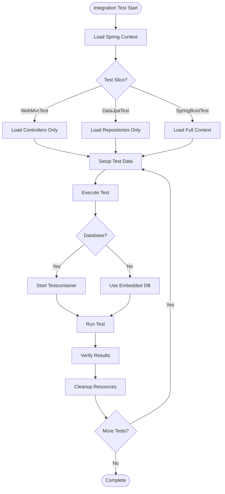

# 11.6 Integration Testing

## 1. Introduction

Integration testing verifies how multiple components work together. This module covers Spring Boot Test, Testcontainers for database testing, and strategies for testing integrations between services, databases, and external APIs.

## 2. Learning Objectives

- Use Spring Boot Test for integration testing
- Apply Testcontainers for database testing
- Test REST APIs with MockMvc and WebTestClient
- Verify database operations with @DataJpaTest
- Test message queue integrations

## 3. Prerequisites

- Spring Boot basics
- Understanding of dependency injection
- Familiarity with JUnit 5
- Basic database knowledge

## 4. Why This Concept Exists

Unit tests verify components in isolation, but real bugs often occur at integration points. Integration testing ensures:
- Database queries work correctly
- API contracts are maintained
- Service interactions function properly
- Configuration is correct

## 5. Problem Statement

How do we test that our application components work together correctly, including databases, APIs, and message queues?

## 6. Theory

### Integration Test Types

| Type | Scope | Tools |
|------|-------|-------|
| Component | Multiple classes | Spring Context |
| Database | Repository layer | @DataJpaTest |
| API | REST endpoints | MockMvc, WebTestClient |
| Service | Service interactions | @SpringBootTest |
| E2E | Full application | Testcontainers |

### Testcontainers

- Docker-based integration testing
- Real database instances
- Disposable containers
- Parallel execution support
- Clean state per test

### Spring Boot Test Slices

- `@WebMvcTest` - Controller layer only
- `@DataJpaTest` - JPA repositories only
- `@RestClientTest` - REST clients only
- `@JsonTest` - JSON serialization
- `@SpringBootTest` - Full context

## 7. Internal Working

### Spring Boot Test Execution

1. Test slices load only relevant beans
2. Auto-configuration creates test context
3. Embedded databases or Testcontainers started
4. Transactions managed for isolation
5. Context cached for performance

### Testcontainers Lifecycle

1. Docker images pulled/cached
2. Containers started with random ports
3. Applications connect via exposed ports
4. Containers stopped after tests
5. Resources cleaned up

## 8. JVM Perspective

- Test context shares JVM with tests
- Embedded databases run in-process
- Testcontainers run in Docker (separate JVM)
- Connection pools managed per context
- Transactions isolated via AOP

## 9. Memory Representation

```
Integration Test Memory:
┌─────────────────────────────────┐
│         Test JVM                │
├─────────────────────────────────┤
│  ┌───────────────────────────┐  │
│  │   Spring Context          │  │
│  │   - Bean definitions      │  │
│  │   - Configuration         │  │
│  │   - AOP proxies           │  │
│  └───────────────────────────┘  │
├─────────────────────────────────┤
│  ┌───────────────────────────┐  │
│  │   Test Infrastructure     │  │
│  │   - MockMvc/WebTestClient │  │
│  │   - TestRestTemplate      │  │
│  │   - @MockBean             │  │
│  └───────────────────────────┘  │
├─────────────────────────────────┤
│  ┌───────────────────────────┐  │
│  │   Database Connection     │  │
│  │   - H2 (embedded)         │  │
│  │   - Testcontainers (Docker)│  │
│  └───────────────────────────┘  │
└─────────────────────────────────┘
```

## 10. Architecture Diagram

```mermaid
graph TD
    A[Integration Testing] --> B[Spring Boot Test]
    A --> C[Testcontainers]
    A --> D[API Testing]
    
    B --> B1[@SpringBootTest]
    B --> B2[Test Slices]
    B --> B3[@MockBean]
    
    C --> C1[Database Containers]
    C --> C2[Message Queues]
    C --> C3[External Services]
    
    D --> D1[MockMvc]
    D --> D2[WebTestClient]
    D --> D3[RestTemplate]
    
    B1 --> E[Test Execution]
    C1 --> E
    D1 --> E
    
    E --> F[Transaction Management]
    E --> G[Context Caching]
```

## 11. Flow Diagram



## 12. Syntax

```java
// Spring Boot Test
@SpringBootTest
class ApplicationTest {
    @Autowired
    private ApplicationContext context;
    
    @Test
    void contextLoads() {
        assertNotNull(context);
    }
}

// WebMvc Test
@WebMvcTest(UserController.class)
class UserControllerTest {
    @Autowired
    private MockMvc mockMvc;
    
    @MockBean
    private UserService userService;
    
    @Test
    void shouldGetUser() throws Exception {
        when(userService.findById(1L)).thenReturn(new User("John"));
        
        mockMvc.perform(get("/users/1"))
            .andExpect(status().isOk())
            .andExpect(jsonPath("$.name").value("John"));
    }
}

// DataJpa Test
@DataJpaTest
class UserRepositoryTest {
    @Autowired
    private TestEntityManager entityManager;
    
    @Autowired
    private UserRepository userRepository;
    
    @Test
    void shouldFindUserByUsername() {
        User user = new User("john", "john@example.com");
        entityManager.persistAndFlush(user);
        
        Optional<User> found = userRepository.findByUsername("john");
        assertTrue(found.isPresent());
    }
}

// Testcontainers
@SpringBootTest
@Testcontainers
class IntegrationTest {
    @Container
    static PostgreSQLContainer<?> postgres = new PostgreSQLContainer<>("postgres:15")
        .withDatabaseName("testdb");
    
    @DynamicPropertySource
    static void configureProperties(DynamicPropertyRegistry registry) {
        registry.add("spring.datasource.url", postgres::getJdbcUrl);
    }
}
```

## 13. Easy Example

```java
import org.junit.jupiter.api.Test;
import org.springframework.beans.factory.annotation.Autowired;
import org.springframework.boot.test.context.SpringBootTest;
import static org.junit.jupiter.api.Assertions.*;

@SpringBootTest
class ApplicationStartupTest {
    
    @Autowired
    private ApplicationContext context;
    
    @Test
    void contextLoads() {
        // Verify Spring context starts successfully
        assertNotNull(context);
        assertTrue(context.getBeanDefinitionCount() > 0);
    }
    
    @Test
    void shouldLoadAllBeans() {
        // Verify critical beans are present
        assertTrue(context.containsBean("userRepository"));
        assertTrue(context.containsBean("userService"));
        assertTrue(context.containsBean("userController"));
    }
}
```

## 14. Medium Example

```java
import org.junit.jupiter.api.BeforeEach;
import org.junit.jupiter.api.Test;
import org.springframework.beans.factory.annotation.Autowired;
import org.springframework.boot.test.autoconfigure.web.servlet.WebMvcTest;
import org.springframework.boot.test.mock.bean.MockBean;
import org.springframework.http.MediaType;
import org.springframework.test.web.servlet.MockMvc;
import java.util.List;
import static org.mockito.Mockito.*;
import static org.springframework.test.web.servlet.request.MockMvcRequestBuilders.*;
import static org.springframework.test.web.servlet.result.MockMvcResultMatchers.*;

@WebMvcTest(UserController.class)
class UserControllerIntegrationTest {
    
    @Autowired
    private MockMvc mockMvc;
    
    @MockBean
    private UserService userService;
    
    @BeforeEach
    void setUp() {
        User user1 = new User(1L, "John", "john@example.com");
        User user2 = new User(2L, "Jane", "jane@example.com");
        
        when(userService.findAll()).thenReturn(List.of(user1, user2));
        when(userService.findById(1L)).thenReturn(user1);
    }
    
    @Test
    void shouldGetAllUsers() throws Exception {
        mockMvc.perform(get("/api/users")
                .accept(MediaType.APPLICATION_JSON))
            .andExpect(status().isOk())
            .andExpect(content().contentType(MediaType.APPLICATION_JSON))
            .andExpect(jsonPath("$[0].name").value("John"))
            .andExpect(jsonPath("$[1].name").value("Jane"))
            .andExpect(jsonPath("$").isArray())
            .andExpect(jsonPath("$.length()").value(2));
        
        verify(userService, times(1)).findAll();
    }
    
    @Test
    void shouldGetUserById() throws Exception {
        mockMvc.perform(get("/api/users/1")
                .accept(MediaType.APPLICATION_JSON))
            .andExpect(status().isOk())
            .andExpect(jsonPath("$.name").value("John"))
            .andExpect(jsonPath("$.email").value("john@example.com"));
        
        verify(userService).findById(1L);
    }
    
    @Test
    void shouldReturn404WhenUserNotFound() throws Exception {
        when(userService.findById(99L)).thenThrow(new UserNotFoundException("User not found"));
        
        mockMvc.perform(get("/api/users/99"))
            .andExpect(status().isNotFound())
            .andExpect(jsonPath("$.message").value("User not found"));
    }
    
    @Test
    void shouldCreateUser() throws Exception {
        User newUser = new User(3L, "Bob", "bob@example.com");
        when(userService.create(any(User.class))).thenReturn(newUser);
        
        mockMvc.perform(post("/api/users")
                .contentType(MediaType.APPLICATION_JSON)
                .content("{\"name\":\"Bob\",\"email\":\"bob@example.com\"}"))
            .andExpect(status().isCreated())
            .andExpect(jsonPath("$.id").value(3))
            .andExpect(jsonPath("$.name").value("Bob"));
        
        verify(userService).create(any(User.class));
    }
}
```

## 15. Hard Example

```java
import org.junit.jupiter.api.BeforeEach;
import org.junit.jupiter.api.Test;
import org.springframework.beans.factory.annotation.Autowired;
import org.springframework.boot.test.context.SpringBootTest;
import org.springframework.boot.test.mock.bean.MockBean;
import org.springframework.test.context.ActiveProfiles;
import org.springframework.transaction.annotation.Transactional;
import java.util.Optional;
import static org.junit.jupiter.api.Assertions.*;
import static org.mockito.Mockito.*;

@SpringBootTest
@ActiveProfiles("test")
@Transactional
class UserRepositoryIntegrationTest {
    
    @Autowired
    private UserRepository userRepository;
    
    @Autowired
    private TestEntityManager entityManager;
    
    @MockBean
    private CacheService cacheService;
    
    private User testUser;
    
    @BeforeEach
    void setUp() {
        testUser = new User("testuser", "test@example.com");
        testUser.setPassword("encodedPassword");
        entityManager.persistAndFlush(testUser);
    }
    
    @Test
    void shouldPersistUser() {
        // Arrange


---

**Continue to Part 2**: [README-part2.md](README-part2.md) | [Part 3](README-part3.md)