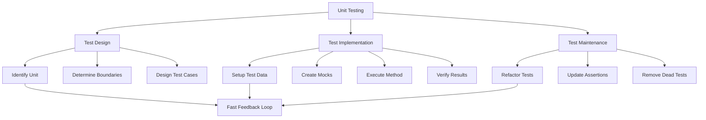

# 11.7 Unit Testing Best Practices

## 1. Introduction

Unit testing focuses on testing individual components in isolation. This module covers best practices, testing strategies, handling private methods, pure functions, and creating maintainable unit tests.

## 2. Learning Objectives

- Apply unit testing best practices
- Test private methods effectively
- Identify and test pure functions
- Create testable code designs
- Achieving high test coverage

## 3. Prerequisites

- JUnit 5 knowledge
- Mockito basics
- Understanding of SOLID principles

## 4. Why This Concept Exists

Unit tests provide:
- Fast feedback during development
- Documentation of expected behavior
- Safety net for refactoring
- Design improvement hints
- Bug prevention

## 5. Problem Statement

How do we write unit tests that are fast, reliable, maintainable, and provide meaningful coverage?

## 6. Theory

### Unit Testing Principles

1. **Fast**: Tests run in milliseconds
2. **Independent**: No test depends on another
3. **Repeatable**: Same result every time
4. **Self-Validating**: Clear pass/fail
5. **Timely**: Written at appropriate time

### Testing Private Methods

- Don't test private methods directly
- Test through public interface
- Refactor if private logic needs testing
- Use package-private for testability

### Pure Functions

- Same input always produces same output
- No side effects (no I/O, no state mutation)
- Easy to test, easy to reason about
- Prefer pure functions when possible

## 7. Internal Working

### Test Execution Flow

1. Test runner discovers test classes
2. Creates new instance per test
3. Executes @BeforeEach setup
4. Runs test method
5. Evaluates assertions
6. Executes @AfterEach cleanup
7. Reports results

### Code Coverage Analysis

1. Instrument bytecode during compilation
2. Track executed lines/branches
3. Calculate coverage percentage
4. Generate reports

## 8. JVM Perspective

- Unit tests run in same JVM
- No network or file I/O
- Mocks created via proxies
- In-memory execution
- Fast garbage collection

## 9. Memory Representation

```
Unit Test Memory Model:
┌─────────────────────────────┐
│        Test Instance        │
├─────────────────────────────┤
│  ┌───────────────────────┐  │
│  │   Mock Objects        │  │
│  │   - Proxy instances   │  │
│  │   - Stub data         │  │
│  └───────────────────────┘  │
├─────────────────────────────┤
│  ┌───────────────────────┐  │
│  │   Class Under Test    │  │
│  │   - Real behavior     │  │
│  │   - Injected mocks    │  │
│  └───────────────────────┘  │
├─────────────────────────────┤
│  ┌───────────────────────┐  │
│  │   Test Data           │  │
│  │   - Fixtures          │  │
│  │   - Expected results  │  │
│  └───────────────────────┘  │
└─────────────────────────────┘
```

## 10. Architecture Diagram



## 11. Flow Diagram

```mermaid
flowchart TD
    Start([Unit Test Start]) --> Identify[Identify Unit Under Test]
    Identify --> Boundaries[Define Boundaries]
    Boundaries --> Design[Design Test Cases]
    
    Design --> Positive[Positive Scenarios]
    Design --> Negative[Negative Scenarios]
    Design --> Boundary[Boundary Conditions]
    
    Positive --> Implement[Implement Tests]
    Negative --> Implement
    Boundary --> Implement
    
    Implement --> Execute[Run Tests]
    Execute --> Analyze[Analyze Results]
    
    Analyze --> Coverage{Coverage OK?}
    Coverage -->|Yes| Refactor[Refactor Code]
    Coverage -->|No| AddMore[Add More Tests]
    
    AddMore --> Implement
    Refactor --> Done([Unit Test Complete])
```



## 12. Syntax

```java
// Pure function testing
class MathUtils {
    static int add(int a, int b) {
        return a + b; // Pure function
    }
}

@Test
void shouldAddNumbers() {
    assertEquals(5, MathUtils.add(2, 3));
}

// Testing through public interface
class UserService {
    private void validateEmail(String email) { // Private method
        if (!email.contains("@")) {
            throw new IllegalArgumentException("Invalid email");
        }
    }
    
    public User createUser(String email) { // Public interface
        validateEmail(email);
        return new User(email);
    }
}

@Test
void shouldRejectInvalidEmail() {
    assertThrows(IllegalArgumentException.class,
        () -> userService.createUser("invalid"));
}

// Testable design with dependency injection
class OrderProcessor {
    private final PaymentService paymentService;
    private final InventoryService inventoryService;
    
    // Constructor injection for testability
    OrderProcessor(PaymentService paymentService, 
                   InventoryService inventoryService) {
        this.paymentService = paymentService;
        this.inventoryService = inventoryService;
    }
}
```

## 13. Easy Example

```java
import org.junit.jupiter.api.Test;
import static org.junit.jupiter.api.Assertions.*;

class StringManipulatorTest {
    
    private final StringManipulator manipulator = new StringManipulator();
    
    @Test
    void shouldReverseString() {
        // Arrange
        String input = "Hello";
        
        // Act
        String result = manipulator.reverse(input);
        
        // Assert
        assertEquals("olleH", result);
    }
    
    @Test
    void shouldCapitalizeFirstLetter() {
        assertEquals("Hello", manipulator.capitalize("hello"));
        assertEquals("Hello", manipulator.capitalize("Hello"));
        assertEquals("", manipulator.capitalize(""));
    }
    
    @Test
    void shouldCountWords() {
        assertEquals(1, manipulator.countWords("Hello"));
        assertEquals(2, manipulator.countWords("Hello World"));
        assertEquals(0, manipulator.countWords(""));
        assertEquals(0, manipulator.countWords("   "));
    }
}
```

## 14. Medium Example

```java
import org.junit.jupiter.api.BeforeEach;
import org.junit.jupiter.api.Test;
import org.junit.jupiter.api.DisplayName;
import java.util.List;
import static org.junit.jupiter.api.Assertions.*;
import static org.mockito.Mockito.*;

class PriceCalculatorTest {
    
    private PriceCalculator calculator;
    
    @BeforeEach
    void setUp() {
        calculator = new PriceCalculator();
    }
    
    @Test
    @DisplayName("Should calculate discount for VIP customers")
    void shouldCalculateVipDiscount() {
        // Arrange
        double price = 100.0;
        CustomerType customerType = CustomerType.VIP;
        
        // Act
        double discountedPrice = calculator.calculatePrice(price, customerType);
        
        // Assert
        assertEquals(80.0, discountedPrice, 0.01); // 20% discount
    }
    
    @Test
    @DisplayName("Should not apply discount for regular customers")
    void shouldNotDiscountRegularCustomer() {
        // Arrange
        double price = 100.0;
        CustomerType customerType = CustomerType.REGULAR;
        
        // Act
        double discountedPrice = calculator.calculatePrice(price, customerType);
        
        // Assert
        assertEquals(100.0, discountedPrice, 0.01);
    }
    
    @Test
    @DisplayName("Should handle edge cases")
    void shouldHandleEdgeCases() {
        // Zero price
        assertEquals(0.0, calculator.calculatePrice(0, CustomerType.REGULAR), 0.01);
        
        // Negative price (should throw)
        assertThrows(IllegalArgumentException.class,
            () -> calculator.calculatePrice(-10, CustomerType.REGULAR));
    }
    
    @Test
    @DisplayName("Should apply bulk discount")
    void shouldApplyBulkDiscount() {
        // Arrange
        List<OrderItem> items = List.of(
            new OrderItem("A", 10, 5.0),
            new OrderItem("B", 20, 3.0)
        );
        
        // Act
        double total = calculator.calculateBulkPrice(items);
        
        // Assert - 10% discount for bulk
        double expected = (50.0 + 60.0) * 0.9;
        assertEquals(expected, total, 0.01);
    }
}
```

## 15. Hard Example

```java
import org.junit.jupiter.api.BeforeEach;
import org.junit.jupiter.api.Test;
import org.junit.jupiter.api.extension.ExtendWith;
import org.mockito.junit.jupiter.MockitoExtension;
import java.util.Optional;
import static org.junit.jupiter.api.Assertions.*;
import static org.mockito.Mockito.*;

@ExtendWith(MockitoExtension.class)
class OrderServiceUnitTest {
    
    @Mock
    private OrderRepository orderRepository;
    
    @Mock
    private PaymentService paymentService;
    
    @Mock
    private InventoryService inventoryService;
    
    @Mock
    private NotificationService notificationService;
    
    private OrderService orderService;
    
    @BeforeEach
    void setUp() {
        orderService = new OrderService(
            orderRepository, paymentService, 
            inventoryService, notificationService
        );
    }
    
    @Test
    void shouldCreateOrderSuccessfully() {
        // Arrange
        CreateOrderRequest request = new CreateOrderRequest(
            "USER-1",
            List.of(new OrderItem("PROD-1", 2, 29.99))
        );
        
        when(inventoryService.checkStock("PROD-1")).thenReturn(10);
        when(paymentService.processPayment(any(PaymentRequest.class)))
            .thenReturn(new PaymentResult(true, "PAY-123"));
        when(orderRepository.save(any(Order.class)))
            .thenAnswer(invocation -> {
                Order order = invocation.getArgument(0);
                order.setId("ORD-1");
                return order;
            });
        
        // Act
        Order order = orderService.createOrder(request);
        
        // Assert
        assertNotNull(order);
        assertEquals("ORD-1", order.getId());
        assertEquals(OrderStatus.CREATED, order.getStatus());
        
        verify(inventoryService).reserveStock("PROD-1", 2);
        verify(paymentService).processPayment(any(PaymentRequest.class));
        verify(notificationService).sendOrderConfirmation(eq("USER-1"), eq("ORD-1"));
    }
    
    @Test
    void shouldFailWhenInsufficientStock() {
        // Arrange
        CreateOrderRequest request = new CreateOrderRequest(


---

**Continue to Part 2**: [README-part2.md](README-part2.md)