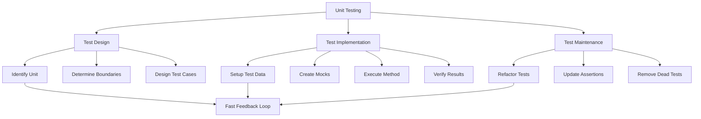
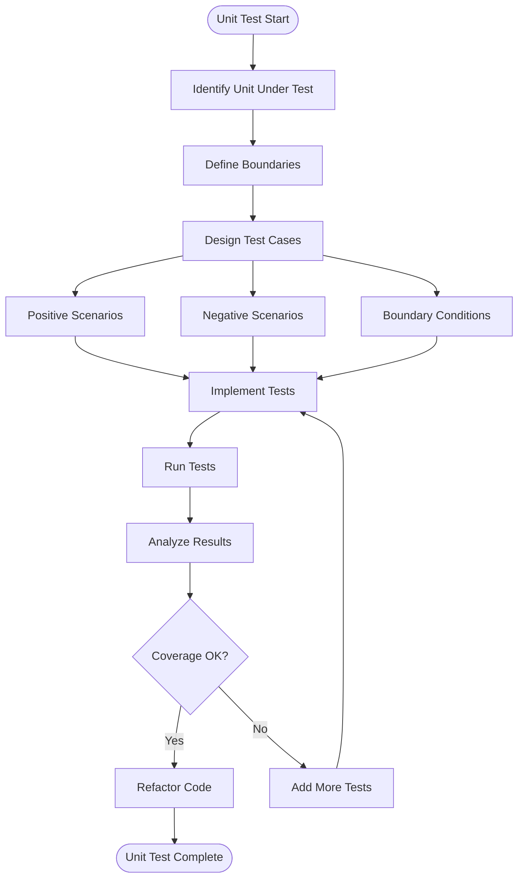

# 11.7 Unit Testing Best Practices

## 1. Introduction

Unit testing focuses on testing individual components in isolation. This module covers best practices, testing strategies, handling private methods, pure functions, and creating maintainable unit tests.

## 2. Learning Objectives

- Apply unit testing best practices
- Test private methods effectively
- Identify and test pure functions
- Create testable code designs
- Achieving high test coverage

## 3. Prerequisites

- JUnit 5 knowledge
- Mockito basics
- Understanding of SOLID principles

## 4. Why This Concept Exists

Unit tests provide:
- Fast feedback during development
- Documentation of expected behavior
- Safety net for refactoring
- Design improvement hints
- Bug prevention

## 5. Problem Statement

How do we write unit tests that are fast, reliable, maintainable, and provide meaningful coverage?

## 6. Theory

### Unit Testing Principles

1. **Fast**: Tests run in milliseconds
2. **Independent**: No test depends on another
3. **Repeatable**: Same result every time
4. **Self-Validating**: Clear pass/fail
5. **Timely**: Written at appropriate time

### Testing Private Methods

- Don't test private methods directly
- Test through public interface
- Refactor if private logic needs testing
- Use package-private for testability

### Pure Functions

- Same input always produces same output
- No side effects (no I/O, no state mutation)
- Easy to test, easy to reason about
- Prefer pure functions when possible

## 7. Internal Working

### Test Execution Flow

1. Test runner discovers test classes
2. Creates new instance per test
3. Executes @BeforeEach setup
4. Runs test method
5. Evaluates assertions
6. Executes @AfterEach cleanup
7. Reports results

### Code Coverage Analysis

1. Instrument bytecode during compilation
2. Track executed lines/branches
3. Calculate coverage percentage
4. Generate reports

## 8. JVM Perspective

- Unit tests run in same JVM
- No network or file I/O
- Mocks created via proxies
- In-memory execution
- Fast garbage collection

## 9. Memory Representation

```
Unit Test Memory Model:
┌─────────────────────────────┐
│        Test Instance        │
├─────────────────────────────┤
│  ┌───────────────────────┐  │
│  │   Mock Objects        │  │
│  │   - Proxy instances   │  │
│  │   - Stub data         │  │
│  └───────────────────────┘  │
├─────────────────────────────┤
│  ┌───────────────────────┐  │
│  │   Class Under Test    │  │
│  │   - Real behavior     │  │
│  │   - Injected mocks    │  │
│  └───────────────────────┘  │
├─────────────────────────────┤
│  ┌───────────────────────┐  │
│  │   Test Data           │  │
│  │   - Fixtures          │  │
│  │   - Expected results  │  │
│  └───────────────────────┘  │
└─────────────────────────────┘
```

## 10. Architecture Diagram



## 11. Flow Diagram



## 12. Syntax

```java
// Pure function testing
class MathUtils {
    static int add(int a, int b) {
        return a + b; // Pure function
    }
}

@Test
void shouldAddNumbers() {
    assertEquals(5, MathUtils.add(2, 3));
}

// Testing through public interface
class UserService {
    private void validateEmail(String email) { // Private method
        if (!email.contains("@")) {
            throw new IllegalArgumentException("Invalid email");
        }
    }
    
    public User createUser(String email) { // Public interface
        validateEmail(email);
        return new User(email);
    }
}

@Test
void shouldRejectInvalidEmail() {
    assertThrows(IllegalArgumentException.class,
        () -> userService.createUser("invalid"));
}

// Testable design with dependency injection
class OrderProcessor {
    private final PaymentService paymentService;
    private final InventoryService inventoryService;
    
    // Constructor injection for testability
    OrderProcessor(PaymentService paymentService, 
                   InventoryService inventoryService) {
        this.paymentService = paymentService;
        this.inventoryService = inventoryService;
    }
}
```

## 13. Easy Example

```java
import org.junit.jupiter.api.Test;
import static org.junit.jupiter.api.Assertions.*;

class StringManipulatorTest {
    
    private final StringManipulator manipulator = new StringManipulator();
    
    @Test
    void shouldReverseString() {
        // Arrange
        String input = "Hello";
        
        // Act
        String result = manipulator.reverse(input);
        
        // Assert
        assertEquals("olleH", result);
    }
    
    @Test
    void shouldCapitalizeFirstLetter() {
        assertEquals("Hello", manipulator.capitalize("hello"));
        assertEquals("Hello", manipulator.capitalize("Hello"));
        assertEquals("", manipulator.capitalize(""));
    }
    
    @Test
    void shouldCountWords() {
        assertEquals(1, manipulator.countWords("Hello"));
        assertEquals(2, manipulator.countWords("Hello World"));
        assertEquals(0, manipulator.countWords(""));
        assertEquals(0, manipulator.countWords("   "));
    }
}
```

## 14. Medium Example

```java
import org.junit.jupiter.api.BeforeEach;
import org.junit.jupiter.api.Test;
import org.junit.jupiter.api.DisplayName;
import java.util.List;
import static org.junit.jupiter.api.Assertions.*;
import static org.mockito.Mockito.*;

class PriceCalculatorTest {
    
    private PriceCalculator calculator;
    
    @BeforeEach
    void setUp() {
        calculator = new PriceCalculator();
    }
    
    @Test
    @DisplayName("Should calculate discount for VIP customers")
    void shouldCalculateVipDiscount() {
        // Arrange
        double price = 100.0;
        CustomerType customerType = CustomerType.VIP;
        
        // Act
        double discountedPrice = calculator.calculatePrice(price, customerType);
        
        // Assert
        assertEquals(80.0, discountedPrice, 0.01); // 20% discount
    }
    
    @Test
    @DisplayName("Should not apply discount for regular customers")
    void shouldNotDiscountRegularCustomer() {
        // Arrange
        double price = 100.0;
        CustomerType customerType = CustomerType.REGULAR;
        
        // Act
        double discountedPrice = calculator.calculatePrice(price, customerType);
        
        // Assert
        assertEquals(100.0, discountedPrice, 0.01);
    }
    
    @Test
    @DisplayName("Should handle edge cases")
    void shouldHandleEdgeCases() {
        // Zero price
        assertEquals(0.0, calculator.calculatePrice(0, CustomerType.REGULAR), 0.01);
        
        // Negative price (should throw)
        assertThrows(IllegalArgumentException.class,
            () -> calculator.calculatePrice(-10, CustomerType.REGULAR));
    }
    
    @Test
    @DisplayName("Should apply bulk discount")
    void shouldApplyBulkDiscount() {
        // Arrange
        List<OrderItem> items = List.of(
            new OrderItem("A", 10, 5.0),
            new OrderItem("B", 20, 3.0)
        );
        
        // Act
        double total = calculator.calculateBulkPrice(items);
        
        // Assert - 10% discount for bulk
        double expected = (50.0 + 60.0) * 0.9;
        assertEquals(expected, total, 0.01);
    }
}
```

## 15. Hard Example

```java
import org.junit.jupiter.api.BeforeEach;
import org.junit.jupiter.api.Test;
import org.junit.jupiter.api.extension.ExtendWith;
import org.mockito.junit.jupiter.MockitoExtension;
import java.util.Optional;
import static org.junit.jupiter.api.Assertions.*;
import static org.mockito.Mockito.*;

@ExtendWith(MockitoExtension.class)
class OrderServiceUnitTest {
    
    @Mock
    private OrderRepository orderRepository;
    
    @Mock
    private PaymentService paymentService;
    
    @Mock
    private InventoryService inventoryService;
    
    @Mock
    private NotificationService notificationService;
    
    private OrderService orderService;
    
    @BeforeEach
    void setUp() {
        orderService = new OrderService(
            orderRepository, paymentService, 
            inventoryService, notificationService
        );
    }
    
    @Test
    void shouldCreateOrderSuccessfully() {
        // Arrange
        CreateOrderRequest request = new CreateOrderRequest(
            "USER-1",
            List.of(new OrderItem("PROD-1", 2, 29.99))
        );
        
        when(inventoryService.checkStock("PROD-1")).thenReturn(10);
        when(paymentService.processPayment(any(PaymentRequest.class)))
            .thenReturn(new PaymentResult(true, "PAY-123"));
        when(orderRepository.save(any(Order.class)))
            .thenAnswer(invocation -> {
                Order order = invocation.getArgument(0);
                order.setId("ORD-1");
                return order;
            });
        
        // Act
        Order order = orderService.createOrder(request);
        
        // Assert
        assertNotNull(order);
        assertEquals("ORD-1", order.getId());
        assertEquals(OrderStatus.CREATED, order.getStatus());
        
        verify(inventoryService).reserveStock("PROD-1", 2);
        verify(paymentService).processPayment(any(PaymentRequest.class));
        verify(notificationService).sendOrderConfirmation(eq("USER-1"), eq("ORD-1"));
    }
    
    @Test
    void shouldFailWhenInsufficientStock() {
        // Arrange
        CreateOrderRequest request = new CreateOrderRequest(
            "USER-1",
            List.of(new OrderItem("PROD-1", 100, 29.99))
        );
        
        when(inventoryService.checkStock("PROD-1")).thenReturn(5);
        
        // Act & Assert
        InsufficientStockException exception = assertThrows(
            InsufficientStockException.class,
            () -> orderService.createOrder(request)
        );
        
        assertEquals("PROD-1", exception.getProductId());
        assertEquals(5, exception.getAvailableQuantity());
        
        verify(paymentService, never()).processPayment(any());
        verify(notificationService, never()).sendOrderConfirmation(anyString(), anyString());
    }
    
    @Test
    void shouldCancelOrderAndRefund() {
        // Arrange
        Order order = new Order("ORD-1", "USER-1", OrderStatus.CREATED);
        when(orderRepository.findById("ORD-1")).thenReturn(Optional.of(order));
        when(paymentService.refund(anyString())).thenReturn(true);
        
        // Act
        orderService.cancelOrder("ORD-1");
        
        // Assert
        assertEquals(OrderStatus.CANCELLED, order.getStatus());
        verify(inventoryService).releaseStock(anyString(), anyInt());
        verify(paymentService).refund(order.getPaymentId());
        verify(notificationService).sendCancellationNotification(eq("USER-1"), eq("ORD-1"));
    }
}
```

## 16. Enterprise Example

```java
import org.junit.jupiter.api.BeforeEach;
import org.junit.jupiter.api.Test;
import org.junit.jupiter.api.extension.ExtendWith;
import org.mockito.junit.jupiter.MockitoExtension;
import java.util.List;
import static org.junit.jupiter.api.Assertions.*;
import static org.mockito.Mockito.*;

@ExtendWith(MockitoExtension.class)
class EnterpriseUnitTest {
    
    @Mock
    private UserRepository userRepository;
    
    @Mock
    private OrderRepository orderRepository;
    
    @Mock
    private PaymentGateway paymentGateway;
    
    @Mock
    private FraudDetector fraudDetector;
    
    @Mock
    private NotificationService notificationService;
    
    @Mock
    private AuditService auditService;
    
    private UserService userService;
    
    @BeforeEach
    void setUp() {
        userService = new UserService(
            userRepository, orderRepository, paymentGateway,
            fraudDetector, notificationService, auditService
        );
    }
    
    @Test
    void shouldRegisterUserWithValidation() {
        // Arrange
        RegisterUserRequest request = new RegisterUserRequest(
            "john_doe",
            "john@example.com",
            "Password123!"
        );
        
        when(userRepository.existsByUsername("john_doe")).thenReturn(false);
        when(userRepository.existsByEmail("john@example.com")).thenReturn(false);
        when(fraudDetector.checkRegistration(request)).thenReturn(FraudCheckResult.safe());
        when(userRepository.save(any(User.class)))
            .thenAnswer(invocation -> {
                User user = invocation.getArgument(0);
                user.setId("USER-1");
                return user;
            });
        
        // Act
        User user = userService.registerUser(request);
        
        // Assert
        assertNotNull(user);
        assertEquals("USER-1", user.getId());
        assertEquals("john_doe", user.getUsername());
        
        verify(fraudDetector).checkRegistration(request);
        verify(notificationService).sendWelcomeEmail(eq("john@example.com"), eq("USER-1"));
        verify(auditService).logUserRegistration(eq("USER-1"));
    }
    
    @Test
    void shouldRejectDuplicateUsername() {
        // Arrange
        RegisterUserRequest request = new RegisterUserRequest(
            "existing_user",
            "new@example.com",
            "Password123!"
        );
        
        when(userRepository.existsByUsername("existing_user")).thenReturn(true);
        
        // Act & Assert
        DuplicateUsernameException exception = assertThrows(
            DuplicateUsernameException.class,
            () -> userService.registerUser(request)
        );
        
        assertEquals("existing_user", exception.getUsername());
        
        verify(userRepository, never()).save(any());
        verify(fraudDetector, never()).checkRegistration(any());
    }
    
    @Test
    void shouldBlockFraudulentRegistration() {
        // Arrange
        RegisterUserRequest request = new RegisterUserRequest(
            "suspicious_user",
            "temp@throwaway.com",
            "weak"
        );
        
        when(userRepository.existsByUsername("suspicious_user")).thenReturn(false);
        when(fraudDetector.checkRegistration(request))
            .thenReturn(FraudCheckResult.suspicious("High risk email"));
        
        // Act & Assert
        FraudDetectedException exception = assertThrows(
            FraudDetectedException.class,
            () -> userService.registerUser(request)
        );
        
        assertEquals("High risk email", exception.getReason());
        
        verify(userRepository, never()).save(any());
        verify(notificationService).sendFraudAlert(eq("suspicious_user"));
        verify(auditService).logFraudAttempt(eq("suspicious_user"), eq("High risk email"));
    }
    
    @Test
    void shouldProcessUserOrders() {
        // Arrange
        User user = new User("USER-1", "john_doe", "john@example.com");
        when(userRepository.findById("USER-1")).thenReturn(Optional.of(user));
        
        List<Order> orders = List.of(
            new Order("ORD-1", "USER-1", OrderStatus.CREATED),
            new Order("ORD-2", "USER-1", OrderStatus.PROCESSED)
        );
        when(orderRepository.findByUserId("USER-1")).thenReturn(orders);
        
        // Act
        UserOrdersSummary summary = userService.getUserOrdersSummary("USER-1");
        
        // Assert
        assertNotNull(summary);
        assertEquals(2, summary.getTotalOrders());
        assertEquals(1, summary.getPendingOrders());
        assertEquals(1, summary.getCompletedOrders());
    }
}
```

## 17. Performance

| Aspect | Target | Measurement |
|--------|--------|-------------|
| Test execution | < 100ms | Per test |
| Test suite | < 30s | Full suite |
| Mock creation | < 10ms | Per mock |
| Assertion | < 1ms | Per assertion |

**Performance Tips:**
- Keep tests focused and small
- Avoid unnecessary object creation
- Use @BeforeEach for shared setup
- Mock external dependencies
- Run tests in parallel when safe

## 18. Time & Space Complexity

| Operation | Time | Space |
|-----------|------|-------|
| Test execution | O(1) | O(m) |
| Mock creation | O(1) | O(m) |
| Assertion | O(1) | O(1) |
| Test discovery | O(n) | O(n) |

Where: m = mock count, n = test count

## 19. Thread Safety

- Tests should be independent and thread-safe
- Avoid shared mutable state
- Use ThreadLocal for test-specific data
- Mock objects are thread-safe
- Use synchronized for shared resources

## 20. Best Practices

1. **Test behavior, not implementation**
2. **One assertion per test** when possible
3. **Use descriptive test names**
4. **Keep tests fast** (< 100ms)
5. **Avoid test interdependencies**
6. **Test edge cases** and boundaries
7. **Use setup methods** for common data
8. **Mock external dependencies**
9. **Write tests before fixing bugs**
10. **Refactor tests with production code**

## 21. Common Mistakes

1. **Testing private methods** directly
2. **Over-mocking** makes tests brittle
3. **Under-mocking** creates slow tests
4. **Ignoring edge cases** like null
5. **Hardcoded test data** without explanation
6. **Missing negative test cases**
7. **Testing too much** in one test
8. **Not cleaning up** test data
9. **Ignoring test failures**
10. **Writing tests after code** (when TDD applies)

## 22. Pitfalls

- **Brittle tests** break with refactoring
- **False confidence** from shallow tests
- **Slow tests** that developers avoid
- **Flaky tests** that randomly fail
- **Maintenance burden** from over-testing
- **Test debt** from skipped tests

## 23. Debugging Tips

1. **Run single test** to isolate failures
2. **Add logging** to understand flow
3. **Check mock setup** for wrong stubs
4. **Verify assertions** match expectations
5. **Use debugger** to step through tests
6. **Check test data** is correct
7. **Verify dependencies** are mocked

## 24. Comparison Table

| Aspect | Good Unit Test | Bad Unit Test |
|--------|---------------|---------------|
| Speed | Milliseconds | Seconds |
| Independence | Fully isolated | Depends on others |
| Readability | Clear intent | Unclear purpose |
| Maintainability | Easy to update | Hard to change |
| Coverage | Meaningful | Superficial |

## 25. Decision Tree

```
Should I test this?
│
├─ Is it business logic?
│  └─ Yes → Write unit test
│
├─ Is it a pure function?
│  └─ Yes → Write multiple test cases
│
├─ Is it private method?
│  └─ Test through public interface
│
├─ Is it trivial getter/setter?
│  └─ No → Skip
│
└─ Is it integration code?
   └─ Write integration test instead
```

## 26. Interview Questions

1. **What makes a good unit test?**
   - Answer: Fast, independent, repeatable, self-validating, and timely.

2. **How do you test private methods?**
   - Answer: Test through public interface; refactor if private logic needs testing.

3. **What is a pure function and why test it?**
   - Answer: Function with no side effects; easy to test with input/output verification.

4. **How do you achieve high test coverage?**
   - Answer: Focus on business logic, edge cases, and critical paths.

5. **What is the difference between unit and integration tests?**
   - Answer: Unit tests isolate components; integration tests verify interactions.

6. **How do you handle external dependencies in unit tests?**
   - Answer: Mock them to isolate the unit under test.

7. **What is test-driven development?**
   - Answer: Write tests before code, ensuring requirements are met.

8. **How do you test exception handling?**
   - Answer: Use assertThrows to verify specific exceptions are thrown.

9. **What are test doubles and types?**
   - Answer: Fakes, stubs, mocks, spies - different levels of test isolation.

10. **How do you ensure tests are maintainable?**
    - Answer: Follow AAA pattern, use setup methods, avoid duplication.

11. **What is the test pyramid?**
    - Answer: Many unit tests, fewer integration tests, minimal E2E tests.

12. **How do you test code with complex dependencies?**
    - Answer: Use dependency injection and mock interfaces.

13. **What are pure functions?**
    - Answer: Functions that always return same output for same input with no side effects.

14. **How do you test legacy code?**
    - Answer: Characterization tests, refactoring, and adding seams.

15. **What is the purpose of unit tests?**
    - Answer: Verify individual components work correctly in isolation.

## 27. Exercises

### Beginner

1. **Pure Function Testing**
   - Create a MathUtils class with add, subtract, multiply, divide
   - Write tests for each function
   - Include edge cases: zero, negative, overflow

2. **String Processing**
   - Create StringUtils with reverse, capitalize, countWords
   - Write tests for each method
   - Handle null and empty inputs

### Intermediate

3. **Dependency Injection Testing**
   - Create a Service with injected dependencies
   - Mock all dependencies
   - Verify interactions and return values

4. **Exception Handling**
   - Create methods that throw specific exceptions
   - Write tests using assertThrows
   - Verify exception messages and types

### Advanced

5. **Complex Unit Test Suite**
   - Design a complete service with multiple dependencies
   - Write comprehensive unit tests
   - Achieve > 90% coverage on business logic

6. **Test Refactoring**
   - Take existing unit tests
   - Refactor to improve readability
   - Remove duplication and improve maintainability

## 28. Summary

Unit testing best practices ensure fast, reliable, and maintainable tests. Focus on testing behavior, keeping tests isolated, and following the AAA pattern. Remember: unit tests are an investment in code quality.

## 29. References

- "Working Effectively with Legacy Code" by Michael Feathers
- "The Art of Unit Testing" by Roy Osherove
- JUnit 5 User Guide: https://junit.org/junit5/
- Mockito Documentation: https://site.mockito.org/
