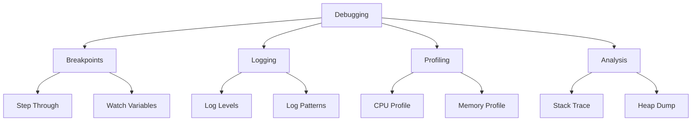
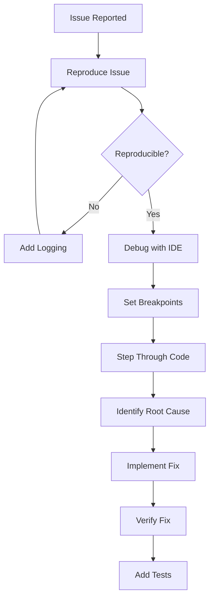

# Module 12: Testing

> **Difficulty:** ⭐⭐ Easy  
> **Reading:** 25 min | **Practice:** 45 min | **Total:** 70 min

## Overview
Bugs inevitably slip into production — logic errors, runtime exceptions, concurrency issues, and memory leaks. Debugging is the systematic process of finding and fixing those defects using breakpoints, logging, profiling, and structured analysis. This module covers IDE debugging, remote debugging, stack trace analysis, and production troubleshooting techniques.

## Learning Objectives
- Set breakpoints and step through code to isolate bugs in the IDE
- Analyze stack traces to trace exceptions back to their root cause
- Configure and use logging effectively to trace production behavior
- Connect to remote JVMs for live debugging without redeploying
- Apply systematic debugging workflows to reproduce and fix issues efficiently

## Prerequisites
- Java fundamentals
- IDE experience
- Basic JVM knowledge

## History
- **1995** — Java 1.0 had only manual debugging with `System.out.println`
- **1998** — Java 1.2 added `assert` keyword for pre/post conditions
- **2001** — Java 1.4 added `java.util.logging` for standard logging
- **2004** — Java 5 improved stack traces and debugging support
- **2006** — Java 6 added `jstack`, `jmap`, `jhat` tools
- **2011** — Java 7 added `jdeps` for dependency analysis
- **2014** — Java 8 improved `Optional` for null-safe debugging
- **2017** — Java 9 added `jshell` for interactive debugging and REPL
- **2018** — Java 11 added Flight Recorder as a production profiling tool
- **2021** — Java 17 enhanced `NullPointerException` messages with variable names
- **2023** — Java 21 added structured concurrency and scoped values (preview)

## Why This Concept Exists
Bugs lead to:
- System failures
- Data corruption
- Security vulnerabilities
- User dissatisfaction

Effective debugging:
- Reduces fix time
- Prevents regressions
- Improves code quality
- Enhances understanding

## Problem Statement
How do you efficiently find and fix software defects?

## Core Concepts

### Debugging Techniques

| Technique | Use Case |
|-----------|----------|
| Breakpoints | Code execution pause |
| Step Through | Line-by-line analysis |
| Watch Variables | Value inspection |
| Logging | Runtime tracking |
| Stack Trace | Error analysis |
| Profiling | Performance issues |

### Common Bug Types

| Type | Description |
|------|-------------|
| Logic Error | Incorrect algorithm |
| Runtime Error | Exception thrown |
| Syntax Error | Code won't compile |
| Concurrency Bug | Threading issue |
| Memory Leak | Unreleased resources |

## Internal Working

### Debugger Process
1. Set breakpoint
2. Run in debug mode
3. Inspect state
4. Step through code
5. Identify issue
6. Fix and verify

### Stack Trace Analysis
1. Find exception origin
2. Follow call chain
3. Identify root cause
4. Check similar cases
5. Implement fix

## JVM Perspective

### JVM Debugging
- JDWP (Java Debug Wire Protocol)
- JDI (Java Debug Interface)
- Agentlib:jdwp
- Remote debugging

### Memory Analysis
- Heap dumps
- Thread dumps
- GC logs
- Memory profilers

## Architecture Diagram



## Flow Diagram



## Syntax

### IDE Debugging
```java
public class DebugExample {
    public static int calculate(int a, int b) {
        int result = a + b;  // Set breakpoint here
        if (result > 100) {
            result = result / 2;  // Watch this line
        }
        return result;
    }
    
    public static void main(String[] args) {
        int x = 50;
        int y = 60;
        int result = calculate(x, y);  // Step into this
        System.out.println("Result: " + result);
    }
}
```

### Logging with SLF4J
```java
import org.slf4j.Logger;
import org.slf4j.LoggerFactory;

public class LoggingExample {
    private static final Logger logger = LoggerFactory.getLogger(LoggingExample.class);
    
    public void processData(String data) {
        logger.debug("Processing data: {}", data);
        
        try {
            // Process
            logger.info("Successfully processed data");
        } catch (Exception e) {
            logger.error("Failed to process data: {}", data, e);
        }
    }
}
```

### Remote Debugging
```bash
# Start application with debug agent
java -agentlib:jdwp=transport=dt_socket,server=y,suspend=n,address=5005 \
     -jar app.jar

# Connect debugger to port 5005
```

## Easy Example
```java
public class DebuggingEasyExample {
    public static void main(String[] args) {
        int[] numbers = {1, 2, 3, 4, 5};
        int sum = 0;
        
        // Bug: incorrect loop boundary
        for (int i = 0; i <= numbers.length; i++) {  // Should be <
            sum += numbers[i];
        }
        
        System.out.println("Sum: " + sum);
    }
    
    // Fixed version
    public static void mainFixed(String[] args) {
        int[] numbers = {1, 2, 3, 4, 5};
        int sum = 0;
        
        for (int i = 0; i < numbers.length; i++) {
            sum += numbers[i];
        }
        
        System.out.println("Sum: " + sum);
    }
}
```

## Medium Example
```java
import org.slf4j.Logger;
import org.slf4j.LoggerFactory;

public class DebuggingMediumExample {
    private static final Logger logger = LoggerFactory.getLogger(DebuggingMediumExample.class);
    
    public static void main(String[] args) {
        DebuggingMediumExample example = new DebuggingMediumExample();
        
        try {
            example.processOrder("ORDER-123");
        } catch (Exception e) {
            logger.error("Failed to process order", e);
        }
    }
    
    public void processOrder(String orderId) {
        logger.debug("Starting processing order: {}", orderId);
        
        // Step 1: Validate
        if (!validateOrder(orderId)) {
            logger.warn("Order validation failed: {}", orderId);
            throw new IllegalArgumentException("Invalid order: " + orderId);
        }
        
        // Step 2: Process
        logger.info("Processing order: {}", orderId);
        processPayment(orderId);
        
        // Step 3: Complete
        logger.info("Order completed: {}", orderId);
    }
    
    private boolean validateOrder(String orderId) {
        logger.debug("Validating order: {}", orderId);
        return orderId != null && !orderId.isEmpty();
    }
    
    private void processPayment(String orderId) {
        logger.debug("Processing payment for order: {}", orderId);
        // Simulate payment processing
    }
}
```

## Hard Example
```java
import java.util.concurrent.*;
import java.util.concurrent.atomic.*;

public class DebuggingHardExample {
    // Concurrent bug example
    private static int counter = 0;
    private static final AtomicReference<Integer> atomicCounter = 
        new AtomicReference<>(0);
    
    public static void main(String[] args) throws Exception {
        // Bug: race condition
        ExecutorService executor = Executors.newFixedThreadPool(10);
        CountDownLatch latch = new CountDownLatch(100);
        
        for (int i = 0; i < 100; i++) {
            executor.submit(() -> {
                counter++;  // Not thread-safe
                atomicCounter.updateAndGet(v -> v + 1);
                latch.countDown();
            });
        }
        
        latch.await();
        System.out.println("Counter: " + counter);  // Expected: 100
        System.out.println("Atomic: " + atomicCounter.get());  // Always 100
        
        executor.shutdown();
    }
}
```

## Enterprise Example
```java
import java.lang.management.*;
import java.util.*;

public class DebuggingEnterpriseExample {
    // Thread dump analysis
    public static void analyzeThreads() {
        ThreadMXBean threadBean = ManagementFactory.getThreadMXBean();
        
        System.out.println("Thread Count: " + threadBean.getThreadCount());
        System.out.println("Peak Thread Count: " + threadBean.getPeakThreadCount());
        System.out.println("Daemon Thread Count: " + threadBean.getDaemonThreadCount());
        
        // Find deadlocked threads
        long[] deadlockedThreads = threadBean.findDeadlockedThreads();
        if (deadlockedThreads != null) {
            System.out.println("DEADLOCK DETECTED!");
            ThreadInfo[] threadInfos = threadBean.getThreadInfo(deadlockedThreads);
            for (ThreadInfo info : threadInfos) {
                System.out.println("  " + info.getThreadName() + 
                    " waiting for " + info.getLockName());
            }
        }
    }
    
    // Memory leak detection
    public static void detectMemoryLeak() {
        Runtime runtime = Runtime.getRuntime();
        
        long before = runtime.totalMemory() - runtime.freeMemory();
        System.out.println("Memory before: " + before / 1024 / 1024 + " MB");
        
        // Simulate memory leak
        List<byte[]> leak = new ArrayList<>();
        for (int i = 0; i < 1000; i++) {
            leak.add(new byte[1024 * 1024]);  // 1MB each
        }
        
        long after = runtime.totalMemory() - runtime.freeMemory();
        System.out.println("Memory after: " + after / 1024 / 1024 + " MB");
        System.out.println("Memory leak: " + (after - before) / 1024 / 1024 + " MB");
    }
    
    public static void main(String[] args) {
        analyzeThreads();
        detectMemoryLeak();
    }
}
```

## Performance Considerations
- Use appropriate log levels
- Avoid debug prints in production
- Use conditional logging
- Profile before optimizing

## Time & Space Complexity

| Operation | Time | Space |
|-----------|------|-------|
| Breakpoint | O(1) | O(1) |
| Step through | O(1) | O(1) |
| Log statement | O(1) | O(1) |
| Heap dump | O(n) | O(n) |

## Thread Safety
- Debuggers may pause threads
- Thread dumps are point-in-time
- Use non-intrusive debugging
- Avoid debug artifacts in production

## Best Practices
1. Reproduce before fixing
2. Use version control
3. Write tests for bugs
4. Log strategically
5. Use IDE debugger

## Common Mistakes
1. Fixing symptoms not causes
2. Not reproducing first
3. Excessive logging
4. Debug prints in production

## Comparison Table

| Tool | Type | Use Case |
|------|------|----------|
| IntelliJ Debugger | IDE | Development |
| JDB | CLI | Remote |
| VisualVM | Profiler | Production |
| JFR | Recorder | Production |

## Interview Questions

### Q1: What is debugging?
**Answer:** Finding and fixing software defects.

### Q2: What is a stack trace?
**Answer:** List of method calls leading to an exception.

### Q3: What is remote debugging?
**Answer:** Debugging application running on different machine.

### Q4: What is a memory leak?
**Answer:** Unreleased memory that should be garbage collected.

### Q5: What is a thread dump?
**Answer:** Snapshot of all thread states at a point in time.

### Q6: What is the difference between error and exception?
**Answer:** Errors are serious (OutOfMemory), exceptions are recoverable.

### Q7: What is logging?
**Answer:** Recording runtime events for debugging and monitoring.

### Q8: What is a breakpoint?
**Answer:** Marker to pause execution at specific line.

### Q9: What is step-through debugging?
**Answer:** Executing code line by line to observe behavior.

### Q10: What is a watchdog?
**Answer:** Timer that detects and recovers from hangs.

### Q11: What is heap dump analysis?
**Answer:** Examining memory snapshot for leaks.

### Q12: What is thread contention?
**Answer:** Threads waiting for locks held by others.

### Q13: What is a race condition?
**Answer:** Bug where outcome depends on timing of operations.

### Q14: What is deadlock?
**Answer:** Two or more threads waiting for each other's locks.

### Q15: What is the difference between debugging and profiling?
**Answer:** Debugging finds bugs, profiling measures performance.

## Exercises

### Easy
1. Debug a simple program
2. Use breakpoints effectively
3. Analyze a stack trace

### Medium
1. Fix a concurrency bug
2. Analyze a thread dump
3. Use logging for debugging

### Hard
1. Debug a memory leak
2. Fix a deadlock
3. Debug production issues

## Summary
Effective debugging is essential for software quality. Master IDE tools, logging, and systematic analysis.

## Examples

[Code examples demonstrating the concept]

## Performance

[Performance considerations and benchmarks]

## Pitfalls

[Common mistakes and anti-patterns]

## References
- Debugging by David Agans
- Java Debugging Guide
- Effective Debugging

## Cross-References

- **Previous Module:** [11 - Design Patterns](../11-design-patterns/)
- **Related:** [01 - Fundamentals](../01-fundamentals/) — basic syntax for reading stack traces
- **Related:** [02 - OOP](../02-oop/) — object lifecycle and memory
- **Related:** [03 - Exception Handling](../03-exception-handling/) — exception analysis and debugging
- **Related:** [09 - Multithreading](../09-multithreading/) — thread dumps and deadlock detection
- **Related:** [10 - JVM Internals](../10-jvm-internals/) — heap dumps, GC logs, JFR
- **External:** [Oracle Java Debugging Guide](https://docs.oracle.com/javase/tutorial/essential/io/)
- **External:** [Effective Debugging by Diomidis Spinellis](https://www.oreilly.com/library/view/effective-debugging/9780134685809/)

## Prerequisites

- [OOP](../02-oop/README.md)

## Debugging Tips

| Problem | Tool/Technique | How |
|---------|---------------|-----|
| Flaky tests (non-deterministic failures) | Test isolation + deterministic data | Remove shared state; use `@BeforeEach` cleanup; use Testcontainers |
| Stack trace analysis | IDE stack trace navigation | Click links in stack trace; find "caused by" chain; identify root exception |
| Remote debugging setup | IntelliJ remote debug config | Configure JDWP agent; set host/port; attach debugger to running JVM |
| Memory leak in production | Heap dump + MAT | Capture dump with `jmap -dump`; analyze dominator tree for leak suspects |
| Concurrency bug reproduction | Stress testing + Thread.sleep | Run tests in tight loop; use `CountDownLatch` for synchronization |

## Code Review Checklist

- [ ] Tests cover happy path, edge cases, and error conditions
- [ ] Tests are isolated (no shared mutable state between tests)
- [ ] External dependencies mocked or use Testcontainers
- [ ] Test data cleaned up after each test
- [ ] Assertions are specific (not just `assertNotNull`)
- [ ] Test names describe the scenario being tested
- [ ] Exception paths tested with expected exception assertions

## Architecture Considerations

Testing architecture determines system quality guarantees. At scale, the test pyramid (many unit tests, fewer integration tests, minimal E2E tests) balances speed and coverage. For microservices, contract testing (Pact) ensures service interfaces remain compatible. For data pipelines, property-based testing (jqwik) verifies invariants across input ranges.

In CI/CD pipelines, test architecture affects deployment velocity. Parallel test execution, test selection (running only affected tests), and test impact analysis optimize feedback loops. For production systems, chaos engineering (testing failure scenarios) validates resilience patterns.

| Pattern | Use Case | Trade-offs |
|---------|----------|------------|
| Test pyramid | General test strategy | Pros: Fast feedback, good coverage; Cons: Requires discipline |
| Contract testing | Microservice interfaces | Pros: Catch integration issues early; Cons: Setup complexity |
| Property-based testing | Algorithm verification | Pros: Finds edge cases; Cons: Harder to write, debug |
| Snapshot testing | UI/API response verification | Pros: Catches unexpected changes; Cons: Brittle, maintenance burden |

## Security Considerations

| Risk | Impact | Mitigation |
|------|--------|------------|
| Test data containing real sensitive data | Data exposure, compliance violation | Use synthetic data; anonymize production data for tests |
| Tests bypassing security controls | False confidence, production vulnerabilities | Test security controls explicitly; include security test scenarios |
| Mock objects hiding security bugs | Security vulnerabilities undetected | Integration test with real security implementations |
| Test infrastructure exposing secrets | Credential leakage | Use secret management; rotate test credentials |
| Missing tests for security-critical code | Vulnerabilities in production | Mandate tests for authentication, authorization, input validation |

## Evolution & Modernization

| Version | Change | Migration Path |
|---------|--------|----------------|
| Java 1.0–1.4 | Manual testing, JUnit 3 | Upgrade to JUnit 5; adopt annotation-based tests |
| Java 5 | JUnit 4 annotations (`@Test`) | Migrate from `TestCase` to `@Test` annotations |
| Java 8 | Lambda-based assertions | Use lambda assertions for custom validation |
| Java 9+ | JUnit 5, Testcontainers, Mockito 2+ | Adopt JUnit 5 extensions; use Testcontainers for integration tests |
| Java 17 | AssertJ, AssertJ 3.x | Use fluent assertions for better readability |
| Java 21 | Virtual threads for test parallelism | Evaluate virtual threads for test execution |

## Version Validation

| Feature | Java Version | Status |
|---------|-------------|--------|
| JUnit 5 (Jupiter) | Java 8+ | Stable |
| Testcontainers | Java 8+ | Stable |
| Mockito 5+ | Java 11+ | Stable |
| AssertJ 3.x | Java 8+ | Stable |
| JaCoCo code coverage | Java 5+ | Stable |
| jshell for quick tests | Java 9+ | Stable |

## Production Incidents

### Incident 1: Flaky Tests Masking Real Bugs

**Problem:** 40% of integration tests failed non-deterministically; developers ignored test failures assuming flakiness.
**Cause:** Tests depended on external services, shared database state, and timing; no isolation between tests.
**Impact:** Real bugs slipped through; 3 production incidents in 1 month; customer trust eroded.
**Detection:** Test failure rate increased; investigation revealed flaky tests hiding real failures.
**Solution:** Isolated tests with Testcontainers; removed external dependencies; added test data cleanup.
**Prevention:** Write deterministic tests; use mocks for external dependencies; implement test isolation.

### Incident 2: Missing Tests for Edge Cases

**Problem:** A payment system failed for negative amounts; no test existed for negative input validation.
**Cause:** Tests only covered happy path; edge cases and error conditions not tested.
**Impact:** $10,000 in erroneous refunds; customer complaints; manual correction required.
**Detection:** Production error logs showed unhandled negative amounts; investigation revealed missing tests.
**Solution:** Added tests for edge cases (negative, zero, null, overflow); implemented input validation.
**Prevention:** Test edge cases explicitly; use property-based testing; implement input validation early.

### Incident 3: Slow Test Suite Causing Delayed Releases

**Problem:** Test suite took 45 minutes to run; developers skipped tests before releases to save time.
**Cause:** Tests not optimized; redundant test data setup; sequential execution of independent tests.
**Impact:** Releases delayed by 2-3 hours; developers skipped tests; 2 production bugs introduced.
**Detection:** Test execution time increased; developers complained about slow feedback.
**Solution:** Parallelized tests; optimized test data setup; removed redundant tests; reduced suite to 10 minutes.
**Prevention:** Monitor test execution time; optimize slow tests; parallelize independent tests.

## Production Checklist

- [ ] Write tests for happy path, edge cases, and error conditions
- [ ] Isolate tests from external dependencies
- [ ] Use mocks for external services
- [ ] Clean up test data after each test
- [ ] Run tests in parallel when possible
- [ ] Monitor test execution time
- [ ] Test exception paths thoroughly
- [ ] Use descriptive test names
- [ ] Test with production-like data volumes
- [ ] Maintain test code quality like production code

## Maturity Levels

| Level | Description |
|-------|-------------|
| Beginner | Writes basic unit tests; only tests happy path; doesn't think about edge cases |
| Intermediate | Tests edge cases; uses mocks; writes integration tests; maintains test coverage |
| Advanced | Implements test金字塔; uses Testcontainers; optimizes test performance |
| Expert | Designs test strategies; contributes to testing frameworks; teaches testing patterns |

## Common Myths

1. **Myth**: 100% code coverage ensures no bugs
   **Truth**: Coverage measures code execution, not quality. 100% coverage with poor assertions catches nothing.

2. **Myth**: Unit tests are always better than integration tests
   **Truth**: Unit tests verify logic; integration tests verify interactions. Both are necessary for quality.

3. **Myth**: Testing is the QA team's responsibility
   **Truth**: Developers write and maintain tests; testing is part of development, not a separate activity.

4. **Myth**: Manual testing is obsolete
   **Truth**: Manual testing is essential for usability, exploratory testing, and edge cases automation can't cover.

5. **Myth**: More tests always mean better quality
   **Truth**: Redundant tests add maintenance burden without value. Quality comes from well-designed, maintainable tests.

## Related Topics

- [Reflection & Annotations](../13-reflection-annotations/README.md)

## Next

- [Reflection & Annotations](../13-reflection-annotations/README.md)

## One-Minute Revision

| Aspect | Value |
|--------|-------|
| Purpose | Quality assurance |
| Complexity | Varies |
| Thread Safe | Yes (tests should be independent) |
| Ordered | No (tests should be independent) |
| Allows Null | No (assertions) |
| Best Alternative | Manual testing (for exploratory) |
| When to Use | Code verification |
| When to Avoid | Skipping tests |
