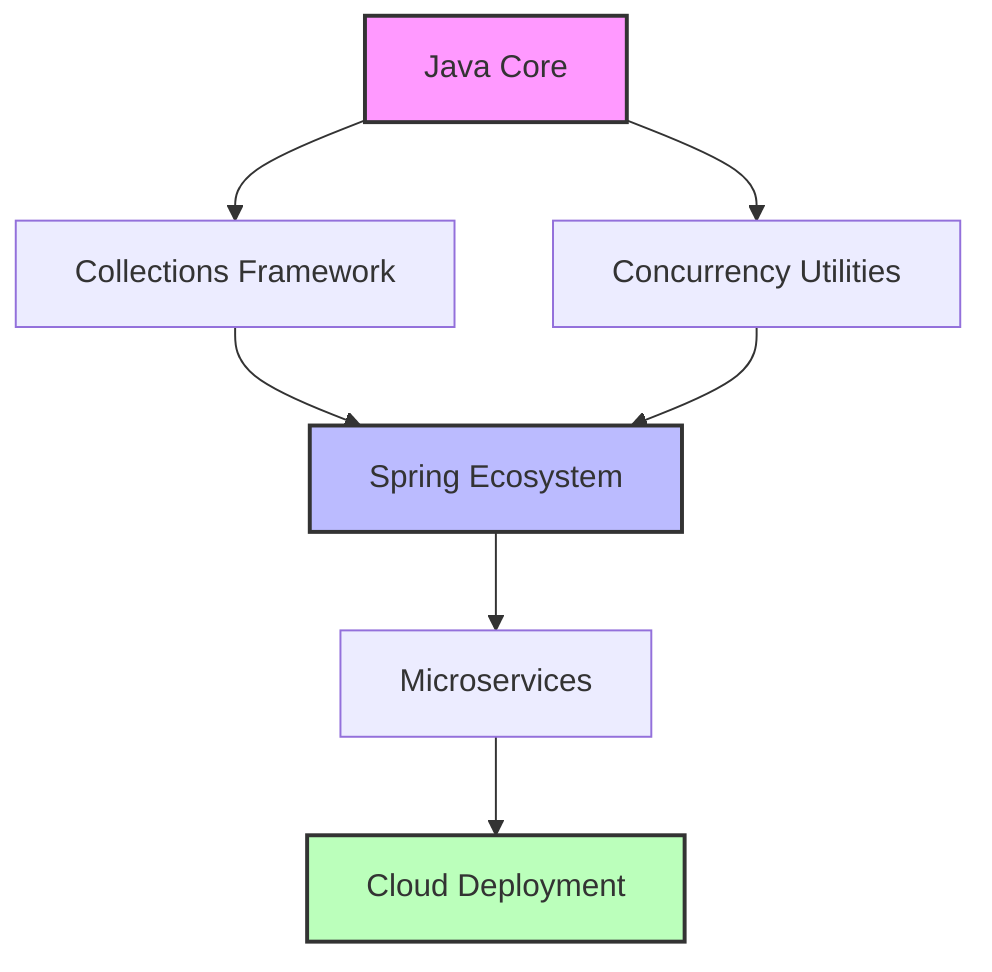
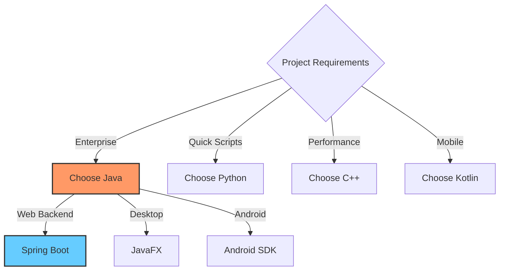

# Module 01: Java Fundamentals

## Overview
Master the foundation of Java programming — from variables to methods, everything you need to write your first production-quality Java code.

## Learning Objectives
By the end of this module, you will be able to:
- Understand Java program structure and execution model
- Declare variables with appropriate data types
- Apply operators and expressions effectively
- Control program flow with conditionals and loops
- Work with arrays and strings efficiently
- Design and implement reusable methods
- Write clean, documented, and tested Java code

## Topics Covered
| Topic | Theory | Examples | Exercises | Solutions |
|-------|--------|----------|-----------|-----------|
| Java Basics | [✓](docs/basics.md) | [Code](src/main/java/com/javaacademy/sprint1/basics) | [Exercises](exercises/basics.md) | [Solutions](solutions/basics.md) |
| Data Types | [✓](docs/datatypes.md) | [Code](src/main/java/com/javaacademy/sprint1/datatypes) | [Exercises](exercises/datatypes.md) | [Solutions](solutions/datatypes.md) |
| Operators | [✓](docs/operators.md) | [Code](src/main/java/com/javaacademy/sprint1/operators) | [Exercises](exercises/operators.md) | [Solutions](solutions/operators.md) |
| Control Flow | [✓](docs/controlflow.md) | [Code](src/main/java/com/javaacademy/sprint1/controlflow) | [Exercises](exercises/controlflow.md) | [Solutions](solutions/controlflow.md) |
| Arrays | [✓](docs/arrays.md) | [Code](src/main/java/com/javaacademy/sprint1/arrays) | [Exercises](exercises/arrays.md) | [Solutions](solutions/arrays.md) |
| Strings | [✓](docs/strings.md) | [Code](src/main/java/com/javaacademy/sprint1/strings) | [Exercises](exercises/strings.md) | [Solutions](solutions/strings.md) |
| Methods | [✓](docs/methods.md) | [Code](src/main/java/com/javaacademy/sprint1/methods) | [Exercises](exercises/methods.md) | [Solutions](solutions/methods.md) |

## Prerequisites
- JDK 21 or later
- Maven 3.8.6+
- Basic text editor or IDE (IntelliJ IDEA recommended)

## How to Use This Module
1. Start with the theory documents in `docs/`
2. Run the example code in `src/main/java/`
3. Complete the exercises in `exercises/`
4. Check your solutions in `solutions/`
5. Take the quizzes in `quiz/`
6. Review interview questions in `interview/`

## Build & Test
```bash
# From repository root
mvn clean compile test -pl java-fundamentals

# Run specific test class
mvn test -pl java-fundamentals -Dtest=BasicsTest
```

## Additional Resources
- [Full Module Documentation](../java-fundamentals/README.md)
- [Java Language Specification](https://docs.oracle.com/javase/specs/jls/se21/html/index.html)
- [Java Tutorials - Oracle](https://docs.oracle.com/en/java/javase/21/)

## Architecture



## When to Use



## Status
✅ Complete — All topics, examples, exercises, and tests ready

## Next Module
[Module 02: Object-Oriented Programming](../02-object-oriented-programming/)
