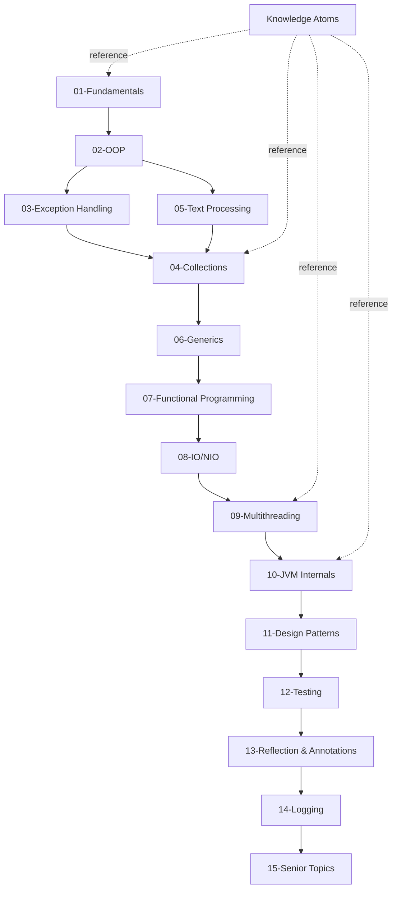

# Java

Java is a class-based, object-oriented programming language created by James Gosling at Sun Microsystems in 1995. It powers 3 billion devices worldwide and runs 97% of enterprise servers.

---

## What You'll Learn Here

This isn't just "how to write Java." This is how to **think** in Java — from your first `Hello World` to making architectural decisions that affect millions of users.

---

## Knowledge Atoms

Shared concepts explained ONCE, linked from everywhere. These are the building blocks that appear across multiple topics.

| Atom | What It Explains |
|------|------------------|
| [Java Memory Model](00-knowledge-atoms/java-memory-model/) | Heap, Stack, Metaspace — where everything lives |
| [Garbage Collection](00-knowledge-atoms/garbage-collection/) | How Java reclaims memory automatically |
| [equals() and hashCode()](00-knowledge-atoms/equals-hashcode/) | The contract every Java developer must understand |
| [Immutability](00-knowledge-atoms/immutability/) | Why String is immutable, why it matters |
| [Pass by Value](00-knowledge-atoms/pass-by-value/) | Java is ALWAYS pass by value — here's proof |
| [Autoboxing](00-knowledge-atoms/autoboxing/) | Primitive ↔ Wrapper conversion, the Integer cache trap |
| [Type Safety](00-knowledge-atoms/type-safety/) | Compile-time vs runtime checking |

---

## Modules

### Foundation (Start Here)
| # | Module | What You'll Learn |
|---|--------|-------------------|
| 01 | [Fundamentals](01-fundamentals/) | Variables, types, operators, control flow, methods, arrays, strings, wrapper classes |
| 02 | [OOP](02-oop/) | Classes, objects, inheritance, polymorphism, records, sealed classes |

### Core (Build Your Skills)
| # | Module | What You'll Learn |
|---|--------|-------------------|
| 03 | [Exception Handling](03-exceptions/) | Try-catch, custom exceptions, best practices |
| 04 | [Collections](04-collections/) | List, Set, Map, Queue — internals, when to use which |
| 05 | [Text Processing](05-text-processing/) | String pool, immutability, StringBuilder |
| 06 | [Generics](06-generics/) | Type safety, wildcards, type erasure |
| 07 | [Functional Programming](07-functional-programming/) | Lambdas, streams, Optional |
| 08 | [IO/NIO](08-io-nio/) | Files, streams, buffers, channels |

### Advanced (Level Up)
| # | Module | What You'll Learn |
|---|--------|-------------------|
| 09 | [Multithreading](09-multithreading-&-concurrency/) | Threads, synchronization, ExecutorService |
| 10 | [JVM Internals](10-jvm-internals/) | Class loading, memory, GC, JIT |
| 11 | [Design Patterns](11-design-patterns/) | 23 GoF patterns with Java implementations |
| 12 | [Testing](12-testing/) | JUnit 5, Mockito |
| 13 | [Reflection & Annotations](13-reflection-annotations/) | Runtime type info, custom annotations |
| 14 | [Logging](14-logging/) | SLF4J, Logback |

### Expert (Master Java)
| # | Module | What You'll Learn |
|---|--------|-------------------|
| 15 | [Senior Topics](15-senior/) | CompletableFuture, virtual threads, JVM tuning, OpenJDK |

---

## Learning Path



---

## For Students

**Start here:** [01-Fundamentals](01-fundamentals/)
**Then:** [02-OOP](02-oop/) → [03-Exception Handling](03-exceptions/)
**Goal:** Write your first Java programs, understand OOP

**Time:** 2-3 months

---

## For Junior Developers

**Start here:** [04-Collections](04-collections/)
**Then:** [06-Generics](06-generics/) → [07-Functional Programming](07-functional-programming/)
**Goal:** Write production-quality code

**Time:** 3-6 months

---

## For Mid-Level Engineers

**Start here:** [09-Multithreading](09-multithreading-&-concurrency/)
**Then:** [10-JVM Internals](10-jvm-internals/) → [11-Design Patterns](11-design-patterns/)
**Goal:** Understand how Java works under the hood

**Time:** 6-12 months

---

## For Senior Engineers

**Start here:** [15-Senior Topics](15-senior/)
**Focus on:** CompletableFuture, virtual threads, performance tuning, production patterns
**Goal:** Make architectural decisions

**Time:** Ongoing

---

## For Architects

**Focus on:**
- Java Strategy — When to choose Java
- Cost Analysis — ROI and TCO
- Architecture Decisions — ADRs
- System Design — Architectural patterns
- Production War Stories — Real failures

---

## For CTOs

**Focus on:**
- Java Strategy — Market position, when to use
- Cost Analysis — Java vs Go vs Python
- Ecosystem Decisions — Spring vs Quarkus, Maven vs Gradle
- Java at Scale — Netflix, Amazon, Google
- Risk Management — Security, vendor lock-in
- Roadmap — Java 21/25, future

---

## Quick Start

```java
public class HelloWorld {
    public static void main(String[] args) {
        System.out.println("Hello, World!");
    }
}
```

Save as `HelloWorld.java`, compile with `javac HelloWorld.java`, run with `java HelloWorld`.

---

## Prerequisites

- Java 21+ installed
- A code editor (IntelliJ IDEA recommended)
