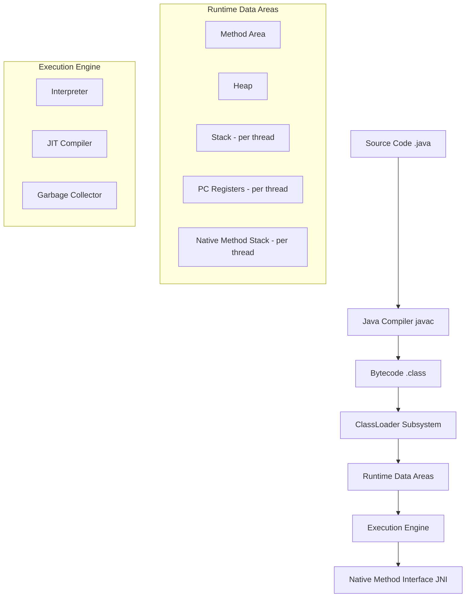
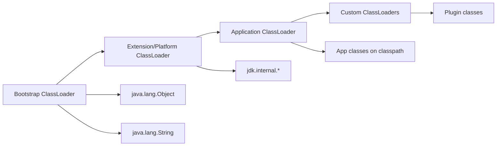
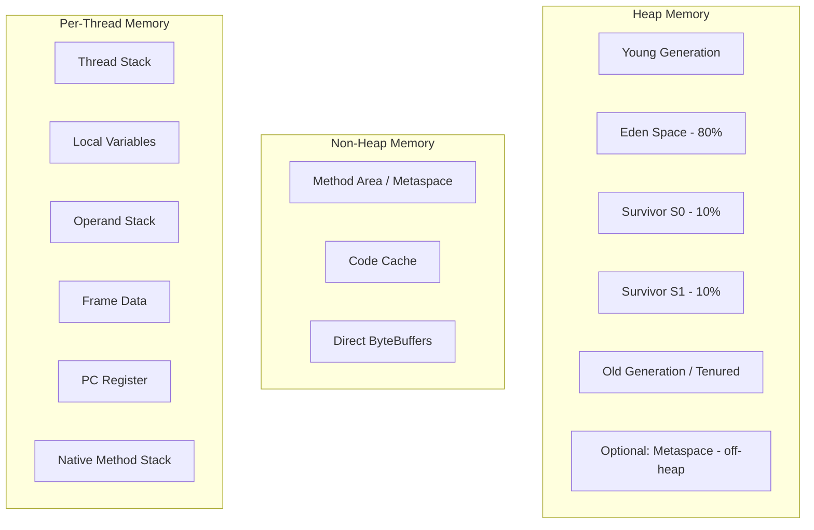
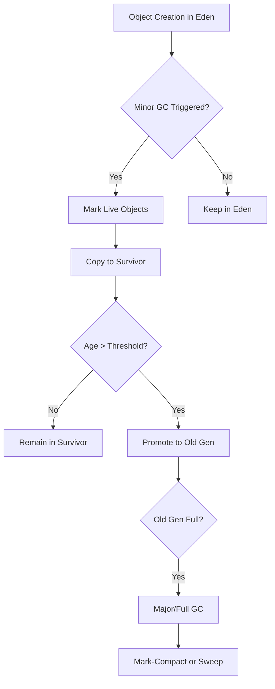
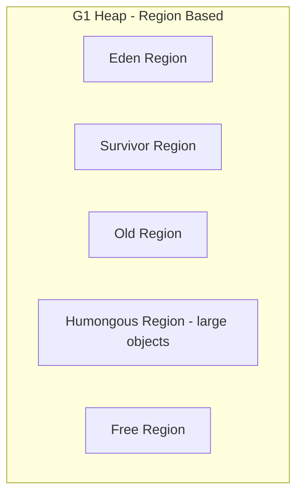
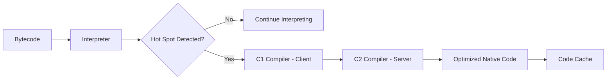
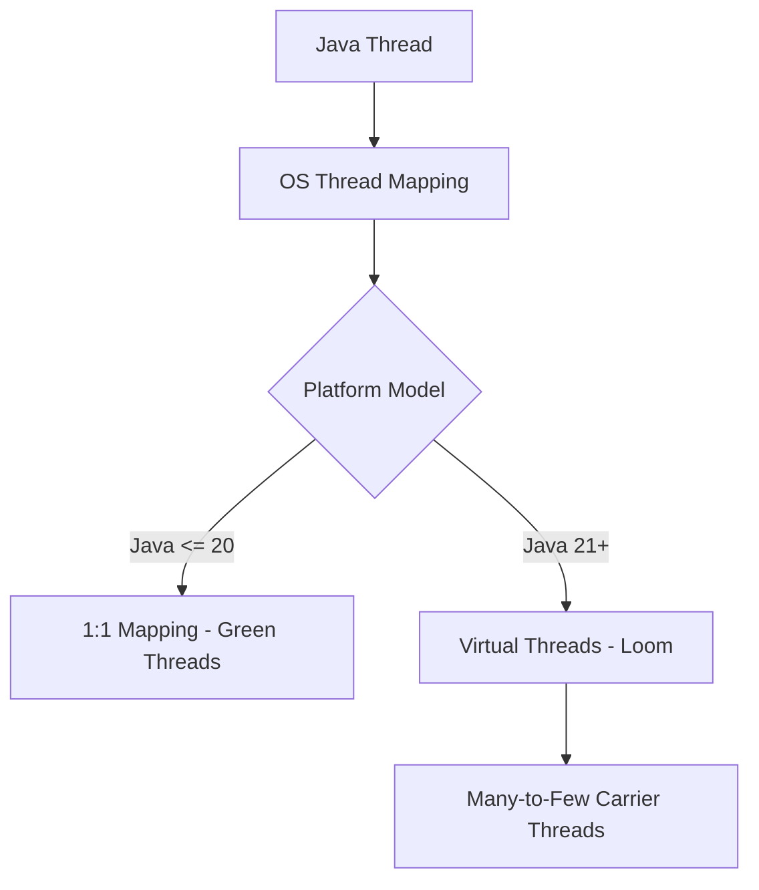

# Java Architecture

> JVM architecture, class loading, memory model, garbage collection, and JIT compilation.

## JVM Architecture Overview



## Class Loading Subsystem



### Loading Phases

| Phase | Description | Example |
|-------|-------------|---------|
| Loading | Reads .class file bytes into memory | `Class.forName()` |
| Linking | Verification, preparation, resolution | Static memory allocation |
| Initialization | Executes static blocks, assigns values | `<clinit>` method |

### Three ClassLoaders

| Loader | Loads From | Visibility |
|--------|-----------|------------|
| Bootstrap | `JAVA_HOME/lib` (rt.jar, jrt) | Core classes only |
| Extension | `JAVA_HOME/lib/ext` | Platform modules |
| Application | Application classpath | User classes |

```java
// Custom ClassLoader
public class CustomClassLoader extends ClassLoader {
    @Override
    protected Class<?> findClass(String name) throws ClassNotFoundException {
        byte[] bytes = loadClassBytes(name);
        if (bytes == null) {
            throw new ClassNotFoundException(name);
        }
        return defineClass(name, bytes, 0, bytes.length);
    }
}
```

## JVM Memory Model



### Memory Size Defaults

| Area | Default | Configuration |
|------|---------|--------------|
| Heap (initial) | 256 MB | `-Xms` |
| Heap (max) | 25% of RAM or 1 GB | `-Xmx` |
| Young Gen | 1/3 of heap | `-Xmn` |
| Metaspace | 256 MB | `-XX:MaxMetaspaceSize` |
| Thread Stack | 512 KB - 1 MB | `-Xss` |
| Code Cache | 240 MB | `-XX:ReservedCodeCacheSize` |

## Garbage Collection Zones



### GC Algorithms

| Algorithm | Type | Use Case |
|-----------|------|----------|
| Serial GC | Single-threaded | Small apps, single CPU |
| Parallel GC | Multi-threaded throughput | Batch processing |
| G1 GC | Region-based (default since Java 9) | Balanced latency/throughput |
| ZGC | Ultra-low latency (<10ms) | Large heaps, latency-critical |
| Shenandoah | Concurrent low-pause | Low-latency apps |
| Epsilon | No-op GC | Testing, short-lived apps |

```bash
# GC Selection
java -XX:+UseG1GC -jar app.jar          # G1 (default)
java -XX:+UseZGC -jar app.jar            # ZGC
java -XX:+UseShenandoahGC -jar app.jar   # Shenandoah
java -XX:+UseSerialGC -jar app.jar       # Serial
java -XX:+UseParallelGC -jar app.jar     # Parallel
```

### G1 GC Regions



## JIT Compilation



### JIT Optimization Techniques

| Technique | Description |
|-----------|-------------|
| Method Inlining | Replace call with method body |
| Escape Analysis | Determine if object escapes method |
| Loop Unrolling | Reduce loop overhead |
| Dead Code Elimination | Remove unreachable code |
| Intrinsics | Replace method with optimized assembly |
| On-Stack Replacement | Optimize running code in loop |

### JIT Thresholds

| Flag | Default | Description |
|------|---------|-------------|
| `-XX:CompileThreshold` | 10000 | Methods compiled after N calls |
| `-XX:+TieredCompilation` | true | Multi-tier compilation |
| `-XX:ReservedCodeCacheSize` | 240 MB | JIT code cache size |

## Thread Model



```java
// Virtual Threads (Java 21+)
Thread.startVirtualThread(() -> {
    // Runs on carrier thread pool
    handleRequest();
});

// Structured Concurrency (Preview)
try (var scope = new StructuredTaskScope.ShutdownOnFailure()) {
    Subtask<String> user = scope.fork(() -> fetchUser());
    Subtask<Order> order = scope.fork(() -> fetchOrder());
    scope.join();
    return new Response(user.get(), order.get());
}
```

## Key JVM Flags Reference

| Category | Flag | Description |
|----------|------|-------------|
| Heap | `-Xms4g` | Initial heap size |
| Heap | `-Xmx4g` | Maximum heap size |
| GC | `-XX:+UseG1GC` | Select G1 garbage collector |
| GC | `-XX:MaxGCPauseMillis=200` | Target max GC pause |
| JIT | `-XX:+TieredCompilation` | Enable tiered JIT |
| Diagnostics | `-XX:+HeapDumpOnOutOfMemoryError` | Dump heap on OOM |
| Diagnostics | `-XX:HeapDumpPath=/tmp` | Heap dump location |
| Diagnostics | `-XX:+PrintGCDetails` | GC logging (Java 8) |
| Diagnostics | `-Xlog:gc*` | GC logging (Java 9+) |

## References

- [Oracle JVM Documentation](https://docs.oracle.com/javase/8/docs/technotes/guides/vm/)
- [OpenJDK Documentation](https://openjdk.org/projects/jdk/)
- [Inside the JVM - Bill Venners](https://www.artima.com/insidejvm2e/)

---
**Prerequisites:** [Java core-concepts](core-concepts.md)
**Related:** [Java performance](performance.md) | [Java internals](internals.md)
**Next:** [Java configuration](configuration.md)
