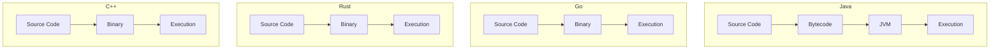

# Comparison: Java vs Go vs Rust vs C++

## Overview
This comparison helps you choose the right systems-level language for your needs.

## Feature Matrix

| Feature | Java | Go | Rust | C++ |
|---------|------|-----|------|-----|
| **Performance** | Fast | Very Fast | Very Fast | Very Fast |
| **Memory Safety** | Yes (GC) | Yes (GC) | Yes (Ownership) | Manual |
| **Concurrency** | Excellent | Excellent | Excellent | Good |
| **Learning Curve** | Moderate | Easy | Steep | Steep |
| **Type System** | Strong Static | Strong Static | Strong Static | Strong Static |
| **Garbage Collection** | Yes | Yes | No | Manual/Smart Ptrs |
| **Compilation** | JIT (JVM) | Compiled | Compiled | Compiled |
| **Binary Size** | Large | Medium | Small | Small |
| **Startup Time** | Slow | Fast | Fast | Fast |
| **Ecosystem** | Very Mature | Growing | Growing | Mature |

## Performance Comparison

| Metric | Java | Go | Rust | C++ |
|--------|------|-----|------|-----|
| **Execution Speed** | Fast | Very Fast | Very Fast | Very Fast |
| **Memory Usage** | High (JVM) | Low-Medium | Very Low | Very Low |
| **Startup Time** | Slow (seconds) | Fast (<1s) | Fast (<1s) | Instant |
| **Throughput** | Good | Excellent | Excellent | Excellent |
| **Concurrency** | Excellent | Excellent | Excellent | Good |

## Architecture Comparison

## Use Case Matrix

| Use Case | Java | Go | Rust | C++ |
|----------|------|-----|------|-----|
| **Enterprise Apps** | Excellent | Good | Poor | Good |
| **Cloud-Native** | Good | Excellent | Excellent | Poor |
| **Systems Programming** | Poor | Good | Excellent | Excellent |
| **Game Development** | Poor | Poor | Good | Excellent |
| **Mobile (Android)** | Excellent | Poor | Poor | Good |
| **Web Backends** | Excellent | Excellent | Good | Poor |
| **CLI Tools** | Poor | Excellent | Excellent | Good |
| **Embedded Systems** | Poor | Good | Excellent | Excellent |
| **Data Science** | Good | Poor | Good | Good |
| **DevOps Tools** | Poor | Excellent | Excellent | Good |

## Operational Comparison

| Factor | Java | Go | Rust | C++ |
|--------|------|-----|------|-----|
| **Setup Complexity** | Moderate | Easy | Moderate | Moderate |
| **Build System** | Maven/Gradle | Go Modules | Cargo | CMake/Make |
| **Package Manager** | Maven Central | Go Packages | Crates.io | vcpkg/Conan |
| **IDE Support** | Excellent | Good | Good | Good |
| **Documentation** | Excellent | Good | Good | Good |
| **Community** | Largest | Large | Large | Large |
| **Learning Resources** | Most | Good | Good | Good |

## Memory Management

```mermaid
graph TD
    subgraph "Java/GC"
        J1[Automatic] --> J2[Stop-the-World]
        J2 --> J3[Predictable Latency]
    end
    
    subgraph "Go/GC"
        G1[Automatic] --> G2[Concurrent]
        G2 --> G3[Low Latency]
    end
    
    subgraph "Rust/Ownership"
        R1[Compile-time] --> R2[No Runtime Cost]
        R2 --> R3[Predictable Performance]
    end
    
    subgraph "C++/Manual"
        C1[Manual] --> C2[Full Control]
        C2 --> C3[Potential Leaks]
    end
```

## Cost Comparison

| Cost Factor | Java | Go | Rust | C++ |
|-------------|------|-----|------|-----|
| **Development Speed** | Fast | Fast | Slow | Slow |
| **Runtime Cost** | High | Low | None | None |
| **Operational Cost** | High | Low | Low | Low |
| **Hiring Cost** | Moderate | Moderate | High | High |
| **Total Cost** | High | Low-Moderate | Moderate | Moderate |

## Migration Effort

| Migration | Java | Go | Rust | C++ |
|-----------|------|-----|------|-----|
| **From Java** | Native | Moderate | High | High |
| **From Go** | Moderate | Native | Moderate | Moderate |
| **From Rust** | High | Moderate | Native | Moderate |
| **From C++** | High | Moderate | Moderate | Native |

## When to Choose Each

### Choose Java When:
- Building enterprise applications
- Need strong ecosystem and libraries
- Android mobile development
- Team has Java expertise
- Need extensive third-party support

### Choose Go When:
- Building cloud-native microservices
- High concurrency required
- Need fast startup and low memory
- DevOps tooling and CLI applications
- Simple deployment needed

### Choose Rust When:
- Maximum performance critical
- Need memory safety without GC
- Systems programming required
- Want fearless concurrency
- Embedded systems development

### Choose C++ When:
- Game development and graphics
- Operating system development
- Real-time systems with strict timing
- Maximum control over hardware
- Legacy system maintenance

## Decision Matrix

| Priority | Java | Go | Rust | C++ |
|----------|------|-----|------|-----|
| **Performance** | Good | Excellent | Excellent | Excellent |
| **Safety** | Good | Good | Excellent | Poor |
| **Productivity** | Excellent | Excellent | Moderate | Moderate |
| **Ecosystem** | Excellent | Good | Good | Good |
| **Community** | Largest | Large | Large | Large |
| **Enterprise Support** | Excellent | Good | Growing | Good |
| **Learning Curve** | Moderate | Easy | Steep | Steep |
| **Future Proof** | Good | Excellent | Excellent | Good |

## Summary

- **Java**: Best for enterprise and Android development
- **Go**: Best for cloud-native and microservices
- **Rust**: Best for performance and safety
- **C++**: Best for systems programming and games