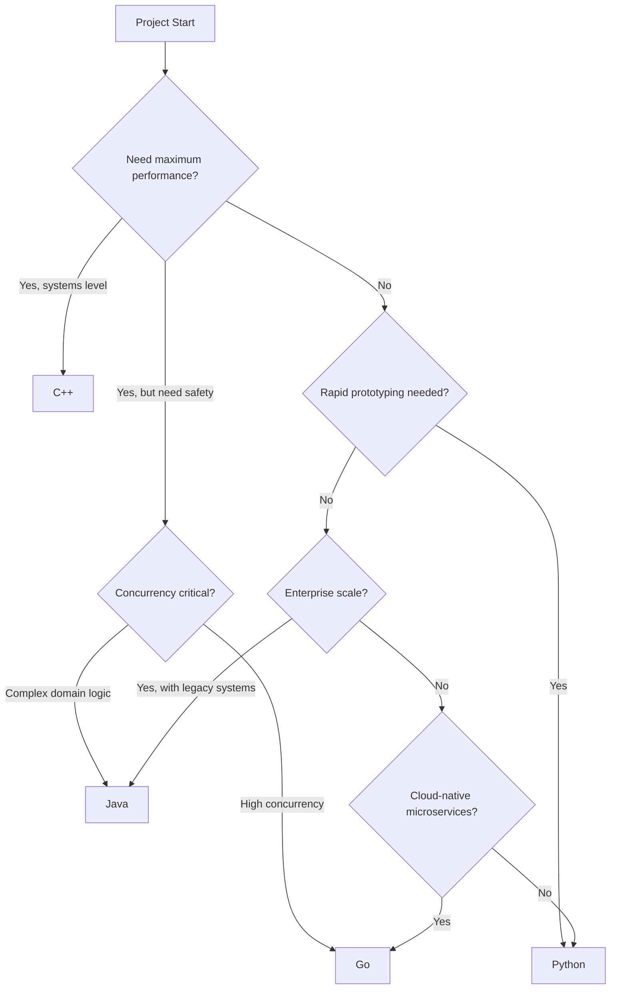

# Decision Tree: When to Use Java vs Go vs Python vs C++

## Overview
This decision tree helps you choose the right language based on your project requirements.

## Decision Flow



## Detailed Decision Matrix

| Criteria | Java | Go | Python | C++ |
|----------|------|-----|--------|-----|
| Startup Time | Slow (seconds) | Fast (<1s) | Fast (<1s) | Instant |
| Memory Usage | High (JVM) | Low-Medium | Medium | Very Low |
| Learning Curve | Moderate | Easy | Easy | Steep |
| Ecosystem Maturity | Very Mature | Growing | Very Mature | Mature |
| Concurrency Model | Threads/Executors | Goroutines | GIL/Asyncio | Threads/Async |
| Type Safety | Strong Static | Strong Static | Dynamic | Strong Static |
| Garbage Collection | Yes | Yes | Yes | Manual/Smart Ptrs |
| Best For | Enterprise, Android | Cloud, CLI, APIs | Data Science, Scripting | Systems, Games, Embedded |

## Use Case Recommendations

### Choose Java When:
- Building enterprise applications with complex business logic
- Needing strong integration with legacy systems
- Android mobile development required
- Team has existing Java expertise
- Needing extensive third-party library support

### Choose Go When:
- Building cloud-native microservices
- High concurrency and parallelism required
- Needing fast startup and low memory footprint
- DevOps tooling and CLI applications
- Simple deployment (single binary)

### Choose Python When:
- Rapid prototyping and development
- Data science, ML, and AI applications
- Scripting and automation tasks
- Web development with Django/Flask
- Quick scripting for existing systems

### Choose C++ When:
- Maximum performance critical
- Game development and graphics
- Embedded systems programming
- Real-time systems with strict timing
- Operating system development

## Performance Benchmarks (Relative)

```mermaid
graph LR
    subgraph "Execution Speed"
        C++ -->|1.0x| Fastest
        Go -->|1.2x| Very Fast
        Java -->|1.5x| Fast
        Python -->|10-100x| Slower
    end
```

## Team Considerations

| Team Size | Recommended |
|-----------|-------------|
| Solo Developer | Python or Go |
| Small Team (2-5) | Go or Python |
| Medium Team (5-20) | Java or Go |
| Large Enterprise (20+) | Java |

## Migration Paths

- From Java to Go: Moderate effort, good for cloud migration
- From Python to Go: Good for performance-critical components
- From C++ to Rust: Consider for safety while maintaining performance
- To Java: Good for enterprise integration needs