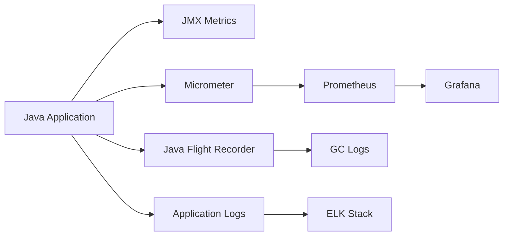

# Java Monitoring

> JMX, Micrometer, Prometheus exporter, and Grafana dashboards.

## Monitoring Stack Overview



## JMX Monitoring

### Enable JMX

```bash
# JVM flags
-Dcom.sun.management.jmxremote
-Dcom.sun.management.jmxremote.port=9010
-Dcom.sun.management.jmxremote.authenticate=false
-Dcom.sun.management.jmxremote.ssl=false
-Djava.rmi.server.hostname=127.0.0.1
```

### JMX Metrics

```java
// Custom MBean
public interface AppMetricsMBean {
    int getActiveConnections();
    long getRequestCount();
    double getAverageResponseTime();
    void reset();
}

public class AppMetrics implements AppMetricsMBean {
    private final AtomicLong requestCount = new AtomicLong();
    private final AtomicLong totalResponseTime = new AtomicLong();
    private final AtomicInteger activeConnections = new AtomicInteger();
    
    @Override
    public int getActiveConnections() { return activeConnections.get(); }
    
    @Override
    public long getRequestCount() { return requestCount.get(); }
    
    @Override
    public double getAverageResponseTime() {
        long count = requestCount.get();
        return count == 0 ? 0 : (double) totalResponseTime.get() / count;
    }
    
    public void recordRequest(long responseTime) {
        requestCount.incrementAndGet();
        totalResponseTime.addAndGet(responseTime);
    }
}

// Register MBean
MBeanServer mbs = ManagementFactory.getPlatformMBeanServer();
ObjectName name = new ObjectName("com.example:type=AppMetrics");
mbs.registerMBean(new AppMetrics(), name);
```

## Micrometer Integration

### Dependencies

```xml
<!-- Maven -->
<dependency>
    <groupId>io.micrometer</groupId>
    <artifactId>micrometer-registry-prometheus</artifactId>
</dependency>
<dependency>
    <groupId>org.springframework.boot</groupId>
    <artifactId>spring-boot-starter-actuator</artifactId>
</dependency>
```

### Custom Metrics

```java
@Service
public class OrderMetrics {
    private final Counter orderCounter;
    private final Timer orderProcessingTime;
    private final DistributionSummary orderValue;
    private final Gauge activeOrders;
    private final AtomicInteger currentOrders = new AtomicInteger(0);
    
    public OrderMetrics(MeterRegistry registry) {
        this.orderCounter = Counter.builder("orders.created")
            .description("Total orders created")
            .tag("status", "all")
            .register(registry);
        
        this.orderProcessingTime = Timer.builder("orders.processing.time")
            .description("Order processing time")
            .publishPercentiles(0.5, 0.95, 0.99)
            .register(registry);
        
        this.orderValue = DistributionSummary.builder("orders.value")
            .description("Order value distribution")
            .baseUnit("dollars")
            .register(registry);
        
        this.activeOrders = Gauge.builder("orders.active", currentOrders, 
            AtomicInteger::doubleValue)
            .description("Currently processing orders")
            .register(registry);
    }
    
    public void recordOrder(double value, long processingTimeMs) {
        orderCounter.increment();
        orderProcessingTime.record(processingTimeMs, TimeUnit.MILLISECONDS);
        orderValue.record(value);
        currentOrders.incrementAndGet();
    }
}
```

### Actuator Endpoints

```yaml
# application.yml
management:
  endpoints:
    web:
      exposure:
        include: health,info,metrics,prometheus
  endpoint:
    health:
      show-details: when-authorized
    metrics:
      enabled: true
    prometheus:
      enabled: true
```

## Prometheus Configuration

### prometheus.yml

```yaml
global:
  scrape_interval: 15s
  evaluation_interval: 15s

scrape_configs:
  - job_name: 'java-app'
    metrics_path: '/actuator/prometheus'
    static_configs:
      - targets: ['localhost:8080']
        labels:
          app: 'my-java-app'
          environment: 'production'

  - job_name: 'jvm'
    metrics_path: '/metrics'
    static_configs:
      - targets: ['localhost:9090']
```

### Key JVM Metrics

| Metric | Description | Alert Threshold |
|--------|-------------|-----------------|
| `jvm_memory_used_bytes` | Memory usage by area | > 80% of max |
| `jvm_gc_pause_seconds_max` | Max GC pause | > 500ms |
| `jvm_gc_pause_seconds_sum` | Total GC time | > 10% of uptime |
| `jvm_threads_live_threads` | Active thread count | > 500 |
| `process_cpu_usage` | CPU utilization | > 80% |
| `http_server_requests_seconds` | Request latency | p99 > 1s |

## Grafana Dashboards

### JVM Dashboard Queries

```promql
# Memory Usage
jvm_memory_used_bytes{area="heap"}
jvm_memory_max_bytes{area="heap"}

# CPU Usage
process_cpu_usage

# GC Metrics
rate(jvm_gc_pause_seconds_sum[5m])
jvm_gc_pause_seconds_max

# HTTP Requests
rate(http_server_requests_seconds_count[5m])
histogram_quantile(0.99, rate(http_server_requests_seconds_bucket[5m]))

# Thread Count
jvm_threads_live_threads
```

### Recommended Dashboards

| Dashboard | ID | Purpose |
|-----------|----|---------| 
| JVM (Micrometer) | 4701 | Spring Boot metrics |
| JVM Overview | 14506 | General JVM monitoring |
| JMX Metrics | 8919 | JMX-based monitoring |

## GC Logging

```bash
# Java 11+ unified logging
-Xlog:gc*:file=gc.log:time,uptime,level,tags:filecount=5,filesize=50m

# Detailed GC logging
-Xlog:gc+age=debug,gc+heap=debug,gc+phases=debug:file=gc-detailed.log:time

# Java 8 style
-XX:+PrintGCDetails
-XX:+PrintGCDateStamps
-XX:+PrintGCTimeStamps
-XX:+PrintHeapAtGC
-XX:+PrintTenuringDistribution
-Xloggc:gc.log
-XX:+UseGCLogFileRotation
-XX:NumberOfGCLogFiles=10
-XX:GCLogFileSize=50m
```

## JFR Monitoring

```bash
# Quick recording
jcmd <pid> JFR.start name=quick duration=60s filename=quick.jfr

# Profile recording
jcmd <pid> JFR.start settings=profile filename=profile.jfr

# Continuous with limits
jcmd <pid> JFR.start settings=default maxage=24h maxsize=100m filename=continuous.jfr
```

## Health Checks

```java
// Custom health indicator
@Component
public class DatabaseHealthIndicator implements HealthIndicator {
    
    private final DataSource dataSource;
    
    @Override
    public Health health() {
        try (Connection conn = dataSource.getConnection()) {
            if (conn.isValid(5)) {
                return Health.up()
                    .withDetail("database", "accessible")
                    .withDetail("connectionPool", getPoolStats())
                    .build();
            }
        } catch (SQLException e) {
            return Health.down()
                .withDetail("database", e.getMessage())
                .build();
        }
        return Health.down().build();
    }
}
```

## References

- [Micrometer Documentation](https://micrometer.io/docs)
- [Prometheus JVM Client](https://github.com/prometheus/client_java)
- [Grafana JVM Dashboard](https://grafana.com/grafana/dashboards/)

---
**Prerequisites:** [Java performance](performance.md)
**Related:** [Java production](production.md) | [Java debugging](debugging.md)
**Next:** [Java production](production.md)
