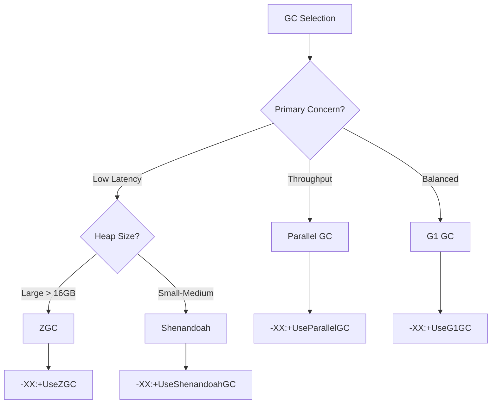

# Java Performance

> JVM tuning, garbage collection selection, heap sizing, JMH benchmarks, and profiling.

## Performance Metrics

| Metric | Description | Target |
|--------|-------------|--------|
| Latency | Time for single operation | < 100ms (p99) |
| Throughput | Operations per second | Depends on workload |
| CPU Utilization | Processor usage | 60-80% sustained |
| Memory Usage | Heap + off-heap consumption | < 80% of available |
| GC Pause Time | Stop-the-world pauses | < 200ms for G1 |
| GC Frequency | How often GC runs | Depends on allocation rate |

## JVM Tuning

### Heap Sizing

```bash
# Rule of thumb: 25-50% of available RAM
# Maximum heap (production)
-XX:MaxRAMPercentage=75.0
-XX:InitialRAMPercentage=50.0

# Fixed sizes (when you know the workload)
-Xms4g -Xmx4g

# Avoid resize pauses: set equal
-XX:+AlwaysPreTouch  # pre-touch all pages at startup
```

### GC Selection Guide



### GC Tuning Parameters

```bash
# G1 GC Tuning
-XX:+UseG1GC
-XX:MaxGCPauseMillis=200        # Target max pause
-XX:G1HeapRegionSize=16m         # Region size
-XX:G1ReservePercent=10          # Reserve memory
-XX:InitiatingHeapOccupancyPercent=45  # Start concurrent cycle
-XX:G1NewSizePercent=5           # Min young gen
-XX:G1MaxNewSizePercent=60       # Max young gen

# ZGC Tuning
-XX:+UseZGC
-XX:+ZGenerational               # Java 21+
-XX:SoftMaxHeapSize=4g           # Soft limit

# Shenandoah Tuning
-XX:+UseShenandoahGC
-XX:ShenandoahGCHeuristics=compact  # Aggressive cleanup
-XX:ShenandoahGuaranteedGCInterval=300000
```

## JMH Benchmarks

### Setup

```xml
<!-- pom.xml -->
<dependency>
    <groupId>org.openjdk.jmh</groupId>
    <artifactId>jmh-core</artifactId>
    <version>1.37</version>
    <scope>test</scope>
</dependency>
<dependency>
    <groupId>org.openjdk.jmh</groupId>
    <artifactId>jmh-generator-annprocess</artifactId>
    <version>1.37</version>
    <scope>provided</scope>
</dependency>
```

### Benchmark Example

```java
import org.openjdk.jmh.annotations.*;
import java.util.concurrent.TimeUnit;

@BenchmarkMode(Mode.AverageTime)
@OutputTimeUnit(TimeUnit.NANOSECONDS)
@State(Scope.Thread)
@Warmup(iterations = 5, time = 1)
@Measurement(iterations = 10, time = 1)
@Fork(2)
public class StringBenchmark {

    @Benchmark
    public String stringConcat() {
        String result = "";
        for (int i = 0; i < 100; i++) {
            result += i;
        }
        return result;
    }

    @Benchmark
    public String stringBuilder() {
        StringBuilder sb = new StringBuilder();
        for (int i = 0; i < 100; i++) {
            sb.append(i);
        }
        return sb.toString();
    }

    @Benchmark
    public String stringJoin() {
        String[] parts = new String[100];
        for (int i = 0; i < 100; i++) {
            parts[i] = String.valueOf(i);
        }
        return String.join("", parts);
    }
}
```

### Run Benchmark

```bash
mvn clean install
java -jar target/benchmarks.jar
java -jar target/benchmarks.jar -prof gc
java -jar target/benchmarks.jar -f 3 -wi 5 -i 10
```

## Profiling Tools

| Tool | Type | Use Case |
|------|------|----------|
| VisualVM | GUI | General profiling, heap dumps |
| async-profiler | Agent | Low-overhead CPU/mem profiling |
| JProfiler | Commercial | Detailed analysis |
| YourKit | Commercial | Production profiling |
| JFR | Built-in | Continuous monitoring |
| jcmd | Built-in | Diagnostic commands |
| jmap | Built-in | Heap dumps |
| jstack | Built-in | Thread dumps |

### Java Flight Recorder

```bash
# Record for 60 seconds
jcmd 1 JFR.start duration=60s filename=recording.jfr

# Continuous recording
jcmd 1 JFR.start settings=profile filename=continuous.jfr
jcmd 1 JFR.dump
jcmd 1 JFR.stop
```

### async-profiler

```bash
# CPU profiling
./profiler.sh -d 30 -f cpu_profile.html <pid>

# Memory allocation profiling
./profiler.sh -d 30 -e alloc -f alloc_profile.html <pid>

# Wall-clock profiling
./profiler.sh -d 30 -e wall -f wall_profile.html <pid>
```

## Common Optimizations

### String Operations

```java
// Bad: creates many String objects
String result = "";
for (int i = 0; i < 1000; i++) {
    result += "item" + i;
}

// Good: use StringBuilder
StringBuilder sb = new StringBuilder();
for (int i = 0; i < 1000; i++) {
    sb.append("item").append(i);
}
String result = sb.toString();
```

### Collection Tuning

```java
// Bad: default capacity
List<String> list = new ArrayList<>();

// Good: pre-size when known
List<String> list = new ArrayList<>(expectedSize);

// Bad: HashMap default
Map<String, Object> map = new HashMap<>();

// Good: pre-size (capacity = expected / 0.75 + 1)
Map<String, Object> map = new HashMap<>(134);  // for ~100 entries
```

### Object Pooling

```java
// Bad: creating new objects in loop
for (int i = 0; i < 10000; i++) {
    byte[] buffer = new byte[1024];
    process(buffer);
}

// Good: reuse with ThreadLocal
private static final ThreadLocal<byte[]> BUFFER =
    ThreadLocal.withInitial(() -> new byte[1024]);

for (int i = 0; i < 10000; i++) {
    byte[] buffer = BUFFER.get();
    process(buffer);
}
```

## Memory Leak Detection

```bash
# Find memory leak with jmap
jmap -histo <pid> | head -20

# Heap dump analysis
jmap -dump:live,format=b,file=heap.hprof <pid>

# VisualVM or Eclipse MAT for analysis

# Enable leak detection
-XX:+HeapDumpOnOutOfMemoryError
-XX:HeapDumpPath=/tmp/heapdumps/
-XX:OnOutOfMemoryError="kill -9 %p"
```

## Performance Checklist

- [ ] Heap sized appropriately for workload
- [ ] GC algorithm selected for latency requirements
- [ ] JIT compilation allowed to warm up
- [ ] No unnecessary object creation in hot paths
- [ ] Collections pre-sized where possible
- [ ] Strings concatenated with StringBuilder
- [ ] Database connection pooling configured
- [ ] HTTP connection pooling configured
- [ ] Thread pool sizes tuned for I/O vs CPU work
- [ ] JFR enabled in production

## References

- [JMH Samples](https://github.com/openjdk/jmh/tree/master/jmh-samples)
- [GC Tuning Guide](https://docs.oracle.com/javase/8/docs/technotes/guides/vm/gctuning/)
- [async-profiler](https://github.com/async-profiler/async-profiler)

---
**Prerequisites:** [Java architecture](architecture.md) | [Java core-concepts](core-concepts.md)
**Related:** [Java production](production.md) | [Java monitoring](monitoring.md)
**Next:** [Java best-practices](best-practices.md)
