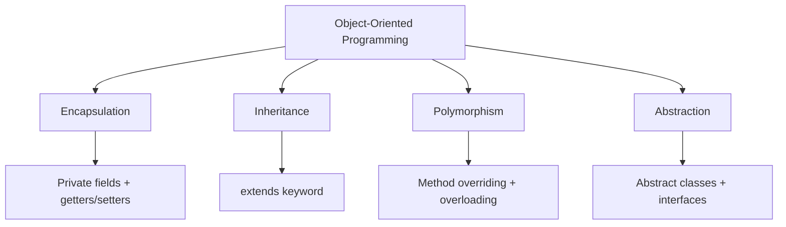
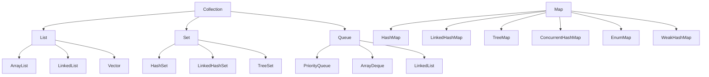

# Java Core Concepts

> OOP, generics, collections, concurrency, streams, annotations, and exception handling.

## OOP Pillars



### Encapsulation

```java
public class BankAccount {
    private double balance;  // hidden state
    
    public double getBalance() {
        return balance;  // controlled access
    }
    
    public void deposit(double amount) {
        if (amount <= 0) throw new IllegalArgumentException("Amount must be positive");
        balance += amount;  // validation before mutation
    }
}
```

### Inheritance

```java
public abstract class Shape {
    protected String color;
    
    public Shape(String color) { this.color = color; }
    public abstract double area();
    public abstract double perimeter();
}

public class Circle extends Shape {
    private final double radius;
    
    public Circle(String color, double radius) {
        super(color);
        this.radius = radius;
    }
    
    @Override
    public double area() { return Math.PI * radius * radius; }
    
    @Override
    public double perimeter() { return 2 * Math.PI * radius; }
}
```

### Polymorphism

```java
// Compile-time (overloading)
public class Printer {
    public void print(String text) { System.out.println(text); }
    public void print(int number) { System.out.println(number); }
    public void print(String text, int copies) { /* ... */ }
}

// Runtime (overriding)
List<Shape> shapes = List.of(new Circle("red", 5), new Square("blue", 4));
for (Shape s : shapes) {
    System.out.println(s.area());  // calls correct implementation
}
```

### Abstraction

```java
// Interface (Java 8+ with default methods)
public interface Payable {
    BigDecimal calculatePayment();
    
    default void processPayment() {
        BigDecimal amount = calculatePayment();
        transfer(amount);
    }
    
    static boolean isPayable(Object obj) {
        return obj instanceof Payable;
    }
}

// Record as value abstraction (Java 16+)
public record Point(double x, double y) {
    public double distanceTo(Point other) {
        return Math.sqrt(Math.pow(x - other.x, 2) + Math.pow(y - other.y, 2));
    }
}
```

## Generics

```java
// Generic class
public class Repository<T, ID> {
    private final Map<ID, T> store = new HashMap<>();
    
    public void save(ID id, T entity) { store.put(id, entity); }
    public Optional<T> findById(ID id) { return Optional.ofNullable(store.get(id)); }
}

// Bounded type parameters
public <T extends Comparable<T>> T findMax(List<T> list) {
    return list.stream().max(Comparable::compareTo).orElseThrow();
}

// Wildcard bounds
public void copy(List<? super String> dest, List<? extends String> src) {
    for (String s : src) dest.add(s);
}

// Type inference
var list = List.of(1, 2, 3);  // List<Integer>
var max = list.stream().max(Integer::compareTo);  // Optional<Integer>
```

## Collections Framework



### Collection Performance

| Operation | ArrayList | LinkedList | HashSet | TreeMap | ConcurrentHashMap |
|-----------|-----------|------------|---------|---------|-------------------|
| add | O(1) amortized | O(1) | O(1) | O(log n) | O(1) |
| remove | O(n) | O(1) | O(1) | O(log n) | O(1) |
| contains | O(n) | O(n) | O(1) | O(log n) | O(1) |
| get(index) | O(1) | O(n) | N/A | N/A | N/A |

```java
// Immutable collections (Java 9+)
var list = List.of("a", "b", "c");
var map = Map.of("key1", "val1", "key2", "val2");
var set = Set.of(1, 2, 3);

// Stream operations on collections
Map<String, Integer> wordLengths = words.stream()
    .collect(Collectors.groupingBy(
        w -> w.substring(0, 1).toUpperCase(),
        Collectors.summingInt(String::length)
    ));
```

## Concurrency

```java
// Virtual Threads (Java 21+)
try (var executor = Executors.newVirtualThreadPerTaskExecutor()) {
    IntStream.range(0, 10_000).forEach(i -> {
        executor.submit(() -> {
            Thread.sleep(Duration.ofSeconds(1));
            return i;
        });
    });
}

// CompletableFuture
CompletableFuture.supplyAsync(() -> fetchUser(id))
    .thenApplyAsync(user -> fetchOrders(user))
    .thenAccept(orders -> process(orders))
    .exceptionally(ex -> handleError(ex));

// Thread-safe data structures
ConcurrentHashMap<String, AtomicInteger> counters = new ConcurrentHashMap<>();
concurrentMap.computeIfAbsent(key, k -> new AtomicInteger(0)).incrementAndGet();

// Reactive Streams
Flux.fromIterable(users)
    .parallel()
    .runOn(Schedulers.parallel())
    .map(user -> enrichUser(user))
    .sequential()
    .subscribe(this::save);
```

## Streams API

```java
// Pipeline operations
List<String> result = orders.stream()
    .filter(order -> order.getAmount() > 100)
    .map(Order::getCustomerName)
    .distinct()
    .sorted()
    .limit(10)
    .collect(Collectors.toList());

// Collectors
Map<Boolean, List<Employee>> partitioned = employees.stream()
    .collect(Collectors.partitioningBy(Employee::isManager));

Map<Department, Double> avgSalary = employees.stream()
    .collect(Collectors.groupingBy(
        Employee::getDepartment,
        Collectors.averagingDouble(Employee::getSalary)
    ));

// Reduction
Optional<String> longest = words.stream()
    .reduce((a, b) -> a.length() >= b.length() ? a : b);

// Parallel streams
long count = data.parallelStream()
    .filter(item -> expensiveCheck(item))
    .count();
```

## Annotations

```java
// Built-in annotations
@Override   // method overrides superclass/interface method
@Deprecated // element is no longer recommended
@SuppressWarnings("unchecked")  // suppress compiler warnings
@FunctionalInterface  // marks single abstract method interface

// Custom annotations
@Retention(RetentionPolicy.RUNTIME)
@Target({ElementType.TYPE, ElementType.METHOD})
public @interface Cacheable {
    int ttlSeconds() default 300;
    String keyPrefix() default "";
}

// Meta-annotations
@Retention(RetentionPolicy.RUNTIME)
@Target(ElementType.METHOD)
@Cacheable(ttlSeconds = 600)
public @interface SessionCache {}

// Processing with reflection
Method[] methods = clazz.getDeclaredMethods();
for (Method m : methods) {
    if (m.isAnnotationPresent(Cacheable.class)) {
        Cacheable ann = m.getAnnotation(Cacheable.class);
        registerCache(m, ann.ttlSeconds());
    }
}
```

## Exception Handling

```java
// Try-with-resources
try (var conn = dataSource.getConnection();
     var stmt = conn.prepareStatement(sql)) {
    stmt.setString(1, param);
    try (var rs = stmt.executeQuery()) {
        while (rs.next()) { /* process */ }
    }
}

// Multi-catch
try {
    parse(input);
} catch (NumberFormatException | IllegalArgumentException e) {
    logger.warn("Invalid input: {}", e.getMessage());
}

// Custom exception hierarchy
public class ServiceException extends Exception {
    private final ErrorCode code;
    
    public ServiceException(String message, ErrorCode code, Throwable cause) {
        super(message, cause);
        this.code = code;
    }
}

// Effective exception handling
public User findUser(long id) throws UserNotFoundException {
    return repository.findById(id)
        .orElseThrow(() -> new UserNotFoundException("User not found: " + id));
}
```

## Records (Java 16+)

```java
// Immutable data carrier
public record User(String name, String email, List<String> roles) {
    // Compact constructor for validation
    public User {
        Objects.requireNonNull(name);
        Objects.requireNonNull(email);
        roles = List.copyOf(roles);  // defensive copy
    }
    
    // Custom methods
    public boolean hasRole(String role) {
        return roles.contains(role);
    }
}

// Sealed interfaces (Java 17+)
public sealed interface Shape permits Circle, Rectangle, Triangle {
    double area();
}

public record Circle(double radius) implements Shape {
    public double area() { return Math.PI * radius * radius; }
}
```

## References

- [Oracle Java Tutorials](https://docs.oracle.com/javase/tutorial/)
- [Baeldung Java](https://www.baeldung.com/)
- [Effective Java - Joshua Bloch](https://www.oreilly.com/library/view/effective-java/9780134686097/)

---
**Prerequisites:** [Java README](../../../README.md)
**Related:** Java design patterns | Java concurrency
**Next:** [Java configuration](configuration.md)
