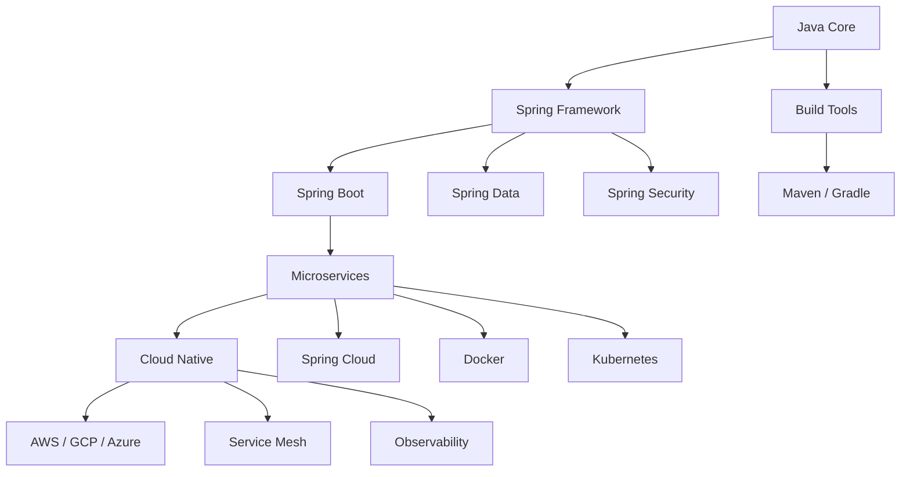

# Java Roadmap

> Java ecosystem roadmap: Core to Spring to Microservices to Cloud.

## Learning Path

## Phase 1: Java Core (2-3 months)

| Topic | Focus |
|-------|-------|
| Syntax | Variables, control flow, methods |
| OOP | Classes, inheritance, interfaces |
| Collections | List, Set, Map, Queue |
| Generics | Type parameters, bounds, wildcards |
| Streams | Pipeline, collectors, parallel |
| Concurrency | Threads, executor service, locks |
| Exceptions | Try-catch, custom exceptions |
| I/O | File I/O, NIO, serialization |

## Phase 2: Build Tools & Frameworks (1-2 months)

| Tool | Purpose |
|------|---------|
| Maven | Dependency management, build lifecycle |
| Gradle | Alternative build tool |
| JUnit 5 | Unit testing |
| Mockito | Mocking framework |
| Spring | Dependency injection, AOP |
| Spring Boot | Auto-configuration, starters |

## Phase 3: Spring Ecosystem (2-3 months)

| Module | Purpose |
|--------|---------|
| Spring Web | REST APIs, MVC |
| Spring Data JPA | Database access |
| Spring Security | Authentication, authorization |
| Spring Cache | Caching abstraction |
| Spring Scheduling | Task scheduling |

## Phase 4: Microservices (2-3 months)

| Concept | Technology |
|---------|------------|
| Service Discovery | Eureka, Consul |
| API Gateway | Spring Cloud Gateway |
| Config Server | Spring Cloud Config |
| Circuit Breaker | Resilience4j |
| Messaging | Kafka, RabbitMQ |
| Tracing | Micrometer, Zipkin |

## Phase 5: Cloud & DevOps (2-3 months)

| Topic | Technology |
|-------|------------|
| Containers | Docker, Docker Compose |
| Orchestration | Kubernetes |
| CI/CD | Jenkins, GitHub Actions |
| Cloud | AWS, GCP, Azure |
| Monitoring | Prometheus, Grafana |
| Logging | ELK Stack |

## Phase 6: Advanced Topics

| Topic | Description |
|-------|-------------|
| Performance Tuning | JVM, GC, profiling |
| Reactive Programming | WebFlux, Project Reactor |
| GraalVM | Native compilation |
| Quarkus / Micronaut | Alternative frameworks |

## Recommended Resources

| Level | Resource |
|-------|----------|
| Beginner | Head First Java, Java Tutorial |
| Intermediate | Effective Java, Spring in Action |
| Advanced | Designing Data-Intensive Applications |
| Practice | LeetCode, HackerRank |

## Timeline Summary

| Phase | Duration | Milestone |
|-------|----------|-----------|
| Java Core | 2-3 months | Build CLI apps |
| Build Tools | 1-2 months | Maven/Gradle projects |
| Spring | 2-3 months | REST APIs |
| Microservices | 2-3 months | Distributed system |
| Cloud | 2-3 months | Production deployment |
| Advanced | Ongoing | Expert level |

**Total: 10-14 months** for job-ready Java developer.

---
**Prerequisites:** [Java README](README.md)
**Related:** [Java core-concepts](core-concepts.md) | [Java best-practices](best-practices.md)
**Next:** [Java cross-links](cross-links.md)
