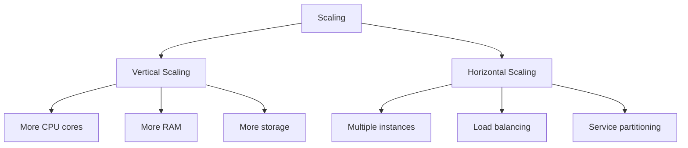

# Java Scaling

> Thread pools, connection pools, caching, clustering, and horizontal scaling patterns.

## Scaling Strategies



## Thread Pool Configuration

### ExecutorService Tuning

```java
// CPU-bound tasks
int cpuCores = Runtime.getRuntime().availableProcessors();
ExecutorService cpuPool = new ThreadPoolExecutor(
    cpuCores,
    cpuCores * 2,
    60L, TimeUnit.SECONDS,
    new LinkedBlockingQueue<>(1000),
    new ThreadPoolExecutor.CallerRunsPolicy()
);

// I/O-bound tasks
ExecutorService ioPool = new ThreadPoolExecutor(
    50,                        // core threads
    200,                       // max threads
    60L, TimeUnit.SECONDS,
    new LinkedBlockingQueue<>(5000),
    new ThreadFactoryBuilder().setNameFormat("io-%d").build(),
    new ThreadPoolExecutor.CallerRunsPolicy()
);

// Virtual Threads (Java 21+)
try (var executor = Executors.newVirtualThreadPerTaskExecutor()) {
    tasks.forEach(task -> executor.submit(task));
}
```

### Thread Pool Sizing Guide

| Workload | Formula | Example |
|----------|---------|---------|
| CPU-bound | N_cpu + 1 | 8 core -> 9 threads |
| I/O-bound | N_cpu * (1 + W/C) | 8 core, 10:1 wait -> 88 threads |
| Mixed | N_cpu * U_cpu * (1 + W/C) | Depends on utilization |

## Connection Pool Configuration

### HikariCP (Spring Boot Default)

```yaml
spring:
  datasource:
    hikari:
      maximum-pool-size: 20        # max connections
      minimum-idle: 5              # min idle connections
      idle-timeout: 30m            # idle connection timeout
      max-lifetime: 20m            # max connection lifetime
      connection-timeout: 10s      # max wait for connection
      validation-timeout: 5s       # connection validation timeout
      leak-detection-threshold: 60s # leak detection
      connection-test-query: SELECT 1
      pool-name: MyHikariPool
```

### HikariCP Sizing

```
connections = (core_count * 2) + effective_spindle_count
# For SSD: connections = (8 * 2) + 1 = 17
# For HDD: connections = (8 * 2) + 4 = 20
```

### HTTP Client Connection Pool

```java
// Apache HttpClient 5
PoolingHttpClientConnectionManager cm = new PoolingHttpClientConnectionManager();
cm.setMaxTotal(200);                 // total connections
cm.setDefaultMaxPerRoute(50);        // per host
cm.setValidateAfterInactivity(5000);

RequestConfig config = RequestConfig.custom()
    .setConnectTimeout(Timeout.ofSeconds(5))
    .setResponseTimeout(Timeout.ofSeconds(10))
    .setConnectionRequestTimeout(Timeout.ofSeconds(3))
    .build();

CloseableHttpClient client = HttpClients.custom()
    .setConnectionManager(cm)
    .setDefaultRequestConfig(config)
    .build();
```

## Caching Strategies

### Local Cache (Caffeine)

```java
Cache<String, User> userCache = Caffeine.newBuilder()
    .maximumSize(10_000)
    .expireAfterWrite(Duration.ofMinutes(10))
    .recordStats()
    .build();

LoadingCache<String, User> loadingCache = Caffeine.newBuilder()
    .maximumSize(10_000)
    .refreshAfterWrite(Duration.ofMinutes(5))
    .expireAfterWrite(Duration.ofMinutes(10))
    .build(key -> userRepository.findById(key));
```

### Distributed Cache (Redis)

```java
// Spring Cache with Redis
@Configuration
@EnableCaching
public class CacheConfig {
    
    @Bean
    public RedisCacheManager cacheManager(RedisConnectionFactory factory) {
        RedisCacheConfiguration config = RedisCacheConfiguration.defaultCacheConfig()
            .entryTtl(Duration.ofMinutes(30))
            .serializeKeysWith(RedisSerializationContext.SerializationPair
                .fromSerializer(new StringRedisSerializer()))
            .serializeValuesWith(RedisSerializationContext.SerializationPair
                .fromSerializer(new GenericJackson2JsonRedisSerializer()));
        
        return RedisCacheManager.builder(factory)
            .cacheDefaults(config)
            .withCacheConfiguration("users", 
                RedisCacheConfiguration.defaultCacheConfig().entryTtl(Duration.ofHours(1)))
            .build();
    }
}

// Usage
@Cacheable(value = "users", key = "#id")
public User getUser(String id) { /* ... */ }

@CacheEvict(value = "users", key = "#id")
public void deleteUser(String id) { /* ... */ }

@CachePut(value = "users", key = "#id")
public User updateUser(String id, User user) { /* ... */ }
```

## Clustering Patterns

### Leader Election

```java
// Using Curator Framework
LeaderLatch latch = new LeaderLatch(client, "/leader/election", myId);
latch.start();
latch.await();

if (latch.hasLeadership()) {
    // This instance is the leader
    startLeaderTasks();
} else {
    // This instance is a follower
    startFollowerTasks();
}
```

### Distributed Locks

```java
// Redis distributed lock
public class RedisLock {
    private final RedisTemplate<String, String> redis;
    
    public boolean tryLock(String key, Duration timeout) {
        String lockKey = "lock:" + key;
        Boolean acquired = redis.opsForValue()
            .setIfAbsent(lockKey, getInstanceId(), timeout);
        return Boolean.TRUE.equals(acquired);
    }
    
    public void unlock(String key) {
        redis.delete("lock:" + key);
    }
}

// Usage
if (lock.tryLock("order-processing", Duration.ofSeconds(30))) {
    try {
        processOrder(orderId);
    } finally {
        lock.unlock("order-processing");
    }
}
```

## Load Balancing

```java
// Round-robin load balancer
public class RoundRobinLoadBalancer {
    private final AtomicInteger counter = new AtomicInteger(0);
    private final List<String> servers;
    
    public String getServer() {
        int index = counter.getAndIncrement() % servers.size();
        return servers.get(Math.abs(index));
    }
}

// Weighted load balancer
public class WeightedLoadBalancer {
    private final TreeMap<Integer, String> weightedServers = new TreeMap<>();
    private final AtomicInteger totalWeight = new AtomicInteger(0);
    
    public void addServer(String server, int weight) {
        totalWeight.addAndGet(weight);
        weightedServers.put(totalWeight.get(), server);
    }
    
    public String getServer() {
        int random = ThreadLocalRandom.current().nextInt(totalWeight.get());
        return weightedServers.higherEntry(random).getValue();
    }
}
```

## Reactive Scaling

```java
// WebFlux for non-blocking I/O
@RestController
public class ReactiveController {
    
    @GetMapping("/users/{id}")
    public Mono<User> getUser(@PathVariable String id) {
        return userRepository.findById(id)
            .flatMap(user -> enrichUser(user))
            .timeout(Duration.ofSeconds(5))
            .retry(3);
    }
    
    @GetMapping("/users")
    public Flux<User> getAllUsers() {
        return userRepository.findAll()
            .parallel()
            .runOn(Schedulers.parallel())
            .map(this::enrichUser)
            .sequential();
    }
}
```

## Scaling Checklist

- [ ] Thread pools sized for workload type
- [ ] Connection pools configured with limits
- [ ] Caching strategy implemented (local + distributed)
- [ ] Database read replicas configured
- [ ] Load balancer configured
- [ ] Session state externalized (Redis)
- [ ] Circuit breakers for external calls
- [ ] Rate limiting implemented
- [ ] Horizontal scaling tested

## References

- [HikariCP Configuration](https://github.com/brettwooldridge/HikariCP)
- [Caffeine Cache](https://github.com/ben-manes/caffeine)
- [Spring Cache](https://docs.spring.io/spring-framework/reference/integration/cache.html)

---
**Prerequisites:** [Java production](production.md)
**Related:** [Java performance](performance.md) | [Java best-practices](best-practices.md)
**Next:** [Java best-practices](best-practices.md)
