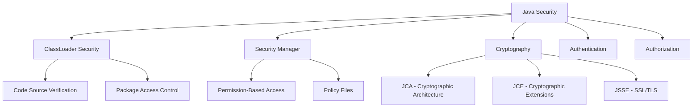

# Java Security

> Security Manager, JCE, SSL/TLS, authentication, and authorization patterns.

## Security Model Overview



## Security Manager (Deprecated in Java 17)

```java
// Custom security policy
System.setSecurityManager(new SecurityManager());

// Check permissions
SecurityManager sm = System.getSecurityManager();
if (sm != null) {
    sm.checkRead(filePath);
    sm.checkWrite(filePath);
    sm.checkConnect(host, port);
}

// Custom permission
public class MyPermission extends BasicPermission {
    public MyPermission(String name) {
        super(name);
    }
    
    @Override
    public boolean implies(Permission p) {
        return p instanceof MyPermission && 
               getName().equals(p.getName());
    }
}
```

### Policy File

```
// java.policy
grant codeBase "file:${app.home}/lib/-" {
    permission java.io.FilePermission "${app.home}/data/-", "read,write";
    permission java.net.SocketPermission "localhost:8080", "connect,resolve";
    permission java.lang.RuntimePermission "modifyThreadGroup";
};
```

## Cryptography (JCA/JCE)

### Message Digest (Hashing)

```java
// SHA-256 hashing
MessageDigest digest = MessageDigest.getInstance("SHA-256");
byte[] hash = digest.digest(data.getBytes(StandardCharsets.UTF_8));

// Hex encoding
String hex = HexFormat.of().formatHex(hash);

// Password hashing with salt
byte[] salt = new byte[16];
SecureRandom.getInstanceStrong().nextBytes(salt);

MessageDigest md = MessageDigest.getInstance("SHA-256");
md.update(salt);
byte[] passwordHash = md.digest(password.getBytes(StandardCharsets.UTF_8));
```

### Symmetric Encryption (AES)

```java
// AES-GCM encryption
KeyGenerator keyGen = KeyGenerator.getInstance("AES");
keyGen.init(256);
SecretKey key = keyGen.generateKey();

Cipher cipher = Cipher.getInstance("AES/GCM/NoPadding");
byte[] iv = new byte[12];
SecureRandom.getInstanceStrong().nextBytes(iv);
GCMParameterSpec gcmSpec = new GCMParameterSpec(128, iv);

cipher.init(Cipher.ENCRYPT_MODE, key, gcmSpec);
byte[] encrypted = cipher.doFinal(plaintext.getBytes(StandardCharsets.UTF_8));

// Decryption
cipher.init(Cipher.DECRYPT_MODE, key, gcmSpec);
byte[] decrypted = cipher.doFinal(encrypted);
String plaintext = new String(decrypted, StandardCharsets.UTF_8);
```

### Asymmetric Encryption (RSA)

```java
// Key pair generation
KeyPairGenerator keyGen = KeyPairGenerator.getInstance("RSA");
keyGen.initialize(2048);
KeyPair keyPair = keyGen.generateKeyPair();

// Encrypt with public key
Cipher cipher = Cipher.getInstance("RSA/ECB/OAEPWithSHA-256AndMGF1Padding");
cipher.init(Cipher.ENCRYPT_MODE, keyPair.getPublic());
byte[] encrypted = cipher.doFinal(data.getBytes(StandardCharsets.UTF_8));

// Decrypt with private key
cipher.init(Cipher.DECRYPT_MODE, keyPair.getPrivate());
byte[] decrypted = cipher.doFinal(encrypted);
```

## SSL/TLS Configuration

### Creating Truststore

```bash
# Generate self-signed certificate
keytool -genkeypair -alias server -keyalg RSA -keysize 2048 \
    -keystore keystore.jks -validity 365

# Export certificate
keytool -exportcert -alias server -keystore keystore.jks -file server.cer

# Import to truststore
keytool -importcert -alias server -file server.cer -keystore truststore.jks
```

### JVM SSL Properties

```bash
# Truststore
-Djavax.net.ssl.trustStore=/path/to/truststore.jks
-Djavax.net.ssl.trustStorePassword=changeit

# Keystore
-Djavax.net.ssl.keyStore=/path/to/keystore.jks
-Djavax.net.ssl.keyStorePassword=changeit

# Protocol version
-Dhttps.protocols=TLSv1.2,TLSv1.3
-Djdk.tls.client.protocols=TLSv1.3
```

### SSL in Code

```java
// Load keystore
KeyStore ks = KeyStore.getInstance("JKS");
try (InputStream is = new FileInputStream("keystore.jks")) {
    ks.load(is, "changeit".toCharArray());
}

// Create SSL context
KeyManagerFactory kmf = KeyManagerFactory.getInstance("SunX509");
kmf.init(ks, "changeit".toCharArray());

SSLContext sslContext = SSLContext.getInstance("TLS");
sslContext.init(kmf.getKeyManagers(), null, new SecureRandom());

// HTTPS connection
HttpsURLConnection conn = (HttpsURLConnection) url.openConnection();
conn.setSSLSocketFactory(sslContext.getSocketFactory());
```

## Authentication Patterns

### JWT Validation

```java
// Validate JWT token
public Claims validateToken(String token) {
    return Jwts.parser()
        .setSigningKey(secretKey.getBytes(StandardCharsets.UTF_8))
        .build()
        .parseSignedClaims(token)
        .getPayload();
}

// Token generation
public String generateToken(String userId, List<String> roles) {
    return Jwts.builder()
        .subject(userId)
        .claim("roles", roles)
        .issuedAt(new Date())
        .expiration(new Date(System.currentTimeMillis() + 3600000))
        .signWith(key)
        .compact();
}
```

### OAuth2 Setup

```java
// Spring Security OAuth2
@Configuration
@EnableWebSecurity
public class SecurityConfig {
    
    @Bean
    public SecurityFilterChain filterChain(HttpSecurity http) throws Exception {
        http
            .oauth2ResourceServer(oauth2 -> 
                oauth2.jwt(jwt -> 
                    jwt.jwkSetUri("https://auth.example.com/.well-known/jwks.json")
                )
            )
            .authorizeHttpRequests(auth -> auth
                .requestMatchers("/public/**").permitAll()
                .requestMatchers("/admin/**").hasRole("ADMIN")
                .anyRequest().authenticated()
            );
        return http.build();
    }
}
```

## Authorization Patterns

### Role-Based Access Control

```java
// Annotation-based
@PreAuthorize("hasRole('ADMIN')")
public void deleteUser(Long id) { /* ... */ }

@PreAuthorize("hasRole('USER') or hasRole('ADMIN')")
public List<Order> getOrders() { /* ... */ }

@PreAuthorize("#userId == authentication.principal.id")
public Order getOrder(Long userId, Long orderId) { /* ... */ }
```

### Method-Level Security

```java
// Custom permission evaluator
@Component
public class CustomPermissionEvaluator implements PermissionEvaluator {
    
    @Override
    public boolean hasPermission(Authentication auth, Object target, Object permission) {
        if (!(target instanceof Securable securable)) return false;
        return securable.isAccessibleBy(auth.getName(), (String) permission);
    }
    
    @Override
    public boolean hasPermission(Authentication auth, Serializable id, 
            String targetType, Object permission) {
        return hasPermission(auth, loadEntity(targetType, id), permission);
    }
}
```

## Secure Coding Practices

```java
// Input validation
public void processInput(String input) {
    if (input == null || input.isBlank()) {
        throw new IllegalArgumentException("Input required");
    }
    // Sanitize
    String clean = input.replaceAll("[^a-zA-Z0-9 ]", "");
}

// Secure random
SecureRandom random = SecureRandom.getInstanceStrong();
int token = random.nextInt(1000000);

// Prevent timing attacks
boolean safeEquals(String a, String b) {
    return MessageDigest.isEqual(a.getBytes(), b.getBytes());
}

// SQL injection prevention
PreparedStatement stmt = conn.prepareStatement(
    "SELECT * FROM users WHERE id = ?");
stmt.setLong(1, userId);
```

## References

- [Java Cryptography Architecture](https://docs.oracle.com/javase/8/docs/technotes/guides/security/crypto/CryptoSpec.html)
- [Java Secure Socket Extension](https://docs.oracle.com/javase/8/docs/technotes/guides/security/jsse/JSSERefGuide.html)
- [OWASP Java Security](https://owasp.org/www-project-java-security-project/)

---
**Prerequisites:** [Java core-concepts](core-concepts.md)
**Related:** [Java production](production.md) | [Java configuration](configuration.md)
**Next:** [Java monitoring](monitoring.md)
