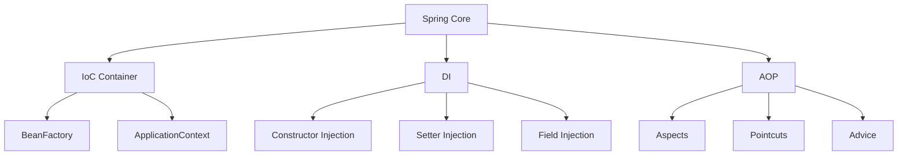
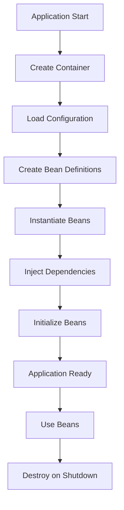
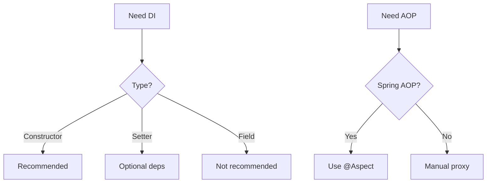

# Module 33: Spring Core

## Overview
Spring Core is the foundation of the Spring Framework, providing Inversion of Control (IoC) and Dependency Injection (DI) containers. It manages object creation, configuration, and lifecycle management through beans.

## Learning Objectives
- Understand IoC and DI concepts
- Master Spring bean configuration
- Use annotations for dependency injection
- Understand bean lifecycle
- Apply AOP basics

## Prerequisites
- Core Java knowledge
- OOP concepts
- Basic design patterns

## Why This Concept Exists
Tight coupling leads to:
- Hard to test code
- Difficult to change implementations
- Complex dependencies
- Poor maintainability

Spring Core provides:
- Loose coupling
- Testability
- Configuration management
- Cross-cutting concerns

## Problem Statement
How do you manage object dependencies and configuration in a flexible, testable way?

## Theory

### IoC Concepts

| Concept | Description |
|---------|-------------|
| IoC | Inversion of Control |
| DI | Dependency Injection |
| Bean | Spring-managed object |
| Container | Bean factory |
| Configuration | Bean definitions |

### DI Types

| Type | Mechanism |
|------|-----------|
| Constructor | Via constructor |
| Setter | Via setter method |
| Field | Via reflection |

### Bean Scopes

| Scope | Description |
|-------|-------------|
| Singleton | One instance per container |
| Prototype | New instance each request |
| Request | Per HTTP request |
| Session | Per HTTP session |

## Internal Working

### Bean Creation Process
1. Read configuration
2. Create bean definitions
3. Instantiate beans
4. Inject dependencies
5. Initialize beans
6. Ready for use

### ApplicationContext Hierarchy
```
ApplicationContext
  ├─ BeanFactory
  ├─ Environment
  ├─ MessageSource
  ├─ ApplicationEventPublisher
  └─ ResourcePatternResolver
```

## JVM Perspective

### Bean Proxy
- CGLIB proxies for AOP
- JDK dynamic proxies for interfaces
- Bytecode manipulation
- Class loading

### Memory Management
- Singleton beans cached
- Prototype beans garbage collected
- Context manages lifecycle

## Memory Representation
```
ApplicationContext:
┌─────────────────────────────────────┐
│ Bean Definitions                     │
│  ├─ Class name                       │
│  ├─ Scope                           │
│  ├─ Dependencies                    │
│  └─ Init/Destroy methods            │
├─────────────────────────────────────┤
│ Singleton Cache                      │
│  ├─ Bean name → Instance            │
│  └─ Proxy instances                 │
└─────────────────────────────────────┘
```

## Architecture Diagram



## Flow Diagram



## Syntax

### Configuration
```java
// Java Configuration
@Configuration
public class AppConfig {
    @Bean
    public UserService userService() {
        return new UserService(userRepository());
    }
    
    @Bean
    public UserRepository userRepository() {
        return new UserRepository();
    }
}

// Component Scanning
@SpringBootApplication
public class Application {
    public static void main(String[] args) {
        SpringApplication.run(Application.class, args);
    }
}
```

### Dependency Injection
```java
// Constructor Injection (Recommended)
@Service
public class UserService {
    private final UserRepository repository;
    
    @Autowired
    public UserService(UserRepository repository) {
        this.repository = repository;
    }
}

// Setter Injection
@Service
public class UserService {
    private UserRepository repository;
    
    @Autowired
    public void setRepository(UserRepository repository) {
        this.repository = repository;
    }
}

// Field Injection (Not Recommended)
@Service
public class UserService {
    @Autowired
    private UserRepository repository;
}
```

### Bean Configuration
```java
// Stereotype Annotations
@Component
@Service
@Repository
@Controller
@RestController

// Bean Scope
@Component
@Scope("prototype")
public class PrototypeBean {}

// Init/Destroy
@Component
public class MyBean {
    @PostConstruct
    public void init() {
        // Initialization
    }
    
    @PreDestroy
    public void cleanup() {
        // Cleanup
    }
}
```

## Easy Example
```java
import org.springframework.context.annotation.*;
import org.springframework.stereotype.*;

// Simple bean
@Component
public class GreetingService {
    public String greet(String name) {
        return "Hello, " + name + "!";
    }
}

// Configuration
@Configuration
@ComponentScan
public class AppConfig {
    @Bean
    public GreetingService greetingService() {
        return new GreetingService();
    }
}

// Main class
public class Main {
    public static void main(String[] args) {
        AnnotationConfigApplicationContext context = 
            new AnnotationConfigApplicationContext(AppConfig.class);
        
        GreetingService service = context.getBean(GreetingService.class);
        System.out.println(service.greet("World"));
        
        context.close();
    }
}
```

## Medium Example
```java
import org.springframework.context.annotation.*;
import org.springframework.stereotype.*;

// Repository
@Repository
public class UserRepository {
    public User findById(Long id) {
        return new User(id, "John");
    }
}

// Service with dependency
@Service
public class UserService {
    private final UserRepository repository;
    
    @Autowired
    public UserService(UserRepository repository) {
        this.repository = repository;
    }
    
    public User getUser(Long id) {
        return repository.findById(id);
    }
}

// Controller
@RestController
@RequestMapping("/users")
public class UserController {
    private final UserService userService;
    
    @Autowired
    public UserController(UserService userService) {
        this.userService = userService;
    }
    
    @GetMapping("/{id}")
    public User getUser(@PathVariable Long id) {
        return userService.getUser(id);
    }
}
```

## Hard Example
```java
import org.springframework.context.annotation.*;
import org.springframework.stereotype.*;
import javax.annotation.PostConstruct;
import javax.annotation.PreDestroy;

// Custom scope
@Component
@Scope("request")
public class RequestScopedBean {
    private String requestId;
    
    @PostConstruct
    public void init() {
        this.requestId = UUID.randomUUID().toString();
        System.out.println("Created: " + requestId);
    }
    
    @PreDestroy
    public void cleanup() {
        System.out.println("Destroyed: " + requestId);
    }
}

// Conditional bean
@Configuration
public class ConditionalConfig {
    @Bean
    @ConditionalOnProperty(name = "feature.enabled", havingValue = "true")
    public FeatureService featureService() {
        return new FeatureService();
    }
    
    @Bean
    @ConditionalOnMissingBean
    public DefaultService defaultService() {
        return new DefaultService();
    }
}
```

## Enterprise Example
```java
import org.springframework.context.annotation.*;
import org.springframework.stereotype.*;
import org.springframework.scheduling.annotation.*;

// Async service
@Service
public class AsyncService {
    @Async
    public CompletableFuture<String> processAsync() {
        // Long running operation
        return CompletableFuture.completedFuture("Done");
    }
}

// Scheduled service
@Component
public class ScheduledTasks {
    @Scheduled(fixedRate = 5000)
    public void reportCurrentTime() {
        System.out.println("Time: " + LocalDateTime.now());
    }
}

// Event handling
@Component
public class ApplicationEventListener {
    @EventListener
    public void handleContextRefresh(ContextRefreshedEvent event) {
        System.out.println("Context refreshed");
    }
}
```

## Performance Considerations
- Singleton beans are fastest
- Prototype beans have creation overhead
- Lazy initialization reduces startup time
- Caching improves performance

## Time & Space Complexity
| Operation | Time | Space |
|-----------|------|-------|
| Bean creation | O(1) | O(1) |
| DI resolution | O(n) | O(1) |
| AOP proxy | O(1) | O(1) |
| Context startup | O(beans) | O(beans) |

## Thread Safety
- Singleton beans must be thread-safe
- Prototype beans are thread-safe
- Request/Session scoped are thread-local
- Use synchronization if needed

## Best Practices
1. Use constructor injection
2. Keep beans focused
3. Use profiles for environments
4. Prefer @Configuration over XML
5. Use @Qualifier for multiple beans

## Common Mistakes
1. Using field injection
2. Circular dependencies
3. Overusing singleton scope
4. Not handling exceptions

## Pitfalls & Warnings
1. N+1 select problem
2. Transaction boundaries
3. Proxy issues
4. Class loading issues

## Debugging Tips
1. Use BeanPostProcessor
2. Log bean creation
3. Check bean definitions
4. Use Actuator endpoints

## Comparison Table

| Feature | Spring | Guice | Dagger |
|---------|--------|-------|--------|
| DI Type | Runtime | Runtime | Compile-time |
| AOP | Yes | Limited | No |
| Configuration | Java/XML | Java | Annotations |
| Performance | Good | Good | Best |

## Decision Tree



## Interview Questions

### Q1: What is IoC?
**Answer:** Inversion of Control - framework manages object creation and lifecycle.

### Q2: What is Dependency Injection?
**Answer:** Providing dependencies from outside rather than creating them internally.

### Q3: What are the types of DI?
**Answer:** Constructor, setter, and field injection.

### Q4: Why is constructor injection preferred?
**Answer:** Immutable dependencies, testable, required dependencies clear.

### Q5: What is a Spring Bean?
**Answer:** An object managed by Spring IoC container.

### Q6: What are bean scopes?
**Answer:** Singleton, prototype, request, session, application.

### Q7: What is @Component?
**Answer:** Stereotype annotation marking a class as Spring-managed bean.

### Q8: What is @Configuration?
**Answer:** Class containing bean definitions and configuration.

### Q9: What is @Bean?
**Answer:** Method-level annotation defining a bean.

### Q10: What is @Autowired?
**Answer:** Annotation for automatic dependency injection.

### Q11: What is the bean lifecycle?
**Answer:** Creation → Dependency Injection → Initialization → Use → Destruction.

### Q12: What is @PostConstruct?
**Answer:** Callback annotation after dependency injection.

### Q13: What is @PreDestroy?
**Answer:** Callback annotation before bean destruction.

### Q14: What is AOP?
**Answer:** Aspect-Oriented Programming for cross-cutting concerns.

### Q15: What is the difference between @Component and @Service?
**Answer:** @Service is a specialization of @Component for service layer.

## Exercises

### Easy
1. Create a simple Spring application
2. Inject dependencies with constructor
3. Use @Component annotation

### Medium
1. Implement custom bean scope
2. Use @Conditional annotations
3. Create event listeners

### Hard
1. Implement custom AOP aspect
2. Create Spring Boot starter
3. Build microservice with Spring

## Summary
Spring Core provides the foundation for dependency injection and IoC in Java applications.

## References
- Spring Framework Documentation
- Spring Core Guide
- Baeldung Spring Tutorial
