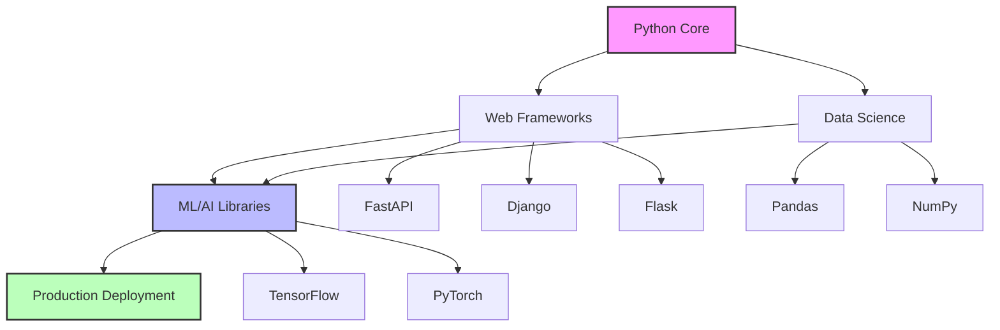
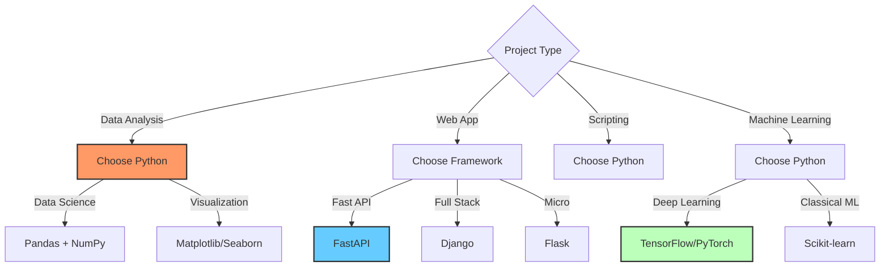

# Python Fundamentals

## Overview
Python is a high-level, interpreted language known for readability and versatility. Used in web, data science, AI.

## Topics
- Variables and Types
- Control Flow
- Functions
- Lists and Tuples
- Dictionaries and Sets
- Classes and Objects
- Exception Handling
- File I/O
- Modules and Packages
- Virtual Environments

## Learning Objectives
- Write Pythonic code
- Use Python's rich standard library
- Create reusable modules

## Prerequisites
- Basic programming knowledge

## Architecture

## When to Use

