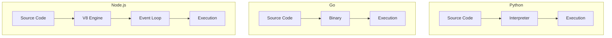

# Comparison: Python vs Go vs Node.js

## Overview
This comparison helps you choose the right language for web development and scripting.

## Feature Matrix

| Feature | Python | Go | Node.js |
|---------|--------|-----|---------|
| **Performance** | Slow | Fast | Fast |
| **Learning Curve** | Very Easy | Easy | Easy |
| **Concurrency** | GIL Limited | Excellent | Event Loop |
| **Type System** | Dynamic | Static | Dynamic |
| **Package Manager** | pip/poetry | Go Modules | npm |
| **Runtime** | CPython | Compiled | V8 |
| **Use Cases** | Data Science, Scripting | Cloud, APIs | Web, Real-time |
| **Community** | Very Large | Large | Large |
| **Ecosystem** | Very Rich | Growing | Rich |
| **IDE Support** | Excellent | Good | Good |

## Performance Comparison

| Metric | Python | Go | Node.js |
|--------|--------|-----|---------|
| **Execution Speed** | Slow | Fast | Fast |
| **Memory Usage** | Medium | Low-Medium | Medium |
| **Startup Time** | Fast | Fast | Fast |
| **Throughput** | Low | High | Medium-High |
| **Concurrency** | Limited | Excellent | Good |

## Architecture Comparison

## Use Case Matrix

| Use Case | Python | Go | Node.js |
|----------|--------|-----|---------|
| **Web APIs** | Excellent | Excellent | Excellent |
| **Real-time Apps** | Poor | Excellent | Excellent |
| **Data Science** | Excellent | Poor | Poor |
| **Machine Learning** | Excellent | Poor | Poor |
| **CLI Tools** | Good | Excellent | Good |
| **Microservices** | Good | Excellent | Good |
| **Prototyping** | Excellent | Good | Excellent |
| **DevOps Scripts** | Excellent | Excellent | Good |
| **Streaming** | Poor | Good | Excellent |
| **IoT** | Good | Excellent | Poor |

## Concurrency Models

## Operational Comparison

| Factor | Python | Go | Node.js |
|--------|--------|-----|---------|
| **Setup** | Easy | Easy | Easy |
| **Deployment** | Moderate | Easy | Easy |
| **Monitoring** | Good | Good | Good |
| **Debugging** | Excellent | Good | Good |
| **Testing** | Excellent | Good | Good |
| **Documentation** | Excellent | Good | Good |
| **Community** | Largest | Large | Large |
| **Learning Resources** | Most | Good | Good |

## Cost Comparison

| Cost Factor | Python | Go | Node.js |
|-------------|--------|-----|---------|
| **Development Speed** | Fast | Fast | Fast |
| **Runtime Cost** | High | Low | Medium |
| **Operational Cost** | High | Low | Medium |
| **Hiring Cost** | Low | Moderate | Low |
| **Total Cost** | Medium | Low-Medium | Medium |

## Ecosystem Comparison

| Library Type | Python | Go | Node.js |
|--------------|--------|-----|---------|
| **Web Framework** | Django, Flask, FastAPI | Gin, Echo, Fiber | Express, Fastify, NestJS |
| **ORM** | SQLAlchemy, Django ORM | GORM, Ent | Prisma, TypeORM, Sequelize |
| **Testing** | pytest, unittest | testing, testify | Jest, Mocha, Vitest |
| **HTTP Client** | requests, httpx | net/http | axios, node-fetch |
| **JSON** | json | encoding/json | built-in |
| **CLI** | click, argparse | cobra, urfave/cli | commander, yargs |
| **Async** | asyncio, Celery | goroutines | async/await, Promises |

## Migration Effort

| Migration | Python | Go | Node.js |
|-----------|--------|-----|---------|
| **From Python** | Native | Moderate | Moderate |
| **From Go** | Moderate | Native | Moderate |
| **From Node.js** | Moderate | Moderate | Native |

## When to Choose Each

### Choose Python When:
- Data science or ML/AI work
- Rapid prototyping needed
- Scripting and automation
- Web development with Django/Flask
- Team prefers simplicity

### Choose Go When:
- Cloud-native microservices
- High concurrency required
- Need fast startup and low memory
- DevOps tooling and CLI
- Simple deployment needed

### Choose Node.js When:
- Real-time web applications
- Streaming and chat apps
- Full-stack JavaScript
- API development
- Fast prototyping needed

## Decision Matrix

| Priority | Python | Go | Node.js |
|----------|--------|-----|---------|
| **Performance** | Poor | Excellent | Good |
| **Productivity** | Excellent | Good | Excellent |
| **Ecosystem** | Excellent | Good | Good |
| **Community** | Largest | Large | Large |
| **Enterprise Support** | Good | Good | Good |
| **Learning Curve** | Easiest | Easy | Easy |
| **Real-time** | Poor | Excellent | Excellent |
| **Data Science** | Excellent | Poor | Poor |

## Summary

- **Python**: Best for data science, ML/AI, and rapid prototyping
- **Go**: Best for cloud-native, high-performance services
- **Node.js**: Best for real-time, full-stack JavaScript applications