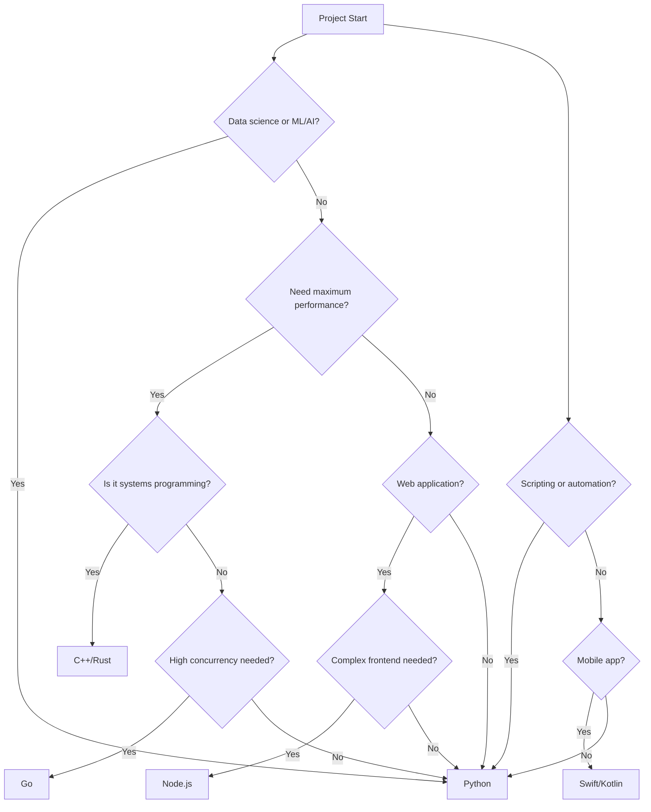
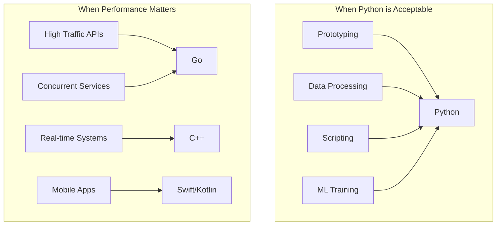

# Decision Tree: When to Use Python vs Others

## Overview
Python excels in many areas but has limitations. Use this guide to decide when Python is the right choice.

## Decision Flow

## Strengths and Weaknesses

### Python Strengths
- Rapid development and prototyping
- Extensive scientific computing libraries (NumPy, Pandas, TensorFlow)
- Excellent for data analysis and visualization
- Strong community and documentation
- Easy to learn and read

### Python Weaknesses
- Slower execution speed
- Global Interpreter Lock (GIL) limits true parallelism
- Higher memory consumption
- Mobile development not primary focus
- Packaging and deployment can be complex

## Alternative Language Comparison

| Criteria | Python | Go | Node.js | Java |
|----------|--------|-----|---------|------|
| Performance | Slow | Fast | Fast | Fast |
| Learning Curve | Very Easy | Easy | Easy | Moderate |
| Concurrency | GIL Limited | Excellent | Event Loop | Good |
| Ecosystem | Very Rich | Growing | Rich | Very Rich |
| Package Management | pip/poetry | go modules | npm | maven/gradle |
| IDE Support | Excellent | Good | Good | Excellent |
| Type System | Dynamic | Static | Dynamic | Static |
| Community Size | Very Large | Growing | Large | Very Large |

## Use Case Scenarios

### When Python is Perfect:
- Data analysis and visualization
- Machine learning model development
- Scientific computing and research
- Web APIs with Django/Flask/FastAPI
- Automation scripts and tooling
- Education and learning programming

### When to Choose Alternatives:
- High-performance web services: Consider Go or Node.js
- Mobile apps: Consider Swift (iOS) or Kotlin (Android)
- Real-time systems: Consider C++ or Rust
- Large enterprise systems: Consider Java or C#
- Systems programming: Consider Rust or C++

## Performance Considerations

## Library Ecosystem

| Domain | Python Libraries | Alternative |
|--------|------------------|-------------|
| Web Framework | Django, Flask, FastAPI | Express.js, Gin, Spring |
| Data Science | Pandas, NumPy, SciPy | R, Julia |
| Machine Learning | TensorFlow, PyTorch, Scikit-learn | TensorFlow (other languages) |
| Async Programming | asyncio, Celery | Node.js event loop |
| Database ORM | SQLAlchemy, Django ORM | Various |

## Migration Considerations

- To Go: Rewrite performance-critical services
- To Node.js: Share JSON handling, similar async model
- To Java: For enterprise integration and performance
- To Rust: For safety and performance in systems code

## Decision Checklist

Use Python if you check 3 or more:
- [ ] Need rapid development
- [ ] Working with data or ML
- [ ] Performance is not critical
- [ ] Small to medium project size
- [ ] Team knows Python well
- [ ] Prototyping phase