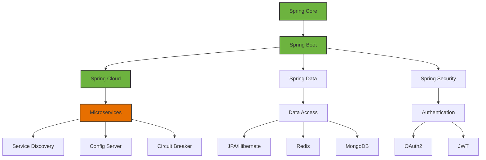
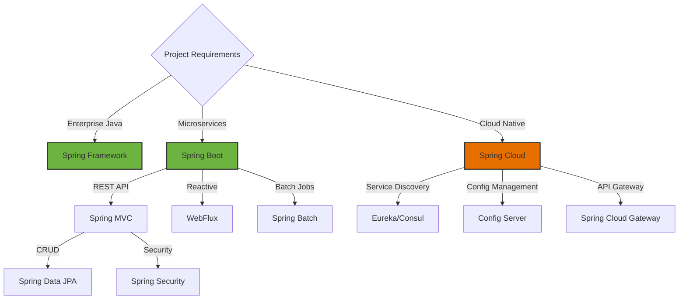

# Spring Ecosystem

## Overview
Spring is a comprehensive Java framework for building enterprise applications with dependency injection, AOP, and microservices support.

## Topics
- Spring Core (IoC, DI, AOP)
- Spring Boot (Auto-configuration, Starters)
- Spring Cloud (Microservices)
- Spring Data (JPA, Redis, MongoDB)
- Spring Security (Authentication, Authorization)
- Spring Batch (Job Processing)
- Spring Integration (Messaging)

## Learning Objectives
- Build enterprise Java applications
- Implement microservices architecture
- Configure Spring Boot applications
- Secure applications with Spring Security

## Prerequisites
- Java fundamentals
- Basic understanding of web development

## Architecture

## When to Use

