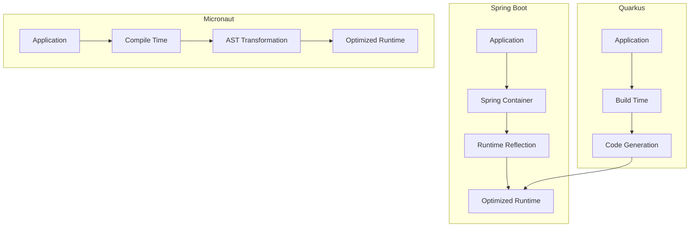

# Comparison: Spring vs Quarkus vs Micronaut

## Overview
This comparison helps you choose the right Java framework for your needs.

## Feature Matrix

| Feature | Spring Boot | Quarkus | Micronaut |
|---------|-------------|---------|-----------|
| **Startup Time** | Slow (2-5s) | Fast (<1s) | Fast (<1s) |
| **Memory Usage** | High (200-500MB) | Low (50-150MB) | Low (50-150MB) |
| **Compilation** | Runtime Reflection | Build-time Processing | Compile-time Processing |
| **GraalVM Support** | Good | Excellent | Excellent |
| **Learning Curve** | Moderate | Moderate | Moderate |
| **Ecosystem** | Excellent | Good | Good |
| **Community** | Largest | Growing | Growing |
| **Enterprise Support** | Excellent | Good | Good |
| **Cloud Native** | Good | Excellent | Excellent |
| **Kubernetes Ready** | Good | Excellent | Excellent |

## Performance Comparison

| Metric | Spring Boot | Quarkus | Micronaut |
|--------|-------------|---------|-----------|
| **Startup Time** | 2-5 seconds | <1 second | <1 second |
| **Memory Usage** | 200-500MB | 50-150MB | 50-150MB |
| **Throughput** | Good | Excellent | Excellent |
| **Response Time** | Good | Excellent | Excellent |
| **CPU Usage** | Moderate | Low | Low |
| **Native Image Size** | Large | Small | Small |

## Architecture Comparison

## Use Case Matrix

| Use Case | Spring Boot | Quarkus | Micronaut |
|----------|-------------|---------|-----------|
| **Enterprise Apps** | Excellent | Good | Good |
| **Microservices** | Excellent | Excellent | Excellent |
| **Serverless** | Good | Excellent | Excellent |
| **CLI Applications** | Good | Excellent | Excellent |
| **Web Applications** | Excellent | Good | Good |
| **REST APIs** | Excellent | Excellent | Excellent |
| **Reactive Applications** | Good | Excellent | Excellent |
| **GraalVM Native** | Good | Excellent | Excellent |
| **Kubernetes** | Good | Excellent | Excellent |
| **Legacy Integration** | Excellent | Good | Good |

## Ecosystem Comparison

| Library | Spring Boot | Quarkus | Micronaut |
|---------|-------------|---------|-----------|
| **Web** | Spring MVC | JAX-RS/RESTEasy | Micronaut HTTP |
| **Data** | Spring Data | Quarkus Hibernate | Micronaut Data |
| **Security** | Spring Security | Quarkus Security | Micronaut Security |
| **Cloud** | Spring Cloud | Quarkus SmallRye | Micronaut OCI/AWS |
| **Messaging** | Spring AMQP | Quarkus Reactive Messaging | Micronaut Messaging |
| **Testing** | Spring Test | Quarkus Test | Micronaut Test |

## Migration Effort

| Migration | Spring Boot | Quarkus | Micronaut |
|-----------|-------------|---------|-----------|
| **From Spring Boot** | Native | Moderate | Moderate |
| **From Quarkus** | Moderate | Native | Low |
| **From Micronaut** | Moderate | Low | Native |
| **From Jakarta EE** | High | Moderate | Moderate |

## Operational Comparison

| Factor | Spring Boot | Quarkus | Micronaut |
|--------|-------------|---------|-----------|
| **Setup** | Easy | Easy | Easy |
| **Configuration** | Excellent | Good | Good |
| **Monitoring** | Excellent | Good | Good |
| **Logging** | Excellent | Good | Good |
| **Debugging** | Excellent | Good | Good |
| **Documentation** | Excellent | Good | Good |
| **Community** | Largest | Growing | Growing |
| **Learning Resources** | Most | Good | Good |

## Cost Comparison

| Cost Factor | Spring Boot | Quarkus | Micronaut |
|-------------|-------------|---------|-----------|
| **Development** | Fast | Fast | Fast |
| **Infrastructure** | High | Low | Low |
| **Operational** | High | Low | Low |
| **Training** | Easy | Moderate | Moderate |
| **Total Cost** | High | Low-Moderate | Low-Moderate |

## GraalVM Native Image

| Aspect | Spring Boot | Quarkus | Micronaut |
|--------|-------------|---------|-----------|
| **Support** | Good | Excellent | Excellent |
| **Build Time** | Long | Short | Short |
| **Image Size** | Large | Small | Small |
| **Startup** | Fast | Very Fast | Very Fast |
| **Runtime** | Good | Excellent | Excellent |
| **Limitations** | Some reflection | Minimal | Minimal |

## When to Choose Each

### Choose Spring Boot When:
- Building enterprise applications
- Need extensive ecosystem
- Team has Spring expertise
- Want largest community
- Need mature, battle-tested solution
- Integrating with legacy systems

### Choose Quarkus When:
- Building cloud-native applications
- Need GraalVM native images
- Want fast startup and low memory
- Deploying to Kubernetes
- Need reactive programming
- Want build-time processing

### Choose Micronaut When:
- Building microservices
- Need GraalVM native images
- Want compile-time safety
- Deploying to serverless
- Need low memory footprint
- Want ahead-of-time compilation

## Decision Matrix

| Priority | Spring Boot | Quarkus | Micronaut |
|----------|-------------|---------|-----------|
| **Performance** | Good | Excellent | Excellent |
| **Ecosystem** | Excellent | Good | Good |
| **Ease of Use** | Excellent | Good | Good |
| **Cloud Native** | Good | Excellent | Excellent |
| **Enterprise** | Excellent | Good | Good |
| **Community** | Largest | Growing | Growing |
| **Future Proof** | Good | Excellent | Excellent |
| **Innovation** | Moderate | High | High |

## Migration Paths

### From Spring Boot to Quarkus:
- Replace Spring annotations with Quarkus equivalents
- Update configuration files
- Test native image compilation
- Update build scripts

### From Spring Boot to Micronaut:
- Replace Spring annotations with Micronaut equivalents
- Update dependency injection
- Test compile-time processing
- Update build configuration

## Summary

- **Spring Boot**: Best for enterprise and large-scale applications
- **Quarkus**: Best for cloud-native and GraalVM native images
- **Micronaut**: Best for microservices and compile-time safety