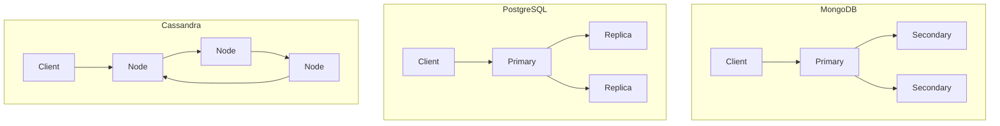
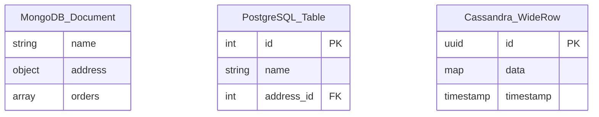

# Comparison: MongoDB vs PostgreSQL vs Cassandra

## Overview
This comparison helps you choose the right database for your needs.

## Feature Matrix

| Feature | MongoDB | PostgreSQL | Cassandra |
|---------|---------|------------|-----------|
| **Data Model** | Document | Relational | Wide Column |
| **Schema** | Flexible | Fixed | Flexible |
| **ACID Transactions** | Yes (4.0+) | Yes | Limited |
| **Joins** | Limited | Excellent | No |
| **Scaling** | Horizontal | Vertical (Citus for horizontal) | Horizontal |
| **Query Language** | MQL | SQL | CQL |
| **Full-Text Search** | Yes | Yes (TSVector) | Yes |
| **Geospatial** | Yes | Excellent (PostGIS) | Limited |
| **Time Series** | Good | Excellent (TimescaleDB) | Excellent |
| **Replication** | Yes | Yes | Yes |
| **Sharding** | Yes | Yes (Citus) | Yes |

## Performance Comparison

| Metric | MongoDB | PostgreSQL | Cassandra |
|--------|---------|------------|-----------|
| **Read Performance** | Very Good | Excellent | Good |
| **Write Performance** | Excellent | Good | Excellent |
| **Complex Queries** | Good | Excellent | Poor |
| **Aggregations** | Good | Excellent | Limited |
| **Full-Text Search** | Good | Good | Good |
| **Geospatial** | Good | Excellent | Poor |
| **Time Series** | Good | Excellent | Excellent |
| **High Throughput** | Good | Good | Excellent |

## Architecture Comparison

## Use Case Matrix

| Use Case | MongoDB | PostgreSQL | Cassandra |
|----------|---------|------------|-----------|
| **Content Management** | Excellent | Good | Poor |
| **E-commerce** | Good | Excellent | Poor |
| **IoT Data** | Good | Good | Excellent |
| **Real-time Analytics** | Good | Excellent | Excellent |
| **User Data** | Good | Excellent | Good |
| **Time Series** | Good | Excellent | Excellent |
| **Social Networks** | Good | Excellent | Excellent |
| **Catalog Data** | Excellent | Good | Good |
| **Session Storage** | Excellent | Good | Good |
| **Logging** | Good | Good | Excellent |

## Operational Comparison

| Factor | MongoDB | PostgreSQL | Cassandra |
|--------|---------|------------|-----------|
| **Setup** | Easy | Moderate | Moderate |
| **Monitoring** | Good | Excellent | Good |
| **Backup** | Good | Excellent | Good |
| **Scaling** | Easy | Moderate | Easy |
| **Upgrades** | Easy | Moderate | Moderate |
| **Documentation** | Good | Excellent | Good |
| **Community** | Large | Large | Large |
| **Managed Options** | Many | Many | Few |

## Cost Comparison

| Cost Factor | MongoDB | PostgreSQL | Cassandra |
|-------------|---------|------------|-----------|
| **License** | SSPL (MongoDB) | PostgreSQL License | Apache 2.0 |
| **Infrastructure** | Medium | Low-Medium | High |
| **Operational** | Medium | Low-Medium | High |
| **Managed Options** | Atlas (paid) | RDS (paid) | Keyspaces (paid) |
| **Total Cost** | Medium | Low-Medium | High |

## Migration Effort

| Migration | MongoDB | PostgreSQL | Cassandra |
|-----------|---------|------------|-----------|
| **From MongoDB** | Native | High effort | High effort |
| **From PostgreSQL** | High effort | Native | High effort |
| **From Cassandra** | High effort | High effort | Native |

## Schema Design Comparison

## When to Choose Each

### Choose MongoDB When:
- Data structure is evolving rapidly
- Building content management systems
- Need flexible schema design
- Working with JSON-heavy applications
- Rapid prototyping required

### Choose PostgreSQL When:
- Complex relationships between data
- Need strong ACID compliance
- Require advanced SQL features
- Working with structured, known schemas
- Need geospatial capabilities

### Choose Cassandra When:
- Need massive write throughput
- Time-series data at scale
- Multi-datacenter replication required
- Linear horizontal scaling needed
- High availability is critical

## Decision Matrix

| Priority | MongoDB | PostgreSQL | Cassandra |
|----------|---------|------------|-----------|
| **Flexibility** | Excellent | Good | Good |
| **Performance** | Good | Excellent | Excellent |
| **Scalability** | Excellent | Good | Excellent |
| **Ease of Use** | Good | Good | Moderate |
| **Ecosystem** | Excellent | Excellent | Good |
| **Community** | Large | Large | Large |
| **Enterprise Support** | Excellent | Excellent | Good |
| **Cost Efficiency** | Good | Excellent | Moderate |

## Summary

- **MongoDB**: Best for flexible schemas and rapid development
- **PostgreSQL**: Best for complex queries and data integrity
- **Cassandra**: Best for high write throughput and horizontal scaling