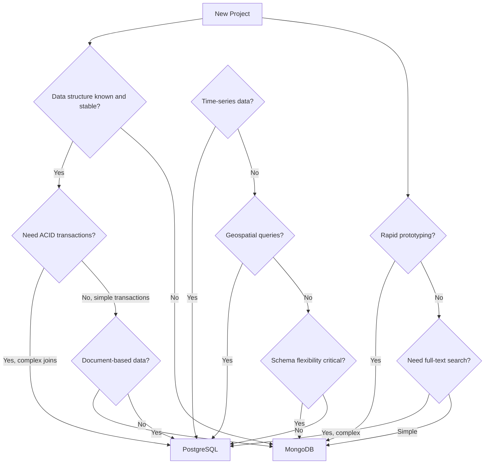
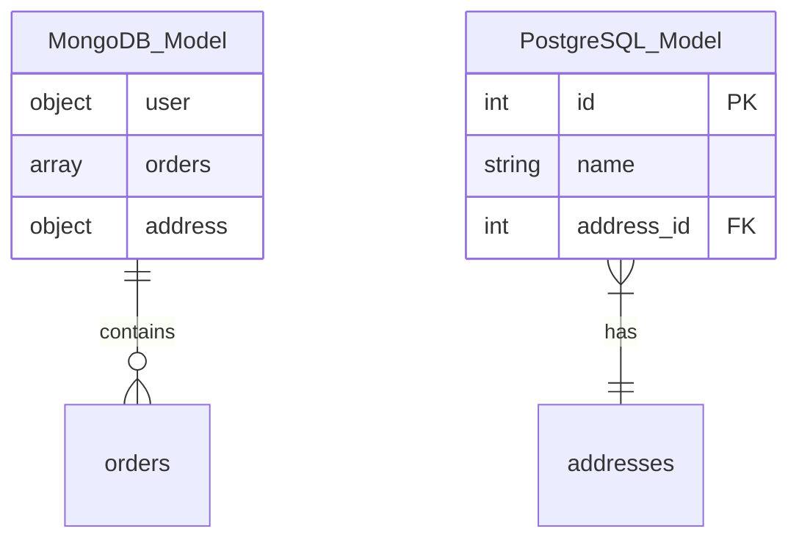
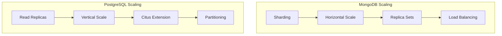

# Decision Tree: When to Use MongoDB vs PostgreSQL vs Others

## Overview
MongoDB and PostgreSQL serve different data modeling paradigms. This guide helps you choose the right database for your use case.

## Decision Flow

## Feature Comparison

| Feature | MongoDB | PostgreSQL | Cassandra | DynamoDB |
|---------|---------|------------|-----------|----------|
| Data Model | Document | Relational | Wide Column | Key-Value/Document |
| Schema | Flexible | Fixed | Flexible | Flexible |
| ACID Transactions | Yes (4.0+) | Yes | Limited | Limited |
| Joins | Limited (Lookup) | Excellent | No | No |
| Scaling | Horizontal | Vertical (Horizontal w/ Citus) | Horizontal | Horizontal |
| Query Language | MQL | SQL | CQL | PartiQL |
| Full-Text Search | Yes | Yes (TSVector) | Yes | Yes |
| Geospatial | Yes | Excellent | Limited | Yes |
| Time Series | Good | Excellent (TimescaleDB) | Excellent | Good |

## Use Case Recommendations

### Choose MongoDB When:
- Data structure is evolving rapidly
- Building content management systems
- Need flexible schema design
- Working with JSON-heavy applications
- Rapid prototyping required
- Horizontal scaling is primary concern
- Building real-time analytics

### Choose PostgreSQL When:
- Complex relationships between data
- Need strong ACID compliance
- Require advanced SQL features
- Working with structured, known schemas
- Need geospatial capabilities (PostGIS)
- Time-series data with complex queries
- Data integrity is critical

## Data Modeling Comparison

## Performance Characteristics

| Scenario | MongoDB | PostgreSQL |
|----------|---------|------------|
| Read-heavy | Very Good | Excellent |
| Write-heavy | Excellent | Good |
| Complex Queries | Good | Excellent |
| Aggregations | Good | Excellent |
| Full-Text Search | Good | Good |
| Geospatial | Good | Excellent |
| Time Series | Good | Excellent |

## Scaling Patterns

## Migration Considerations

### From MongoDB to PostgreSQL:
- Normalize document structure
- Define proper relationships
- Plan for schema migration
- Test query performance

### From PostgreSQL to MongoDB:
- Denormalize where appropriate
- Embed related data in documents
- Plan for eventual consistency
- Consider migration tools

## When to Consider Alternatives

### Consider Cassandra When:
- Need massive write throughput
- Time-series data at scale
- Multi-datacenter replication
- Linear horizontal scaling required

### Consider DynamoDB When:
- Fully managed service needed
- Predictable performance at any scale
- Serverless architecture
- Simple access patterns

## Decision Checklist

Choose MongoDB if you check 3 or more:
- [ ] Schema will evolve frequently
- [ ] Working with JSON documents
- [ ] Rapid prototyping phase
- [ ] Need horizontal scaling
- [ ] Building content management
- [ ] Developer velocity critical

Choose PostgreSQL if you check 3 or more:
- [ ] Complex data relationships
- [ ] Need ACID compliance
- [ ] Working with structured data
- [ ] Require advanced queries
- [ ] Data integrity critical
- [ ] Need geospatial support