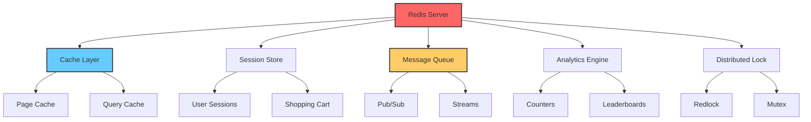
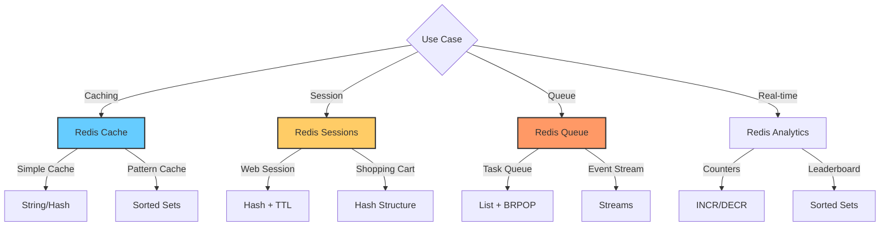

# Redis Fundamentals

## Overview
Redis is an open-source, in-memory data structure store used as database, cache, and message broker.

## Topics
- Data Structures (Strings, Lists, Sets, Hashes, Sorted Sets)
- Persistence
- Replication
- Pub/Sub
- Transactions
- Lua Scripting
- Cluster Mode
- Security
- Memory Management
- Use Cases

## Learning Objectives
- Use Redis as cache
- Implement pub/sub patterns
- Optimize memory usage

## Prerequisites
- Basic database concepts

## Architecture

## When to Use

