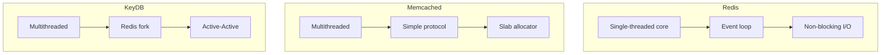

# Comparison: Redis vs Memcached vs KeyDB

## Overview
This comparison helps you choose the right in-memory data store for your needs.

## Feature Matrix

| Feature | Redis | Memcached | KeyDB |
|---------|-------|-----------|-------|
| **Data Structures** | Rich (5+ types) | Simple strings | Rich (Redis fork) |
| **Persistence** | Yes (RDB/AOF) | No | Yes |
| **Pub/Sub** | Yes | No | Yes |
| **Clustering** | Yes | Yes | Yes |
| **Lua Scripting** | Yes | No | Yes |
| **Transactions** | Yes | No | Yes |
| **Replication** | Yes | No | Yes (Active-Active) |
| **Multithreading** | Yes (6.0+) | Yes | Yes |
| **Modules** | Yes | No | Yes |
| **Memory Efficiency** | Good | Better | Better |

## Performance Comparison

| Metric | Redis | Memcached | KeyDB |
|--------|-------|-----------|-------|
| **Throughput** | High | Very High | Very High |
| **Latency** | Low | Very Low | Low |
| **Memory Usage** | Good | Better | Better |
| **CPU Usage** | Single-threaded core | Multithreaded | Multithreaded |
| **Connection Handling** | Good | Excellent | Good |

## Data Structure Support

| Structure | Redis | Memcached | KeyDB | Use Case |
|-----------|-------|-----------|-------|----------|
| **Strings** | Yes | Yes | Yes | Simple caching |
| **Lists** | Yes | No | Yes | Message queues |
| **Sets** | Yes | No | Yes | Tagging |
| **Sorted Sets** | Yes | No | Yes | Leaderboards |
| **Hashes** | Yes | No | Yes | Object storage |
| **HyperLogLog** | Yes | No | Yes | Cardinality |
| **Streams** | Yes | No | Yes | Event sourcing |
| **Bitmaps** | Yes | No | Yes | Analytics |

## Architecture Comparison

## Use Case Matrix

| Use Case | Redis | Memcached | KeyDB |
|----------|-------|-----------|-------|
| **Simple Caching** | Excellent | Excellent | Excellent |
| **Session Management** | Excellent | Good | Excellent |
| **Leaderboards** | Excellent | Poor | Excellent |
| **Message Queues** | Excellent | Poor | Excellent |
| **Real-time Analytics** | Excellent | Good | Excellent |
| **Distributed Locks** | Excellent | Poor | Excellent |
| **Geospatial** | Excellent | Poor | Excellent |
| **High-Throughput Cache** | Good | Excellent | Excellent |

## Operational Comparison

| Factor | Redis | Memcached | KeyDB |
|--------|-------|-----------|-------|
| **Setup** | Easy | Easy | Easy |
| **Monitoring** | Excellent | Good | Good |
| **Clustering** | Good | Good | Good |
| **Upgrades** | Easy | Easy | Easy (Redis compatible) |
| **Backup** | Excellent | N/A | Excellent |
| **Documentation** | Excellent | Good | Good |

## Cost Comparison

| Cost Factor | Redis | Memcached | KeyDB |
|-------------|-------|-----------|-------|
| **License** | BSD | BSD | BSD |
| **Infrastructure** | Medium | Low | Medium |
| **Memory Cost** | Higher | Lower | Lower |
| **Operational Cost** | Low | Low | Low |
| **Managed Options** | Many | Few | Few |

## Migration Effort

| Migration | Redis | Memcached | KeyDB |
|-----------|-------|-----------|-------|
| **From Redis** | Native | High effort | Very low effort |
| **From Memcached** | Medium effort | Native | Medium effort |
| **From KeyDB** | Very low effort | High effort | Native |

## When to Choose Each

### Choose Redis When:
- Need rich data structures
- Require data persistence
- Building real-time analytics
- Need pub/sub messaging
- Want largest ecosystem

### Choose Memcached When:
- Simple key-value caching only
- Maximum memory efficiency needed
- Multithreading is critical
- No persistence requirement
- Simple caching layer sufficient

### Choose KeyDB When:
- Want Redis compatibility with better performance
- Need native multithreading
- Want active-active replication
- Require better memory efficiency
- Need modern Redis fork

## Decision Matrix

| Priority | Redis | Memcached | KeyDB |
|----------|-------|-----------|-------|
| **Functionality** | Excellent | Limited | Excellent |
| **Performance** | Good | Excellent | Excellent |
| **Memory Efficiency** | Good | Excellent | Excellent |
| **Ease of Use** | Good | Good | Good |
| **Ecosystem** | Excellent | Good | Growing |
| **Community** | Largest | Large | Growing |
| **Enterprise Support** | Excellent | Good | Growing |
| **Cost Efficiency** | Good | Excellent | Good |

## Summary

- **Redis**: Best for rich functionality and ecosystem
- **Memcached**: Best for simple caching and memory efficiency
- **KeyDB**: Best for Redis compatibility with better performance