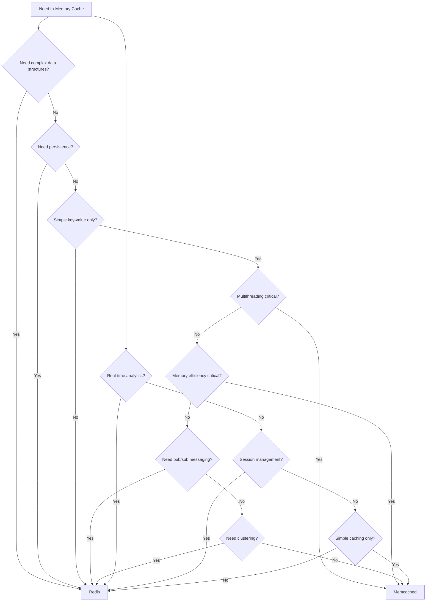
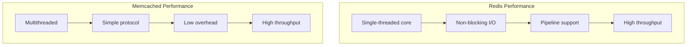
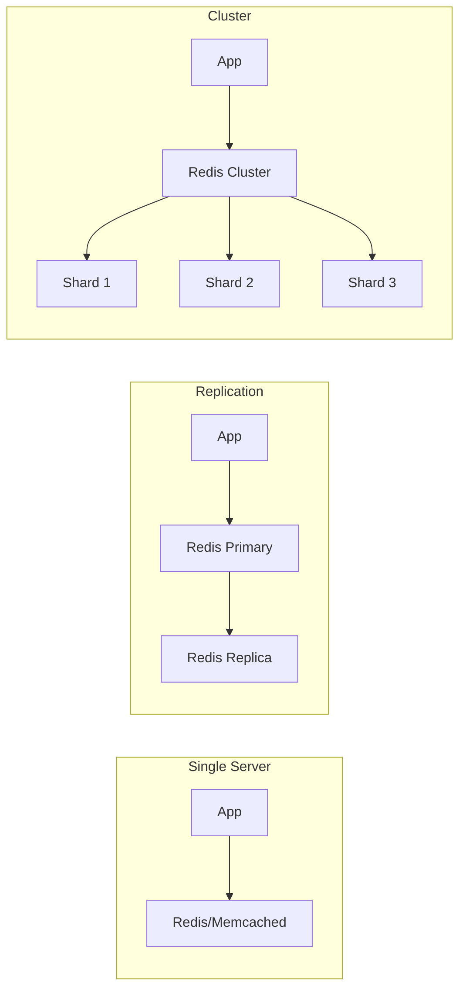

# Decision Tree: When to Use Redis vs Memcached vs Others

## Overview
Redis and Memcached are both in-memory data stores but serve different use cases. This guide helps you choose the right one.

## Decision Flow

## Feature Comparison

| Feature | Redis | Memcached | KeyDB | Dragonfly |
|---------|-------|-----------|-------|-----------|
| Data Structures | Rich (5+ types) | Simple strings only | Rich (Redis fork) | Rich (Redis fork) |
| Persistence | Yes (RDB/AOF) | No | Yes | Yes |
| Pub/Sub | Yes | No | Yes | Yes |
| Clustering | Yes | Yes | Yes | Yes |
| Lua Scripting | Yes | No | Yes | Yes |
| Transactions | Yes | No | Yes | Yes |
| Memory Efficiency | Good | Better for strings | Good | Excellent |
| Multithreading | Yes (6.0+) | Yes | Yes | Yes |
| Replication | Yes | No | Yes | Yes |

## Use Case Recommendations

### Choose Redis When:
- Need complex data structures (lists, sets, hashes, sorted sets)
- Require data persistence
- Building real-time analytics
- Need pub/sub messaging
- Implementing leaderboards or counters
- Session management with complex data
- Need Lua scripting for atomic operations

### Choose Memcached When:
- Simple key-value caching only
- Maximum memory efficiency needed
- Multithreading is critical
- No persistence requirement
- Simple caching layer is sufficient

## Performance Characteristics

## Data Structure Support

| Structure | Redis | Memcached | Use Case |
|-----------|-------|-----------|----------|
| Strings | Yes | Yes | Simple caching |
| Lists | Yes | No | Message queues, feeds |
| Sets | Yes | No | Tagging, membership |
| Sorted Sets | Yes | No | Leaderboards, priorities |
| Hashes | Yes | No | Object storage |
| HyperLogLog | Yes | No | Cardinality estimation |
| Streams | Yes | No | Event sourcing |

## Memory Usage Comparison

| Scenario | Redis | Memcached |
|----------|-------|-----------|
| String values (<1KB) | 1.5x overhead | 1.0x overhead |
| Small objects | Good | Better |
| Large objects | Good | Good |
| High cardinality | Good | Better |

## When to Consider Alternatives

### Consider KeyDB When:
- Need Redis compatibility with better performance
- Want native multithreading
- Need active-active replication
- Require better memory efficiency

### Consider Dragonfly When:
- Need extreme memory efficiency
- Want modern architecture
- Need better multithreading
- Require Redis compatibility

## Deployment Patterns

## Decision Checklist

Choose Redis if you check 3 or more:
- [ ] Need complex data structures
- [ ] Require data persistence
- [ ] Building real-time features
- [ ] Need pub/sub messaging
- [ ] Want rich functionality
- [ ] Need transactions

Choose Memcached if you check 3 or more:
- [ ] Simple key-value only
- [ ] Memory efficiency critical
- [ ] No persistence needed
- [ ] Multithreading important
- [ ] Simple caching use case
- [ ] Budget constraints