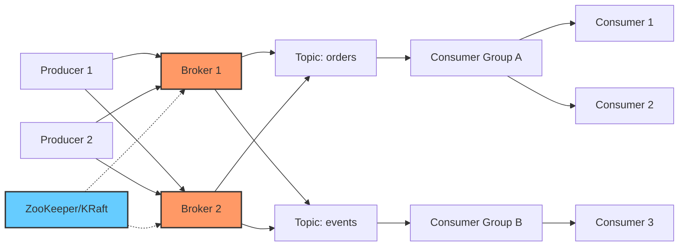
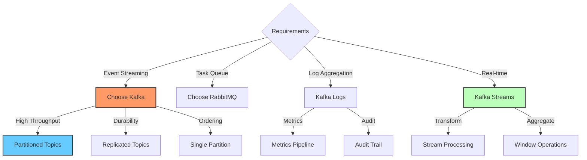

# Kafka Fundamentals

## Overview
Apache Kafka is a distributed event streaming platform for high-performance data pipelines.

## Topics
- Topics and Partitions
- Producers and Consumers
- Consumer Groups
- Offsets
- Replication
- Serialization
- Kafka Connect
- Kafka Streams
- Schema Registry
- Monitoring

## Learning Objectives
- Build event-driven systems
- Implement streaming pipelines
- Ensure data reliability

## Prerequisites
- Distributed systems basics

## Architecture

## When to Use

