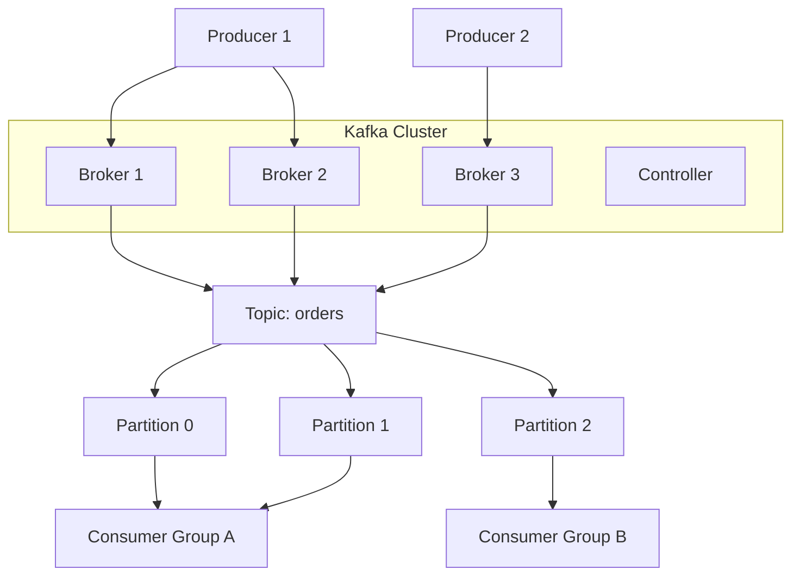
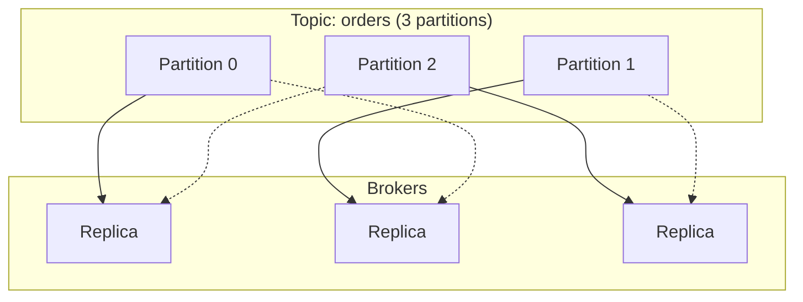
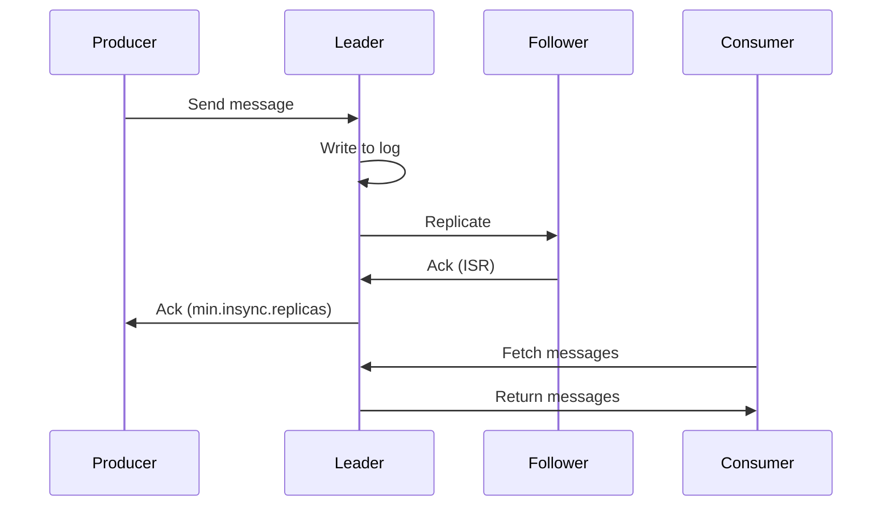
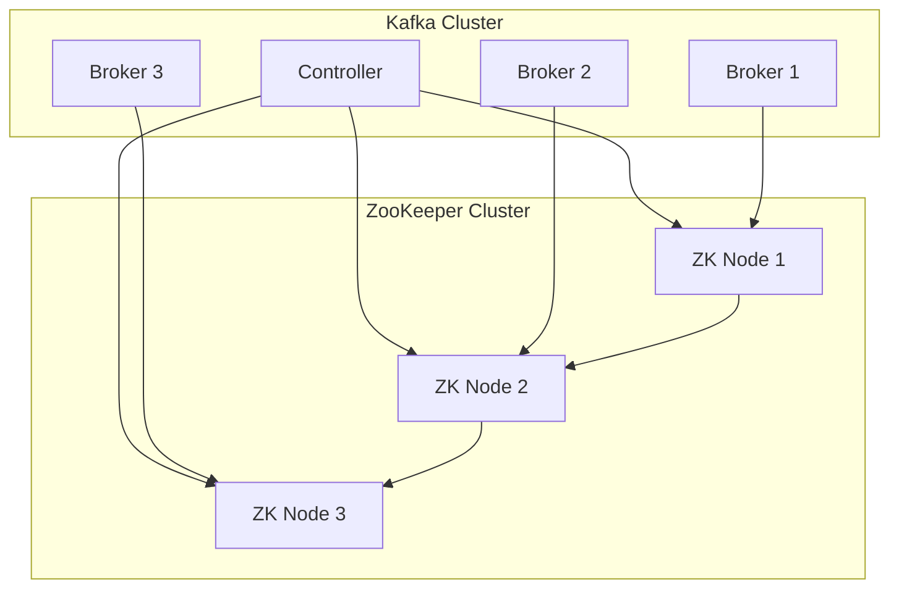
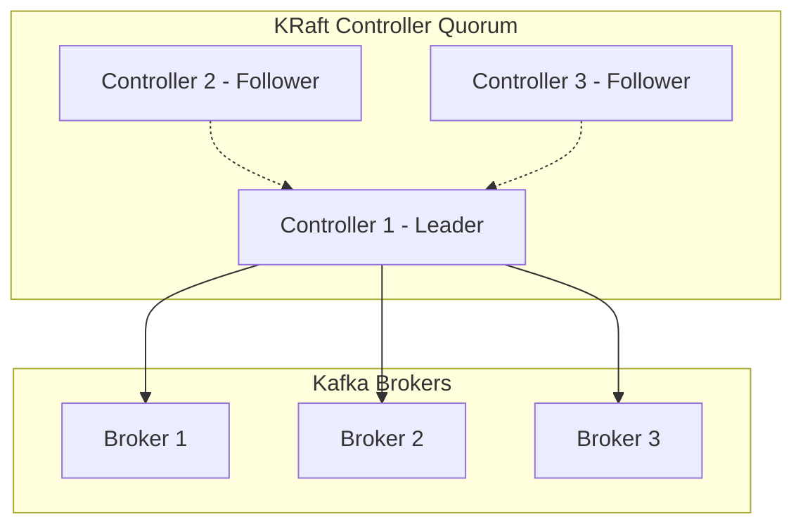
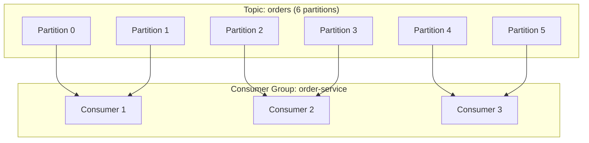
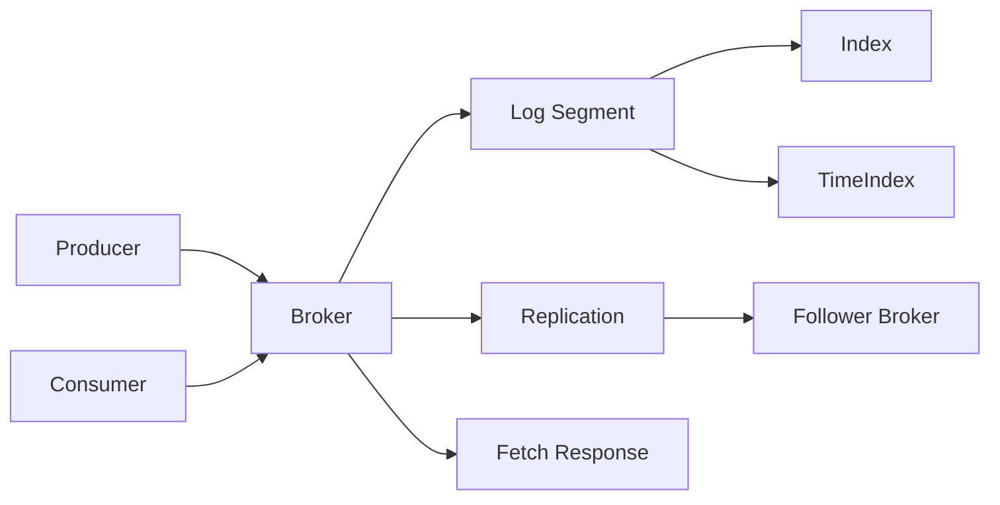

# Kafka Architecture

> Broker, partition, ISR, controller, ZooKeeper/KRaft, and consumer group architecture.

## Cluster Architecture



## Core Components

| Component | Description |
|-----------|-------------|
| Broker | Server storing and serving data |
| Topic | Logical category of messages |
| Partition | Ordered, immutable sequence of records |
| Offset | Unique ID for each record in partition |
| Replica | Copy of partition for fault tolerance |
| ISR | In-Sync Replicas - replicas caught up with leader |
| Controller | Broker managing partition leadership |
| ZooKeeper/KRaft | Cluster coordination service |

## Partition Distribution



## Replication Flow



## ZooKeeper Architecture (Legacy)



### ZooKeeper Responsibilities

| Responsibility | Description |
|----------------|-------------|
| Broker Registration | Track active brokers |
| Topic Metadata | Partition assignments, configs |
| Controller Election | Elect controller broker |
| ISR Management | Track in-sync replicas |
| ACL Management | Access control lists |

## KRaft Mode (Java 11+)



### KRaft vs ZooKeeper

| Feature | ZooKeeper | KRaft |
|---------|-----------|-------|
| External Service | Yes | No (built-in) |
| Metadata Storage | ZK + Kafka | Kafka only |
| Scalability | Limited by ZK | Scales to millions of partitions |
| Operations | More complex | Simpler |
| Default Since | Legacy | Kafka 3.3+ |

## Consumer Group Architecture



### Consumer Group Rules

1. Each partition consumed by exactly one consumer in group
2. Consumers within group share load across partitions
3. More consumers than partitions = idle consumers
4. Each consumer group has independent offset tracking

## Record Flow



## Log Structure

```
/kafka-logs/
├── orders-0/
│   ├── 00000000000000000000.log
│   ├── 00000000000000000000.index
│   ├── 00000000000000000000.timeindex
│   └── leader-epoch-checkpoint
├── orders-1/
│   └── ...
└── __consumer_offsets-0/
    └── ...
```

## References

- [Kafka Documentation](https://kafka.apache.org/documentation/)
- [Kafka Internals](https://kafka.apache.org/documentation/#internals)

---
**Prerequisites:** [Kafka core-concepts](core-concepts.md)
**Related:** [Kafka configuration](configuration.md) | [Kafka production](../../14-cloud/azure/production.md)
**Next:** [Kafka configuration](configuration.md)
