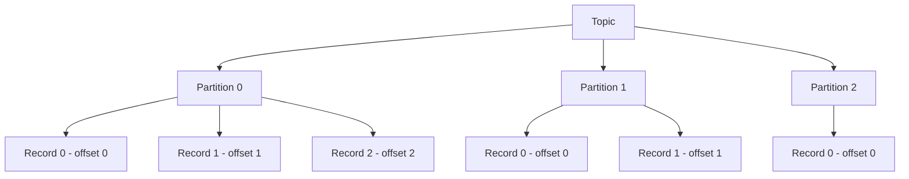
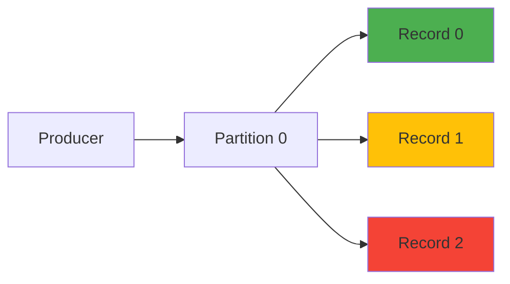
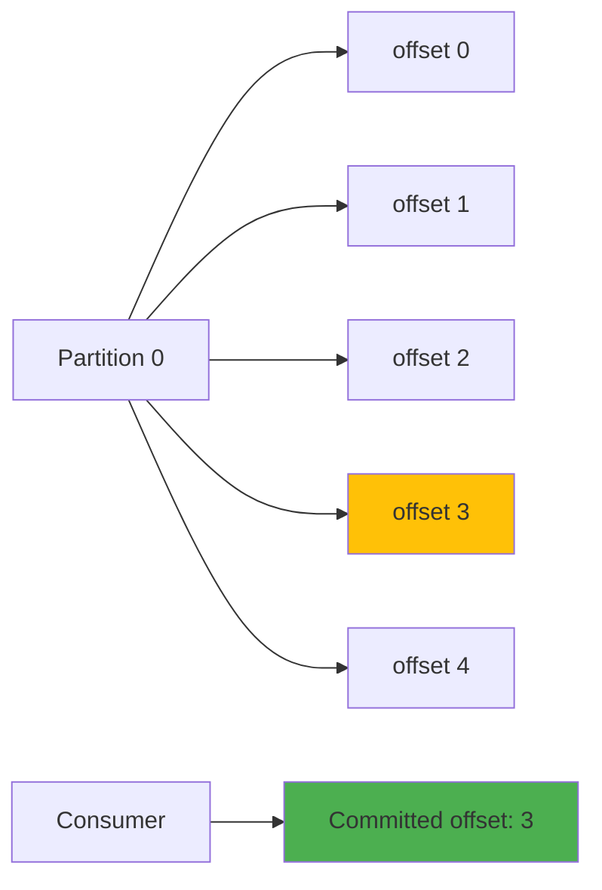
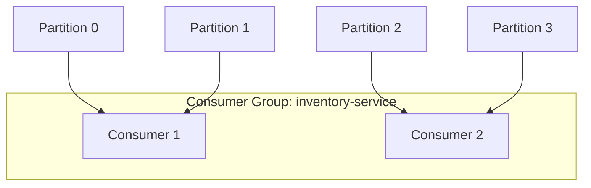
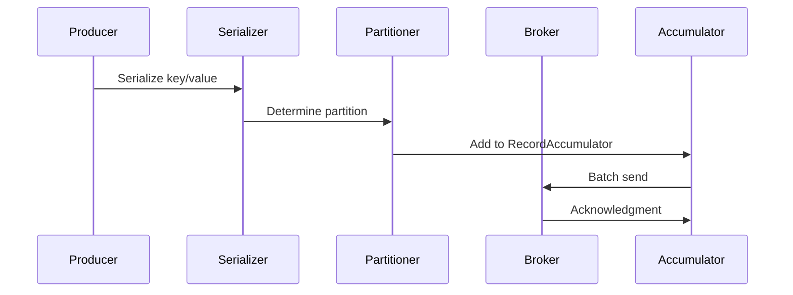

# Kafka Core Concepts

> Topics, partitions, offsets, consumer groups, producers, and acknowledgments.

## Topic Model



### Topic Configuration

| Property | Description | Default |
|----------|-------------|---------|
| Partitions | Number of partitions | 1 |
| Replication Factor | Copies of data | 1 |
| Retention.ms | How long to keep data | 604800000 (7 days) |
| Retention.bytes | Max size per partition | -1 (unlimited) |
| Cleanup.policy | Delete or compact | delete |

## Partitions

### Ordering Guarantee



- Messages within a partition are ordered
- No ordering across partitions
- Key-based partitioning ensures same key goes to same partition

### Partitioning Strategies

| Strategy | Description | Use Case |
|----------|-------------|----------|
| Round Robin | Distribute evenly | No ordering needed |
| Key Hash | Hash key to partition | Ordering per key |
| Custom | Custom partitioner | Complex routing |

```java
// Key-based partitioning
ProducerRecord<String, String> record = new ProducerRecord<>(
    "orders",           // topic
    orderId,            // key (determines partition)
    orderJson           // value
);

// Custom partitioner
public class CustomPartitioner implements Partitioner {
    @Override
    public int partition(String topic, Object key, byte[] keyBytes,
                         Object value, byte[] valueBytes, Cluster cluster) {
        int partitionCount = cluster.partitionCountForTopic(topic);
        String region = ((Order) key).getRegion();
        return Math.abs(region.hashCode()) % partitionCount;
    }
}
```

## Offsets



### Offset Management

| Method | Description | Reliability |
|--------|-------------|-------------|
| auto-commit | Automatic periodic commit | At-most-once |
| manual sync | Commit after processing | At-least-once |
| manual async | Async commit after processing | At-least-once |
| transactions | Exactly-once semantics | Exactly-once |

```java
// Manual offset commit
consumer.subscribe(List.of("orders"));
while (true) {
    ConsumerRecords<String, String> records = consumer.poll(Duration.ofMillis(100));
    for (ConsumerRecord<String, String> record : records) {
        processRecord(record);
    }
    consumer.commitSync();  // commit after processing
}

// Commit specific offsets
Map<TopicPartition, OffsetAndMetadata> offsets = Map.of(
    new TopicPartition("orders", 0), new OffsetAndMetadata(100),
    new TopicPartition("orders", 1), new OffsetAndMetadata(50)
);
consumer.commitSync(offsets);
```

## Consumer Groups



### Consumer Group Features

| Feature | Description |
|---------|-------------|
| Load Balancing | Partitions distributed among consumers |
| Fault Tolerance | Rebalance on consumer failure |
| Scaling | Add/remove consumers dynamically |
| Offset Tracking | Per-group offset storage |

### Rebalance Triggers

1. Consumer joins group
2. Consumer leaves group (crash or manual)
3. Topic metadata changes (partition added)
4. Consumer heartbeat timeout (session.timeout.ms)

## Producers

### Producer Flow



### Producer Configuration

| Property | Description | Default |
|---------|-------------|---------|
| acks | Replication acknowledgment | 1 |
| retries | Number of retries | 2147483647 |
| batch.size | Batch size in bytes | 16384 |
| linger.ms | Time to wait for more records | 0 |
| buffer.memory | Total buffer size | 33554432 |
| compression.type | Compression algorithm | none |

### Acknowledgment Modes

| acks | Behavior | Use Case |
|------|----------|----------|
| 0 | No acknowledgment | Fire and forget |
| 1 | Leader acknowledges | Default, balanced |
| all/-1 | All ISR acknowledge | Maximum durability |

```java
Properties props = new Properties();
props.put("bootstrap.servers", "localhost:9092");
props.put("acks", "all");
props.put("retries", 3);
props.put("batch.size", 32768);
props.put("linger.ms", 10);
props.put("compression.type", "snappy");

KafkaProducer<String, String> producer = new KafkaProducer<>(props);

ProducerRecord<String, String> record = 
    new ProducerRecord<>("orders", "key", "value");

producer.send(record, (metadata, exception) -> {
    if (exception != null) {
        logger.error("Send failed", exception);
    } else {
        logger.info("Sent to partition {} offset {}", 
            metadata.partition(), metadata.offset());
    }
});
```

## Messages and Records

### Record Structure

| Field | Description |
|-------|-------------|
| Key | Optional key for partitioning |
| Value | Message payload |
| Headers | Key-value metadata pairs |
| Timestamp | Event or log time |
| Partition | Assigned partition |
| Offset | Position in partition |

```java
// Record with headers
ProducerRecord<String, String> record = new ProducerRecord<>(
    "orders", "order-123", orderJson
);
record.headers().add("source", "web-api".getBytes());
record.headers().add("version", "1.0".getBytes());
```

## Serialization

| Serializer | Description |
|-----------|-------------|
| StringSerializer | UTF-8 strings |
| ByteArraySerializer | Raw bytes |
| IntegerSerializer | Integer values |
| JsonSchemaSerializer | JSON with schema |
| AvroSerializer | Avro format |

```java
// JSON serialization with Jackson
public class JsonSerde<T> implements Serializer<T>, Deserializer<T> {
    private final ObjectMapper mapper = new ObjectMapper();
    
    @Override
    public byte[] serialize(String topic, T data) {
        return mapper.writeValueAsBytes(data);
    }
    
    @Override
    public T deserialize(String topic, byte[] data) {
        return mapper.readValue(data, type);
    }
}
```

## References

- [Kafka Producers](https://kafka.apache.org/documentation/#producerconfigs)
- [Kafka Consumers](https://kafka.apache.org/documentation/#consumerconfigs)
- [Kafka Topics](https://kafka.apache.org/documentation/#topics)

---
**Prerequisites:** [Kafka architecture](architecture.md)
**Related:** [Kafka performance](../../14-cloud/azure/performance.md) | [Kafka configuration](configuration.md)
**Next:** [Kafka configuration](configuration.md)
