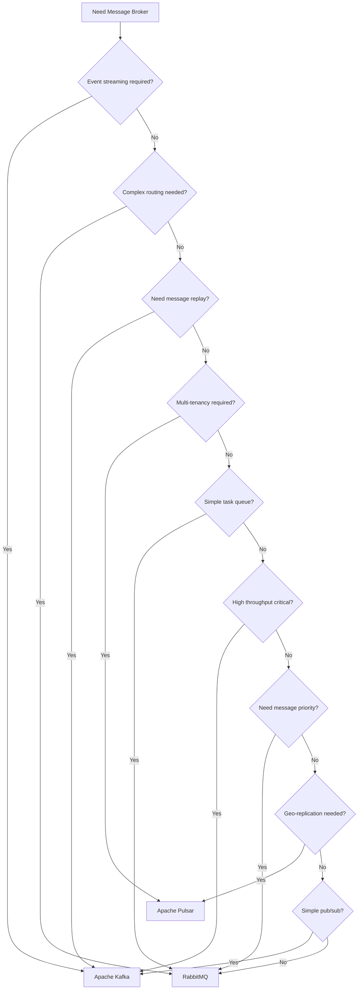
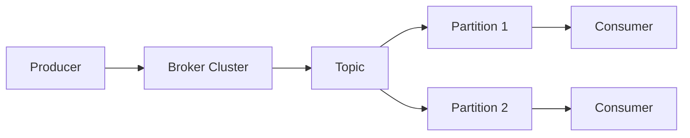
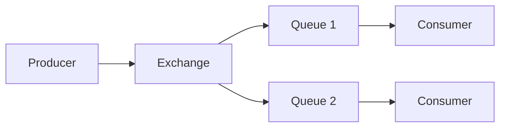

# Decision Tree: When to Use Kafka vs RabbitMQ vs Pulsar

## Overview
Each messaging system excels in different scenarios. Use this guide to choose the right one for your needs.

## Decision Flow



## Feature Comparison

| Feature | Kafka | RabbitMQ | Pulsar | Redpanda |
|---------|-------|----------|--------|----------|
| Message Model | Pub/Sub + Log | Queue + Pub/Sub | Pub/Sub + Queue | Pub/Sub + Log |
| Message Retention | Configurable | Until consumed | Configurable | Configurable |
| Ordering Guarantees | Per partition | Per queue | Per partition | Per partition |
| Message Replay | Yes | No | Yes | Yes |
| Consumer Groups | Yes | Yes | Yes | Yes |
| Transactions | Yes | Yes | Yes | Yes |
| Schema Registry | Yes | No | Yes | Yes |
| Multi-tenancy | Limited | Yes (vhosts) | Yes | Limited |
| Geo-replication | MirrorMaker | Federation | Yes (native) | Yes |
| Protocol Support | Kafka protocol | AMQP, MQTT, STOMP | Kafka protocol | Kafka protocol |

## Use Case Recommendations

### Choose Kafka When:
- Building event streaming platform
- Need message replay capability
- High throughput is critical
- Log aggregation required
- Real-time data pipelines
- Event sourcing patterns

### Choose RabbitMQ When:
- Complex routing logic needed
- Traditional message queuing
- Task distribution required
- Message priority is important
- Simple producer-consumer patterns
- Need multiple protocol support

### Choose Pulsar When:
- Multi-tenancy required
- Need both queue and streaming
- Geo-replication is critical
- Unified messaging platform
- Need tiered storage
- Strong consistency required

## Performance Characteristics

```mermaid
graph TD
    subgraph "Throughput Comparison"
        Kafka -->|100K+ msg/s| High
        Pulsar -->|100K+ msg/s| High
        RabbitMQ -->|20-50K msg/s| Medium
        Redpanda -->|100K+ msg/s| High
    end
    
    subgraph "Latency Comparison"
        Kafka -->|ms| Low
        Pulsar -->|ms| Low
        RabbitMQ -->|us| Very Low
        Redpanda -->|us| Very Low
    end
```

## Architecture Patterns

### Kafka Architecture


### RabbitMQ Architecture


## Decision Matrix

| Requirement | Kafka | RabbitMQ | Pulsar |
|-------------|-------|----------|--------|
| High Throughput | Best | Good | Best |
| Low Latency | Good | Best | Good |
| Message Replay | Best | Poor | Best |
| Complex Routing | Poor | Best | Good |
| Ease of Use | Moderate | Easy | Moderate |
| Ecosystem | Very Rich | Rich | Growing |
| Operational Complexity | High | Moderate | High |
| Message Ordering | Per partition | Per queue | Per partition |

## When to Consider Alternatives

### Consider Redpanda When:
- Need Kafka compatibility
- Want better performance
- Simpler operations needed
- Lower latency required

### Consider NATS When:
- Need ultra-low latency
- Simple pub/sub required
- Cloud-native architecture
- Lightweight solution needed

## Migration Considerations

### From RabbitMQ to Kafka:
- Refactor routing logic
- Implement topic partitioning
- Update consumer groups
- Plan for message replay

### From Kafka to Pulsar:
- Leverage native migration tools
- Plan for schema evolution
- Test geo-replication
- Validate ordering guarantees

## Decision Checklist

Choose Kafka if you check 3 or more:
- [ ] Event streaming platform needed
- [ ] Message replay required
- [ ] High throughput critical
- [ ] Building data pipelines
- [ ] Need strong ordering
- [ ] Event sourcing patterns

Choose RabbitMQ if you check 3 or more:
- [ ] Complex routing needed
- [ ] Traditional queuing patterns
- [ ] Message priority required
- [ ] Multiple protocols needed
- [ ] Simple deployment needed
- [ ] Task distribution use case

Choose Pulsar if you check 3 or more:
- [ ] Multi-tenancy required
- [ ] Geo-replication needed
- [ ] Need queue + streaming
- [ ] Tiered storage required
- [ ] Strong consistency needed
- [ ] Unified platform desired