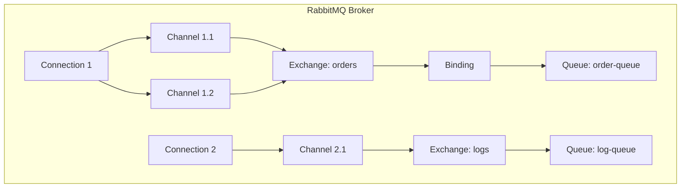
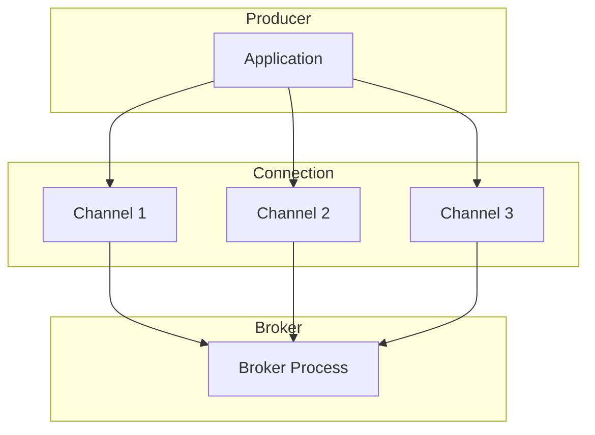
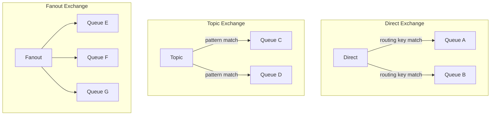
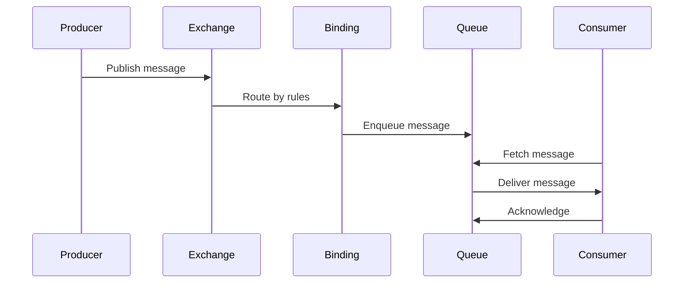
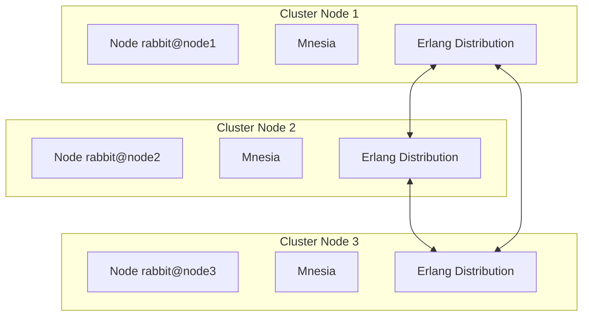

# RabbitMQ Architecture

> Exchange, queue, binding, channel, connection, and broker topology.

## Broker Architecture

## Core Components

| Component | Description |
|-----------|-------------|
| Broker | Server that receives, stores, and delivers messages |
| Connection | TCP connection between client and broker |
| Channel | Virtual connection within a connection |
| Exchange | Routes messages to queues based on rules |
| Queue | Buffer storing messages until consumed |
| Binding | Rule linking exchange to queue |
| Consumer | Application receiving messages |
| Producer | Application sending messages |

## Connection and Channel Model

### Channel Benefits

- Multiplexing: Many channels share one TCP connection
- Lower overhead than opening new connections
- AMQP operations happen on channels, not connections
- Each channel has its own session state

## Exchange Types

## Message Flow

## Virtual Hosts

Virtual hosts provide logical isolation within a broker.

| Feature | Description |
|---------|-------------|
| Isolation | Separate exchanges, queues, permissions |
| Namespace | Each vhost has its own resources |
| Security | Permissions scoped to vhost |
| Default | `/` is the default virtual host |

## Erlang Distribution

## Message Storage

Messages persist in memory and optionally to disk:

| Storage | Description |
|---------|-------------|
| RAM | Fast access, lost on restart if not durable |
| Disk | Durable storage, survives restarts |
| Lazy queues | Move messages to disk to save RAM |
| Quorum queues | Raft-based replicated storage |

## References

- [RabbitMQ Architecture Guide](https://www.rabbitmq.com/tutorials/amqp-concepts)
- [RabbitMQ Clustering](https://www.rabbitmq.com/clustering.html)

---
**Prerequisites:** [RabbitMQ core-concepts](core-concepts.md)
**Related:** [RabbitMQ configuration](configuration.md) | [RabbitMQ production](production.md)
**Next:** [RabbitMQ core-concepts](core-concepts.md)
