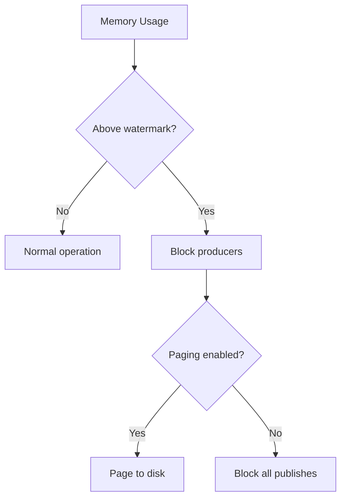

# RabbitMQ Configuration

> rabbitmq.conf, management plugin, clustering, and environment settings.

## Configuration Files

| File | Purpose |
|------|---------|
| `rabbitmq.conf` | Primary configuration (new-style) |
| `advanced.config` | Erlang term configuration |
| `definitions.json` | Exchanges, queues, bindings, users |
| `enabled_plugins` | Enabled plugin list |

## rabbitmq.conf

```ini
# Network
listeners.tcp.default = 5672
listeners.ssl.default = 5671

# Memory
vm_memory_high_watermark.relative = 0.6
vm_memory_high_watermark_paging_ratio = 0.5

# Disk
disk_free_limit.relative = 1.5

# Channel limits
channel_max = 2048

# Connection limits
heartbeat = 60

# Queue defaults
default_vhost = /
default_user = guest
default_pass = guest

# Logging
log.dir = /var/log/rabbitmq
log.file = rabbit.log
log.file.level = info

# Management plugin
management.listener.port = 15672
management.listener.ssl = false
```

## Memory Management



| Setting | Default | Description |
|---------|---------|-------------|
| vm_memory_high_watermark.relative | 0.4 | Fraction of RAM for alerts |
| vm_memory_high_watermark.absolute | unlimited | Absolute memory limit |
| vm_memory_high_watermark_paging_ratio | 0.5 | Start paging at this ratio |

## Disk Space

| Setting | Default | Description |
|---------|---------|-------------|
| disk_free_limit.relative | 1.5 | Multiple of free disk required |
| disk_free_limit.absolute | 2GB | Absolute disk free limit |

## Clustering

```ini
# Cluster formation
cluster_formation.peer_discovery_backend = classic_config
cluster_formation.classic_config.nodes.1 = rabbit@node1
cluster_formation.classic_config.nodes.2 = rabbit@node2
cluster_formation.classic_config.nodes.3 = rabbit@node3

# Partition handling
cluster_partition_handling = autoheal
```

| Strategy | Description |
|----------|-------------|
| autoheal | Choose a winning partition, restart others |
| pause-minority | Pause nodes in minority partition |
| ignore | No automatic handling |

## TLS Configuration

```ini
# SSL listeners
listeners.ssl.default = 5671

# SSL options
ssl_options.cacertfile = /etc/rabbitmq/ssl/ca.pem
ssl_options.certfile = /etc/rabbitmq/ssl/server.pem
ssl_options.keyfile = /etc/rabbitmq/ssl/server-key.pem
ssl_options.verify = verify_peer
ssl_options.fail_if_no_peer_cert = true
```

## Management Plugin

```ini
# Enable management
management.listener.port = 15672
management.listener.ssl = false

# CORS
management.cors.allow_origins.1 = https://example.com

# Statistics collection
management.sample_retention_policies.global.halfhour = 5
management.sample_retention_policies.global.hour = 60
```

## Environment Variables

```bash
# Alternative: RABBITMQ_* environment variables
export RABBITMQ_NODENAME=rabbit@node1
export RABBITMQ_ERLANG_COOKIE='secret'
export RABBITMQ_NODE_PORT=5672
export RABBITMQ_DIST_PORT=25672
```

## Limit Settings

```ini
# Connection limits (per vhost or global)
vm_memory_high_watermark.relative = 0.6
disk_free_limit.absolute = 1GB
channel_max = 2048
heartbeat = 60

# Frame size
frame_max = 131072
channel_max = 2048
```

## Queue Limits

```ini
# Via policies
# x-max-length: maximum messages in queue
# x-max-length-bytes: maximum queue size in bytes
# x-message-ttl: message time-to-live in ms
```

## Plugin Configuration

```bash
# List enabled plugins
rabbitmq-plugins list

# Enable management
rabbitmq-plugins enable rabbitmq_management

# Enable Prometheus metrics
rabbitmq-plugins enable rabbitmq_prometheus
```

## References

- [Configuration Guide](https://www.rabbitmq.com/configure.html)
- [rabbitmq.conf Reference](https://www.rabbitmq.com/configure.html#config-file)
- [Environment Variables](https://www.rabbitmq.com/configure.html#environment-variables)

---
**Prerequisites:** [RabbitMQ core-concepts](core-concepts.md)
**Related:** [RabbitMQ installation](installation.md) | [RabbitMQ production](production.md)
**Next:** [RabbitMQ installation](installation.md)
