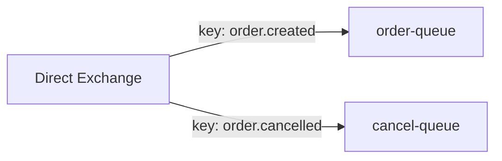
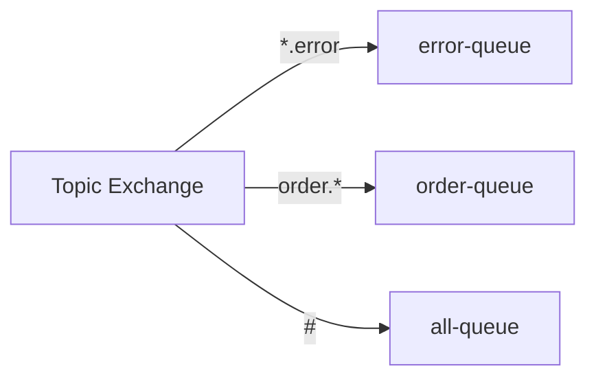
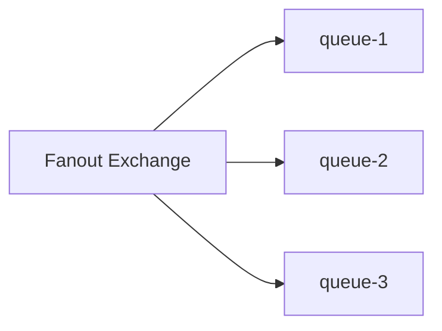
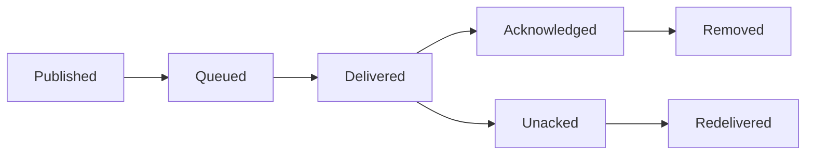
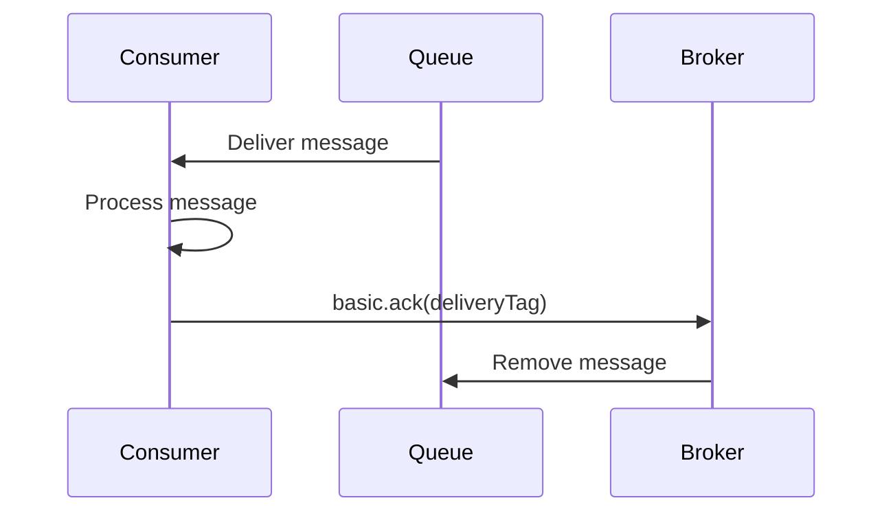
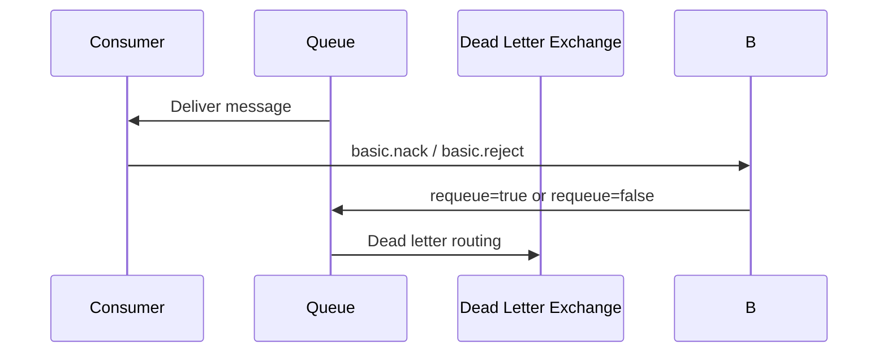

# RabbitMQ Core Concepts

> Exchanges, queues, acknowledgments, routing, and message lifecycle.

## Exchanges

### Direct Exchange

Routes messages where the routing key exactly matches the binding key.



| Property | Description |
|----------|-------------|
| Routing | Exact match on routing key |
| Use Case | Point-to-point routing |
| Default | Default exchange is direct |

### Topic Exchange

Routes messages using wildcard pattern matching on routing keys.



| Pattern | Description |
|---------|-------------|
| `*` | Matches one word |
| `#` | Matches zero or more words |
| `.` | Word separator |

### Fanout Exchange

Broadcasts messages to all bound queues, ignoring routing keys.



### Headers Exchange

Routes based on message header attributes instead of routing keys.

| Argument | Description |
|----------|-------------|
| `x-match: all` | All headers must match |
| `x-match: any` | Any header can match |

## Queues

### Queue Properties

| Property | Description |
|----------|-------------|
| Name | Queue identifier |
| Durable | Survives broker restart |
| Exclusive | Used by one connection, deleted on close |
| Auto-delete | Deleted when last consumer unsubscribes |
| Arguments | Optional policies and features |

### Queue Types

| Type | Description |
|------|-------------|
| Classic | Traditional queue, single-broker |
| Quorum | Raft-replicated across cluster nodes |
| Stream | Append-only log, non-destructive reads |

### Message State



## Bindings

Bindings link exchanges to queues with optional routing rules.

```bash
# Create binding via management API
curl -X POST -u guest:guest \
  http://localhost:15672/api/bindings/%2F/e/order-exchange/q/order-queue \
  -H "content-type: application/json" \
  -d '{"routing_key": "order.created"}'
```

## Acknowledgments

### Delivery Modes

| Mode | Description |
|------|-------------|
| auto-ack | Message acknowledged immediately on delivery |
| manual-ack | Consumer explicitly acknowledges after processing |
| reject | Consumer rejects with requeue option |

### Acknowledgment Flow



### Rejection



## Message Properties

| Property | Description |
|----------|-------------|
| deliveryTag | Unique ID for delivered message |
| redelivered | Whether message was previously delivered |
| exchange | Exchange message was published to |
| routingKey | Routing key used for publishing |
| properties | Headers, content-type, priority, etc. |

## Prefetch (QoS)

Controls how many unacknowledged messages a consumer can receive.

```bash
# Set prefetch count
rabbitmqctl set_qos 0 10 0

# Per-connection via AMQP
channel.basic_qos(prefetchCount=10)
```

| Setting | Description |
|---------|-------------|
| prefetchCount | Max unacked messages per consumer |
| prefetchSize | Max unacked bytes per consumer |
| global | Apply across all channels on connection |

## TTL (Time-To-Live)

Messages expire after a configured duration.

| Setting | Scope |
|---------|-------|
| x-message-ttl | Per queue argument |
| expiration | Per message property |

## Dead Letter Exchanges

Messages are routed to a DLX when:
1. Consumer rejects with requeue=false
2. Message TTL expires
3. Queue reaches maximum length

## References

- [RabbitMQ Exchanges](https://www.rabbitmq.com/tutorials/amqp-concepts#exchanges)
- [RabbitMQ Queues](https://www.rabbitmq.com/queues.html)
- [RabbitMQ Acknowledgments](https://www.rabbitmq.com/confirms.html)

---
**Prerequisites:** [RabbitMQ architecture](architecture.md)
**Related:** [RabbitMQ performance](performance.md) | [RabbitMQ configuration](configuration.md)
**Next:** [RabbitMQ configuration](configuration.md)
