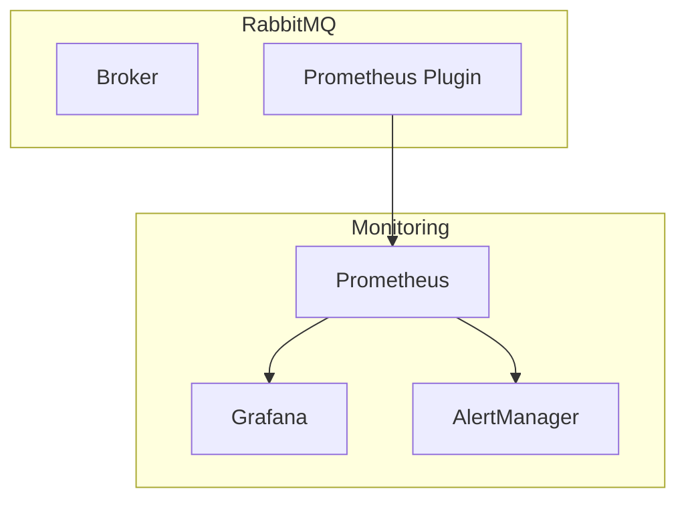

# RabbitMQ Monitoring

> Management UI, Prometheus, Grafana, metrics, and alerts.

## Management UI

### Access

```
URL: http://localhost:15672
Default credentials: guest/guest
```

### UI Sections

| Section | Description |
|---------|-------------|
| Overview | Broker status, message rates |
| Connections | Active client connections |
| Channels | Active channels |
| Exchanges | Exchange list and bindings |
| Queues | Queue depths and consumers |
| Policies | Applied policies |
| Admin | Users, vhosts, cluster |

## Prometheus Metrics

```ini
# Enable Prometheus plugin
rabbitmq-plugins enable rabbitmq_prometheus
```

### Key Metrics

| Metric | Description |
|--------|-------------|
| rabbitmq_queue_messages | Messages in queue |
| rabbitmq_queue_consumers | Consumer count |
| rabbitmq_connections_total | Total connections |
| rabbitmq_channel_total | Total channels |
| rabbitmq_node_mem_used | Memory usage |
| rabbitmq_node_disk_free | Free disk space |
| rabbitmq_queue_messages_published_total | Publish rate |
| rabbitmq_queue_messages_delivered_total | Deliver rate |

### Prometheus Endpoint

```
GET http://localhost:15692/metrics
```

## Grafana Dashboard

### Recommended Panels

| Panel | Metric |
|-------|--------|
| Queue Depth | rabbitmq_queue_messages |
| Message Rate | rabbitmq_queue_messages_published_total |
| Memory Usage | rabbitmq_node_mem_used |
| Disk Free | rabbitmq_node_disk_free |
| Connection Count | rabbitmq_connections_total |
| Consumer Lag | rabbitmq_queue_messages_ready |

## Alerting Rules

```yaml
# Prometheus alerting rules
groups:
  - name: rabbitmq
    rules:
      - alert: RabbitMQHighMemory
        expr: rabbitmq_node_mem_used / rabbitmq_node_mem_limit > 0.8
        for: 5m
        labels:
          severity: warning

      - alert: RabbitMQDiskLow
        expr: rabbitmq_node_disk_free < 1000000000
        for: 5m
        labels:
          severity: critical

      - alert: RabbitMQQueueHigh
        expr: rabbitmq_queue_messages > 100000
        for: 5m
        labels:
          severity: warning
```

## CLI Monitoring

```bash
# Cluster status
rabbitmqctl cluster_status

# List queues with details
rabbitmqctl list_queues name messages consumers memory

# List connections
rabbitmqctl list_connections name state channels

# List channels
rabbitmqctl list_channels connection_number name number_of_messages

# Node health
rabbitmq-diagnostics check_running
rabbitmq-diagnostics check_port_connectivity
```

## Health Checks

```bash
# Basic health check
rabbitmq-diagnostics -q ping

# Detailed health check
rabbitmq-diagnostics check_running
rabbitmq-diagnostics check_ports
rabbitmq-diagnostics check_alarms

# Queue health
rabbitmq-diagnostics check_queue_state order-queue
```

## Monitoring Stack



## Log Monitoring

```ini
# Log configuration
log.dir = /var/log/rabbitmq
log.file = rabbit.log
log.file.level = info

# Rotate logs
log.file.rotation.date = $D0
log.file.rotation.size = 10485760
log.file.rotation.count = 5
```

## References

- [RabbitMQ Monitoring](https://www.rabbitmq.com/monitoring.html)
- [Prometheus Plugin](https://www.rabbitmq.com/prometheus.html)

---
**Prerequisites:** [RabbitMQ configuration](configuration.md)
**Related:** [RabbitMQ production](production.md) | [RabbitMQ scaling](scaling.md)
**Next:** [RabbitMQ production](production.md)
