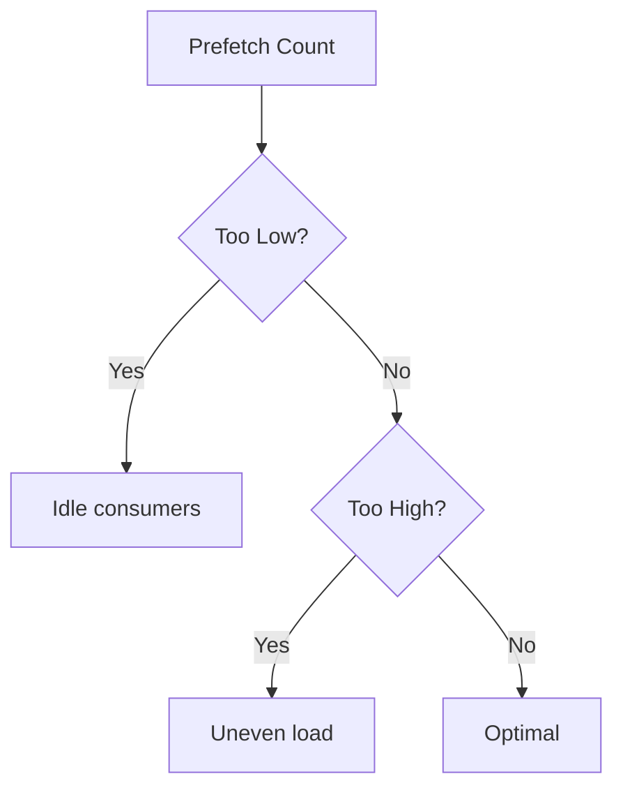
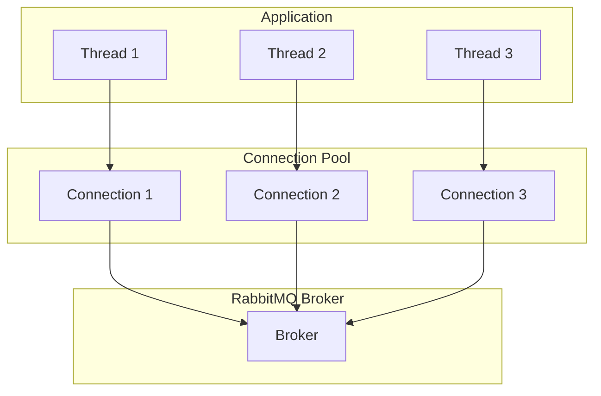
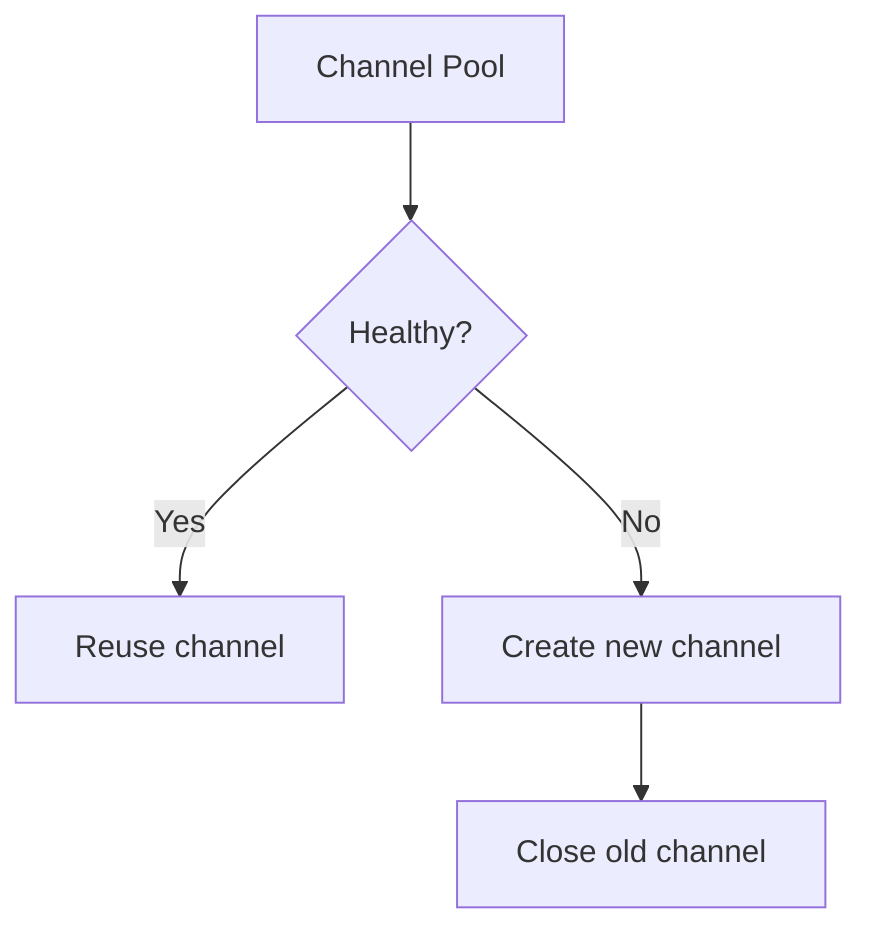

# RabbitMQ Performance

> Prefetch, batching, connection pooling, and throughput optimization.

## Performance Metrics

| Metric | Description |
|--------|-------------|
| Throughput | Messages per second |
| Latency | Time from publish to consume |
| Queue Depth | Number of queued messages |
| Memory Usage | RAM consumed by broker |
| Disk I/O | Disk write/read rates |

## Prefetch Tuning



### Prefetch Guidelines

| Workload | Recommended Prefetch |
|----------|---------------------|
| CPU-intensive | 1-5 |
| I/O-bound | 10-50 |
| Fast processing | 100-1000 |
| Mixed | Start at 10, tune up |

```bash
# Set per-consumer prefetch
channel.basic_qos(prefetch_count=10)

# Set per-connection (global)
channel.basic_qos(prefetch_count=10, global=True)
```

## Connection Pooling



### Pool Configuration

| Setting | Description |
|---------|-------------|
| pool_size | Number of connections |
| max_overflow | Extra connections under load |
| timeout | Connection wait timeout |
| recycle | Connection lifetime |

## Batch Publishing

```python
# Batch publish for throughput
channel.confirm_delivery()
for message in messages:
    channel.basic_publish(
        exchange='orders',
        routing_key='order.created',
        body=json.dumps(message),
        properties=pika.BasicProperties(delivery_mode=2)
    )
```

### Batch vs Individual

| Approach | Throughput | Latency |
|----------|------------|---------|
| Individual | Lower | Lower |
| Batch | Higher | Higher |

## Queue Performance

### Queue Types Comparison

| Type | Throughput | Durability |
|------|------------|------------|
| Classic | High | Single node |
| Quorum | Moderate | Replicated |
| Stream | Very high | Append-only |

### Queue Configuration

```ini
# Queue arguments for performance
x-queue-type: quorum
x-max-length: 1000000
x-dead-letter-exchange: dlx
```

## Channel Management



| Practice | Benefit |
|----------|---------|
| Reuse channels | Lower overhead |
| Limit channel count | Prevent resource exhaustion |
| Close idle channels | Free broker resources |

## Memory Optimization

```ini
# Memory watermark
vm_memory_high_watermark.relative = 0.6
vm_memory_high_watermark_paging_ratio = 0.5

# Lazy queues for memory-constrained
x-queue-mode: lazy
```

## Disk Optimization

```ini
# Disk free limit
disk_free_limit.absolute = 1GB

# Queue sync
queue_master_locator = min-masters
```

## Producer Optimization

| Setting | Description |
|---------|-------------|
| batch.size | Accumulator batch size |
| linger.ms | Wait time before sending batch |
| compression.type | none, gzip, snappy, lz4 |
| acks | 0, 1, all |

## Consumer Optimization

| Setting | Description |
|---------|-------------|
| prefetch_count | Unacked message limit |
| auto_ack | true/false |
| consumer_timeout | Max processing time |

## Benchmarking

```bash
# Perftest tool
rabbitmq-perftest publish 100000 --producers 4 --confirm 100

# RabbitMQ benchmark
rabbitmq-benchmark -r 10000 -n 100000 -p 4
```

## References

- [RabbitMQ Performance](https://www.rabbitmq.com/docs/clustering#performance-tuning)
- [Quorum Queues Performance](https://www.rabbitmq.com/docs/quorum-queues)

---
**Prerequisites:** [RabbitMQ core-concepts](core-concepts.md)
**Related:** [RabbitMQ monitoring](monitoring.md) | [RabbitMQ production](production.md)
**Next:** [RabbitMQ security](security.md)
