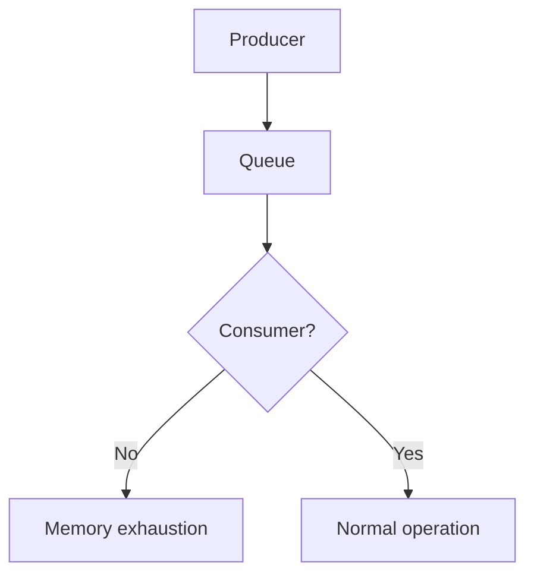
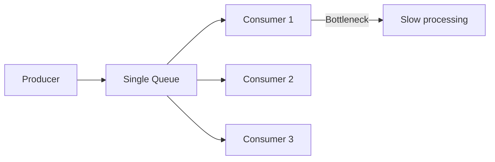

# RabbitMQ Pitfalls

> Common gotchas, mistakes, and how to avoid them.

## 1. Default Guest User Remote Access

**Problem**: Default guest user can only connect from localhost.

```bash
# This fails from remote
rabbitmqctl add_user guest guest  # Already exists
```

**Solution**: Create new user or allow guest remote access.

```ini
# Not recommended for production
loopback_users.guest = false
```

## 2. Unbounded Queue Growth

**Problem**: Queue grows unbounded, consuming all memory.



**Solution**: Set queue length limits.

```bash
rabbitmqadmin declare queue name=bounded durable=true \
  arguments='{"x-max-length": 10000, "x-dead-letter-exchange": "dlx"}'
```

## 3. Auto-Ack with Long Processing

**Problem**: Messages lost if consumer crashes during processing.

```python
# BAD: auto-ack with long processing
channel.basic_consume(queue='orders', on_message_callback=process)

# GOOD: manual ack
channel.basic_consume(queue='orders', on_message_callback=process, auto_ack=False)
```

## 4. Not Using Durable Exchanges

**Problem**: Exchanges lost on broker restart.

```python
# BAD
channel.exchange_declare(exchange='orders', exchange_type='topic')

# GOOD
channel.exchange_declare(exchange='orders', exchange_type='topic', durable=True)
```

## 5. Connection Leaks

**Problem**: Opening connections without closing them.

```python
# BAD: new connection per publish
for msg in messages:
    conn = pika.BlockingConnection(params)
    channel = conn.channel()
    channel.basic_publish(...)
    # Forgot to close

# GOOD: reuse connection
connection = pika.BlockingConnection(params)
for msg in messages:
    channel.basic_publish(...)
connection.close()
```

## 6. Ignoring Message TTL

**Problem**: Old messages accumulate indefinitely.

```bash
# BAD: no TTL
rabbitmqadmin declare queue name=orders durable=true

# GOOD: set TTL
rabbitmqadmin declare queue name=orders durable=true \
  arguments='{"x-message-ttl": 86400000}'
```

## 7. Single Queue Bottleneck

**Problem**: All messages processed by one queue.



**Solution**: Use multiple queues or partition by routing key.

## 8. No Dead Letter Exchange

**Problem**: Failed messages disappear or block queue.

```python
# BAD: reject with requeue
channel.basic_reject(delivery_tag=tag, requeue=True)

# GOOD: use DLX
rabbitmqadmin declare queue name=dlq durable=true
rabbitmqadmin declare exchange name=dlx type=fanout
```

## 9. Not Monitoring Queue Depths

**Problem**: Issues discovered only when system fails.

```bash
# Monitor queue depth
rabbitmqctl list_queues name messages

# Set up alerts
# Alert when messages > threshold
```

## 10. Hardcoded Credentials

**Problem**: Credentials in source code.

```python
# BAD
connection = pika.BlockingConnection(
    pika.ConnectionParameters('localhost', credentials=pika.PlainCredentials('guest', 'guest'))
)

# GOOD: use environment variables
import os
user = os.environ.get('RABBITMQ_USER', 'guest')
```

## 11. No Connection Heartbeats

**Problem**: Dead connections not detected.

```ini
# Enable heartbeats
heartbeat = 60
```

## 12. Wrong Exchange Type

**Problem**: Using wrong exchange for routing needs.

| Need | Wrong Choice | Right Choice |
|------|--------------|--------------|
| Broadcast | Direct | Fanout |
| Pattern routing | Direct | Topic |
| Point-to-point | Fanout | Direct |

## 13. Ignoring Consumer Prefetch

**Problem**: Uneven load distribution.

```python
# BAD: no prefetch set
channel.basic_consume(queue='orders', on_message_callback=process)

# GOOD: set prefetch
channel.basic_qos(prefetch_count=10)
channel.basic_consume(queue='orders', on_message_callback=process)
```

## 14. Not Using TLS

**Problem**: Credentials in plaintext.

```ini
# Enable TLS
listeners.ssl.default = 5671
ssl_options.cacertfile = /etc/rabbitmq/ssl/ca.pem
ssl_options.certfile = /etc/rabbitmq/ssl/server.pem
ssl_options.keyfile = /etc/rabbitmq/ssl/server-key.pem
```

## 15. Forgetting to Handle Network Partitions

**Problem**: Cluster split-brain without recovery strategy.

```ini
# Configure partition handling
cluster_partition_handling = autoheal
```

## References

- [RabbitMQ Common Issues](https://www.rabbitmq.com/docs/troubleshooting)
- [Pitfalls and Best Practices](https://www.rabbitmq.com/docs/best-practices)

---
**Prerequisites:** [RabbitMQ best-practices](best-practices.md)
**Related:** [RabbitMQ debugging](debugging.md) | [RabbitMQ troubleshooting](troubleshooting.md)
**Next:** [RabbitMQ debugging](debugging.md)
