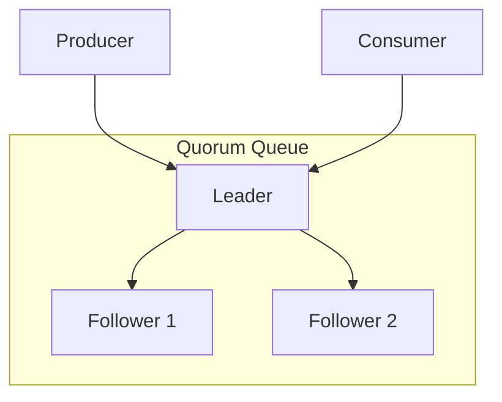
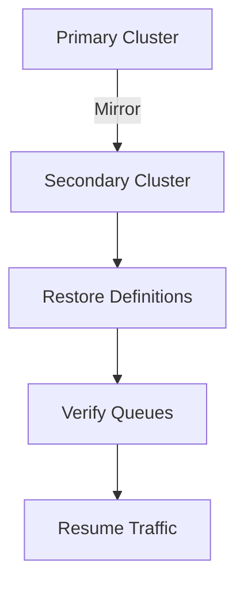

# RabbitMQ Production

> Clustering, HA, queue mirroring, disaster recovery, and operations.

## Cluster Architecture

```mermaid
graph TB
    subgraph "Cluster"
        N1[rabbit@node1]
        N2[rabbit@node2]
        N3[rabbit@node3]
    end

    N1 <--> N2
    N2 <--> N3
    N1 <--> N3

    subgraph "Load Balancer"
        LB[HAProxy / AWS ALB]
    end

    LB --> N1
    LB --> N2
    LB --> N3
```

## Cluster Setup

### Node Requirements

| Requirement | Description |
|-------------|-------------|
| Erlang cookie | Same on all nodes |
| Hostnames | Resolvable via DNS or /etc/hosts |
| Ports | 5672 (AMQP), 15672 (Mgmt), 25672 (Erlang) |
| Memory | Sufficient for message storage |

### Join Cluster

```bash
# On node2
rabbitmqctl stop_app
rabbitmqctl reset
rabbitmqctl join_cluster rabbit@node1
rabbitmqctl start_app

# Verify
rabbitmqctl cluster_status
```

## Quorum Queues

Raft-based replicated queues for data safety.



### Configuration

```bash
# Declare quorum queue
rabbitmqadmin declare queue name=orders durable=true \
  arguments='{"x-queue-type": "quorum"}'
```

| Feature | Classic | Quorum |
|---------|---------|--------|
| Replication | Optional | Always |
| Durability | Single node | Multi-node |
| Throughput | Higher | Moderate |
| Recovery | Possible loss | Consensus-based |

## High Availability

### Load Balancing

```
# HAProxy config
frontend rabbitmq
    bind *:5672
    default_backend rabbitmq_backend

backend rabbitmq_backend
    balance roundrobin
    server rabbit1 node1:5672 check
    server rabbit2 node2:5672 check
    server rabbit3 node3:5672 check
```

### Node Failure Handling

| Strategy | Description |
|----------|-------------|
| autoheal | Restart nodes in minority |
| pause-minority | Pause nodes in minority |
| ignore | No automatic recovery |

## Policies

```bash
# Set ha-policy for mirroring
rabbitmqctl set_policy ha-all "^orders\." \
  '{"ha-mode":"all","ha-sync-mode":"automatic"}' \
  --apply-to queues

# Set queue length limit
rabbitmqctl set_policy max-length "^temp\." \
  '{"max-length":1000}' \
  --apply-to queues
```

## Backup and Recovery

### Backup Types

| Type | Description |
|------|-------------|
| Definitions | Exchanges, queues, bindings, users |
| Messages | Actual message data |
| Configuration | rabbitmq.conf, advanced.config |

### Backup Commands

```bash
# Export definitions
rabbitmqadmin export /backup/definitions.json

# Import definitions
rabbitmqadmin import /backup/definitions.json
```

## Disaster Recovery



## Queue Master Locator

| Strategy | Description |
|----------|-------------|
| min-masters | Queue master on node with fewest masters |
| client-local | Master on client's node |
| random | Random node selection |

## Resource Limits

```ini
# Memory limit
vm_memory_high_watermark.relative = 0.6

# Disk limit
disk_free_limit.absolute = 1GB

# Connection limit
# Per vhost or global
```

## Operational Checklist

- [ ] Enable quorum queues for critical data
- [ ] Configure HA with load balancer
- [ ] Set up monitoring and alerting
- [ ] Regular definitions backup
- [ ] Test disaster recovery
- [ ] Monitor memory and disk
- [ ] Configure connection limits
- [ ] Use policies for queue management

## References

- [RabbitMQ Clustering](https://www.rabbitmq.com/clustering.html)
- [Quorum Queues](https://www.rabbitmq.com/quorum-queues.html)
- [High Availability](https://www.rabbitmq.com/ha.html)

---
**Prerequisites:** [RabbitMQ configuration](configuration.md)
**Related:** [RabbitMQ scaling](scaling.md) | [RabbitMQ security](security.md)
**Next:** [RabbitMQ scaling](scaling.md)
