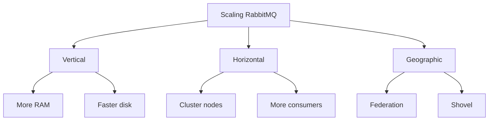
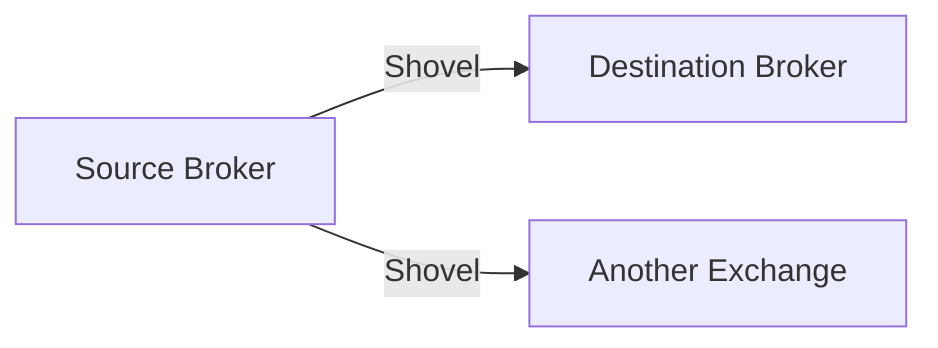
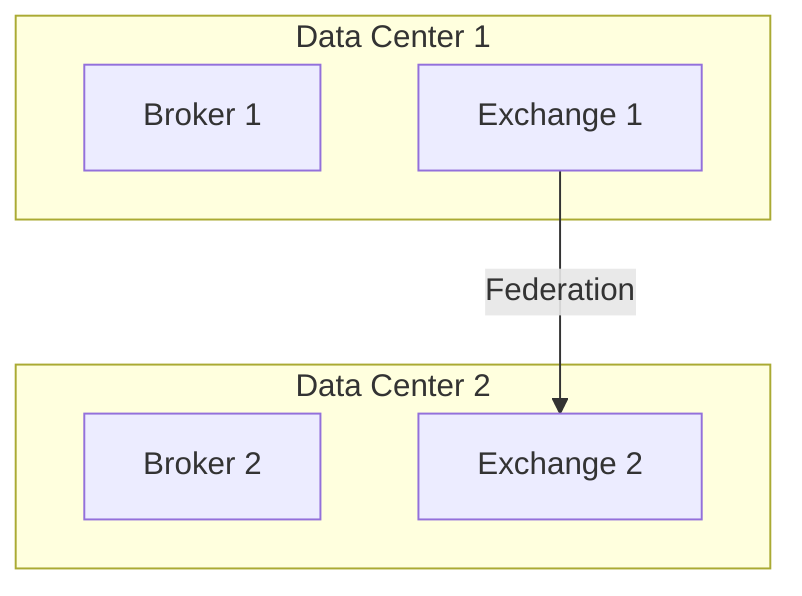
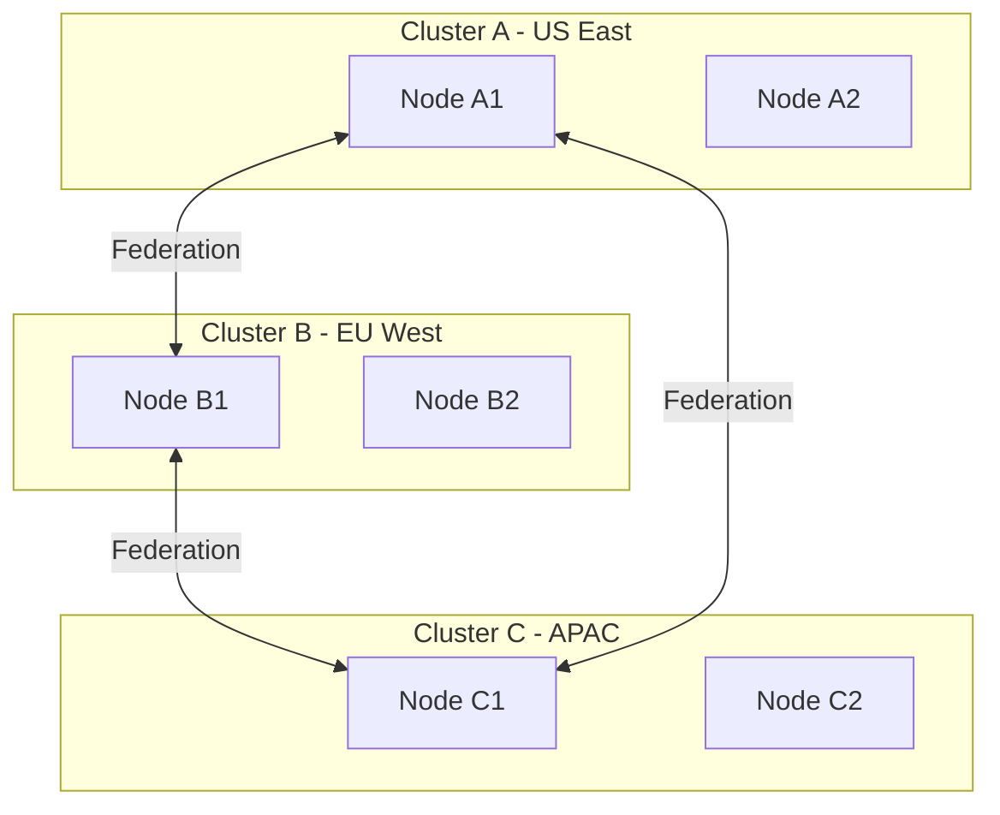
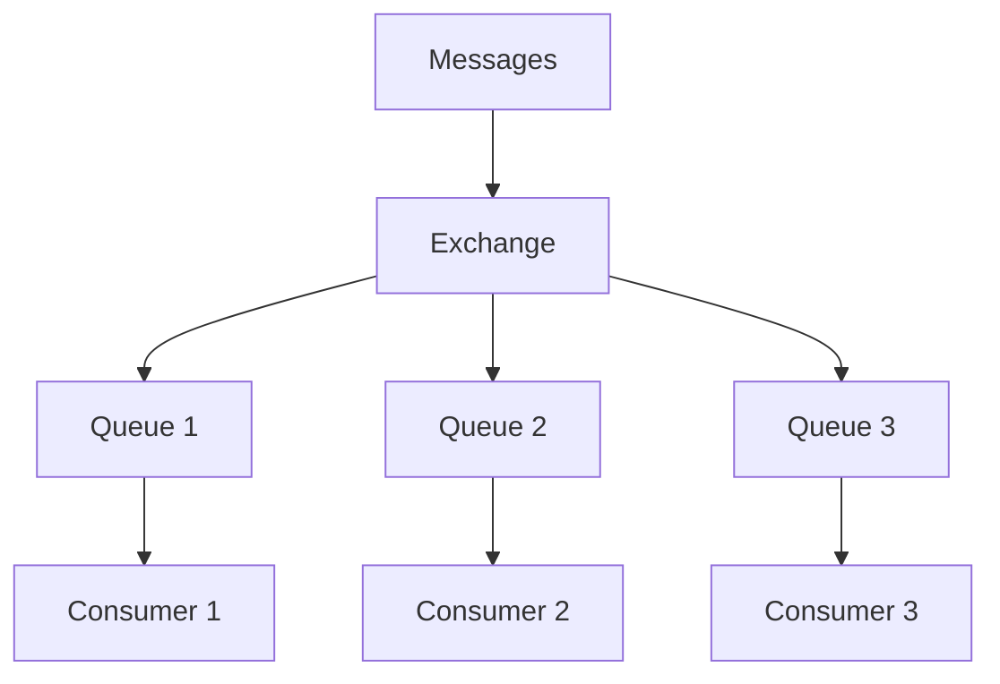

# RabbitMQ Scaling

> Clustering, shovels, federation, and multi-site deployment.

## Scaling Strategies



## Horizontal Scaling

### Cluster Expansion

```bash
# Add new node to cluster
rabbitmqctl stop_app
rabbitmqctl reset
rabbitmqctl join_cluster rabbit@existing-node
rabbitmqctl start_app

# Verify
rabbitmqctl cluster_status
```

### Queue Distribution

| Strategy | Description |
|----------|-------------|
| min-masters | Distribute masters evenly |
| Random | Random master selection |
| Client-local | Master on connecting node |

## Shovel Plugin

Moves messages between brokers or exchanges.



### Configure Shovel

```bash
# Dynamic shovel
rabbitmqadmin declare shovel my-shovel \
  src-protocol=amqp091 \
  src-uri=amqp://source-host \
  src-queue=source-queue \
  dest-protocol=amqp091 \
  dest-uri=amqp://dest-host \
  dest-exchange=dest-exchange
```

### Shovel Use Cases

| Use Case | Description |
|----------|-------------|
| Migration | Move queues between brokers |
| Replication | Replicate to remote site |
| Load balancing | Distribute across clusters |
| Protocol bridge | Connect different protocols |

## Federation Plugin

Federates exchanges and queues across brokers.



### Federation Configuration

```bash
# Create upstream
rabbitmqadmin declare federation-upstream my-upstream \
  uri=amqp://remote-host

# Set policy
rabbitmqctl set_policy federate-me "^federated\." \
  '{"federation-upstream":"my-upstream"}' \
  --apply-to exchanges
```

## Multi-Cluster Architecture



## Consumer Scaling

| Approach | Description |
|----------|-------------|
| Add consumers | More consumers per queue |
| Add queues | More queues, distribute load |
| Prefetch tuning | Balance load across consumers |

### Consumer Scaling Patterns



## Stream Queues

High-throughput append-only logs for scaling.

| Feature | Description |
|---------|-------------|
| Non-destructive | Multiple consumers read same data |
| Offset-based | Replay from any position |
| Replicated | Data safety across cluster |

## Load Balancing

```bash
# HAProxy configuration
frontend rabbitmq_amqp
    bind *:5672
    mode tcp
    default_backend rabbitmq

backend rabbitmq
    mode tcp
    balance roundrobin
    option tcp-check
    server rabbit1 node1:5672 check inter 5s
    server rabbit2 node2:5672 check inter 5s
```

## Geographic Distribution

| Topology | Description |
|----------|-------------|
| Hub-spoke | Central broker, remote shovels |
| Mesh | Fully connected clusters |
| Chain | Linear federation chain |

## Capacity Planning

| Factor | Consideration |
|--------|---------------|
| Messages/sec | Broker throughput |
| Queue depth | Storage requirements |
| Connection count | Network resources |
| Memory | Message buffering |
| Disk | Persistence storage |

## References

- [Federation Plugin](https://www.rabbitmq.com/federation.html)
- [Shovel Plugin](https://www.rabbitmq.com/shovel.html)
- [Clustering Guide](https://www.rabbitmq.com/clustering.html)

---
**Prerequisites:** [RabbitMQ production](production.md)
**Related:** [RabbitMQ monitoring](monitoring.md) | [RabbitMQ best-practices](best-practices.md)
**Next:** [RabbitMQ best-practices](best-practices.md)
