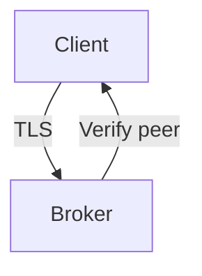
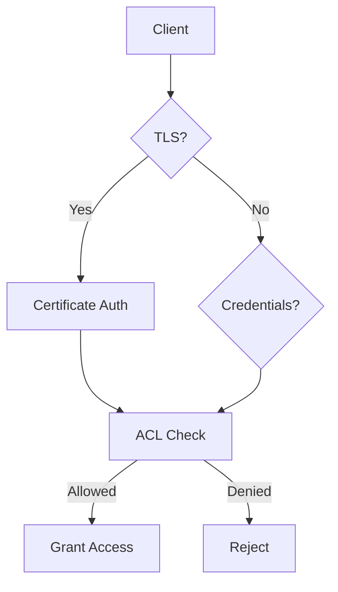

# RabbitMQ Security

> TLS, SASL, ACLs, management UI hardening, and authentication.

## Authentication Methods

| Method | Description |
|--------|-------------|
| PLAIN | Username/password over TCP |
| AMQPLAIN | Base64-encoded credentials |
| EXTERNAL | Client certificate (TLS) |
| SASL | Pluggable auth mechanisms |

## TLS Configuration



### Enable TLS

```ini
# rabbitmq.conf
listeners.ssl.default = 5671

ssl_options.cacertfile = /etc/rabbitmq/ssl/ca.pem
ssl_options.certfile = /etc/rabbitmq/ssl/server.pem
ssl_options.keyfile = /etc/rabbitmq/ssl/server-key.pem
ssl_options.verify = verify_peer
ssl_options.fail_if_no_peer_cert = true
ssl_options.versions.1 = tlsv1.3
ssl_options.versions.2 = tlsv1.2
```

### Certificate Generation

```bash
# Generate CA
openssl req -x509 -newkey rsa:4096 -days 365 \
  -keyout ca-key.pem -out ca.pem -nodes

# Generate server cert
openssl req -newkey rsa:4096 -nodes \
  -keyout server-key.pem -out server.csr

openssl x509 -req -in server.csr -CA ca.pem \
  -CAkey ca-key.pem -CAcreateserial -out server.pem -days 365
```

## SASL Authentication

```ini
# Enable SASL
auth_mechanisms.1 = PLAIN
auth_mechanisms.2 = AMQPLAIN
auth_mechanisms.3 = EXTERNAL
```

| Mechanism | Description |
|-----------|-------------|
| PLAIN | Simple username/password |
| AMQPLAIN | Obfuscated credentials |
| EXTERNAL | TLS client certificate |

## Access Control (ACLs)

### User Management

```bash
# Create user
rabbitmqctl add_user myuser password

# Set permissions
rabbitmqctl set_permissions -p / myuser ".*" ".*" ".*"

# Set tag
rabbitmqctl set_user_tags myuser administrator

# List users
rabbitmqctl list_users
```

### Virtual Host Permissions

```bash
# Configure: regex for configure operations
# Write: regex for write operations
# Read: regex for read operations

rabbitmqctl set_permissions -p / myuser \
  "^my-exchange.*" \
  "^my-exchange.*" \
  "^my-queue.*"
```

### Topic Permissions

```bash
rabbitmqctl set_topic_permissions -p / myuser \
  "amq.topic" \
  "^myapp\." \
  "^myapp\."
```

## Management UI Security

```ini
# Restrict access
management.listener.port = 15672
management.listener.ssl = false

# CORS
management.cors.allow_origins.1 = https://example.com

# Disable guest remote access
loopback_users.guest = true
```

## Network Security

```ini
# Bind to specific interface
listeners.tcp.local = 127.0.0.1:5672

# Use firewall rules
# Allow only specific IPs
```

## Credential Security

| Practice | Description |
|----------|-------------|
| Use strong passwords | Minimum 12 characters |
| Rotate credentials | Change periodically |
| Use environment variables | Never hardcode |
| Enable TLS | Encrypt in transit |
| Use separate accounts | Per-application credentials |

## Authorization



## Audit Logging

```ini
# Enable audit logging
log.dir = /var/log/rabbitmq
log.file = rabbit.log
log.file.level = info

# Management UI logging
management.http_log_dir = /var/log/rabbitmq/http
```

## Security Checklist

- [ ] Disable default guest account for remote access
- [ ] Enable TLS for all connections
- [ ] Use strong passwords
- [ ] Implement least-privilege ACLs
- [ ] Restrict management UI access
- [ ] Enable audit logging
- [ ] Regular credential rotation
- [ ] Monitor for unauthorized access
- [ ] Use separate vhosts for isolation
- [ ] Keep RabbitMQ updated

## References

- [RabbitMQ Security](https://www.rabbitmq.com/ssl.html)
- [Access Control](https://www.rabbitmq.com/access-control.html)
- [Authentication](https://www.rabbitmq.com/authentication.html)

---
**Prerequisites:** [RabbitMQ configuration](configuration.md)
**Related:** [RabbitMQ production](production.md) | [RabbitMQ monitoring](monitoring.md)
**Next:** [RabbitMQ monitoring](monitoring.md)
