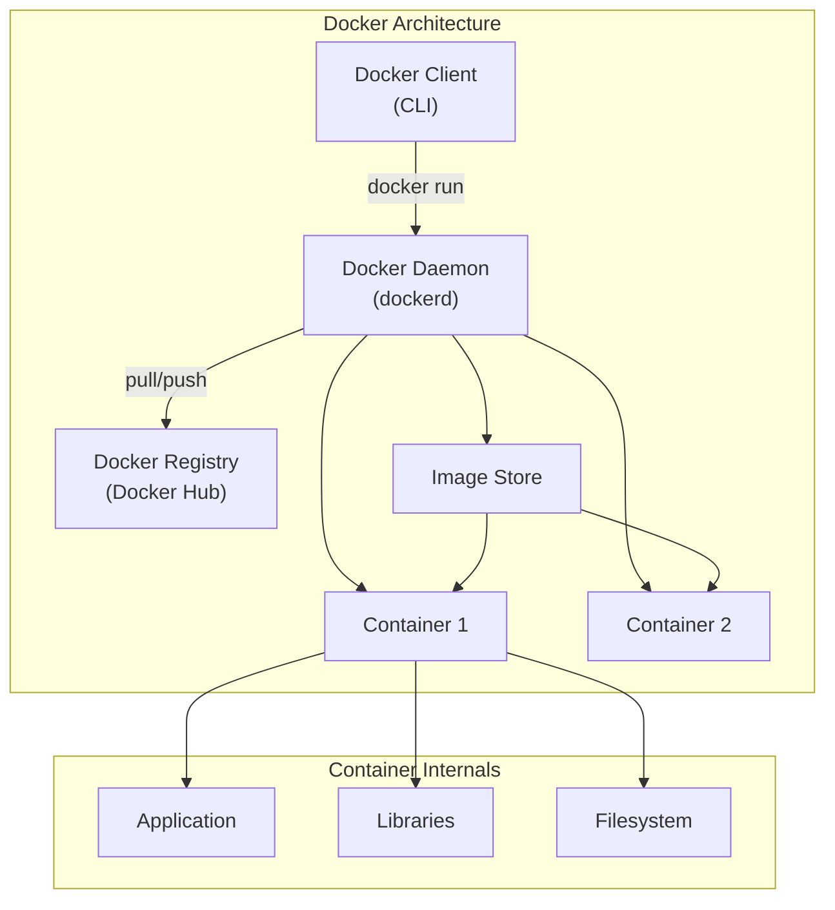
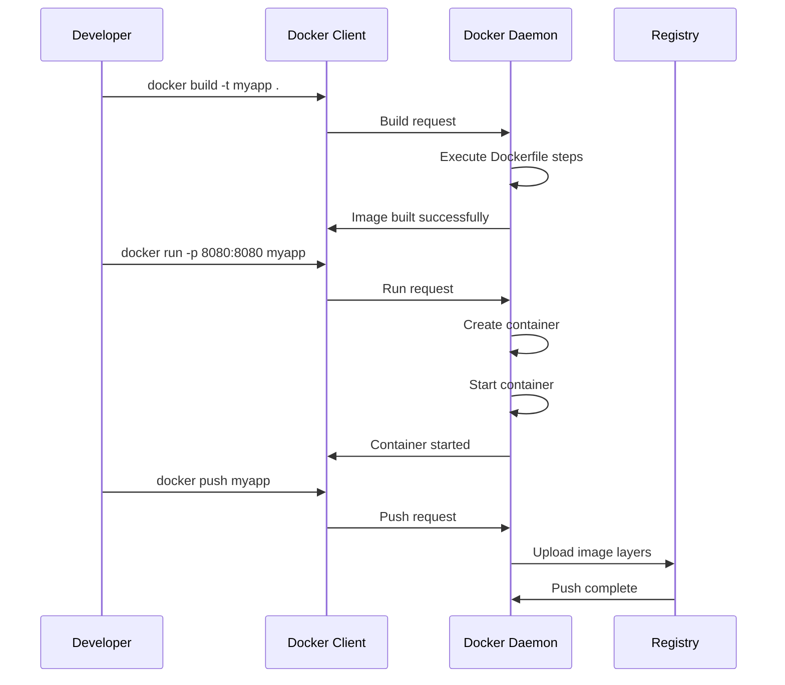

# 1. Introduction

Docker is an open-source platform that automates the deployment, scaling, and management of applications using containerization. Containers package an application with all its dependencies, libraries, and configuration files, ensuring consistent behavior across different environments.

# 2. Learning Objectives

- Understand what containers are and how they differ from virtual machines
- Learn Docker architecture (daemon, client, registry)
- Create and manage Docker images and containers
- Write Dockerfiles for Java applications
- Understand Docker image layers and caching

# 3. Prerequisites

- Basic command-line knowledge
- Understanding of software packaging and dependencies
- Familiarity with Java application structure

# 4. Why This Concept Exists

Before Docker, developers faced the "it works on my machine" problem. Applications behaved differently across development, staging, and production environments due to OS differences, library versions, and configuration variations. Docker solves this by packaging the entire runtime environment into a portable container.

# 5. Problem Statement

**Without Docker:**
- Environment inconsistencies between development and production
- Complex deployment procedures requiring manual configuration
- Resource inefficiency from running full virtual machines
- Difficulty in scaling applications quickly

**With Docker:**
- Consistent environments everywhere
- Lightweight, fast-starting containers
- Easy scaling and orchestration
- Simplified CI/CD pipelines

# 6. Theory

**Container vs Virtual Machine:**

| Feature | Container | VM |
|---------|-----------|-----|
| Virtualization Level | OS-level | Hardware-level |
| Startup Time | Seconds | Minutes |
| Size | MBs | GBs |
| Isolation | Process-level | Full OS |
| Performance | Near-native | Overhead |

**Docker Architecture:**
- **Docker Client**: CLI tool that sends commands to the daemon
- **Docker Daemon (dockerd)**: Background service managing containers
- **Docker Registry**: Storage for images (Docker Hub, private registries)
- **Docker Images**: Read-only templates for creating containers
- **Docker Containers**: Running instances of images

# 7. Internal Working

1. When you run `docker run`, the client sends the command to the Docker daemon
2. The daemon checks if the image exists locally; if not, pulls from registry
3. The daemon creates a container from the image using container runtime
4. A writable layer is added on top of the image layers
5. The container runs as an isolated process with its own filesystem and network

**Image Layer System:**
```
┌─────────────────────┐
│   Container Layer   │ (Writable)
├─────────────────────┤
│   Layer 4: COPY    │ (Read-only)
├─────────────────────┤
│   Layer 3: RUN     │ (Read-only)
├─────────────────────┤
│   Layer 2: ENV     │ (Read-only)
├─────────────────────┤
│   Layer 1: FROM    │ (Base image)
└─────────────────────┘
```

# 8. JVM Perspective

Docker containers share the host OS kernel but have isolated:
- Process ID namespace (PID)
- Network namespace (NET)
- Mount namespace (MNT)
- UTS namespace (hostname)

**JVM in Containers:**
- JVM 10+ detects container memory limits automatically
- JVM 8u131+ requires `-XX:+UnlockExperimentalVMOptions -XX:+UseCGroupMemoryLimitForHeap`
- Container memory limit = heap + metaspace + native memory + thread stacks

# 9. Memory Representation

```
Host Machine
├── Docker Daemon
│   ├── Container 1 (Java App)
│   │   ├── JVM Heap (Xmx)
│   │   ├── Metaspace
│   │   ├── Native Memory
│   │   └── Thread Stacks
│   └── Container 2 (Database)
│       └── ...
└── Docker Images (Layered FS)
    ├── base:ubuntu:22.04
    ├── eclipse-temurin:21
    └── my-java-app:latest
```

# 10. Architecture Diagram (Mermaid)



# 11. Flow Diagram (Mermaid)



# 12. Syntax

```bash
# Image commands
docker build -t <name>:<tag> .
docker images
docker rmi <image>
docker pull <image>
docker push <image>

# Container commands
docker run -d -p <host>:<container> <image>
docker ps
docker ps -a
docker stop <container>
docker rm <container>
docker exec -it <container> /bin/bash

# System commands
docker logs <container>
docker inspect <container>
docker system prune
```

# 13. Easy Example

```dockerfile
# Simple Dockerfile for Java application
FROM eclipse-temurin:21-jre
COPY target/app.jar /app.jar
EXPOSE 8080
CMD ["java", "-jar", "/app.jar"]
```

```bash
# Build and run
docker build -t my-java-app .
docker run -p 8080:8080 my-java-app
```

# 14. Medium Example

```dockerfile
# Optimized multi-stage Dockerfile
FROM maven:3.9-eclipse-temurin-21 AS builder
WORKDIR /app
COPY pom.xml .
RUN mvn dependency:go-offline
COPY src ./src
RUN mvn package -DskipTests

FROM eclipse-temurin:21-jre-jammy
WORKDIR /app
COPY --from=builder /app/target/*.jar app.jar
EXPOSE 8080
ENTRYPOINT ["java", "-jar", "app.jar"]
```

# 15. Hard Example

```dockerfile
# Production-ready Dockerfile with security
FROM eclipse-temurin:21-jdk-jammy AS builder
WORKDIR /workspace
COPY mvnw .
COPY .mvn .mvn
COPY pom.xml .
RUN ./mvnw dependency:go-offline -B
COPY src src
RUN ./mvnw package -DskipTests -B

FROM eclipse-temurin:21-jre-jammy
RUN groupadd -r spring && useradd -r -g spring spring
WORKDIR /app
COPY --from=builder /workspace/target/*.jar app.jar
RUN chown spring:spring app.jar
USER spring
EXPOSE 8080
ENTRYPOINT ["java", "-jar", "app.jar"]
```

# 16. Enterprise Example

```dockerfile
# Enterprise Java Application Dockerfile
FROM eclipse-temurin:21-jdk-jammy AS builder
WORKDIR /app
COPY pom.xml .
RUN mvn dependency:go-offline
COPY src ./src
RUN mvn clean package -DskipTests -B

FROM eclipse-temurin:21-jre-jammy
RUN apt-get update && apt-get install -y --no-install-recommends \
    curl && rm -rf /var/lib/apt/lists/*
RUN groupadd -r appuser && useradd -r -g appuser appuser
WORKDIR /app
COPY --from=builder /app/target/*.jar app.jar
COPY --from=builder /app/config ./config
RUN chown -R appuser:appuser /app
USER appuser
HEALTHCHECK --interval=30s --timeout=3s \
  CMD curl -f http://localhost:8080/actuator/health || exit 1
EXPOSE 8080 8443
ENTRYPOINT ["java", \
  "-XX:+UseContainerSupport", \
  "-XX:MaxRAMPercentage=75.0", \
  "-Djava.security.egd=file:/dev/./urandom", \
  "-jar", "app.jar"]
```

# 17. Performance

**Docker Performance Metrics:**
- Container startup: 100-500ms (vs VM: 30-60s)
- Image pull (cached): Near-instant
- Memory overhead: <10MB per container
- CPU overhead: <2% for containerization

**Optimization Tips:**
- Use smaller base images (Alpine, JRE vs JDK)
- Order Dockerfile commands by change frequency
- Use `.dockerignore` to exclude unnecessary files
- Leverage multi-stage builds

# 18. Time & Space Complexity

| Operation | Time | Space |
|-----------|------|-------|
| Build image | O(layers) | O(image size) |
| Pull image | O(network) | O(image size) |
| Start container | O(1) | O(writable layer) |
| Stop container | O(1) | O(0) |

# 19. Thread Safety

Docker containers are isolated at the OS level:
- Each container has its own process space
- Network interfaces are isolated
- Filesystem is isolated (unless volumes shared)
- Memory is bounded by cgroups

Java thread safety within containers follows standard JVM thread safety rules.

# 20. Best Practices

1. Use multi-stage builds to reduce image size
2. Run as non-root user
3. Use specific image tags, not `latest`
4. Minimize layers by combining RUN commands
5. Use `.dockerignore` file
6. Scan images for vulnerabilities
7. Use health checks
8. Set resource limits
9. Use init processes for proper signal handling
10. Keep containers immutable

# 21. Common Mistakes

- Running as root user
- Not using `.dockerignore`
- Using `latest` tag in production
- Not optimizing layer caching
- Including unnecessary files in image
- Not setting resource limits
- Using `docker exec` for debugging in production

# 22. Pitfalls

- JVM may not respect container memory limits (pre-Java 10)
- Containers are not mini-VMs; they share kernel
- Port conflicts if host ports are in use
- Data loss when containers are removed without volumes
- Image layer caching may cause stale builds

# 23. Debugging Tips

```bash
# Check container logs
docker logs <container>

# Execute into container
docker exec -it <container> /bin/bash

# Check container resources
docker stats <container>

# Inspect container configuration
docker inspect <container>

# Check image layers
docker history <image>
```

# 24. Comparison Table

| Feature | Docker | Podman | LXC |
|---------|--------|--------|-----|
| Daemon | Required | Daemonless | N/A |
| Rootless | Optional | Default | No |
| OCI Compliant | Yes | Yes | No |
| Kubernetes | Native | Compatible | No |
| Learning Curve | Low | Medium | High |

# 25. Decision Tree

```
Need to package application?
├── Single application? → Docker
├── Multiple services? → Docker Compose
├── Production cluster? → Kubernetes
└── Simple isolation? → Docker
```

# 26. Interview Questions

1. **What is the difference between a container and a virtual machine?**
   Containers share the host OS kernel and isolate at the process level; VMs virtualize hardware and run complete OS instances.

2. **How does Docker achieve isolation?**
   Through Linux namespaces (PID, NET, MNT, UTS, IPC, USER) and cgroups for resource limits.

3. **What are Docker image layers?**
   Each Dockerfile instruction creates a read-only layer. Layers are cached and shared between images to save space.

4. **Why use multi-stage builds?**
   To separate build-time dependencies from runtime, reducing final image size significantly.

5. **How do you handle configuration in Docker?**
   Environment variables, Docker secrets, config files mounted via volumes, or external config services.

6. **What is the difference between COPY and ADD?**
   COPY copies files; ADD can also handle URLs and tar extraction. Prefer COPY for transparency.

7. **How do you debug a failing container?**
   Check logs (`docker logs`), exec into container, check entrypoint/cmd, verify environment variables.

8. **What is a Dockerfile best practice for Java apps?**
   Use multi-stage build, copy dependency layer first for caching, run as non-root, set JVM memory flags.

9. **How does Docker networking work?**
   Docker creates virtual bridges; containers connect to bridges; port mapping forwards traffic to containers.

10. **What is the difference between CMD and ENTRYPOINT?**
    CMD provides default arguments; ENTRYPOINT defines the executable. CMD can be overridden; ENTRYPOINT is fixed.

11. **How do you reduce Docker image size?**
    Use smaller base images, multi-stage builds, `.dockerignore`, combine RUN commands.

12. **What is a volume in Docker?**
    A mechanism for persisting data beyond container lifecycle; stored outside container filesystem.

13. **How does Docker handle logging?**
    Containers write to stdout/stderr; Docker captures via logging drivers (json-file, syslog, fluentd).

14. **What is Docker Compose?**
    A tool for defining and running multi-container applications using YAML configuration.

15. **How do you secure Docker containers?**
    Run as non-root, scan images, use minimal base images, don't store secrets in images, use read-only filesystems.

16. **What is the difference between docker stop and docker kill?**
    `stop` sends SIGTERM then SIGKILL; `kill` sends SIGKILL immediately.

# 27. Exercises

**Level 1:**
1. Create a Dockerfile for a simple Java "Hello World" application
2. Build the image and run a container
3. Verify the application works by accessing it via curl

**Level 2:**
1. Create an optimized multi-stage Dockerfile for a Spring Boot application
2. Add health checks and non-root user
3. Run with resource limits (-m, --cpus)

**Level 3:**
1. Set up a Docker network with two containers (app + database)
2. Configure the app to connect to the database via container name
3. Use volumes for database persistence

# 28. Summary

Docker revolutionizes application deployment by providing consistent, lightweight, and portable containers. Understanding Docker fundamentals is essential for modern Java developers, enabling easier development, testing, and deployment workflows. Key takeaways: use multi-stage builds, follow security best practices, and understand container networking for effective microservices architecture.

# 29. References

- [Docker Official Documentation](https://docs.docker.com/)
- [Docker Best Practices](https://docs.docker.com/develop/develop-images/dockerfile_best-practices/)
- [Java in Containers](https://developers.redhat.com/blog/2017/03/14/java-inside-docker)
- [Docker Security](https://docs.docker.com/engine/security/)
- [OCI Runtime Specification](https://github.com/opencontainers/runtime-spec)
