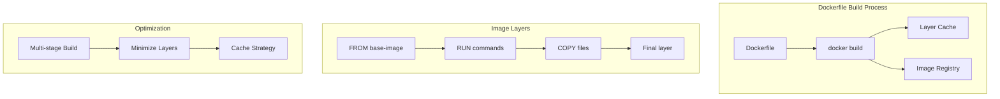
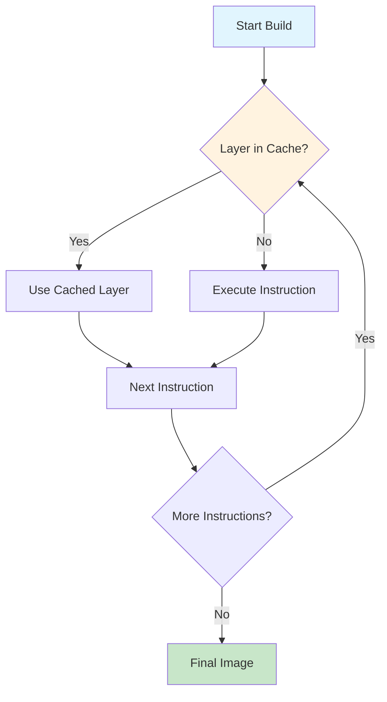

# 1. Introduction

A Dockerfile is a text file containing instructions for building a Docker image. Each instruction creates a layer in the image, and understanding how Dockerfiles work is crucial for creating efficient, secure, and maintainable container images.

# 2. Learning Objectives

- Master Dockerfile instructions and their effects
- Understand multi-stage builds and their benefits
- Optimize image size and build performance
- Implement security best practices in Dockerfiles
- Debug and troubleshoot Dockerfile issues

# 3. Prerequisites

- Docker fundamentals (Module 21.1)
- Basic understanding of Linux commands
- Knowledge of build processes (Maven/Gradle for Java)

# 4. Why This Concept Exists

Dockerfiles provide a reproducible, version-controllable way to build container images. Without proper Dockerfile optimization, images become bloated, insecure, and slow to build. Understanding Dockerfile internals enables developers to create production-ready containers.

# 5. Problem Statement

**Without proper Dockerfile knowledge:**
- Large image sizes wasting storage and network bandwidth
- Slow build times due to poor layer caching
- Security vulnerabilities from unnecessary packages
- Non-reproducible builds

**With proper Dockerfile knowledge:**
- Minimal, optimized images
- Fast builds using layer caching
- Secure, hardened containers
- Consistent, reproducible builds

# 6. Theory

**Dockerfile Instructions:**

| Instruction | Purpose |
|-------------|---------|
| FROM | Base image |
| RUN | Execute commands |
| COPY | Copy files to image |
| ADD | Copy with extra features |
| CMD | Default command |
| ENTRYPOINT | Fixed executable |
| ENV | Environment variables |
| EXPOSE | Document ports |
| WORKDIR | Set working directory |
| USER | Set user |
| HEALTHCHECK | Container health |

**Layer Caching:**
Each instruction creates a layer. Docker caches layers and reuses them if the instruction and inputs haven't changed. Order matters - put rarely-changing instructions first.

# 7. Internal Working

**Build Process:**
1. Docker reads Dockerfile line by line
2. Each instruction creates a temporary container
3. Container commits changes as a new layer
4. Temporary container is discarded
5. Final image is the stack of layers

**Layer Optimization:**
```
# Bad: Each RUN creates a layer, no cleanup
RUN apt-get update
RUN apt-get install -y curl
RUN apt-get clean

# Good: Single layer with cleanup
RUN apt-get update && \
    apt-get install -y --no-install-recommends curl && \
    apt-get clean && \
    rm -rf /var/lib/apt/lists/*
```

# 8. JVM Perspective

**JVM Memory in Docker:**
```dockerfile
# JVM flags for container-aware memory management
ENTRYPOINT ["java", \
  "-XX:+UseContainerSupport", \
  "-XX:MaxRAMPercentage=75.0", \
  "-XX:InitialRAMPercentage=50.0", \
  "-jar", "app.jar"]
```

- `-XX:+UseContainerSupport`: Enabled by default in Java 10+
- `-XX:MaxRAMPercentage`: Percentage of container memory for heap
- Metaspace and native memory are outside heap allocation

# 9. Memory Representation

```
Image Layers (Read-only)
┌─────────────────────────┐
│ Layer N: Application    │ ← Most specific
├─────────────────────────┤
│ Layer 2: Dependencies   │
├─────────────────────────┤
│ Layer 1: Base OS        │ ← Most shared
└─────────────────────────┘

Container Layer (Writable)
┌─────────────────────────┐
│ Runtime data, logs,     │
│ temp files              │
└─────────────────────────┘
```

# 10. Architecture Diagram (Mermaid)



# 11. Flow Diagram (Mermaid)



# 12. Syntax

```dockerfile
# FROM - Base image (must be first)
FROM <image>:<tag>

# RUN - Execute command
RUN <command>
RUN ["executable", "param1"]

# COPY - Copy files
COPY <src> <dest>
COPY --chown=user:group <src> <dest>

# ADD - Copy with extras (auto-extracts tar)
ADD <src> <dest>
ADD <url> <dest>

# CMD - Default command (overridable)
CMD ["executable", "param1"]
CMD <command> param1

# ENTRYPOINT - Fixed executable
ENTRYPOINT ["executable", "param1"]

# ENV - Environment variables
ENV KEY=VALUE

# EXPOSE - Document port
EXPOSE <port>

# WORKDIR - Set working directory
WORKDIR /path

# USER - Set user
USER <user>

# HEALTHCHECK - Health monitoring
HEALTHCHECK --interval=30s CMD curl -f http://localhost/
```

# 13. Easy Example

```dockerfile
# Simple Dockerfile
FROM eclipse-temurin:21-jre
WORKDIR /app
COPY target/app.jar .
EXPOSE 8080
CMD ["java", "-jar", "app.jar"]
```

# 14. Medium Example

```dockerfile
# Optimized with layer caching
FROM eclipse-temurin:21-jdk AS builder
WORKDIR /app

# Copy dependency files first (rarely changes)
COPY pom.xml .
RUN mvn dependency:go-offline -B

# Copy source code (changes frequently)
COPY src ./src
RUN mvn package -DskipTests -B

# Runtime image
FROM eclipse-temurin:21-jre
WORKDIR /app
COPY --from=builder /app/target/*.jar app.jar
EXPOSE 8080
CMD ["java", "-jar", "app.jar"]
```

# 15. Hard Example

```dockerfile
# Production-grade multi-stage build
FROM eclipse-temurin:21-jdk-jammy AS builder
WORKDIR /workspace

# Cache Maven wrapper
COPY mvnw ./
COPY .mvn .mvn
RUN chmod +x mvnw

# Cache dependencies
COPY pom.xml .
RUN ./mvnw dependency:go-offline -B

# Build application
COPY src src
RUN ./mvnw package -DskipTests -B

# Runtime stage
FROM eclipse-temurin:21-jre-jammy

# Security: install only needed packages
RUN apt-get update && \
    apt-get install -y --no-install-recommends curl && \
    apt-get clean && \
    rm -rf /var/lib/apt/lists/*

# Create non-root user
RUN groupadd -r spring && useradd -r -g spring spring

WORKDIR /app

# Copy only necessary artifacts
COPY --from=builder /workspace/target/app.jar app.jar

# Set ownership
RUN chown spring:spring app.jar

# Switch to non-root user
USER spring

# Document port
EXPOSE 8080

# Health check
HEALTHCHECK --interval=30s --timeout=3s --retries=3 \
  CMD curl -f http://localhost:8080/actuator/health || exit 1

# JVM tuning for containers
ENTRYPOINT ["java", \
  "-XX:+UseContainerSupport", \
  "-XX:MaxRAMPercentage=75.0", \
  "-Djava.security.egd=file:/dev/./urandom", \
  "-jar", "app.jar"]
```

# 16. Enterprise Example

```dockerfile
# Enterprise multi-module Maven project
FROM eclipse-temurin:21-jdk-jammy AS builder
WORKDIR /workspace

# Copy Maven configuration
COPY pom.xml ./
COPY mvnw ./
COPY .mvn .mvn
RUN chmod +x mvnw

# Cache all dependencies
RUN ./mvnw dependency:go-offline -B -Dmaven.wagon.http.pool=false

# Copy source code
COPY src src
COPY modules modules

# Build all modules
RUN ./mvnw install -DskipTests -B

# Extract specific module jar
RUN mkdir -p /workspace/app && \
    cp modules/my-module/target/*.jar /workspace/app/app.jar

# Runtime stage
FROM eclipse-temurin:21-jre-jammy

# Security hardening
RUN groupadd -r appgroup && \
    useradd -r -g appgroup -d /app -s /sbin/nologin appuser

WORKDIR /app

# Copy application
COPY --from=builder /workspace/app/app.jar .

# Copy configuration
COPY config/ ./config/

# Set permissions
RUN chown -R appuser:appgroup /app

USER appuser

# Expose multiple ports (app + management)
EXPOSE 8080 8443 9090

# Detailed health check
HEALTHCHECK --interval=30s --timeout=5s --start-period=60s --retries=3 \
  CMD curl -f http://localhost:8080/actuator/health || \
      curl -f http://localhost:8443/actuator/health || exit 1

# JVM configuration for production
ENTRYPOINT ["java", \
  "-XX:+UseContainerSupport", \
  "-XX:MaxRAMPercentage=75.0", \
  "-XX:InitialRAMPercentage=50.0", \
  "-XX:+UseG1GC", \
  "-XX:MaxGCPauseMillis=200", \
  "-Djava.security.egd=file:/dev/./urandom", \
  "-Dspring.profiles.active=${SPRING_PROFILES_ACTIVE}", \
  "-jar", "app.jar"]
```

# 17. Performance

**Build Time Optimization:**
| Technique | Impact |
|-----------|--------|
| Layer ordering | 50-80% faster rebuilds |
| Multi-stage builds | 60-90% smaller images |
| `.dockerignore` | 30-50% faster builds |
| Build cache | Near-instant rebuilds |

**Image Size Comparison:**
| Base Image | Size |
|------------|------|
| eclipse-temurin:21-jdk | ~450MB |
| eclipse-temurin:21-jre | ~250MB |
| eclipse-temurin:21-jre-alpine | ~180MB |

# 18. Time & Space Complexity

| Operation | Time | Space |
|-----------|------|-------|
| Build (cached) | O(1) | O(cached layers) |
| Build (no cache) | O(n) | O(total image) |
| Layer check | O(1) | O(metadata) |

# 19. Thread Safety

Dockerfile instructions execute sequentially (single-threaded). BuildKit enables parallel layer building for independent instructions:

```dockerfile
# These can be built in parallel with BuildKit
COPY config/ ./config/
COPY static/ ./static/
```

# 20. Best Practices

1. Order instructions from least to most frequently changing
2. Combine RUN commands to reduce layers
3. Use multi-stage builds for Java applications
4. Copy dependency files before source code
5. Use `.dockerignore` to exclude unnecessary files
6. Run as non-root user
7. Use specific image tags
8. Add HEALTHCHECK instructions
9. Minimize installed packages
10. Use BuildKit for parallel builds

# 21. Common Mistakes

- Using `COPY . .` before dependency caching
- Not cleaning up package manager caches
- Running as root user
- Using ADD when COPY suffices
- Not using `.dockerignore`
- Hardcoding secrets in Dockerfile
- Using `latest` tag in production

# 22. Pitfalls

- `COPY` invalidates cache if any file changes
- `RUN apt-get update` without `apt-get install` wastes layers
- `CMD` and `ENTRYPOINT` interact in complex ways
- `.dockerignore` patterns are not intuitive
- BuildKit has different caching behavior

# 23. Debugging Tips

```bash
# Build with no cache
docker build --no-cache -t myapp .

# Build with BuildKit
DOCKER_BUILDKIT=1 docker build -t myapp .

# Inspect intermediate containers
docker run -it <intermediate-image> /bin/bash

# Check build history
docker history <image>

# Debug build failures
docker build --progress=plain -t myapp .
```

# 24. Comparison Table

| Feature | COPY | ADD |
|---------|------|-----|
| Local files | Yes | Yes |
| URLs | No | Yes |
| Auto-extract tar | No | Yes |
| Transparency | High | Low |
| Recommendation | Default | Special cases |

# 25. Decision Tree

```
Need to add files to image?
├── Simple copy? → COPY
├── Need URL download? → ADD
├── Need tar extraction? → ADD
└── Default? → COPY

Need to run commands?
├── Build-time only? → RUN
├── Runtime default? → CMD
└── Runtime fixed? → ENTRYPOINT
```

# 26. Interview Questions

1. **What is the difference between COPY and ADD?**
   COPY simply copies files; ADD can download URLs and auto-extract tar files. Use COPY for transparency unless you need ADD's features.

2. **How does Docker layer caching work?**
   Each instruction creates a layer. Docker caches layers and reuses them if the instruction and its context haven't changed. Order instructions from least to most frequently changing.

3. **What is a multi-stage build?**
   A Dockerfile with multiple FROM statements. Each stage builds independently, and you can copy artifacts between stages. This separates build-time dependencies from runtime.

4. **Why should you copy dependency files before source code?**
   Dependency files (pom.xml, package.json) change less frequently. By copying them first, Docker can cache the dependency installation layer and only rebuild when dependencies change.

5. **What is the difference between CMD and ENTRYPOINT?**
   CMD provides default arguments that can be overridden at runtime. ENTRYPOINT defines the fixed executable that always runs. They can be combined.

6. **How do you reduce Docker image size?**
   Use multi-stage builds, smaller base images (Alpine), combine RUN commands, clean up caches, and use .dockerignore.

7. **What is BuildKit?**
   BuildKit is Docker's modern build backend that enables parallel layer building, better caching, and secret mounting during build.

8. **How do you handle secrets in Dockerfiles?**
   Never hardcode secrets. Use BuildKit secret mounts, build args (non-persistent), or external secret management.

9. **What is the purpose of HEALTHCHECK?**
   It tells Docker how to verify if the container is healthy. Docker can restart unhealthy containers in orchestration systems.

10. **Why use `--no-install-recommends` with apt-get?**
    It prevents installing recommended packages that aren't strictly necessary, reducing image size.

11. **What is a dangling image?**
    An image with no tag that's not referenced by any container. Created during rebuilds. Clean with `docker image prune`.

12. **How do you debug a Dockerfile build failure?**
    Use `--progress=plain` for verbose output, `--no-cache` to force rebuild, or run intermediate containers interactively.

13. **What is the .dockerignore file?**
    A file listing patterns of files to exclude from the build context. Reduces build time and prevents unnecessary cache invalidation.

14. **Why run as non-root in Docker?**
    Security best practice. If an attacker escapes the container, they gain root access. Running as non-root limits damage.

15. **How do you handle JVM memory in containers?**
    Use `-XX:+UseContainerSupport` (default in Java 10+) and `-XX:MaxRAMPercentage` instead of fixed `-Xmx` values.

# 27. Exercises

**Level 1:**
1. Create a Dockerfile for a Java application
2. Build and run it
3. Inspect the image layers with `docker history`

**Level 2:**
1. Convert a single-stage Dockerfile to multi-stage
2. Compare image sizes before and after
3. Add a health check instruction

**Level 3:**
1. Create a production-ready Dockerfile with non-root user
2. Implement BuildKit caching for Maven dependencies
3. Add security scanning to your build process

# 28. Summary

Dockerfiles are the foundation of container image creation. Mastering Dockerfile instructions, multi-stage builds, and optimization techniques enables developers to create efficient, secure, and maintainable container images. Key principles: order instructions strategically, minimize layers, use multi-stage builds, and follow security best practices.

# 29. References

- [Dockerfile Reference](https://docs.docker.com/engine/reference/builder/)
- [Dockerfile Best Practices](https://docs.docker.com/develop/develop-images/dockerfile_best-practices/)
- [BuildKit Documentation](https://docs.docker.com/build/buildkit/)
- [Multi-stage Builds](https://docs.docker.com/build/building/multi-stage/)
- [Java Container Support](https://docs.oracle.com/en/java/javase/21/docs/specs/man/java.html)
