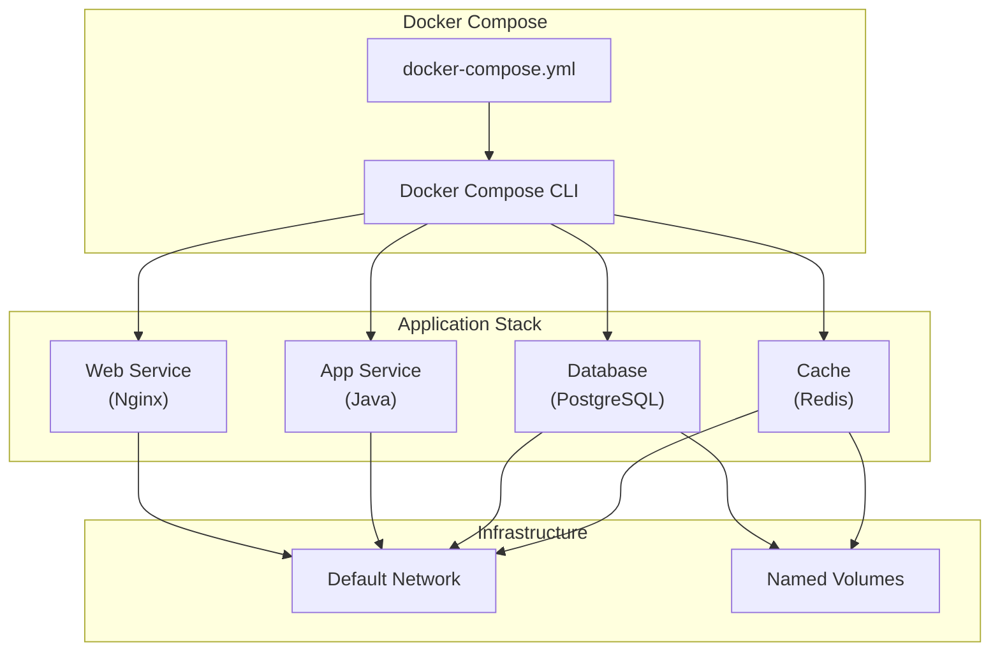
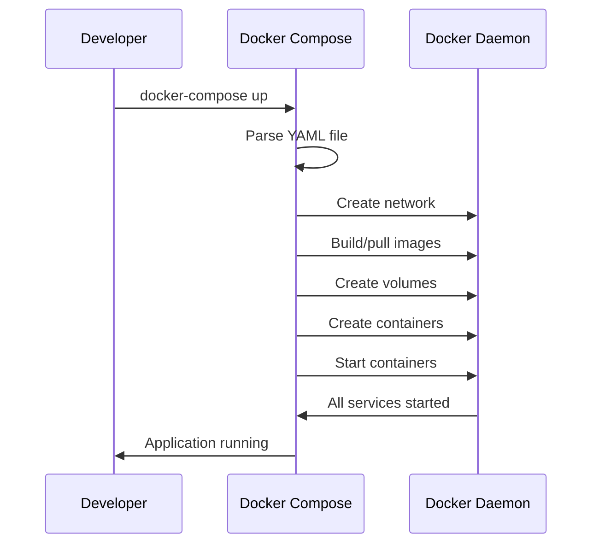

# 1. Introduction

Docker Compose is a tool for defining and running multi-container Docker applications. Using a YAML file, you configure all services, networks, and volumes needed for your application, then create and start all services with a single command.

# 2. Learning Objectives

- Define multi-container applications with docker-compose.yml
- Configure service dependencies and networking
- Manage persistent data with volumes
- Use environment variables and secrets
- Scale services and manage development workflows

# 3. Prerequisites

- Docker fundamentals (Module 21.1)
- Understanding of client-server architecture
- Basic YAML syntax knowledge

# 4. Why This Concept Exists

Modern applications consist of multiple services (web servers, databases, caches, message queues). Manually managing multiple containers with `docker run` commands is error-prone and hard to replicate. Docker Compose provides declarative configuration for entire application stacks.

# 5. Problem Statement

**Without Docker Compose:**
- Complex `docker run` commands with many flags
- Hard to replicate environments
- Manual network configuration
- Difficult service dependency management

**With Docker Compose:**
- Single YAML file defines entire stack
- One command starts everything
- Automatic networking
- Built-in service dependencies

# 6. Theory

**Docker Compose Architecture:**
```yaml
version: '3.8'
services:
  web:
    image: nginx:alpine
    ports:
      - "80:80"
  app:
    build: .
    ports:
      - "8080:8080"
    depends_on:
      - db
  db:
    image: postgres:15
    volumes:
      - db-data:/var/lib/postgresql/data
volumes:
  db-data:
networks:
  default:
    driver: bridge
```

**Key Concepts:**
- **Services**: Containers that make up your application
- **Networks**: Communication channels between services
- **Volumes**: Persistent data storage
- **Configs**: Non-sensitive configuration data
- **Secrets**: Sensitive configuration data

# 7. Internal Working

1. Docker Compose reads the YAML file
2. Creates a default network for the project
3. Builds images if `build` is specified
4. Creates containers with specified configurations
5. Connects containers to the network
6. Starts containers in dependency order

**Service Dependencies:**
```yaml
services:
  web:
    depends_on:
      app:
        condition: service_healthy
  app:
    depends_on:
      db:
        condition: service_healthy
```

# 8. JVM Perspective

**JVM Configuration in Compose:**
```yaml
services:
  app:
    build: .
    environment:
      - JAVA_OPTS=-Xms512m -Xmx1024m
      - SPRING_PROFILES_ACTIVE=docker
    deploy:
      resources:
        limits:
          memory: 2G
          cpus: '1.5'
```

- JVM must respect container memory limits
- Use percentage-based heap settings
- Configure Metaspace and thread stack sizes

# 9. Memory Representation

```
Host Machine
├── Docker Compose Project
│   ├── Network: myapp_default (172.18.0.0/16)
│   ├── Volume: myapp_db-data
│   ├── Container: myapp_web_1
│   ├── Container: myapp_app_1
│   └── Container: myapp_db_1
└── Docker Daemon
```

# 10. Architecture Diagram (Mermaid)



# 11. Flow Diagram (Mermaid)



# 12. Syntax

```yaml
# Basic structure
version: '3.8'
services:
  <service-name>:
    image: <image>
    build: <context>
    ports:
      - "<host>:<container>"
    environment:
      - KEY=VALUE
    volumes:
      - <source>:<target>
    depends_on:
      - <service>
    networks:
      - <network>
    deploy:
      resources:
        limits:
          memory: <value>
          cpus: '<value>'

networks:
  <network-name>:
    driver: bridge

volumes:
  <volume-name>:
    driver: local
```

# 13. Easy Example

```yaml
# docker-compose.yml for simple app
version: '3.8'
services:
  web:
    image: nginx:alpine
    ports:
      - "80:80"
    volumes:
      - ./html:/usr/share/nginx/html
```

```bash
# Start
docker-compose up -d

# Stop
docker-compose down
```

# 14. Medium Example

```yaml
# Spring Boot with PostgreSQL
version: '3.8'
services:
  app:
    build: .
    ports:
      - "8080:8080"
    environment:
      - SPRING_DATASOURCE_URL=jdbc:postgresql://db:5432/mydb
      - SPRING_DATASOURCE_USERNAME=postgres
      - SPRING_DATASOURCE_PASSWORD=secret
    depends_on:
      db:
        condition: service_healthy
    networks:
      - backend

  db:
    image: postgres:15
    environment:
      - POSTGRES_DB=mydb
      - POSTGRES_PASSWORD=secret
    volumes:
      - pgdata:/var/lib/postgresql/data
    healthcheck:
      test: ["CMD-SHELL", "pg_isready -U postgres"]
      interval: 5s
      timeout: 5s
      retries: 5
    networks:
      - backend

networks:
  backend:

volumes:
  pgdata:
```

# 15. Hard Example

```yaml
# Full-stack microservices application
version: '3.8'

services:
  gateway:
    build:
      context: ./api-gateway
      dockerfile: Dockerfile
    ports:
      - "8080:8080"
    environment:
      - EUREKA_CLIENT_SERVICEURL_DEFAULTZONE=http://discovery:8761/eureka
      - SPRING_PROFILES_ACTIVE=docker
    depends_on:
      discovery:
        condition: service_healthy
    networks:
      - microservices

  discovery:
    build:
      context: ./service-discovery
      dockerfile: Dockerfile
    ports:
      - "8761:8761"
    healthcheck:
      test: ["CMD", "curl", "-f", "http://localhost:8761/actuator/health"]
      interval: 10s
      timeout: 5s
      retries: 5
      start_period: 30s
    networks:
      - microservices

  user-service:
    build:
      context: ./user-service
      dockerfile: Dockerfile
    environment:
      - EUREKA_CLIENT_SERVICEURL_DEFAULTZONE=http://discovery:8761/eureka
      - SPRING_DATASOURCE_URL=jdbc:postgresql://user-db:5432/users
    depends_on:
      user-db:
        condition: service_healthy
    networks:
      - microservices
      - user-network

  user-db:
    image: postgres:15-alpine
    environment:
      - POSTGRES_DB=users
      - POSTGRES_USER=user
      - POSTGRES_PASSWORD=secret
    volumes:
      - user-data:/var/lib/postgresql/data
    healthcheck:
      test: ["CMD-SHELL", "pg_isready -U user"]
      interval: 5s
      timeout: 5s
      retries: 5
    networks:
      - user-network

  order-service:
    build:
      context: ./order-service
      dockerfile: Dockerfile
    environment:
      - EUREKA_CLIENT_SERVICEURL_DEFAULTZONE=http://discovery:8761/eureka
      - SPRING_REDIS_HOST=redis
    depends_on:
      - redis
    networks:
      - microservices
      - order-network

  redis:
    image: redis:7-alpine
    volumes:
      - redis-data:/data
    networks:
      - order-network

  rabbitmq:
    image: rabbitmq:3-management
    ports:
      - "15672:15672"
    environment:
      - RABBITMQ_DEFAULT_USER=admin
      - RABBITMQ_DEFAULT_PASS=secret
    networks:
      - microservices

  postgres:
    image: postgres:15-alpine
    environment:
      - POSTGRES_DB=maindb
      - POSTGRES_USER=admin
      - POSTGRES_PASSWORD=secret
    volumes:
      - postgres-data:/var/lib/postgresql/data
    networks:
      - microservices

networks:
  microservices:
  user-network:
  order-network:

volumes:
  user-data:
  order-data:
  redis-data:
  postgres-data:
```

# 16. Enterprise Example

```yaml
# Production-grade enterprise application
version: '3.8'

x-common-env: &common-env
  JAVA_OPTS: "-XX:+UseContainerSupport -XX:MaxRAMPercentage=75.0"
  SPRING_PROFILES_ACTIVE: "docker"
  LOGGING_LEVEL_ROOT: "INFO"

services:
  traefik:
    image: traefik:v2.10
    command:
      - "--api.dashboard=true"
      - "--providers.docker=true"
      - "--entrypoints.web.address=:80"
    ports:
      - "80:80"
      - "8080:8080"
    volumes:
      - /var/run/docker.sock:/var/run/docker.sock:ro
    networks:
      - web

  app:
    build:
      context: .
      dockerfile: Dockerfile
      args:
        - BUILD_VERSION=${BUILD_VERSION:-latest}
    <<: *common-env
    ports:
      - "8080"
    deploy:
      replicas: 3
      resources:
        limits:
          memory: 1G
          cpus: '1.0'
      update_config:
        parallelism: 1
        delay: 30s
      restart_policy:
        condition: on-failure
        max_attempts: 3
    healthcheck:
      test: ["CMD", "curl", "-f", "http://localhost:8080/actuator/health"]
      interval: 30s
      timeout: 10s
      retries: 3
      start_period: 60s
    depends_on:
      db:
        condition: service_healthy
      redis:
        condition: service_healthy
    labels:
      - "traefik.enable=true"
      - "traefik.http.routers.app.rule=Host(`app.example.com`)"
      - "traefik.http.services.app.loadbalancer.server.port=8080"
    networks:
      - web
      - backend

  db:
    image: postgres:15-alpine
    environment:
      POSTGRES_DB: ${DB_NAME}
      POSTGRES_USER: ${DB_USER}
      POSTGRES_PASSWORD_FILE: /run/secrets/db_password
    secrets:
      - db_password
    volumes:
      - pgdata:/var/lib/postgresql/data
      - ./init-scripts:/docker-entrypoint-initdb.d
    healthcheck:
      test: ["CMD-SHELL", "pg_isready -U ${DB_USER}"]
      interval: 10s
      timeout: 5s
      retries: 5
    deploy:
      resources:
        limits:
          memory: 2G
    networks:
      - backend

  redis:
    image: redis:7-alpine
    command: redis-server --requirepass ${REDIS_PASSWORD}
    volumes:
      - redis-data:/data
    healthcheck:
      test: ["CMD", "redis-cli", "ping"]
      interval: 10s
      timeout: 5s
      retries: 5
    networks:
      - backend

secrets:
  db_password:
    file: ./secrets/db_password.txt

networks:
  web:
  backend:
    driver: bridge

volumes:
  pgdata:
  redis-data:
```

# 17. Performance

**Docker Compose Performance:**
- Startup time: 10-30 seconds (depending on services)
- Memory overhead: ~10MB per container
- Network latency: <1ms between containers on same network

**Optimization:**
- Use named volumes for database data
- Implement health checks for proper startup order
- Use `.env` files for environment-specific configuration

# 18. Time & Space Complexity

| Operation | Time | Space |
|-----------|------|-------|
| Parse YAML | O(1) | O(config) |
| Create network | O(1) | O(metadata) |
| Start services | O(services) | O(services) |
| Stop services | O(services) | O(0) |

# 19. Thread Safety

Docker Compose manages containers as independent processes. Service dependencies ensure proper startup order. Health checks verify service readiness before dependent services start.

# 20. Best Practices

1. Use `.env` files for environment-specific configuration
2. Implement health checks for all services
3. Use named volumes for persistent data
4. Define explicit networks for service isolation
5. Use `depends_on` with `condition: service_healthy`
6. Set resource limits for all services
7. Use secrets for sensitive data
8. Tag images with versions, not `latest`
9. Use multi-stage builds in Dockerfile
10. Regularly update base images

# 21. Common Mistakes

- Using `latest` tag in production
- Not implementing health checks
- Hardcoding secrets in docker-compose.yml
- Not setting resource limits
- Ignoring service startup order
- Not using named volumes for databases
- Exposing unnecessary ports

# 22. Pitfalls

- `depends_on` doesn't wait for service readiness without health checks
- Named volumes persist after `docker-compose down`
- Network names are prefixed with project name
- Environment variables may conflict with host variables
- Build context affects `.dockerignore` effectiveness

# 23. Debugging Tips

```bash
# Check service status
docker-compose ps

# View logs
docker-compose logs <service>
docker-compose logs -f <service>

# Execute command in service
docker-compose exec <service> <command>

# Check service health
docker-compose ps | grep healthy

# Rebuild services
docker-compose build --no-cache
docker-compose up --build
```

# 24. Comparison Table

| Feature | Docker Compose | Kubernetes | Docker Swarm |
|---------|----------------|------------|--------------|
| Complexity | Low | High | Medium |
| Scaling | Manual | Auto | Auto |
| Production | Development | Yes | Yes |
| Learning Curve | Easy | Steep | Medium |
| Use Case | Local dev | Production | Production |

# 25. Decision Tool

```
Need multi-container setup?
├── Local development? → Docker Compose
├── Single host production? → Docker Compose
├── Multi-host production? → Kubernetes
└── Simple clustering? → Docker Swarm
```

# 26. Interview Questions

1. **What is Docker Compose?**
   A tool for defining and running multi-container Docker applications using YAML configuration files.

2. **How does Docker Compose handle service dependencies?**
   Using `depends_on` directive. With `condition: service_healthy`, it waits for health checks to pass.

3. **What is the difference between `docker-compose up` and `docker-compose up -d`?**
   Without `-d`, containers run in foreground with logs attached. With `-d`, containers run in background (detached).

4. **How do you persist data in Docker Compose?**
   Use named volumes defined in the `volumes` section of the YAML file.

5. **How do you handle environment-specific configuration?**
   Use `.env` files, environment variables in YAML, or Docker secrets/configs.

6. **What is the purpose of networks in Docker Compose?**
   To isolate and control communication between services. Default network is created automatically.

7. **How do you scale services in Docker Compose?**
   Use `docker-compose up --scale service=N` or `deploy.replicas` in Swarm mode.

8. **How do you debug a Docker Compose application?**
   Check logs with `docker-compose logs`, exec into containers, verify network connectivity.

9. **What is the difference between `build` and `image` in a service?**
   `build` specifies a Dockerfile to build; `image` specifies a pre-built image to use.

10. **How do you handle secrets in Docker Compose?**
    Use Docker secrets (Swarm mode), environment variables from `.env` files, or mounted secret files.

11. **What is the purpose of the `depends_on` directive?**
    Defines service startup order. With health check conditions, it ensures dependent services are ready.

12. **How do you stop and remove all resources?**
    `docker-compose down -v` removes containers, networks, and volumes.

13. **What is the difference between `docker-compose` and `docker compose`?**
    `docker-compose` (hyphen) is the standalone tool; `docker compose` (space) is the Docker CLI plugin.

14. **How do you override configuration for different environments?**
    Use multiple YAML files with `-f` flag or override files.

15. **What is the purpose of the `profiles` feature?**
    To selectively start services based on profiles, useful for optional services like debug tools.

# 27. Exercises

**Level 1:**
1. Create a docker-compose.yml with nginx and a custom HTML page
2. Start the stack and verify it works
3. Add a second service and configure networking

**Level 2:**
1. Create a Spring Boot + PostgreSQL stack
2. Implement health checks for both services
3. Configure persistent data storage

**Level 3:**
1. Create a microservices stack with 3+ services
2. Implement service discovery with health checks
3. Add monitoring with Prometheus and Grafana

# 28. Summary

Docker Compose simplifies multi-container application management through declarative YAML configuration. It's ideal for development environments, testing, and single-host production deployments. Key features include service dependencies, networking, volumes, and environment configuration.

# 29. References

- [Docker Compose Documentation](https://docs.docker.com/compose/)
- [Compose File Reference](https://docs.docker.com/compose/compose-file/)
- [Docker Compose CLI](https://docs.docker.com/compose/reference/)
- [Networking in Compose](https://docs.docker.com/compose/networking/)
- [Compose Secrets](https://docs.docker.com/compose/secrets/)
