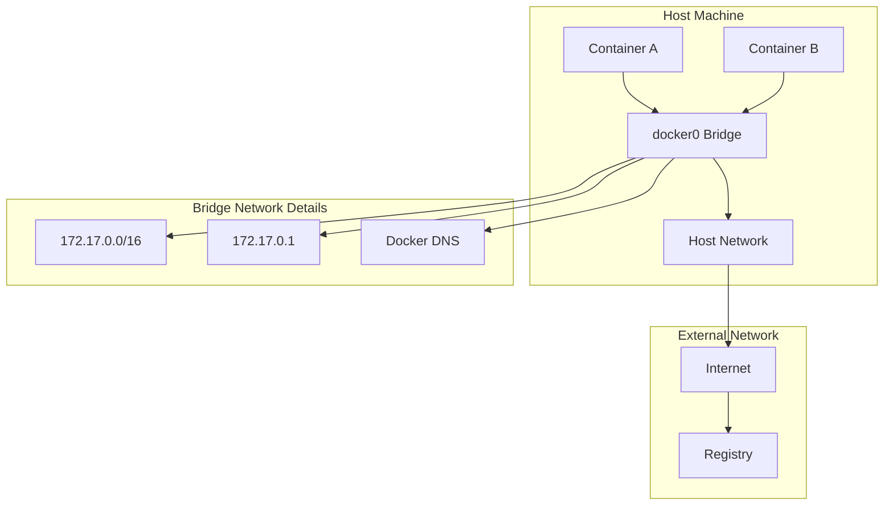
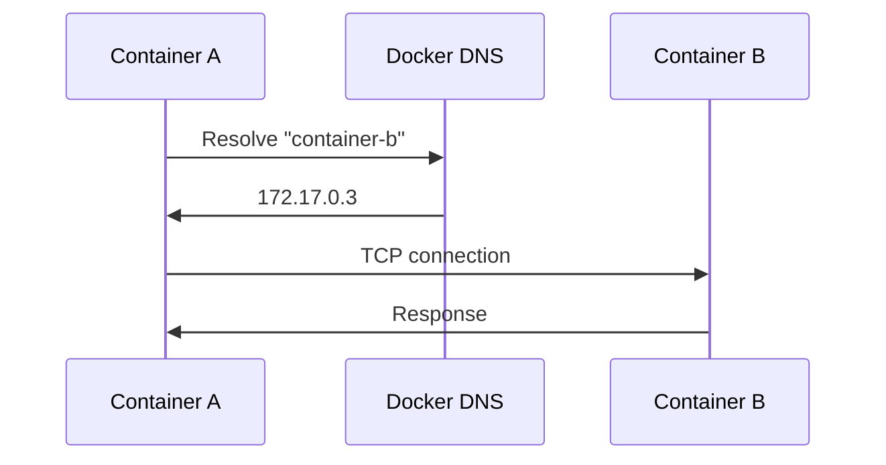

# 1. Introduction

Docker networking enables containers to communicate with each other, with the host machine, and with external networks. Understanding networking is crucial for building distributed applications and microservices architectures.

# 2. Learning Objectives

- Understand Docker network drivers and their use cases
- Configure container networking for different scenarios
- Implement service discovery between containers
- Troubleshoot network connectivity issues
- Secure container communications

# 3. Prerequisites

- Docker fundamentals (Module 21.1)
- Basic networking concepts (TCP/IP, DNS, ports)
- Understanding of containerization

# 4. Why This Concept Exists

Containers need to communicate to form application stacks. Docker networking provides isolation, security, and flexibility for container communication while abstracting complex network configurations.

# 5. Problem Statement

**Without Docker Networking:**
- Containers isolated, no communication
- Manual port mapping for each service
- No service discovery
- Complex network configuration

**With Docker Networking:**
- Automatic DNS resolution between containers
- Isolated network environments
- Easy service discovery
- Flexible network topologies

# 6. Theory

**Network Types:**

| Driver | Use Case | Isolation |
|--------|----------|-----------|
| bridge | Single host, default | Container-level |
| host | Maximum performance | None |
| overlay | Multi-host Swarm | Full |
| macvlan | Direct L2 access | Container-level |
| none | Complete isolation | Complete |

**Bridge Network Details:**
- Default network for containers
- Creates virtual bridge on host
- Containers get IP from subnet
- DNS resolution via container names

# 7. Internal Working

**Bridge Network Internals:**
```
Host Machine
├── docker0 (Bridge Interface)
│   ├── 172.17.0.1 (Gateway)
│   └── Subnet: 172.17.0.0/16
├── Container A (172.17.0.2)
│   └── eth0 → veth → docker0
├── Container B (172.17.0.3)
│   └── eth0 → veth → docker0
└── iptables (NAT rules)
```

**DNS Resolution:**
- Docker provides internal DNS server
- Containers resolve each other by name
- Works within the same network
- External DNS via host or configured servers

# 8. JVM Perspective

**JVM Network Configuration in Containers:**
```java
// JVM respects container network settings
// Binding to 0.0.0.0 makes service accessible
server.port=8080
server.address=0.0.0.0

// DNS resolution works via container names
spring.datasource.url=jdbc:postgresql://db:5432/mydb
```

- JVM uses container's network namespace
- DNS resolution follows container networking rules
- Port binding must match EXPOSE/docker-compose ports

# 9. Memory Representation

```
Host Network Stack
├── Network Namespaces
│   ├── Host namespace
│   ├── Container A namespace
│   │   ├── eth0 (172.17.0.2)
│   │   ├── lo (127.0.0.1)
│   │   └── Route table
│   └── Container B namespace
│       ├── eth0 (172.17.0.3)
│       ├── lo (127.0.0.1)
│       └── Route table
├── Bridge: docker0 (172.17.0.1)
└── iptables (NAT, filtering)
```

# 10. Architecture Diagram (Mermaid)



# 11. Flow Diagram (Mermaid)



# 12. Syntax

```bash
# Create network
docker network create <name>
docker network create --driver bridge <name>
docker network create --subnet=172.18.0.0/16 <name>

# List networks
docker network ls

# Inspect network
docker network inspect <name>

# Connect container
docker network connect <network> <container>

# Disconnect container
docker network disconnect <network> <container>

# Run with network
docker run --network <network> <image>

# Remove network
docker network rm <name>
docker network prune
```

# 13. Easy Example

```bash
# Create network and run containers
docker network create mynet
docker run -d --name web --network mynet nginx
docker run -d --name app --network mynet myapp

# Test connectivity
docker exec web ping app
```

# 14. Medium Example

```yaml
# docker-compose.yml with custom network
version: '3.8'
services:
  web:
    image: nginx:alpine
    ports:
      - "80:80"
    networks:
      - frontend
  app:
    build: .
    ports:
      - "8080:8080"
    networks:
      - frontend
      - backend
  db:
    image: postgres:15
    networks:
      - backend

networks:
  frontend:
  backend:
    driver: bridge
    ipam:
      config:
        - subnet: 172.20.0.0/16
```

# 15. Hard Example

```yaml
# Complex network topology
version: '3.8'

services:
  traefik:
    image: traefik:v2.10
    command:
      - "--providers.docker=true"
      - "--providers.docker.exposedbydefault=false"
    ports:
      - "80:80"
      - "443:443"
    volumes:
      - /var/run/docker.sock:/var/run/docker.sock:ro
    networks:
      - web
      - internal

  api:
    build: ./api
    labels:
      - "traefik.enable=true"
      - "traefik.http.routers.api.rule=PathPrefix(`/api`)"
    networks:
      - internal
      - data

  worker:
    build: ./worker
    networks:
      - data

  redis:
    image: redis:7-alpine
    command: redis-server --requirepass secret
    networks:
      - data

  postgres:
    image: postgres:15
    environment:
      POSTGRES_PASSWORD: secret
    volumes:
      - pgdata:/var/lib/postgresql/data
    networks:
      - data
    # No external access - internal only

networks:
  web:
    # External facing network
    driver: bridge
  internal:
    # Internal service mesh
    driver: bridge
    internal: true
  data:
    # Database network - most restricted
    driver: bridge
    internal: true
    ipam:
      config:
        - subnet: 172.25.0.0/24

volumes:
  pgdata:
```

# 16. Enterprise Example

```yaml
# Production network with security groups
version: '3.8'

services:
  gateway:
    image: envoyproxy/envoy:v1.27
    volumes:
      - ./envoy.yaml:/etc/envoy/envoy.yaml
    ports:
      - "80:80"
      - "443:443"
    networks:
      dmz:
        ipv4_address: 10.0.1.10
    deploy:
      placement:
        constraints:
          - node.role == manager

  app:
    image: myapp:${VERSION}
    networks:
      app:
        ipv4_address: 10.0.2.10
    deploy:
      replicas: 3
      update_config:
        parallelism: 1
        delay: 30s

  db-primary:
    image: postgres:15
    networks:
      db:
        ipv4_address: 10.0.3.10
    volumes:
      - pgdata:/var/lib/postgresql/data
    deploy:
      placement:
        constraints:
          - node.labels.db == primary

  db-replica:
    image: postgres:15
    networks:
      db:
    depends_on:
      - db-primary

networks:
  dmz:
    driver: overlay
    attachable: true
    ipam:
      config:
        - subnet: 10.0.1.0/24
    driver_opts:
      encrypted: "true"
  app:
    driver: overlay
    attachable: true
    ipam:
      config:
        - subnet: 10.0.2.0/24
  db:
    driver: overlay
    attachable: true
    internal: true
    ipam:
      config:
        - subnet: 10.0.3.0/24

volumes:
  pgdata:
```

# 17. Performance

**Network Performance:**
| Driver | Throughput | Latency | CPU Usage |
|--------|------------|---------|-----------|
| bridge | High | Low | Low |
| host | Maximum | Minimal | Lowest |
| overlay | Good | Medium | Medium |
| macvlan | High | Low | Low |

**Optimization Tips:**
- Use host networking for performance-critical applications
- Minimize overlay hops in Swarm
- Use DNS resolution for service discovery
- Implement connection pooling

# 18. Time & Space Complexity

| Operation | Time | Space |
|-----------|------|-------|
| Create network | O(1) | O(metadata) |
| Connect container | O(1) | O(state) |
| DNS resolution | O(1) | O(cache) |
| Packet routing | O(1) | O(buffers) |

# 19. Thread Safety

Docker networking is handled by the kernel and Docker daemon. Container network operations are thread-safe. DNS resolution uses caching for performance. Connection handling is managed by container runtimes.

# 20. Best Practices

1. Use custom networks for service isolation
2. Implement network segmentation (frontend/backend/database)
3. Use DNS names instead of IP addresses
4. Set resource limits for network traffic
5. Use encrypted overlay networks in Swarm
6. Monitor network traffic and latency
7. Implement proper firewall rules
8. Use health checks with network dependencies

# 21. Common Mistakes

- Using default bridge network in production
- Hardcoding IP addresses
- Not implementing network segmentation
- Exposing database ports externally
- Ignoring DNS caching issues
- Not using health checks with network dependencies

# 22. Pitfalls

- Container names must be unique within a network
- DNS resolution may have caching delays
- Overlay networks have performance overhead
- Host networking breaks container isolation
- Network policies may conflict with iptables

# 23. Debugging Tips

```bash
# Check network configuration
docker network inspect <network>

# Test connectivity
docker exec <container> ping <target>
docker exec <container> nslookup <target>

# Check port binding
docker port <container>

# Monitor network traffic
docker exec <container> tcpdump -i eth0

# Check DNS resolution
docker exec <container> cat /etc/resolv.conf
```

# 24. Comparison Table

| Feature | Bridge | Host | Overlay |
|---------|--------|------|---------|
| Isolation | Yes | No | Yes |
| Performance | Good | Best | Good |
| Multi-host | No | No | Yes |
| DNS | Yes | Host DNS | Yes |
| Use Case | Default | Performance | Swarm |

# 25. Decision Tree

```
Need container networking?
├── Single host, default? → Bridge
├── Maximum performance? → Host
├── Multi-host cluster? → Overlay
├── Direct L2 access? → Macvlan
└── Complete isolation? → None
```

# 26. Interview Questions

1. **What are the Docker network types?**
   Bridge (default, single host), host (no isolation), overlay (multi-host), macvlan (L2), none (no networking).

2. **How does Docker DNS work?**
   Docker runs an internal DNS server. Containers resolve each other by name within the same network.

3. **What is the difference between bridge and overlay networks?**
   Bridge is for single-host communication; overlay enables multi-host communication in Swarm mode.

4. **How do you secure container networking?**
   Use network segmentation, encrypted overlays, internal networks, and firewall rules.

5. **What happens when a container connects to multiple networks?**
   It gets an IP on each network and can communicate with containers on all connected networks.

6. **How do you troubleshoot network connectivity?**
   Check DNS resolution, verify network connectivity, inspect iptables rules, check port bindings.

7. **What is the purpose of the `internal` flag in networks?**
   It creates a network without external access. Containers can only communicate with each other.

8. **How does host networking differ from bridge?**
   Host networking shares the host's network stack directly. No isolation, but maximum performance.

9. **What is network mode in Docker Compose?**
   It specifies which network a service connects to. Default is a project-specific bridge network.

10. **How do you implement service discovery?**
    Use Docker's built-in DNS with custom networks. Containers resolve each other by service name.

11. **What are the performance implications of overlay networks?**
    Overlay networks add encapsulation overhead. Use for multi-host; prefer bridge for single-host performance.

12. **How do you configure DNS servers for containers?**
    Use `--dns` flag or configure in daemon.json. Default uses host's DNS settings.

13. **What is the docker0 bridge?**
    The default bridge network interface created by Docker. All containers connect to it unless using custom networks.

14. **How do you implement network policies in Docker?**
    Use Docker's internal firewall or external tools like Calico for advanced policies.

15. **What is the difference between EXPOSE and publish?**
    EXPOSE documents ports; `-p` actually publishes them to the host. EXPOSE doesn't make ports accessible.

# 27. Exercises

**Level 1:**
1. Create a custom bridge network
2. Run two containers on the network
3. Verify they can communicate by name

**Level 2:**
1. Implement network segmentation (frontend/backend)
2. Configure a database with internal-only network
3. Test isolation between networks

**Level 3:**
1. Set up Docker Swarm with overlay networks
2. Implement encrypted inter-service communication
3. Configure network policies for security

# 28. Summary

Docker networking provides flexible, isolated communication between containers. Understanding network drivers, DNS resolution, and security best practices is essential for building robust distributed applications. Key concepts: use custom networks, implement segmentation, and prefer DNS names over IPs.

# 29. References

- [Docker Networking Overview](https://docs.docker.com/network/)
- [Bridge Network Driver](https://docs.docker.com/network/bridge/)
- [Overlay Network Driver](https://docs.docker.com/network/overlay/)
- [Docker DNS Configuration](https://docs.docker.com/engine/reference/commandline/dockerd/#daemon-dns-options)
- [Network Plugins](https://docs.docker.com/engine/extend/plugins_network/)
