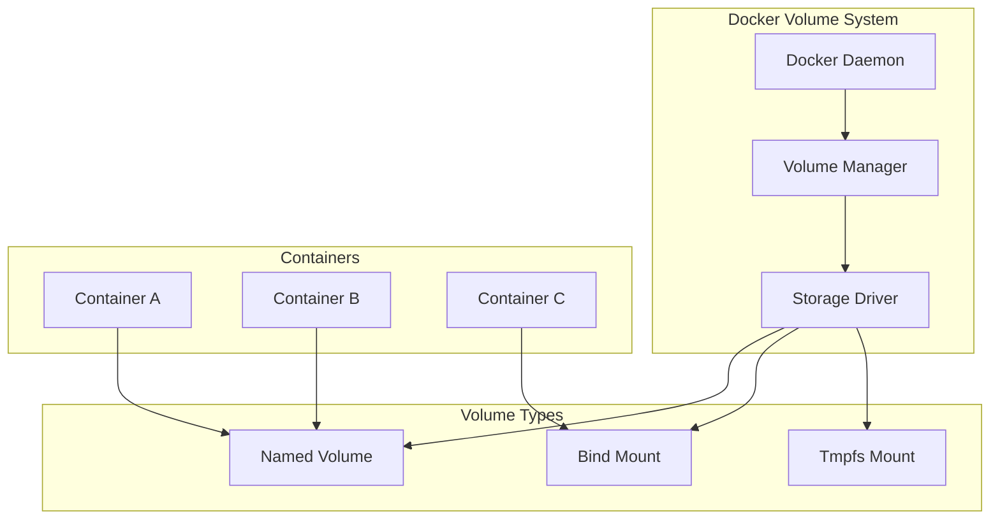
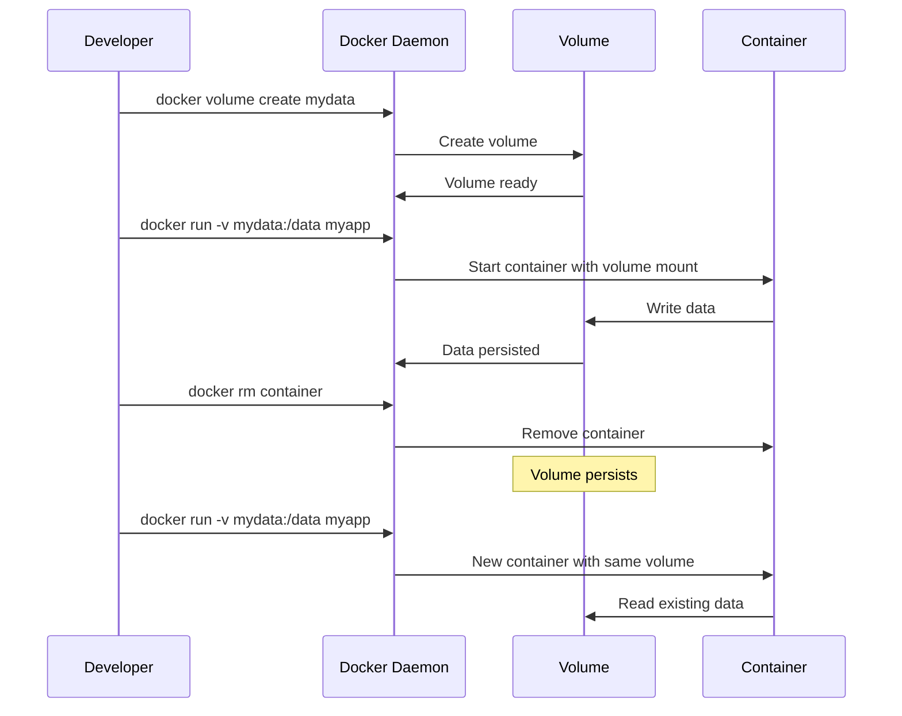

# 1. Introduction

Docker volumes provide persistent storage for containers. Unlike container writable layers, volumes survive container removal, can be shared between containers, and are managed by Docker. Understanding volumes is essential for stateful applications like databases.

# 2. Learning Objectives

- Understand volume types and their use cases
- Implement persistent storage for containers
- Configure bind mounts for development
- Manage volume lifecycle and backups
- Implement volume security best practices

# 3. Prerequisites

- Docker fundamentals (Module 21.1)
- Understanding of filesystem concepts
- Basic knowledge of data persistence

# 4. Why This Concept Exists

Containers are ephemeral by design. When a container is removed, its writable layer is lost. Volumes provide persistent, managed storage that survives container lifecycle, enabling stateful applications in containerized environments.

# 5. Problem Statement

**Without Volumes:**
- Data lost when containers removed
- No data sharing between containers
- Poor performance for I/O intensive apps
- Complex backup/restore procedures

**With Volumes:**
- Persistent data beyond container lifecycle
- Easy data sharing between containers
- Optimized storage performance
- Simplified backup and migration

# 6. Theory

**Volume Types:**

| Type | Location | Performance | Persistence |
|------|----------|-------------|-------------|
| Named Volume | Docker managed | Good | Persistent |
| Bind Mount | Host path | Best | Depends |
| Tmpfs | Memory | Fastest | Temporary |

**Named Volumes:**
- Managed by Docker in `/var/lib/docker/volumes/`
- Identified by name
- Can be reused across containers
- Support volume drivers

**Bind Mounts:**
- Mount host directory to container
- Direct access to host files
- Development-friendly
- Performance depends on host filesystem

# 7. Internal Working

**Volume Architecture:**
```
Host Machine
├── /var/lib/docker/volumes/
│   ├── myvolume1/_data/
│   │   └── data files...
│   └── myvolume2/_data/
│       └── data files...
├── /host/path/ (bind mount)
│   └── host files...
└── Docker Daemon
    ├── Container A → /var/lib/docker/volumes/myvolume1
    ├── Container B → /var/lib/docker/volumes/myvolume1
    └── Container C → /host/path/
```

**Volume Lifecycle:**
1. Volume created: `docker volume create`
2. Container mounts volume: `docker run -v`
3. Data written to volume
4. Container removed (volume persists)
5. New container can mount same volume
6. Volume removed: `docker volume rm`

# 8. JVM Perspective

**JVM and Docker Volumes:**
```java
// Application reads/writes to mounted volume
String dataPath = System.getenv("DATA_PATH"); // /data
Path dataDir = Path.of(dataPath);
Files.createDirectories(dataDir);
Files.writeString(dataDir.resolve("app.log"), logData);

// Database uses volume for persistence
// jdbc:postgresql://db:5432/mydb → data in mounted volume
```

- JVM uses mounted volumes like any filesystem
- File permissions may differ between container and host
- Volume performance affects I/O operations

# 9. Memory Representation

```
Volume Types in Memory
├── Named Volume
│   ├── Docker-managed path
│   ├── Metadata in Docker DB
│   └── Actual data on disk
├── Bind Mount
│   ├── Host path reference
│   ├── Direct file access
│   └── No Docker management
└── Tmpfs Mount
    ├── Memory-only storage
    ├── Fast access
    └── Lost on container stop
```

# 10. Architecture Diagram (Mermaid)



# 11. Flow Diagram (Mermaid)



# 12. Syntax

```bash
# Named volumes
docker volume create <name>
docker volume ls
docker volume inspect <name>
docker volume rm <name>
docker volume prune

# Bind mounts
docker run -v /host/path:/container/path <image>
docker run --mount type=bind,source=/host,target=/container <image>

# Tmpfs mounts
docker run --tmpfs /container/path <image>
docker run --mount type=tmpfs,target=/container,tmpfs-size=100m <image>

# Volume permissions
docker run -v <name>:/data:ro <image>  # Read-only
docker run -v <name>:/data:rw <image>  # Read-write (default)
```

# 13. Easy Example

```bash
# Create and use named volume
docker volume create mydata
docker run -d --name db -v mydata:/var/lib/postgresql/data postgres:15
docker exec db psql -U postgres -c "\dt"  # Database persists
docker rm -f db
docker run -d --name db2 -v mydata:/var/lib/postgresql/data postgres:15
# Data is still there
```

# 14. Medium Example

```yaml
# docker-compose.yml with volumes
version: '3.8'
services:
  db:
    image: postgres:15
    environment:
      POSTGRES_PASSWORD: secret
    volumes:
      - pgdata:/var/lib/postgresql/data
      - ./init-scripts:/docker-entrypoint-initdb.d:ro
    ports:
      - "5432:5432"

  app:
    build: .
    volumes:
      - ./logs:/app/logs
      - app-data:/app/data
    depends_on:
      - db

volumes:
  pgdata:
    driver: local
  app-data:
```

# 15. Hard Example

```yaml
# Production configuration with volume options
version: '3.8'

services:
  db:
    image: postgres:15-alpine
    environment:
      POSTGRES_PASSWORD_FILE: /run/secrets/db_password
    secrets:
      - db_password
    volumes:
      - type: volume
        source: pgdata
        target: /var/lib/postgresql/data
        volume:
          nocopy: true
    deploy:
      placement:
        constraints:
          - node.labels.db == primary

  redis:
    image: redis:7-alpine
    command: redis-server --appendonly yes
    volumes:
      - redis-data:/data
    healthcheck:
      test: ["CMD", "redis-cli", "ping"]
      interval: 10s
      timeout: 5s
      retries: 5

  app:
    image: myapp:latest
    volumes:
      - type: bind
        source: ./config
        target: /app/config
        read_only: true
      - type: tmpfs
        target: /tmp
        tmpfs:
          size: 100000000  # 100MB
          mode: 1777
    depends_on:
      - db
      - redis

volumes:
  pgdata:
    driver: local
    driver_opts:
      type: none
      o: bind
      device: /mnt/data/postgres
  redis-data:
    driver: local

secrets:
  db_password:
    file: ./secrets/db_password.txt
```

# 16. Enterprise Example

```yaml
# Enterprise storage configuration
version: '3.8'

services:
  db-primary:
    image: postgres:15-alpine
    environment:
      POSTGRES_PASSWORD_FILE: /run/secrets/db_password
    secrets:
      - db_password
    volumes:
      - pg-primary:/var/lib/postgresql/data
    deploy:
      placement:
        constraints:
          - node.labels.storage == ssd

  db-replica:
    image: postgres:15-alpine
    environment:
      PRIMARY_HOST: db-primary
    volumes:
      - pg-replica:/var/lib/postgresql/data
    depends_on:
      - db-primary

  elasticsearch:
    image: elasticsearch:8.10.0
    environment:
      - discovery.type=single-node
      - ES_JAVA_OPTS=-Xms2g -Xmx2g
    volumes:
      - es-data:/usr/share/elasticsearch/data
    deploy:
      resources:
        limits:
          memory: 4G

  kafka:
    image: confluentinc/cp-kafka:7.4.0
    environment:
      KAFKA_LOG_RETENTION_HOURS: 168
    volumes:
      - kafka-data:/var/lib/kafka/data

volumes:
  pg-primary:
    driver: local
    driver_opts:
      type: none
      o: bind
      device: /mnt/storage/postgres-primary
  pg-replica:
    driver: local
  es-data:
    driver: local
    driver_opts:
      type: none
      o: bind
      device: /mnt/storage/elasticsearch
  kafka-data:
    driver: local

secrets:
  db_password:
    external: true
```

# 17. Performance

**Volume Performance:**
| Type | Read Speed | Write Speed | IOPS |
|------|------------|-------------|------|
| Named (local) | Fast | Fast | High |
| Bind mount | Host speed | Host speed | Host |
| Tmpfs | Fastest | Fastest | Highest |
| NFS/CIFS | Network | Network | Low |

**Best Practices:**
- Use named volumes for databases
- Use bind mounts for development
- Use tmpfs for sensitive/temporary data
- Consider storage drivers for production

# 18. Time & Space Complexity

| Operation | Time | Space |
|-----------|------|-------|
| Create volume | O(1) | O(metadata) |
| Mount volume | O(1) | O(0) |
| Write data | O(n) | O(data size) |
| Backup volume | O(n) | O(data size) |

# 19. Thread Safety

Volume operations are managed by Docker daemon with proper locking. Multiple containers can mount the same volume, but application-level synchronization is needed for concurrent writes.

# 20. Best Practices

1. Use named volumes for persistent data
2. Use bind mounts only for development
3. Set appropriate permissions
4. Implement regular backups
5. Use volume drivers for remote storage
6. Monitor volume usage
7. Clean up unused volumes
8. Use read-only mounts where possible
9. Document volume purposes
10. Test backup/restore procedures

# 21. Common Mistakes

- Using bind mounts in production
- Not backing up named volumes
- Storing secrets in volumes
- Ignoring permission issues
- Using default volume options
- Not monitoring disk usage

# 22. Pitfalls

- Bind mount paths must be absolute
- Volume permissions may differ between host and container
- Named volumes persist after `docker-compose down`
- Bind mounts may not work on Docker Desktop
- Remote volumes have network latency

# 23. Debugging Tips

```bash
# Check volume details
docker volume inspect <volume>

# List volume contents
docker run --rm -v <volume>:/data alpine ls -la /data

# Check volume usage
docker system df -v

# Backup volume
docker run --rm -v <volume>:/data -v $(pwd):/backup alpine \
  tar czf /backup/backup.tar.gz -C /data .

# Restore volume
docker run --rm -v <volume>:/data -v $(pwd):/backup alpine \
  tar xzf /backup/backup.tar.gz -C /data
```

# 24. Comparison Table

| Feature | Named Volume | Bind Mount | Tmpfs |
|---------|--------------|------------|-------|
| Persistence | Yes | Depends | No |
| Docker Managed | Yes | No | No |
| Performance | Good | Best | Fastest |
| Use Case | Production | Development | Secrets |
| Backup | Easy | Easy | N/A |

# 25. Decision Tool

```
Need storage in containers?
├── Persistent data? → Named Volume
├── Development files? → Bind Mount
├── Sensitive/temp data? → Tmpfs
├── Remote storage? → Volume Driver
└── Sharing between containers? → Named Volume
```

# 26. Interview Questions

1. **What are the Docker volume types?**
   Named volumes (Docker-managed), bind mounts (host path), and tmpfs mounts (memory-only).

2. **What is the difference between named volumes and bind mounts?**
   Named volumes are Docker-managed and persistent; bind mounts reference host paths directly.

3. **How do you backup a Docker volume?**
   Run a container with the volume mounted and create a tar archive of the data.

4. **How do containers share data?**
   Mount the same named volume to multiple containers, or use bind mounts pointing to the same host path.

5. **What is the `:ro` flag in volume mounts?**
   It mounts the volume as read-only, preventing containers from modifying the data.

6. **How do you clean up unused volumes?**
   Use `docker volume prune` to remove all unused volumes, or `docker volume rm` for specific ones.

7. **What happens to volumes when containers are removed?**
   Named volumes persist. Bind mounts are not affected (host files remain). Use `-v` flag to remove volumes with container.

8. **How do you set permissions for volumes?**
   Use `--user` flag, configure in Dockerfile, or set ownership on host before mounting.

9. **What is a volume driver?**
   A plugin that handles volume creation and management, enabling remote or specialized storage backends.

10. **How do you mount a volume as read-write?**
    Use `:rw` flag (default) or omit the flag. Ensure container user has write permissions.

11. **What is the difference between `-v` and `--mount`?**
    `-v` is shorthand; `--mount` is more explicit and supports additional options like tmpfs configuration.

12. **How do you monitor volume usage?**
    Use `docker system df -v` to see volume sizes and usage.

13. **What is the nocopy option?**
    When creating a volume from a container, nocopy prevents copying existing data to the new volume.

14. **How do you handle volume permissions in containers?**
    Ensure the container user matches the volume owner, or use appropriate permissions in Dockerfile.

15. **What are the security implications of bind mounts?**
    Bind mounts can expose host files to containers. Use read-only mounts and restrict access carefully.

# 27. Exercises

**Level 1:**
1. Create a named volume and mount it to a PostgreSQL container
2. Insert data, remove the container, and verify data persists
3. Create a new container with the same volume

**Level 2:**
1. Set up a bind mount for development files
2. Implement read-only mounts for configuration
3. Configure tmpfs for sensitive data

**Level 3:**
1. Implement a backup strategy for named volumes
2. Set up remote storage with a volume driver
3. Configure volume encryption for sensitive data

# 28. Summary

Docker volumes provide essential persistent storage for containers. Understanding volume types, use cases, and best practices enables proper data management in containerized applications. Key concepts: use named volumes for production data, bind mounts for development, and implement proper backup strategies.

# 29. References

- [Docker Volumes Guide](https://docs.docker.com/storage/volumes/)
- [Bind Mounts Guide](https://docs.docker.com/storage/bind-mounts/)
- [TMPFS Mounts Guide](https://docs.docker.com/storage/tmpfs/)
- [Volume Drivers](https://docs.docker.com/engine/extend/plugins_volume/)
- [Storage Best Practices](https://docs.docker.com/storage/)
