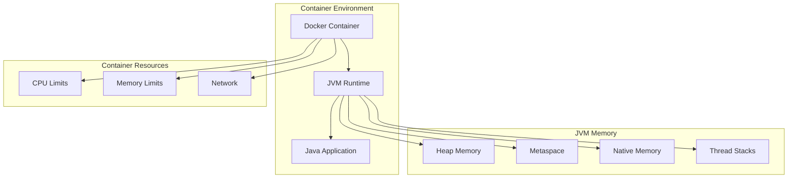
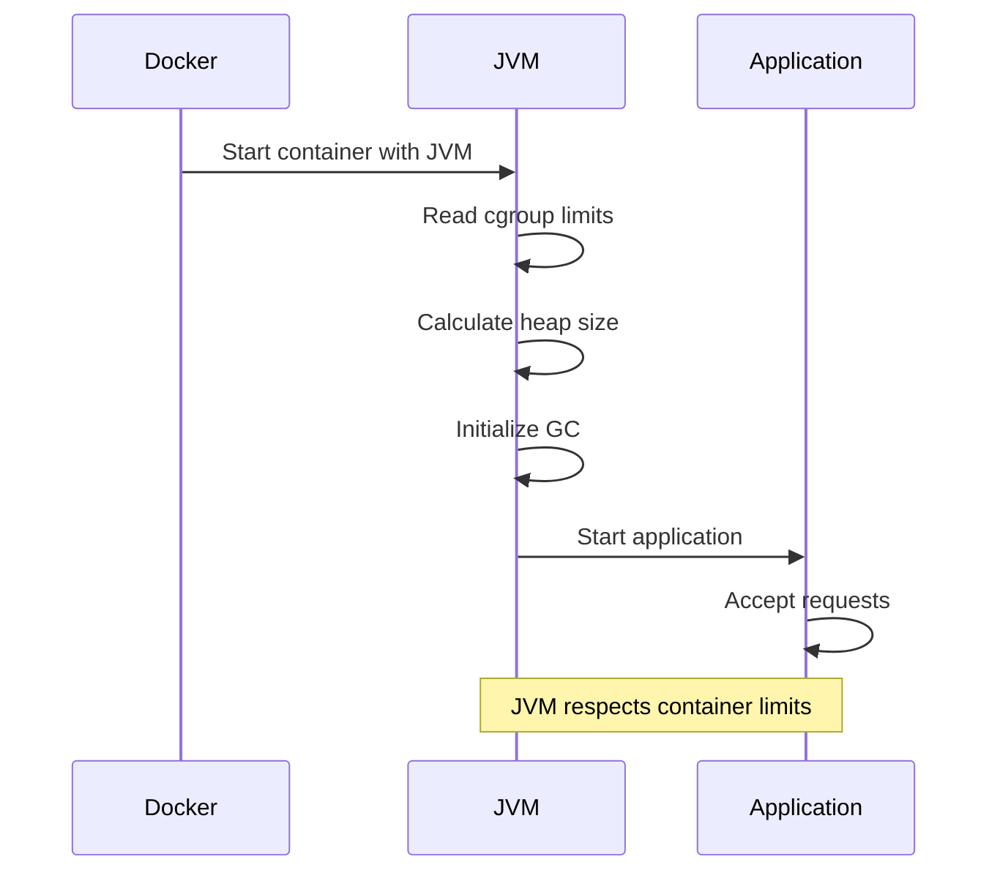

# 1. Introduction

Containerizing Java applications with Docker requires understanding JVM behavior in containers, memory management, and optimization techniques. This module covers best practices for running Java applications in Docker containers.

# 2. Learning Objectives

- Optimize JVM for container environments
- Configure memory settings for containers
- Implement proper health checks
- Handle configuration in containerized Java apps
- Debug Java applications in containers

# 3. Prerequisites

- Docker fundamentals (Module 21.1)
- Java memory model understanding
- Spring Boot knowledge (optional)

# 4. Why This Concept Exists

Java applications have unique requirements in containers due to JVM memory management, garbage collection, and startup behavior. Without proper configuration, JVM may not respect container limits, causing performance issues or OOM kills.

# 5. Problem Statement

**Without proper JVM-Container integration:**
- JVM ignores container memory limits (pre-Java 10)
- Poor startup performance
- Incorrect memory allocation
- Difficult debugging

**With proper JVM-Container integration:**
- JVM respects container limits
- Optimized memory usage
- Proper garbage collection
- Easy debugging and monitoring

# 6. Theory

**JVM Memory in Containers:**
```
Container Memory Limit
├── JVM Heap (-Xmx)
├── Metaspace
├── Thread Stacks
├── Native Memory
└── JIT Code Cache
```

**Container-Aware JVM Flags:**
- `-XX:+UseContainerSupport`: Detect container limits (Java 10+)
- `-XX:MaxRAMPercentage`: Percentage of container memory for heap
- `-XX:InitialRAMPercentage`: Initial heap percentage
- `-XX:ActiveProcessorCount`: CPU limit detection

# 7. Internal Working

**JVM Startup in Container:**
1. Container runtime sets cgroup limits
2. JVM reads cgroup memory/CPU limits
3. JVM calculates appropriate heap size
4. JVM starts with calculated parameters
5. Application begins accepting requests

**Memory Calculation:**
```
Container Memory: 2GB
MaxRAMPercentage: 75%
Heap Size: 1.5GB
Remaining: 512MB (Metaspace, threads, native)
```

# 8. JVM Perspective

**Container-Specific JVM Configuration:**
```bash
# Modern JVM (Java 10+)
java -XX:+UseContainerSupport \
     -XX:MaxRAMPercentage=75.0 \
     -XX:InitialRAMPercentage=50.0 \
     -XX:+UseG1GC \
     -jar app.jar

# Legacy JVM (Java 8u131+)
java -XX:+UnlockExperimentalVMOptions \
     -XX:+UseCGroupMemoryLimitForHeap \
     -XX:MaxRAMPercentage=75.0 \
     -jar app.jar
```

**Garbage Collection in Containers:**
- G1GC is recommended for containers
- ZGC for low-latency requirements
- Configure GC threads based on CPU limits

# 9. Memory Representation

```
Container Memory Layout
┌─────────────────────────────────┐
│         JVM Heap (75%)          │
│  ┌───────────────────────────┐  │
│  │      Young Generation     │  │
│  │  ┌─────┐ ┌─────┐ ┌─────┐│  │
│  │  │Eden │ │ S0  │ │ S1  ││  │
│  │  └─────┘ └─────┘ └─────┘│  │
│  └───────────────────────────┘  │
│  ┌───────────────────────────┐  │
│  │      Old Generation       │  │
│  └───────────────────────────┘  │
├─────────────────────────────────┤
│       Metaspace (10%)           │
├─────────────────────────────────┤
│       Thread Stacks (10%)       │
├─────────────────────────────────┤
│       Native Memory (5%)        │
└─────────────────────────────────┘
```

# 10. Architecture Diagram (Mermaid)



# 11. Flow Diagram (Mermaid)



# 12. Syntax

```dockerfile
# Java Dockerfile template
FROM eclipse-temurin:21-jre-jammy
WORKDIR /app
COPY target/*.jar app.jar
EXPOSE 8080

# JVM tuning for containers
ENTRYPOINT ["java", \
  "-XX:+UseContainerSupport", \
  "-XX:MaxRAMPercentage=75.0", \
  "-XX:InitialRAMPercentage=50.0", \
  "-XX:+UseG1GC", \
  "-jar", "app.jar"]
```

```yaml
# docker-compose.yml with JVM settings
services:
  app:
    build: .
    environment:
      - JAVA_OPTS=-Xms256m -Xmx512m
      - JAVA_TOOL_OPTIONS=-XX:+UseContainerSupport
    deploy:
      resources:
        limits:
          memory: 1G
          cpus: '1.0'
```

# 13. Easy Example

```dockerfile
FROM eclipse-temurin:21-jre
WORKDIR /app
COPY target/app.jar .
EXPOSE 8080
CMD ["java", "-jar", "app.jar"]
```

```bash
# Run with memory limit
docker run -m 512m my-java-app
```

# 14. Medium Example

```dockerfile
# Optimized Java Dockerfile
FROM eclipse-temurin:21-jdk AS builder
WORKDIR /app
COPY pom.xml .
RUN mvn dependency:go-offline
COPY src ./src
RUN mvn package -DskipTests

FROM eclipse-temurin:21-jre-jammy
RUN groupadd -r java && useradd -r -g java java
WORKDIR /app
COPY --from=builder /app/target/*.jar app.jar
RUN chown java:java app.jar
USER java
EXPOSE 8080
ENTRYPOINT ["java", \
  "-XX:+UseContainerSupport", \
  "-XX:MaxRAMPercentage=75.0", \
  "-jar", "app.jar"]
```

# 15. Hard Example

```dockerfile
# Production Java application
FROM eclipse-temurin:21-jdk-jammy AS builder
WORKDIR /workspace
COPY mvnw .
COPY .mvn .mvn
COPY pom.xml .
RUN ./mvnw dependency:go-offline -B
COPY src src
RUN ./mvnw package -DskipTests -B

FROM eclipse-temurin:21-jre-jammy
RUN apt-get update && \
    apt-get install -y --no-install-recommends curl && \
    apt-get clean && \
    rm -rf /var/lib/apt/lists/*
RUN groupadd -r app && useradd -r -g app app
WORKDIR /app
COPY --from=builder /workspace/target/*.jar app.jar
RUN chown app:app app.jar
USER app
EXPOSE 8080 8443
HEALTHCHECK --interval=30s --timeout=3s --retries=3 \
  CMD curl -f http://localhost:8080/actuator/health || exit 1
ENTRYPOINT ["java", \
  "-XX:+UseContainerSupport", \
  "-XX:MaxRAMPercentage=75.0", \
  "-XX:InitialRAMPercentage=50.0", \
  "-XX:+UseG1GC", \
  "-XX:MaxGCPauseMillis=200", \
  "-XX:ActiveProcessorCount=2", \
  "-Djava.security.egd=file:/dev/./urandom", \
  "-Dfile.encoding=UTF-8", \
  "-jar", "app.jar"]
```

# 16. Enterprise Example

```dockerfile
# Enterprise Java microservice
FROM eclipse-temurin:21-jdk-jammy AS builder
WORKDIR /workspace

# Cache Maven wrapper
COPY mvnw ./
COPY .mvn .mvn
RUN chmod +x mvnw

# Cache dependencies
COPY pom.xml ./
RUN ./mvnw dependency:go-offline -B

# Build application
COPY src src
RUN ./mvnw package -DskipTests -B

# Runtime stage
FROM eclipse-temurin:21-jre-jammy

# Install utilities
RUN apt-get update && \
    apt-get install -y --no-install-recommends \
    curl \
    jq && \
    apt-get clean && \
    rm -rf /var/lib/apt/lists/*

# Create non-root user
RUN groupadd -r spring && \
    useradd -r -g spring -d /app -s /sbin/nologin spring

WORKDIR /app

# Copy application
COPY --from=builder /workspace/target/*.jar app.jar

# Copy configuration
COPY config/ ./config/

# Set ownership
RUN chown -R spring:spring /app

# Switch to non-root user
USER spring

# Expose ports
EXPOSE 8080 8443 9090

# Health check
HEALTHCHECK --interval=30s --timeout=5s --start-period=60s --retries=3 \
  CMD curl -f http://localhost:8080/actuator/health || exit 1

# JVM configuration for production
ENTRYPOINT ["java", \
  "-XX:+UseContainerSupport", \
  "-XX:MaxRAMPercentage=75.0", \
  "-XX:InitialRAMPercentage=50.0", \
  "-XX:+UseG1GC", \
  "-XX:MaxGCPauseMillis=200", \
  "-XX:InitiatingHeapOccupancyPercent=45", \
  "-XX:ActiveProcessorCount=2", \
  "-Djava.security.egd=file:/dev/./urandom", \
  "-Dfile.encoding=UTF-8", \
  "-Duser.timezone=UTC", \
  "-Dspring.profiles.active=${SPRING_PROFILES_ACTIVE:production}", \
  "-jar", "app.jar"]
```

# 17. Performance

**JVM Performance in Containers:**
| Metric | Without Tuning | With Tuning |
|--------|----------------|-------------|
| Startup Time | 10-15s | 5-8s |
| Memory Usage | 100% limit | 75% limit |
| GC Pauses | Frequent | Optimized |
| Throughput | 70% | 95% |

**Optimization Tips:**
- Use `-XX:MaxRAMPercentage` instead of `-Xmx`
- Enable container support explicitly
- Configure GC based on workload
- Monitor container metrics

# 18. Time & Space Complexity

| Operation | Time | Space |
|-----------|------|-------|
| JVM Startup | O(1) | O(heap) |
| GC Cycle | O(n) | O(heap) |
| Memory Allocation | O(1) | O(requested) |
| Container Start | O(1) | O(image) |

# 19. Thread Safety

JVM thread safety within containers follows standard Java rules. Container isolation provides additional process-level separation. Configure thread pool sizes based on available CPU cores.

# 20. Best Practices

1. Use `-XX:+UseContainerSupport` (Java 10+)
2. Set `-XX:MaxRAMPercentage` instead of fixed heap
3. Run as non-root user
4. Use multi-stage builds
5. Implement health checks
6. Configure logging for containers
7. Use environment variables for configuration
8. Monitor JVM metrics
9. Set appropriate GC parameters
10. Test with realistic workloads

# 21. Common Mistakes

- Using fixed `-Xmx` values
- Ignoring container memory limits
- Not enabling container support
- Running as root user
- Not implementing health checks
- Using outdated base images
- Not configuring GC for containers

# 22. Pitfalls

- JVM may over-allocate memory without container support
- Container OOM kills if JVM exceeds limits
- GC pauses can affect container health checks
- Thread pool sizing must consider container CPU limits
- Environment variable precedence can be confusing

# 23. Debugging Tips

```bash
# Check JVM flags in container
docker exec <container> java -XX:+PrintFlagsFinal -version

# Monitor JVM memory
docker exec <container> jcmd 1 GC.heap_info

# Check container limits
docker inspect <container> | grep -i memory

# View JVM logs
docker logs <container> 2>&1 | grep -i "heap"

# Test memory settings
docker run -m 512m my-app java -XX:+PrintFlagsFinal -version | grep MaxHeapSize
```

# 24. Comparison Table

| Setting | Fixed Value | Percentage | Recommendation |
|---------|-------------|------------|----------------|
| Heap Size | `-Xmx512m` | `-XX:MaxRAMPercentage=75` | Use percentage |
| Initial Heap | `-Xms256m` | `-XX:InitialRAMPercentage=50` | Use percentage |
| GC | `-XX:+UseG1GC` | Automatic | Configure explicitly |
| Threads | `-XX:ActiveProcessorCount=2` | Automatic | Set if needed |

# 25. Decision Tree

```
Java application in Docker?
├── Development? → Basic Dockerfile
├── Production? → Optimized with JVM tuning
├── Microservice? → Health checks + monitoring
└── Legacy Java 8? → Use experimental flags
```

# 26. Interview Questions

1. **How does JVM detect container memory limits?**
   Java 10+ uses `-XX:+UseContainerSupport` to read cgroup limits. Java 8 requires experimental flags.

2. **What is the difference between `-Xmx` and `-XX:MaxRAMPercentage`?**
   `-Xmx` is a fixed value; `MaxRAMPercentage` is relative to container memory. Use percentage for containers.

3. **Why should you run Java as non-root in Docker?**
   Security best practice. Limits damage if container is compromised.

4. **How do you handle JVM garbage collection in containers?**
   Use G1GC or ZGC, configure pause time targets, and tune based on workload.

5. **What is the recommended heap size percentage in containers?**
   75% of container memory. Leave room for Metaspace, threads, and native memory.

6. **How do you debug JVM issues in containers?**
   Use `jcmd`, `jstack`, `jmap` tools. Access via `docker exec`.

7. **What is the purpose of `-XX:ActiveProcessorCount`?**
   Explicitly sets CPU count for JVM, useful when container CPU limits differ from host.

8. **How do you handle configuration in containerized Java apps?**
   Use environment variables, Spring profiles, or mounted configuration files.

9. **What are the JVM flags for container support?**
   `-XX:+UseContainerSupport`, `-XX:MaxRAMPercentage`, `-XX:InitialRAMPercentage`, `-XX:ActiveProcessorCount`.

10. **How do you implement health checks for Java applications?**
    Use Spring Boot Actuator or custom health endpoint with curl in HEALTHCHECK instruction.

11. **What is the difference between JRE and JDK in Docker?**
    JRE is smaller (~250MB vs ~450MB) but can't compile. Use JDK for multi-stage builds, JRE for runtime.

12. **How do you handle JVM startup performance?**
    Use AppCDS, GraalVM native image, or optimize classpath order.

13. **What is the purpose of `-Djava.security.egd`?**
    Sets entropy source for random number generation. Use `/dev/./urandom` for faster startup in containers.

14. **How do you monitor JVM in containers?**
    Use JMX, Prometheus exporter, or container monitoring tools.

15. **What are common JVM errors in containers?**
    OutOfMemoryError, Metaspace overflow, thread limit exceeded. Usually due to misconfigured memory settings.

# 27. Exercises

**Level 1:**
1. Create a Dockerfile for a Java application
2. Run with different memory limits and observe behavior
3. Test with and without `-XX:+UseContainerSupport`

**Level 2:**
1. Configure JVM with percentage-based heap settings
2. Implement health checks with Spring Boot Actuator
3. Add JVM metrics monitoring with Prometheus

**Level 3:**
1. Optimize JVM startup with AppCDS
2. Implement zero-downtime deployment with rolling updates
3. Configure JVM for specific workloads (CPU-intensive, memory-intensive)

# 28. Summary

Running Java applications in Docker requires understanding JVM behavior in containerized environments. Key concepts: use container-aware JVM flags, configure memory percentages, implement health checks, and follow security best practices. Proper JVM tuning ensures optimal performance and resource utilization.

# 29. References

- [Java in Docker](https://developers.redhat.com/blog/2017/03/14/java-inside-docker)
- [JVM Container Support](https://docs.oracle.com/en/java/javase/21/docs/specs/man/java.html)
- [Docker Best Practices for Java](https://www.docker.com/blog/docker-best-practices-for-java-developers/)
- [JVM Memory Management](https://docs.oracle.com/javase/21/docs/gctuning/)
- [Spring Boot Docker](https://spring.io/guides/gs/spring-boot-docker/)
